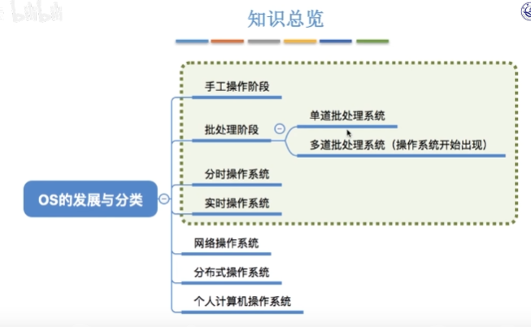
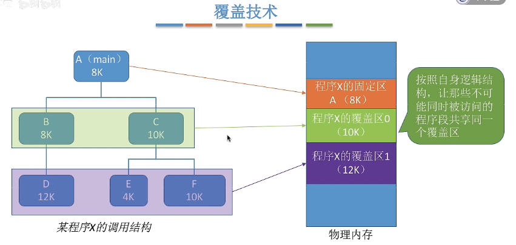
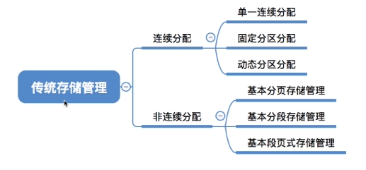
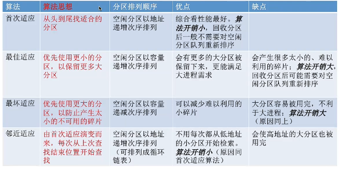
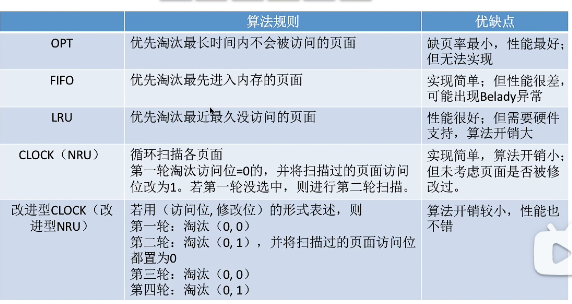
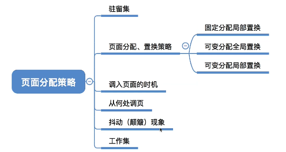
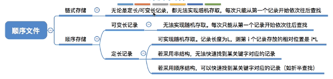
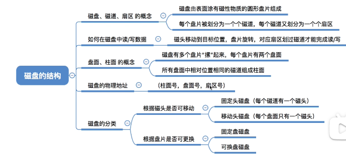

::: tip

一、绪论

二、进程管理

三、内存管理

四、文件管理

五、设备管理

:::

## 一、绪论

**操作系统定义**：负责管理计算机硬件资源，并为应用程序提供一个统一的接口

**操作系统功能**：进程，存储，文件，设备，用户接口

**操作系统特性**：并发，共享，虚拟，安全可靠，可扩展

- 批处理阶段
  - 单道批处理系统（新存储技术磁带引用）
  - 多道批处理系统（读入多道程序，使用**中断技术，操作系统，无人机交互功能**，响应用户时间长）
- 分时操作系统（以时间片轮询方式服务，**有人机交互功能，不独占文件资源**）
- 实时操作系统（在严格时间内完成）
- 按层次结构原则：计算机层次从内到外依次为：裸机、CPU调度、内存管理、**设备管理、文件管理**、作业管理、**命令管理**、用户。

**系统调用**：用户空间程序与内核进行交互。用于执行特权操作和访问受保护的系统资源。

- 操作系统调用过程：

  1. 传递系统调用参数
  2. 执行trap指令（陷阱指令，触发中断，将控制权从用户态转为内核态）
  3. 执行中断应用程序
  4. 返回结果，回复用户模式

**系统调用，库函数，内核函数关系**

- 系统调用：用户与操作系统内核之间交互的接口（中断机制来切换到内核）
- 库函数：由程序调用，不是操作系统的一部分
- API：API 通常是系统调用更高级别的抽象，不直接涉及操作系统内核
- 内核函数：硬件与操作系统之间交互（应用程序无法直接调用内核函数）

**中断机制**：用于暂停正在运行的进程并跳转到中断处理程序执行，**中断不一定会进行目态管态切换**

- 硬件中断（外中断）：中断信号来源于其他进程

- 异常中断（内中断）：中断信号来源于当前执行指令和CPU内部

内核程序：中断处理程序，系统调用，进程调度程序，设备驱动程序，文件系统，时钟管理（计时功能），原语（设备驱动，CPU切换任务，接近硬件，具有原子性不能被中断）

**内核与微核对比**

- 内核：集中式管理计算机硬件和软件资源。所有服务都在管态下运行，对硬件直接的访问，性能更高；内核中的任何错误或漏洞都可能使整个系统崩溃，难以扩展：添加新功能或修改现有功能需要修改内核代码
- 微核：将内核功能组件服务化，通过消息传递机制与多个微核交互，大多数服务运行在用户态，性能比内核低；可扩展性与模块化强

## 二、进程管理

进程与作业关系：进程是已提交完毕的作业的执行过程，一个作业可以由多个进程构成

进程状态转换：创建，就绪，执行，阻塞，结束

进程控制：

1. PSW（程序状态字）

   - PC(程序计数器)：指向程序中当前正在执行的指令的内存地址
   - CPU状态码（标识处于管态还是目态）
   - 中断屏蔽码
   - 条件码（标志位）：记录最近执行指令的结果状态
     1. ZF：零标志位
     2. CF：进位
      3. SF：符号标志
      4. OF：出标志
      5. PF：奇偶标志

2. 阻塞与唤醒：一个进程由执行状态变为阻塞状态，是由这个进程自己调用阻塞原语去完成的；而进程由阻塞状态转变为就绪状态，则是由另一个发现者进程调用唤醒原语实现的

3. 进程上下切换：

   - 保存处理及上下文，包括程序计数器和其他寄存器。

   - 更新PCB信息。

   - 把进程的PCB 移入相应队列，如就绪、某事件的阻塞队列等。

   - 选择另一个进程执行，更新其PCB。

   - 更新内存管理的数据结构。

   - 恢复处理器上下文

4. 通信

   - 共享存储器

   - 消息传递

   - 管道通信

调度基本指标

1. CPU利用率： $利用率= \frac{忙碌时间}{总时间}$

2. 系统吞吐量：单位时间内完成任务数量（速度）

3. 响应时间

4. 周转时间：从提交到完成的时间间隔（**等待时间+运行时间）**

   - **开始时间 - 到达时间 = 等待时间**

5. **带权周转时间：周转时间 / 运行时间**

处理器调度

- 作业调度（高级调度）
- 交换调度（中级调度）：内外存调用淘汰策略
- 进程调度（低级调度）

 **进程调度算法**

- 非抢占式：将处理器分配给就绪队列中优先级最高的进程，该进程便会一直运行下去，直到由于其自身原因（任务完成或申请设备等）主动让出处理器时，才将处理器分配给另一个当前优先级最高的进程。

  1. FCFS（先来先服务）：对长任务作业（CPU繁忙作业）
  2. SJDF（短作业优先）
  3. 优先级策略

- 抢占式：在执行过程中进行优先级调度

  1. 时间片轮转
  2. 高响应比：（作业等待时间+估计运行时间）/估计运行时间
  3. 多级队列调度及反馈

**同步与互斥**

- 进程同步：进程之间能够按照某种顺序正确访问共享资源

- 进程互斥：进程不能同时访问共享资源

- **同类进程相互互斥，不同类进行相互同步**

- PV操作：s为可用资源数量

  1. P(s)： 申请资源，s = s -1，当s$\geq$ 0 该进程继续运行，否则停止等待
  2. V(s)：释放资源，s=s+1，当 s $\le$ 0时，唤醒等待队列中的线程，并继续执行
  3. 进程同步：s为0，进程互斥s为1

互斥规则：

1. 空闲让进
2. 忙则等待
3. 有限等待
4. 让权等待

**进程同步模型**

 - 生产消费模型：生产者和消费者共用缓存区（锁），每次使用时检测缓存区是否为空，为空则消费者等待并唤醒生产者进行生产，缓存区满则生产者等待并唤醒消费者进行消费
- 读写模型：允许多个进程同时读取文件，并且只允许一个进程进行写操作，当写操作时，所有的读取操作会被阻塞，直到写入操作完成。

管程：封装共享数据和同步方法

- 局部于管程的数据只能被局部于管程内的过程所访问。
- 一个进程只有通过调用管程内的过程才能进入管程访问共享数据。
- 每次仅允许一个进程在管程内执行某个内部过程，即进程互斥地通过调用内部过有进入管程。其他想进入管程的过程必须等待，并阻塞在等待队列。

**死锁**

死锁必要条件：

- 互斥条件
- 不剥夺条件
- 请求与保持
- 环路等待

死锁处理方法：

- 预防死锁（设置限制条件，破坏死锁必要条件）

- 避免死锁（动态分配过程中设置资源分配算法，检测系统安全状态）

  1. 系统安全状态检测：可用资源数量满足

- 检测及解除死锁（已发生死锁情况下，剥夺死锁资源，或杀死进程）

银行家算法：
$$
Need[i][j] = Max[i][j] - Allocation[i][j]
$$

- i：第`i`进程数

- j：第`j`类资源

- Need：当前进程需要资源量

- Max：当前进程最大需要资源量

- Allocation：当前进程可分配资源量

- Available：空闲资源数量

- Request：当前线程请求资源数量

- 算法

  1. Request <=Need数量，否则报错

  2. Request <= Available，否则当前进程等待

  3. $$
     Available = Available - Request \\Allocation +  = Allocation + Request \\
     Need = Need - Request
     $$

  4. 检测系统安全状态

  5. 确定分配

资源分配图：

1. 二元序列表示 $<P_1,r_2> 表示 P_1正在申请r_2资源，<r_1,P_1)表示P_1占有r_1资源$ 

## 三、内存管理

物理地址：内存中实际存储单元地址

逻辑地址：（相对地址）：指令地址

编译：将告警语言翻译为机器语言

装载：将程序从外存载入内存中运行

装载方式：

- > 绝对装入（编译时产生物理地址的指令）

- 静态重定位（依据当前内存情况，将**相对地址重定位到物理地址**，作业进入内存，在运行期间不能移动）

- **动态重定位**（将地址转换推迟到程序执行时进行，CPU进行转换）

内存保护：

- 界限寄存器：上下界存储器及基址限长保护器

- 存储保护键

内存空间扩充（有限的内存空间中运行大型程序）

- 覆盖：将不同程序或数据段加载到同一个内存地址

  

- 交换：内外存调度

**内存空间分配**

- 连续分配

  1. 单一连续分配：用户进程独占用户区且只能有一道程序运行，无内存碎片，存储器利用低
  2. 固定分区分配：等额切分内存，并建立分区说明表（分区大小，起始位置，状态）
  3. 可变分区：不预先划分内存空间，根据进程的大小动态建立分区（分区的大小正好合适进程的需要，无内部碎片）
     - 

- 非连续分配

  1. 分页存储：将内存空间分为一个大小相等的分区，页/物理块：程序的逻辑空间和内存分为一些大小相同的片段，页表：记录页与物理块地址映射关系

  2. 分段存储管理方式：按照程序自身逻辑关系划分为若干个段，每个段大小不同，且不连续

  3. 段页式存储管理方式：将内存先分段，在段中在进行分页

     地址计算：首先根据段号查找段表，获取段的起始地址和长度，将逻辑地址中的偏移量转换为页号和页内偏移量

页式存储管理：页式内存管理提供灵活的内存分配和回收，支持程序动态调整，但会增加访问延迟，可能导致碎片化，并限制内存分配粒度

段式存储管理：内存组织灵活，可按逻辑段组织，便于代码共享，但管理复杂，需要维护段表。

段页式存储管理优点：

- 段的大小可以动态调整，适应不同程序的需求，避免了内存碎片问题
- 段有独立保护机制，可以设置不同的访问权限，增强了系统的安全性
- 通过分页机制实现了虚拟内存，提高了内存的利用率和管理效率

**虚拟内存概念**：允许程序使用比物理内存更大的地址空间

- 局部性原理：程序在短时间内倾向于访问同一区域的内存地址

  1. 时间局部性: 如果一个数据项被访问过，那么它在不久的将来很可能再次被访问
  2. 空间局部性: 如果一个数据项被访问过，那么它附近的内存地址很可能在不久的将来被访问

- **页面置换算法**

  1. OPT（最佳置换算法）

  2. FIFO（先进先出）

  3. LRU（最近最久未使用）

  4. CLOCK（时钟置换，最近未使用）

     使用循环队列管理页面，定期替换未访问的页面，并重置已访问页面的访问状态

  

**工作集与页面分配策略：**操作系统如何将物理内存分配给进程的页面。

- 工作集：进程在一段时间内频繁访问的页面集合

  1. 工作集的大小取决于进程的活动状态。
  2. 为了提高程序效率，工作集中的页面应常驻内存，减少页面置换。
- 调度时机

  1. 缺页调度

  2. 预先分页：操作系统预先将程序的一部分页面加载到内存中

  3. 预测分页

  4. 工作集：将最近访问的页面，保留在内存中
- Belady：增加内存容量反而会导致页面失效次数增加（FIFO算法）
- 内存抖动：页面频繁调度，导致应用程序性能下降（原因是程序不完全加载进内存）

## 四、文件管理

文件结构：

1. 流式文件：文件内部数据由二进制流或字符组成（流式文件），文件数据没有明显的结构特性

2. 记录文件：由一组相似的记录组成，每条记录有为若干个数据项

   逻辑结构：

   

   索引文件：用于快速定位和访问文件数据（直接访问且不产生碎片，索引块占用额外空间）

   - 索引结构：顺序，哈希，B树，倒排
   - 层级索引
     1. 单级索引：文件最大长度= 盘块大小$\times$ 块数量（盘块 大小 / 索引表项大小）  
     2. 二级索引：文件最大长度 = 盘块大小 $\times$ 一级块数量 $\times$​ 二级块数量

**文件目录**：

1. 文件控制块：操作系统用来管理和访问文件的数据结构，包含文件名、物理地址、文件结构信息、访问权限、用户和时间信息
2. 目录结构：

   - 单级目录

   - 二级目录：MFD：文件系统中的根目录，它包含所有用户文件目录的入口，UFD：用户的文件目录

   - 多级目录（树形目录）
3. 文件共享
   - 基于索引节点共享（硬链接）：不同的FCB指针指向同一个文件地址（异名共享，FCB引用时删除）
   - 基于符号链接共享（软链接）：文件存储指向目标文件的路径
4. 文件保护：访问控制矩阵，用户权限表，口令与密码

文件存储空间

- **空闲表法：**  记录空闲块的起始位置和空闲块数（连续分配方式）
- 空闲盘块链（离散分配）
- 位示图法（使用二进制位对应磁盘块，0代表磁盘空闲，1表示磁盘被分配）

**磁盘结构**

- 磁盘访问时间 = 寻道时间 + 旋转延迟 + 传输时间

  - 寻道时间：磁头冲当前磁道移动到目标磁道消耗时间（调度算法优化项）

    $T_s = m \times n + s$   s：启动磁臂时间 

  - 旋转延迟：$T_r = \frac{1}{2r}$  r：磁盘转速

  - 传输时间$T_t = \frac{b}{rN}$  b：每次读写字节数，N：磁道上字节数

- 磁盘调度算法：

  1. FCFS：先来先服务
  2. SSTF：优先处理距离当前磁头进的磁道，保证每次寻道的时间最短
  3. SCAN：选择下一个最近的请求，并且该请求位于磁头当前移动方向上
  4. C-SCAN：SCAN改进
  5. 平均寻道长度：平均寻道长度 = (所有寻道距离之和) / (寻道次数)

**RAID技术**：独立磁盘冗余阵列，提高数据可靠性、可用性和性能

- RAID0：数据被分成多个块并分别存储在不同的硬盘上，可以提高读写性能，读写速度最快，无数据冗余
- RAID1：数据被完全复制到另一个硬盘上，提供了数据冗余，实际可用容量为所有磁盘容量的一半
- **RAID 5**：数据和校验信息交替存储在多个磁盘上，提供了数据冗余和性能

## 五、设备管理

- 块设备（物理块为交换单位，可寻址，可随机读写）

- 字符设备（以字符为单位交换，**不可寻址**，采用中断驱动方式）

设备控制方式

1. 直接程序控制（简单实现，效率低）

2. 中断控制

3. DMA控制（直接内存访问，无需CPU介入，需要DMA硬件控制器）

4. IO通道方式（同DMA，一个通道控制多台设备）

   字节多路：多个低速设备共享一个串行通信接口。

   数组选择：多个高速设备共享一个并行通信接口（占用通道）

   数组多路选择

IO软件层次结构

1. 硬件
2. 设备独立层：命名，保护，阻塞，缓冲，分配
3. 设备驱动程序层：建立设备寄存器，检测状态
4. 中断处理：设备触发事件响应
5. 用户软件层

