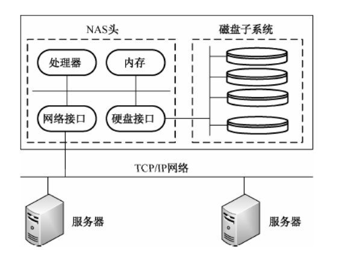
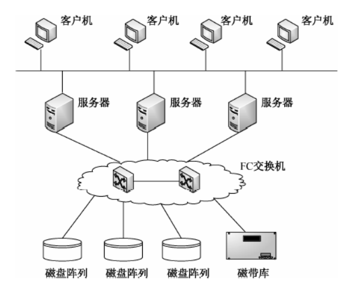

::: tip

一、常见应用层协议

二、网络层协议

三、无线网络

四、网络工程

五、网络存储技术

六、综合布线

:::

## 一、常见应用层协议

1. FTP：（TCP，21端口控制信息，20端口传输文件）
2. TFTP：简单文件传输协议（UDP）
3. HTTP
4. SMTP
5. DHCP：动态主机配置协议（UDP，给客户机分配IP）
6. Telnet：远程登录协议（允许用户登录进入远程计算机系统）
7. DNS：域名系统
8. SNMP：简单网络管理协议

## 二、网络层协议

（处理信息路由和主机地址解析）

1. IPV4

2. IPV6

   > IPV6的长度为128位，以16位为一段，共分为8段（每一段16位）每段之间使用`:`分开，每段使用16进制表示  2001：0da8：d001：0001：0000：0000：0000：0001
   >
   > IPV6压缩表示：
   > 2001：da8：d001：1：0：0：0：1
   >
   > 2001：da8：d001：1：：1（每个IPv6地址只允许有一个“：：”）

3. ICMP：差错报文协议（解决IP报文丢失、重复、延迟或乱序传递）

4. IGMP：组播协议（解决本地网络之间通信及路由问题）

5. ARP：地址解析协议（动态完成IP到MAC地址转换）

6. RARP：反向地址解析协议（动态完成MAC到IP地址转换）

## 三、无线网络

- WLAN

  >  AP：网络接入点，用于提供无线网络连接
  >
  >  Ad hoc：使用无线网卡实现点对点连接（整个网络都使用无线通信）
  >
  >  IEEE802.11标准：无线局域网协议（CSMA/CA)

- 3G通信技术（WCDMA，CDMA2000，TD-SCDMA复用技术）

- 4G通信技术（上传20Mbps，下载100Mbps）

  > TD-LTE
  >
  > FDD-LTE
  >
  > WiMAX（IEEE802.16）：全球微波互联接入(2GHz到66GHz)
  >
  > - 实现50公里的无线信号传输
  > - 无法满足高速运动下的网络连接

## 四、网络工程

- 规划

  > 功能需求
  >
  > 通信需求
  >
  > 性能
  >
  > 可靠
  >
  > 安全
  >
  > 运行与维护
  >
  > 管理
  >
  > ---
  >
  > 服务器数量与位置
  >
  > 客户机数量与位置
  >
  > 同时访问量
  >
  > 用户数
  >
  > 使用时间
  >
  > 数据传输量
  >
  > 网络拥塞时间段
  >
  > 协议
  >
  > 通信方式

- 设计

  > 1. 网络逻辑结构
  > 2. IP地址方案
  > 3. 具体的软件，硬件，广域网连接设备和服务及费用
  >
  > ---
  >
  > 1. 物理网络布线方案
  > 2. 设备和部件清单
  > 3. 软件，硬件，安装费用估计
  > 4. 安装日程表，测试计划
  > 5. 用户培训

- 实施

  > 工程实施计划
  >
  > 网络设备验收
  >
  > 设备安装与调试
  >
  > 系统测试
  >
  > 系统试运行
  >
  > 用户培训

## 五、网络存储技术

- DAS：直接附加存储

  > 将存储设备与服务器相联，通过服务器完成IO（在传递距离、连接数量、传输速率等方面受到限制，无法扩展）

- NAS：网络附加存储

  > NAS存储设备仅提供文件系统功能
  >
  > 

- SAN：存储区网络

  >  
  >
  > FC ：光纤通道

## 六、综合布线

模块化的、灵活性极高的建筑物内或建筑群之间的信息传输通道，使话音设备、数据设备、交换设备及各种控制设备与信息管理系统连接起来，同时也使 这些设备与外部通信网络相连

- 工作区

- 配线子系统

- 干线子系统

- 建筑群子系统

- 设备间

- 进线间

- 管理