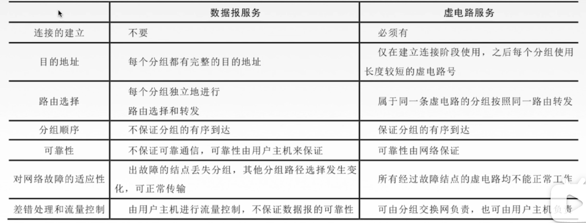
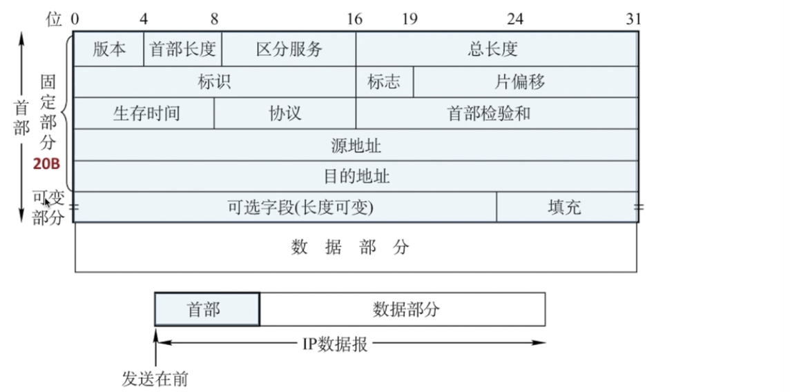
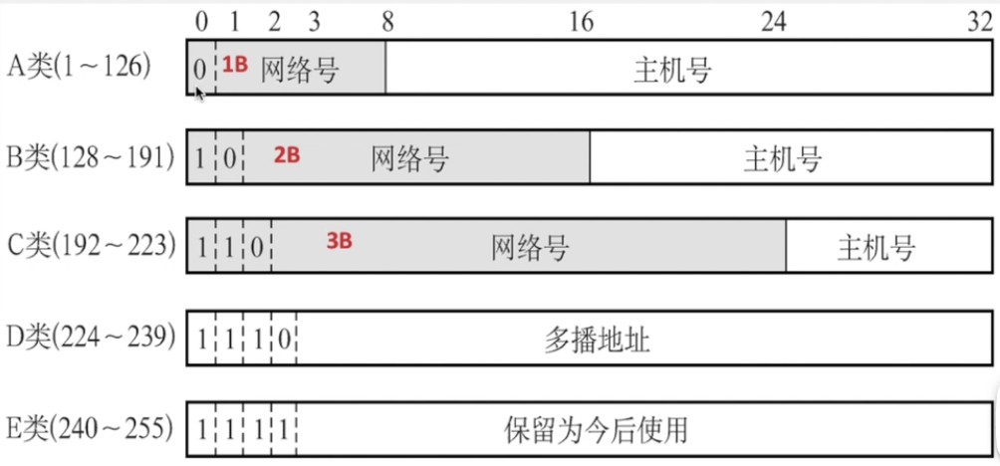
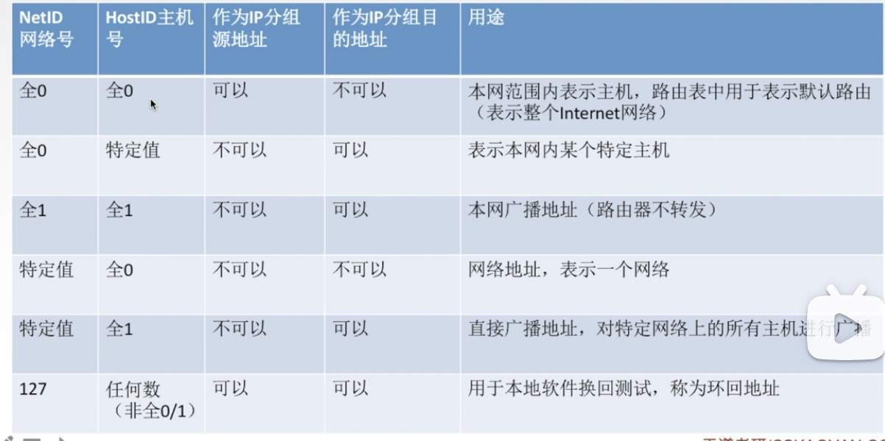
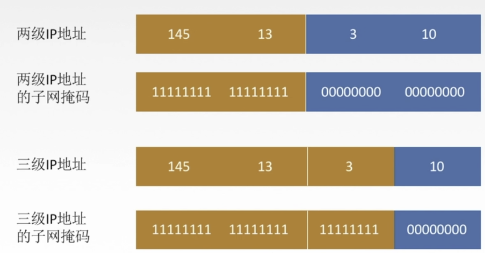

::: tip

- 数据交换
- IP协议
- 路由算法与路由协议

:::

把分组数据从源端转发到目的端，实现分组交换网上的不同主机提供通信服务。

实现功能

1. 路由选择与分组转发
2. 异构网络互联
3. 拥塞控制（缓解网络阻塞，区别于链路层流量控制解决发送接收端速度不一致情况）

##  **数据交换**

- 电路：使用**多路复用**技术独占网络资源。**通信时延小**，有序传输，**没有冲突**，实时性强，建立连接时间长，网络使用效率低，灵活性差，**无法差错控制（交换机只转发数据）**。
- 报文：无需建立连接，**具有存储转发，动态分配路线**，线路利用率高，多目标服务。有存储转发时延，网络节点存储缓存交换
- 分组：同报文交换，需要额外的信息量，需要对分组排序存储
  - 数据报方式：提供无连接服务（不确定分组传输的路径）
  - 虚电路方式：提供连接服务（确定分组传播路径，类似于电路交换建立逻辑电路）
  -  

## **IP协议**

 

 

- 版本（IPV4、IPV6）
- 总长度（65525种数据）
- 生存时间TTL：IP报生存时间，经过一个路由减1，为0丢弃
- 协议：数据部分使用协议，TCP(6)，UDP(17)

**IP数据报分片**

- 标识：同一数据报的分片使用同一标识

- 标志：DF=1，禁止分片，DF=0，运行分片，MF=1：后续还有分片，MF=0代表最后一个分片

- 片偏移：原数据报相对位置（8B为单位），数据起始位置除以8等于片偏移

**IP地址**（32位/4字节标识符，网络号+主机号）

- 分类IP地址

    

- 特殊IP地址

   

  **私有地址**

   

  | 网络类别   | 最大可用网号  | 第一可用网号 | 最后可用网号 | 最大主机数  |
  | ---------- | ------------- | ------------ | ------------ | ----------- |
  | A(固定0)   | $2^7$ -2 =126 | 1            | 126          | $2^{24}-2$  |
  | B(固定10)  | $2^{14}$-1    | 128.1        | 191.255      | $2^{16}-2$  |
  | C(固定110) | $2^{21}-1$    | 192.0.1      | 233.255.255  | $2^8-2$=254 |

**IP组播** （多播）  TODO

- 单播（点对点方式）

- 广播

- 多播（效率最高）

  > 使用UDP协议
  >
  > 不产生ICMP报文
  >
  > 组播地址范围 224.0.0.0 ~ 239.255.255.255

 **移动IP**（使用固定IP，实现跨越不同网段的漫游功能，网络IP权限不会在漫游中发生改变）

- 移动节点：具有永久IP地址的移动设备
- 归属代理（实际网络代理）

**网络地址转换NAT**（专用网络连接到互联网）

- 宽带分享
- 安全防护

**子网划分与子网掩码**

- 子网结构：网络号+子网号+主机号

- 子网掩码：**区分子网IP网络号与主机号界限**（网络号位数全1，主机号位数全0）

-  

- **子网IP计算：通过子网掩码与外网IP逐位相与**

- 特殊网段IP与二进制表示

  | 二进制表示 | 十进制表示 |
  | ---------- | ---------- |
  | 10000000   | 128        |
  | 11000000   | 192        |
  | 11100000   | 224        |
  | 11110000   | 240        |
  | 11111000   | 248        |
  | 11111100   | 252        |
  | 11111110   | 254        |
  | 11111111   | 255        |

**无分类编址CIDR**

- 消除分类IP及划分子网概念

- CIDR标记法：eg：128.14.35.7/20：前20位网络号

  > ~~~sh
  > 二进制：  10000000 00001110 00100011 00000111 (128.14.35.7)
  > 最小地址: 10000000 00001110 00100000 00000000 (128.14.32.0)
  > 最大地址: 10000000 00001110 00100000 00000000 (128.14.47.255)
  > 地址掩码: 11111111 11111111 11110000 00000000 (255.255.240.0)
  > ~~~

**构成超网：** 将多个子网聚合成较大的子网（路由聚合）

- 将相同位数和相同的网络号合并成一个路由（路由器记录下一跳地址）
- 查找路由时通过**最长匹配网络号进行路由**

**ARP协议**（地址解析协议，建立IP地址与Mac地址映射）

- 路由器广播ARP请求分组（广播询问IP对应的Mac地址）

   

  单波ARP响应分组（返回本机IP地址及MAC地址给路由器）

    

**DHCP协议**（服务器向客户端动态分配IP，子网掩码，默认网关，DNS服务器）

***DHCP属于应用层协议，使用C/S方式，客户端和服务端广播进行交互，基于UDP***

1. 入网主机广播DHCP发现报文，寻找网络中DHCP服务器
2. 服务器广播DHCP提供报文（服务拟分配主机一个IP地址及相关配置）
3. 主机广播DHCP请求报文
4. 服务器确定DHCP报文

 **ICMP协议**（用于差错报告，网络探寻）

- 差错报文

  1. 终点不可达（路由器或主机不能交付分组到目的时，向源点发送不可达报文）
  2. 源点抑制（网络拥塞丢弃分组）
  3. 时间超过（分组中TTL为零）
  4. 参数问题（首部数据问题）
  5. 改变路由（重定向）

  ---

  - 一个报文只存在一个ICMP差错报文（一个分组出发后，后续所有分组都不发送）

  - 对具有组播地址的数据不会发送ICMP差错报文
  - 对ICMP差错报告报文不再发送ICMP差错报文
  - 对特殊地址（127.0.0.1或0.0.0.0)不发送ICMP报文

- 询问报文（测试目的站是否可达及了解相关状态）

  1. 请求回答（ping）
  2. 本地时间错校验（用时钟同步测量连通时间，traceroute）
  3. 掩码地址请求回答
  4. 路由器询问和通告

## **路由算法与路由协议**

- 静态（手动配置，适用于结构简单，拓扑变化不大的网络中）

- 动态（自适应）

  - 内部网关协议

    1. RIP(距离向量)：路由器中维护从它到目的网络的最佳路径（**最大15跳，UDP，应用层**）

       > 仅和相邻的路由器交换信息（路由表）
       >
       > 每30秒交换一次路由信息，若超过180秒没接收到邻居路由信息，则判断邻居路由不可达，并更新自己路由表
       >
       > 经过多次交换后所有路由器将存储内网网络所有路由表
       >
       > **距离向量算法**
       >
       > 1. 更改相邻路由RIP报文路由表所有表项（**下一跳改为相邻路由地址，TTL加1**）
       > 2. 更新本地路由表，存在相同的目的网络和相同的下跳网络（更新跳数），存在相同的目的网络则比较跳数（跳数较短的更新替代）
       > 3. 180s未收到邻居路由报文，则把邻居路由标记不可达，设置跳数为16

    2. OSPF：最短路径优先

       > 路由器广播发送相邻的所有路由器链路信息（只有链路变化才发送）。
       >
       > 子网中所有路由器链路信息都交换完毕后使用Dijkstra算法依据链路状态构造最短路径

  - 外部网络（BGP)：交换路基向量（应用协议，使用TCP传输）

   

- **路由器转发分组算法**

  1. 提取目的地址IP
  2. 判断是否直接交付（**目的IP与各个子网掩码相与操作，判断IP是否与相应的子网IP匹配**，匹配则将IP转为Mac地址，并封装成Mac帧发送到目的主机

  3. 特定主机路由地址（路由器中存在目的地址的特殊路由）
  4. 检测路由表中是否存在合适路径**（目的地址与各网子掩码相与操作，判断IP网络号与子网网络号是否相同，相同则交付给子网路由下一条地址）**
  5. 默认路由地址（路由器传给下一路由地址，**路由器默认网关**）
  6. 报告转发分组出错