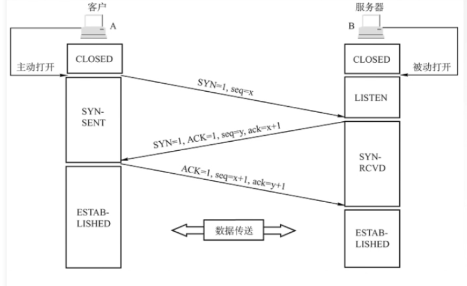
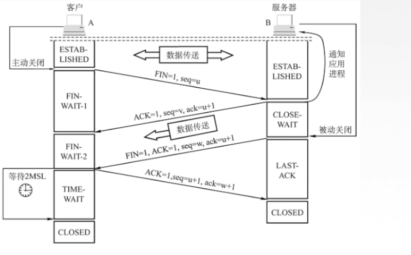
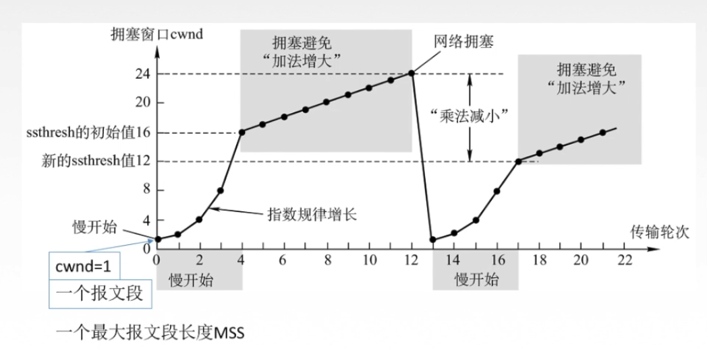

::: tip

- TCP协议与UDP协议
- UDP：无连接传输控制协议

:::

- 主机之间进程通信

- 复用和分用（端口）

  > 复用：应用层进程复用同一个传输层进行通讯
  >
  > 分用：传输层从网络层收到数据后指明交付的进程
  >
  > 端口号：16bit存储: 0~65536
  >
  > 1. 服务端口号（固定）
  >
  >    > 0~1023：系统应用使用的端口
  >    >
  >    > - FTP：21
  >    > - TELNET：23
  >    > - SMTP：25
  >    > - DNS：53
  >    > - TFTP：69
  >    > - HTTP：80
  >    > - SNMP：161
  >    >
  >    > 1024~49151：开放式应用端口号
  >
  > 2. 客户端口号 (49152~65535)
  >
  >    > 客户端通信时候操作系统随机分配
  >
  > 3. 套接字（Socket）主机IP+端口号，**允许同一个port绑定多个进程，但不能绑定同一个IP**

- 报文差错检测（TCP可靠传输）

##  **TCP协议与UDP协议**

TCP：面向传输控制的协议（不提供广播和多播服务，时延长，传输可靠，适用于大文件传输）

1. 面向连接（虚拟电路）

2. 点对点连接通信

3. 提供可靠数据交付（可靠有序，不丢不重）

4. 全双工通信（发送接收缓存）

5. 面向字节流

6. TCP报文格式

    

   - **seq序号：TCP报文分片标识**
   - **ack确认号：期望接收下一TCP报文标识（确认号N-1之前TCP报文都正确接收）**
   - 数据偏移：记录TCP数据指针位置
   - 控制位：
     1. **紧急位URG**：紧急数据（发送方应用，不用在缓存中排队）
     2. **确认位ACK**：连接成功后TCP报文标识
     3. 推送位PSH：推送报文（交付方立即将TCP报文交付给应用层）
     4. RST：TCP链接差错，必须释放连接在重新链接
     5. **同步位SYN**：标识TCP报文为连接请求或连接接收报文
     6. **终止位FIN：**释放TCP链接
   - 接收窗口：允许接收方缓存TCP数据量（由发送方决定）
   - 紧急指针：当URG=1时，标记TCP报文中紧急数据
   - 选项：包含当前时间戳，报文最大长度，窗口扩大等信息

7. **TCP连接管理**

   **TCP发起连接**

   - C/S服务方式：主动发起连接建立的应用为客户端，被动等待连接为服务器

   -   

     1. 客户端发送请求报文（控制位**SYN=1，确认位ACK=0**，确认序号seq=x随机）

     2. 服务器为此次**TCP连接分配接收缓存**，并向客户端返回TCP确认报文（**SYN=1，ACK=1**，seq=y随机，**ack=x+1**）

     3. 客户端为此次**TCP连接分配接收缓存**（**SYN=0，ACK=1，seq=x+1，ack=y+1**）**并携带数据**

   *SYN洪泛攻击：攻击者向服务器发送大量SYN连接请求而不确认，导致服务器重复发送ACK给攻击者，以致于服务器资源浪费宕机。SYN Cookie：对TCP三次握手协议进行更改，在服务器收到SYN包时不进行分配缓存，根据SYN包计算出cookie值响应客户端*

   ---

   **TCP释放连接**（客户端，服务器都能主动释放连接）

   -   
     1. 客户端发送连接释放报文段（**ACK=0，FIN=1，seq=u**）
     2. 服务端回送一个确认报文段**（ACK=1，seq=v，ack=u+1）客户端到服务器方向连接被释放，服务器不接受来自客户端任何请求**
     3. 服务端发送链接释放报文**（FIN=1，ACK=1，seq=w，ack=u+1）服务器释放服务器到客户端连接**
     4. 客户端回送确认报文段（ACK=1，seq=u+1,ack=w+1)，等待计时器接收后释放连接（间隔时间内防止回收确认报文段丢失，判断依据是服务器是否重发第3步报文）

8. **TCP可靠传输**

   - 校验（伪首部）
   - seq序号
   - ack确认
   - 重传（TCP在规定时间内未接收到ack确认报文，则进行重传，RTTs平均加权往返时间，**ack冗余确认**）

9. **TCP流量控制**（滑动窗口流量控制,通链路层帧传输）

10. **TCP拥塞控制**（资源需求总和>可用资源，协调过多的数据发送到网络中）

     

    1. 慢开始（逐步增加窗口大小）
    2. 拥塞判断（发生网络拥塞时记录窗口值，并将调整窗口为1）
    3. 重新执行1步骤，直到窗口到达上一次拥塞值时缓慢增加

## **UDP：无连接传输控制协议**

（不可靠，时延小，适用于小文件传输）

 1. UDP无连接交互，减少开销和发送数据之间时延

2. 不保证可靠交互

3. 面向报文传输，适合数据量较少的应用通信（传输层对应用层的报文不做拆分处理，直到网络层进行拆分）

4. 无网络拥塞控制

5. UDP首部开销小

    

    

   UDP校验和：（信息摘要校验）

   1. 发送端填上伪首部（源IP+目的IP+UDP协议+UPD长度+全0填充）

  6. UPD补0填充

   7. UPD数据报和伪码求和取反得到校验和，将校验和填入UDP首部