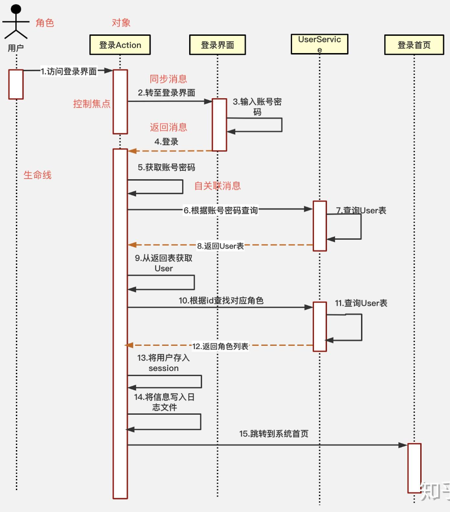

::: tip

- 概述
- 软件需求与软件需求规约
- 结构化方法
- 面对对象方法UML
- 面对对象方法RUP
- 软件测试
- 软件生存周期过程与模型
- CMMI集成化能力模型

:::

## 概述

系统工程：将系统化的、规范的、可量化的方法应用于软件的开发、运行和维护过程，以及这些方法的研究。它旨在通过应用工程化的原则来提高软件的质量、缩短软件开发周期、降低软件成本，并确保软件满足用户的需求

**软件工程的三要素**：方法、工具、过程

软件工程求解问题基本途经：

1. 需求获取与分析
   - 与利益相关者沟通，了解他们的需求和期望。
   - 分析业务流程，识别问题域。
   - 定义软件的功能性需求和非功能性需求。
   - 编写需求规格说明书
2. 系统设计
   - 根据需求分析结果，设计软件的总体架构。
   - 确定软件的主要组件及其交互方式。
   - 进行详细设计，为每个模块或组件指定具体的技术实现方案。
   - 设计数据库模型、用户界面等
3. 实施（编码）
   - 选择合适的编程语言和技术栈。
   - 按照设计文档编写高质量的代码。
   - 实现单元测试，确保每个模块的功能正确无误。
4. 测试
   - 执行集成测试，确保各个模块能够协同工作。
   - 进行系统测试，验证软件是否满足所有需求。 
   - 用户接受度测试（UAT），让最终用户试用软件，收集反馈。
   - 对发现的问题进行修复，直至软件达到可交付状态。
5. 部署与维护
   - 将软件部署到生产环境。
   - 提供必要的培训和支持，帮助用户熟悉软件。
   - 监控软件运行状况，及时响应用户的问题和建议。
   - 根据户反馈持续改进软件，添加新功能，优化现有功能。
6. 项目管理
   - 制定项目计划，包括时间表、预算、资源分配等。
   - 跟踪项目进度，定期评估项目状态。
   - 管理风险，制定应对策略。
   - 协调团队成员之间的合作，促进有效沟通。

## 软件需求与软件需求规约

需求性质：完整性，一致性，可验证性，可追踪性，可实现

需求分类：

- 功能需求：软件系统必须实现的具体功能，以满足用户的基本需求
- 非功能需求：软件系统在性能、可靠性、安全性、易用性等方面的要求，这些需求不直接关联到软件的具体功能，而是关注系统的整体质量和用户体验。

需求发现技术：场景替换，交谈，观察，小组会，技术文档提炼

**软件需求规约作用**：

- 软件开发组织和用户之间的技术合同，
- 需求规约是项目管理的控制点，指导项目经理进行成本、进度的控制。
- 不作为进度或规划文档（不包含项目成本，交付进度，软件开发方法，质量保证，验收文档）

需求规约格式：

1. 引言

   1.1 目的

   1.2 范園

   1.3 定义，缩略语

   1.4 参考文献

   1.5 概述

2. 总体描述

   2.1 产品概述

   2.2 产品功能

   2.3 用户特性

   2.4 约束

   2.5 假设和依赖

3. 特定需求

附录

## 结构化方法

结构化方法：强调将软件开发过程划分为多个相互关联且有序的步骤，确保每个阶段的工作都基于清晰、准确的需求和规范进行

结构化方法特点：

1. 模块化设计：将复杂的问题分解成若干个简单的模块，每个模块都有明确的输入和输出，模块之间通过接口进行通信。模块都是独立的，可以单独测试和调试，而且可以重复利用，提高了软件开发的效率和质量。
2. 层次化结构：将整个软件系统分成若干个层次，每个层次都有明确的功能和职责。这种层次化的结构使得软件系统的设计更加清晰和易于理解，同时也方便了软件的维护和升级
3. 结构化编程（OOP）：侧重于通过定义清晰的控制流程来组织代码，使用顺序、选择和循环结构来解决问题，代码结构清晰，易于调试，无法扩展，适用于程序规模较大，需要清晰控制和模块化设计的情况

- **优点**：结构化方法易于实现，有利于应用软件总体结构的优化，实现的系统具有较好的维护性。
- **缺点**：结构化方法的开发周期长，难以适应环境的变化，对系统分析和设计人员的要求较高。

**结构化分析方法**： 处理，基本思想是自顶向下、逐步求精、模块化设计、结构化编码

**结构化分析工具**：DFD数据流图，数据字典，判定表

- DFD数据流图：图形化的方式展示了数据在信息系统中的流动和处理过程

  - 外部实体：产生或使用数据的一类具体事物，使用矩形表示
  - 数据流：外部实体交换信息（通信）的信息载体，使用箭头表示
  - 加工/转换：转换数据流，存在输入和输出数据流，使用椭圆表示
  - 数据存储：数据在系统中的存储和持久化位置，实用双横线表示

  案例：

  - 开学阶段，需要教师提交开课申请进行开课，学生根据老师的开课信息，选择课程，教务处生成学生课表、教师课表。

  - 期末阶段，需要根据开课情况对学生进行考试安排，对教师进行监考安排，以及学生考试成绩管理。

  - 学期结束，需要对学生成绩进行统计，计算绩点，排名，评定奖学金。

     

     

      

- 数据字典：数据字典是对数据流图中包含的所有元素的定义的集合

  ~~~C++
  - `=`：定义为
  
  - `+`：顺序
  
  - `|`：或者，选择
  
  - `{}`:重复
  
  - m..n：可取 m~n 中的任意值
  ~~~

- 判断表

**结构化设计**：在需求分析的基础上（DFD），基于高内聚低耦合方式将DFD转为模块结构图（MSD）

**结构化设计工具**：模块结构图，层次图，HIPO图（每个模块都存在IPO图，分为输入，处理和输出）

结构化设计步骤：

- 变换数据流程图（与处理事务相关为逻辑输入输出，与事务外的间接输入输出为物理输出）

- 事务型数据流程图（集中-发散方式）

   

**模块化设计规则**

- 耦合度：不同模块之间相互依赖程度

  1. 内容耦合（模块间能直接修改或操作数据）
   2. 公共耦合（模块间能访问公共的数据项）
   3. 控制耦合（模块间使用接口完成数据交换）
   4. 间接耦合（模块间通过第三方接口完成数据交换）
   5. 数据耦合（模块间使用接口参数相同）
- 内聚：模块内部依赖关系
  1. 偶然内聚
  2. 逻辑内聚
  3. 时间内聚
  4. 过程内聚
  5. 通信内聚
  6. 顺序内聚
  7. 功能内聚

**结构化程序设计**：顺序，选择if-else，循环do-while

**结构化程序设计工具**：

- 程序流程图
- 盒图： 
- PAD图： 
- 伪码

## 面对对象方法UML

面对对象方法：强调通过模拟现实世界中的实体及其相互关系来构建软件系统，封装，继承，多态，抽象

UML：统一建模语言，包括一系列的图形符号和规则，**用于描述系统的结构和行为**

- 事物术语：类与对象，接口，协作，用例，主动类，构件，制品，节点，交互，状态机，活动

  1. 结构事物
     - 类与对象
     - 接口/需接口：接口（圆圈表示）。需接口：组件实现接口（半圆）
     - 协作：描述一组类、接口和其他元素如何共同工作（虚椭圆）
     - 用例：描述系统与参与者之间的交互（实椭圆）
     - 主动类：控制活动的类（双竖线矩形）
     - 构件：模块化组件，通过外部接口隐藏具体实现（共享相同的接口的构件可以相互替换）
     - 制品：系统交付实现（源码，执行程序，或脚本）
     - 节点：具有记忆能力或处理能力的计算机资源
  2. 行为事物

     - 交互（Interaction）：对象之间通过消息交换进行的一组动作。

     - 状态机（State Machine）：描述对象在其生命周期内经历的状态序列。

     - 活动（Activity）：描述计算机过程执行的步骤序列。
  3. 分组事物
     - 包：实现模块化和结构化的机制
       1. 引入：包之间使用关系
       2. 包含：抽象用况使用关系
       3. 扩展：抽象用况之间有条件使用关系
  4. 说明事物：注解

- 事务关系术语：关联，聚合，组合，依赖，泛化

  1. has a ：包含关系：
     - 关联（Association）：对象中含有其他对象属性  实线+箭头
     - 聚合（Aggregation）：关联实体之间不在同一生命周期中，可以由方法注入   实线+空菱形
     - 组合（Component）：关联实体在同一生命周期中，实线+实心菱形
     - 依赖（Dependency）：临时关联（局部变量，入参，出参）。虚线+箭头
  2. is a：类似关系
     - 泛化（Generalization）：继承关系。实线+空三角形
     - 实现（Realization）：实现关系。虚线+空三角形

- UML模型

  1. 类图

       

  2. 用例图

      

  3. 状态图：描述对象在其生命周期内所经历的各种状态，以及状态之间的转移、引发转移的事件或状态转移的活动

     - 状态：对象在其生命周期中的某个条件或状况，通常分为初态，终态，通用状态
     - 事件：引起状态转换的特定情况或动作
     - 动作：与状态转换相关的行为或活动。
     -   

  4. 顺序图（时序图）：展示系统组件间交互过程的图表

     - 角色

     - 对象：交互中所扮演的角色

     - 生命线：对象存在的时间

     - 控制焦点：对象时间线上某段时期执行的操作

     - 消息：对象之间发送的信息，可以是同步消息、异步消息或返回消息

     - 组合片段：选择（opt/alt）、循环（loop）、中断（break）、并行（par）

        

## 面对对象方法RUP

RUP是一种软件开发过程框架，提供一种系统化的方法来管理软件项目的开发。强调迭代开发、用例驱动和以架构为中心。

- 以用例为中心的开发
- 以体系结构为中心
- 迭代，增量式

核心步骤：

- 需求获取：明确用户需求，转化为可用于软件开发的具体规格说明（产品经理/需求分析师，客户，人机接口设计员）
  1. 确定需求来源（用户，管理层，开发团队）
  2. 收集需求方式（访谈，问卷，观察，文档分析，竞品分析）
  3. 输出需求规格说明书SRS（功能，非功能，约束条件，优先级，需求变更管理）
  4. 用例图，界面原型（帮助理解软件的功能和操作方式）
- 需求分析：需求转为开发语言描述（产品经理/需求分析师，架构师，开发人员，测试人员）
  1. 分析包：存放特定功能或领域相关的分析模型元素（高类聚）达到功能需求的组织和管理
  2. 分析类（用例分析）：分析需求之间的依赖，及需求的属性和操作
     - 边界类：定义系统与外界的交互隔离（用户界面，数据库，外部系统）
     - 实体类：长期驻留在系统中的模型化对象
     - 控制类：负责协调和管理系统中其他类的行为。它通常不直接处理数据，而是通过调用其他类的成员函数来实现系统功能
- 需求设计：定义满足需求规约所需要的软件结构
  1. 设计类：关系（继承，依赖，关联，组合），属性，方法，是否主动类
  2. 接口：
  3. 设计子系统
- 需求测试

## 软件测试

软件测试目标

1. 确保软件质量
2. 验证软件功能和性能
3. 提高软件可靠性
4. 支持软件维护和优化
5. 降低成本和风险

软件测试技术

- 路径测试：（白盒测试，结构测试）

  1. 路径覆盖：设计测试用例使程序中的所有可能路径都至少执行一次

  2. 条件组合
  3. 分支覆盖：使得程序中的每个判定的取真分支和取假分支至少执行一次
  4. 语句覆盖：测程序中的每条语句至少执行一次

- 基于事物流测试：模拟用户操作的事务流程来验证软件的功能正确性（黑盒测试）

  1. 事物流程图

     - 分支：根据某个条件或决策点，流程会分成两条或多条不同的路径

     - 并生：两个或多个流程同时进行

     - 分裂：从一个单一的流程点分散到多个方向

     - 汇集：指多个流程线汇聚到一个点继续执行

     - 吸收：一个流程完全包含或取代另一个流程

     - 结合：两个或多个流程的输出合并成一个新的流程或结果

- 等价划分：主要用于减少测试用例的数量，同时仍然能够有效地覆盖程序的主要功能（黑盒测试）

- 边界值分析：检测发生在输入或输出边界处的错误（黑盒测试）

- 因果图与决策表：通过图形化的方式表示输入条件与输出结果之间的因果关系（黑盒测试）

  1. 输入条件约束：E（互斥），I（包含），O（唯一），R（要求），M（强制屏蔽）

软件测试步骤

- 单元测试：对软件中的最小可测试单元进行检查和验证
- 集成测试：模块之间的接口和交互测试
- 有效性测试（验收测试或功能测试）：验证软件是否满足业务需求和用户期望的过程。它从最终用户的角度出发，检查软件的功能性和非功能性特性

## 软件生存周期过程与模型

软件开发过程：与软件生产直接相关的活动集

- 开发过程活动：系统需求分析，系统体系结构设计，软件需求分析，软件体系结构设计，软件详细设计，软件编码和测试，软件集成，软件合格性测试，系统集成，系统合格性测试，软件安装，软件验收支持
- 支持过程活动

  1. 过程实现：编制和管理计划，及进度安排。
  2. 配置标识：制定方案，建立基线文档
  3. 配置控制：记录变更请求，分析，评价，批准变更
  4. 配置状态统计：编制管理记录和状态报告，表明受控软件项的状态和历史
  5. 配置评价：确保软件具有需求的全部功能
  6. 发布管理和交付：保存代码和文档的母拷贝。记理、储存、包装和交付具有安全保密性关键功能的代码和文档
- 组织过程活动
  1. 启动与范围定义：管理者检查和管理过程中需要的资源
  2. 规划：执行过程中指定相应的计划和任务，执行过程中有管费用
  3. 测量：规划并实施活动需要的资源
  4. 执行和控制
  5. 评审和评价
  6. 结束处理

软件生存周期模型

- 瀑布模型（计划驱动模型，不易变更，适合需求明确的项目）

  1. 每个阶段必须在前一阶段完成后才能开始

- 增量模型（逐步交付，快速反馈，降低风险，需要用户参与反馈的项目，瀑布模型和原型模型）

  1. 每个增量都包含完整的产品子集，可以在较早阶段交付给用户，并且可以根据用户的反馈逐步完善

- 螺旋模型（风险分析及驱动，需要经验丰富的开发人员）

  1. 瀑布模型的关键元素与原型模型的迭代特征结合起来，增加了风险分析环节

- 喷泉模型（迭代式和增量式的模型，强调循环开发和并行开发）

  1. 面向对象的软件开发。它是一个迭代模型，允许在任何阶段进行来回迭代，强调的是并行开发多个特性而不是顺序进行

- 敏捷模型（灵活性、迭代和增量交付，以及团队之间的紧密协作）

## CMMI集成化能力模型

CMMI：指导软件开发过程改进和评估软件开发能力的模型，建立一套规范的、度量的、持续改进的软件开发过程体系，提高软件开发的效率和质量

软件质量影响因素：人员，规程和方法，工具

CMMI模型部件

- 过程域：描述了组织在特定过程域中的实践和改进目标（矩形）
- 专用目标与共用目标：过程域都有其特定的专用目标和可以应用于多个过程域的共用目标（菱形）
- 实践：达到目标而执行的活动（椭圆）
- 典型工作产品：践所产生的输出样品，用于证明实践的执行情况（椭圆）
- 简介性注释：解释过程域中的主要概念（椭圆）
- 相关过程域：列出与当前过程域相关的其他过程域（椭圆）

**CMMI能力等级：单个特定领域的能力**

- Level 0：不存在：\- 没有实现过程域的目标。

- Level 1：执行： 实现了过程域的目标，但没有标准化的过程

- Level 2：管理：实现了过程域的目标，并且有标准化的过程。

- Level 3：定义：过程不仅被标准化，而且还被组织内部广泛共享和重复使用。

- Level 4：过程不仅被定义，还能够对其进行量化管理。
  - 量化管理级：实现数字化的管理，通过量化技术来实现流程的稳定性，实现管理的精度，降低项目实施在质量上的波动。

- Level 5：优化级：过程不仅被量化管理，还能在此基础上进行持续优化

**CMMI组织成熟度等级：组织在多个领域的整体成熟度**

- 初始级（Initial）：企业对项目的目标与要做的努力很清晰，项目的目标得以实现。但由于任务的完成带有很大的偶然性，企业无法保证在实施同类项目时仍然能够完成任务。
  - 项目目标清晰，但成功依赖于个人能力
- 已管理级（Managed）：企业在项目实施上能够遵守既定的计划与流程，有资源准备，权责到人，对相关的项目实施人员有相应的培训，对整个流程有监测与控制，并与上级单位对项目与流程进行审查。
  - 项目遵循既定流程，有资源准备和权责分配。
- 已定义级（Defined）：企业能够根据自身的特殊情况以及自己的标准流程，将这套管理体系与流程予以制度化。企业不仅能够在同类的项目上成功，也可以在其他项目上成功。
  - 管理体系制度化，适用于多种项目
- 量化管理级（Quantitative Management）：企业的项目管理不仅形成了一种制度，而且要实现数字化的管理。对管理流程要做到量化与数字化。
  - 管理流程数字化，实现精确管理
- 优化级（Optimized）：企业的项目管理达到了最高的境界。企业要能够充分利用信息资料，对企业在项目实施的过程中可能出现的次品予以预防。
  - 利用信息主动改进流程，达到持续优化

 **组织成熟度等级与能力等级区别**

- **组织成熟度等级**关注的是组织作为一个整体在所有过程域上的综合表现，而**能力等级**则关注于特定过程域的能力表现。

- 组织成熟度等级强调的是整体的成熟度，而能力等级更侧重于具体过程的有效性和效率。

- 在实际应用中，组织成熟度等级往往作为能力等级的集成结果，即当所有关键过程域都达到了某个能力等级时，组织才被认为达到了相应的成熟度等级。

