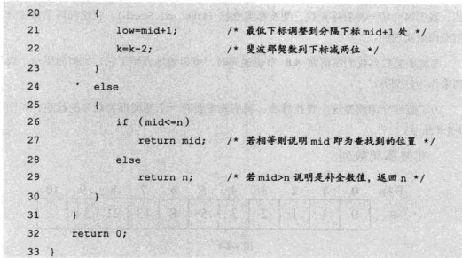
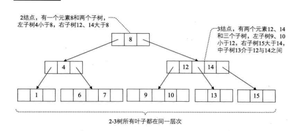
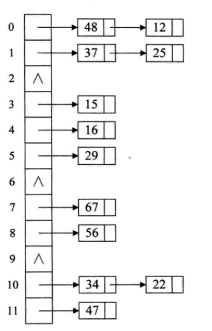

::: tip

- 顺序表查找
- 二分法查找(Binary Search)
- 线性索引查找
- 二叉排序树(Binary Sort Tree BST)
- 多路查找树(B树)
- 散列表查找(哈希表)

:::

平均查找长度 ASL 

ASL= $\sum_{i=1}^nP_iC_i$  其中n为结点个数,$P_i$是查找第i结点的概率

## 顺序表查找

顺序表是指线性顺序存储结构(结点排序)

~~~c
typedef struct{
KeyType key;
InfoType data;
}NodeType
~~~

哨兵顺序查找

存取查找平均查找次数为 $ASL = \frac{(n+1)}{2}$

## 二分法查找(Binary Search)

递归实现

~~~c
int BinSearch(SeqList R,KeyType k,int low,int high)
{
int mid;
if(low<=high){
  mid = (low + high) / 2 ;
  if(R[mid].key== k) return mid;
  if(R[mid].key >k) 
    return BinSearch(R,k,low,mid-1);
  else 
      return BinSearch(R,k,mid+1,higth);
}
else 
 return 0;
}
~~~

非递归实现

> __差值查找__
>
> mid = $\frac{low+high}{2} = low + \frac{1}{2}(high-low)$  折半查找中间值
>
> $mid = low + \frac{key-a[low]}{a[high]-a[low]}(high-low)$  改进后的中间插入值
>
> __斐波那契查找__
>
>  
>
>  

## 线性索引查找

- 稠密索引

  > 将数据集中每一条记录对应索引项(关键码与指针一一对应)

- 分块索引

  > 分块索引表  分块数据  (分块索引记录关键码,块长,块指针)

- 倒排索引

  > 记录次关键码
  >
  > 记录表号
  >
  > 其中记录号表存具有次关键字所有记录的记录号(通过属性描述查找记录,区别于通过唯一ID查找记录)

## 二叉排序树(Binary Sort Tree  BST)

左节点值小于父节点，右节点值大于父节点

二叉排序树查找

~~~C
// f指向T的双亲 
// 查找成功 指针指向p结点元素 否则p指向上一路径访问最后一个结点 返回True
Status SearchBST (BiTree T,int key , BiTree f, BiTree *p)
{
if (!T) {   // 查找不成功
  *p = f;
  return FALSE ;
}else if (Key == T->data){
  *p = T
  return TRUE;
} else if (key< T->data){
  return SearchBST(T->lchild,key,T,p)
}else{
  return SearchBST(T->rchild,key,T,p)
}
}
~~~

二叉树删除

> 叶子结点直接删除
>
> 只存在一个子结点的子节点替代删除结点
>
> 包含左右子节点的，中序遍历后找到删除节点**前序元素**或**后序元素**代替被删除的节点
>
> ~~~c
> // 删除结点代码
> Status DeleteBST (BiTree * T ,int key)
> {
>  if(!*T) return FALSE; //不存在关键字等于key的数据元素
>  else
>  {
>      if(key == (*T)->data) // 找到删除元素
>          return Delete(T)
>      else if (key<(*T)->data)
>          return DeleteBST(&(*T)->lchild,key);
>          else 
>            return DeleteBST(&(*T)->rchild,key);
>  }
> }
> 
> Status Delete(BiTree *p) // p为删除结点元素指针
> {
>  BiTree q,s;
>  if((*p)->rchild == null)
>  {
>      q=*p; *p=(*p)->lchild; free(q);
>  }else if((*p)->lchild == null)
>  {
>      q =*p; *p=(*p)->rchild; free(q);
>  }else{ // 左右子树均不为空
>    q=*p;s=(*p)->lchild; // 记录左指针
>      while(s->rchild){ //循环右指针 s指向p中序遍历的前驱结点
>          q = s; s=s->rchild;
>      }
>      (*p)->data = s->data  //指向被删除结点的直接前驱
>      if(q!=*p)
>           q->rchild=s->lchild 
>       else
>           q->lchild=s->lchild
>           free(s);
>  }
>  return TRUE;
> }
> ~~~

## 多路查找树(B树)

> _每一个结点的子结点可以多于两个,且每个结点可以存储多个元素_

__2-3树__

_一个结点包含一个元素和两个或三个孩子结点(或没有孩子结点),与BST类似,左子树包含元素小于该元素,且所有叶子结点都在同一层_

__B树(B-tree)平衡多路查找树,结点中最大的孩子数目称为B树的阶(order)__

> 一个m阶的B树具有如下属性
>
> - 根节点不是叶子结点,则其至少有两个子树
> - 每一个非根的分支结点都有k-1个元素和k个孩子 __其中[m/2]$\le k \le m$ 每一个叶子结点n都有k-1个元素 
> - 所有叶子结点都在同一层
> - 含有n个关键字的B树上查找时,从根节点到关键字结点路径上设计结点数不超过 $\log_\frac{m}{2}(\frac{n+1}{2})+1$

B+树(解决一个页块多次访问)

> _m阶的B+树和m阶的B树差异在于:_
>
> - _有n棵子树的结点包含n个关键字_
> - ___所有的叶子结点包含全部关键字的信息,及指向含这些关键字指针,叶子结点本身依据关键字大小顺序链接___
> - ___所有分支结点可以看成索引,结点中仅含有其子树中最大(最小)关键字___
>
> 
>
> > B+树结构适合范围数据查找

## 散列表查找(哈希表)

- 散列技术时记录的存储位置和它关键字之间建立一个确定对应关系f,使得每个关键字key对应一个存储位置f(key)  f称为散列方式(Hash),采用散列技术将记录存在一块连续的存储空间中,称为散列表

- 哈希函数：简单，散列地址分布均匀

- 常见哈希函数

  > 直接定址法：$f(key)=a\times key+b$ (a,b为常数)
  >
  > 数学分析法：抽取关键字作为hash中key值
  >
  > 平方取中法：关键字平方取中间数字
  >
  > 折叠：折叠求和,将数字分组求和
  >
  > 除留余数法：f(key) = key mod p (p<=m)
  >
  > 随机数法

- 哈希冲突

  > 开放定址法：寻找下一个空的散列地址,线性探测法
  >
  > $f_1(key) = (f(key)+d_i) MOD m  (d_i=1,2,3,m-1)$ 
  >
  > 再散列函数：多次计算散列
  >
  > 链接地址法：将哈希冲突数据放在链表上,散列表存储同义词的表头指针
  >
  >  
  >
  > 公共溢出区法：使用溢出表存储哈希冲突数据

