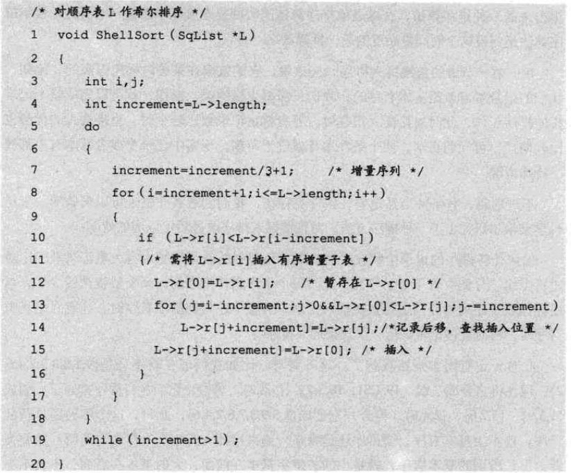
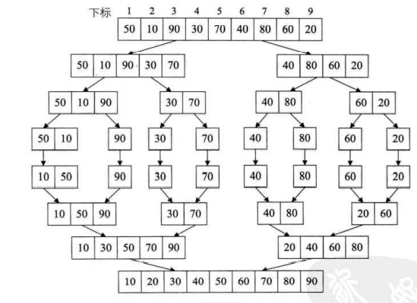
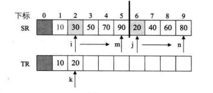
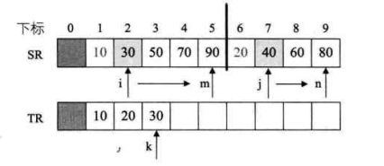

::: tip

- 冒泡排序
- 选择排序
- 插入排序
- 希尔排序
- 堆排序
- 归并排序
- 快速排序

:::

_内排序是在整个排序过程中,待排序的所有记录全部被放置在内存中,外排序是由于排序记录个数多,不能同时放在内存中,整个排序过程需要在内存外进行数据交换_

> __排序算法性能影响__
>
> - 时间性能
> - 辅助空间
> - 算法复杂度

## 冒泡排序

(交换排序)

__比较两两相邻的记录的关键字,如果反序则交换,直到没有反序记录为止__

~~~c
// 自后向前扫描的冒泡排序
void BubbleSort(SqList * L)
{
 int i,j;
 status flag = true;
 for (i=1;i<L->length && flag;i++) // 两两比较循环
 {
     flag = false;
     for(j=L->length-1;i>=i;j--) // 倒叙遍历比较
     {
      if(L->r[j]>L->r[j+1])
      {
          swap(L,j,j+1);
          flag =true;
      }
     }
 }
}
~~~

## 选择排序

(Simple Selection Sort)

__通过n-i次关键字比较,从n-i+1个记录中选出最小的记录,并和第i个记录交换__(从未排序的数列中遍历一位元素与已排序最大元素__比较交换位置__)

~~~c
void SelectSort(SqList *L)
{
 int i,j.min;
 for(i=1;i<L->length;i++) // 循环数组
 {
     min = i;            // 哨兵下标
     for(j=i+1;j<=L->length;j++)
     {
         if(L->r[min]>L->r[j])
             min = j;
     }
     if(i!=min)
         swap(L,i,min);
 }
}
~~~

选择排序性能优于冒泡排序

## 插入排序

(将待排序的记录插入已排序的合适位置)

__直接插入排序: 将待排序数列分为已排序和未排序 R[1...i-1] R[i..n] , 排序时将从未排序中取出一个元素插入到已排序数列的合适位置__

~~~c
void InsertSort(SeqList R,int n)
{
    int i,j;
    for(i=2;i<=n;i++)
        if(R[i].key < R[i-1].key){
            R[0] = R[i];
            for(j=i-1;R[0].key<R[j].key;j--)
                R[j+1] = R[j];
            R[j+1] = R[0];
        }
}
~~~

> 性能优于选择排序

## 希尔排序

(特殊的插入排序)

> _定义一个小于n的整数 $d_1$作为第一个增量,把下标距离$d_1$的倍数元素放在同一组中,在各组中在使用插入排序_

## 堆排序

__堆排序(Heap Sort)将待排序的序列构成一个大顶堆,此时,序列的最大值是根结点,移走后,再次进行堆排序选出一个最大根结点取走__

~~~c
void HeapSort(SqList *L)
{
 int i;
 for(i=L->length/2;i>0;i--) // 把L中的r构成一个大顶堆
     HeapAdjust(L,i,L->length);
 for(i=L->length;i>1;i--)
 {
     swap(L,1,i); // 将堆顶记录和当前未排序子序列的最后一个记录交换
     HeapAdjust(L,1,i-1); // 将L->r[1...i-1]重新调整为一个大顶堆
 }
}

void HeapAdjust(SqList *L,int s,int m)
{
 int temp,j;
 temp = L->r[s];
 for(j=2*s;j<=m;j*=2)
 {
     if(j<m&&L->r[j]<L->r[j+1])
         ++j;
     if(temp>=L->r[j])
         break;
     L->r[s]=L->r[j];
     s=j;
 }
 L->r[s] = temp;
}
~~~

$\log_2n+1$

## 归并排序

(merging Sort)

~~~ c
void MergerSort(SqList *L)
{
 MSort(L->r,L->r,1,L->length)
}

void MSort(int SR[],int TR1[],int s,int t)
{
 int m;
 int TR2[MAXSIZE+1];
 if(s==t) // s == t 判断是同一个值 递归终止
     TR1[s] = SR[s];
 else
 {
     m = (s+t) /2 ; // 将数组一分为2
     MSort(SR,TR2,s,m);//递归将SR[s..m]归并为有序的TR2[s..m]
     MSort(SR,TR2,m+1,t); //递归将SR[m+1..t]归并为有序的TR2[m+1...t]
     Merge(TR2,TR1,s,m,t); // 将TR2和TR2归并到TR1
 }
}
~~~

~~~c
// 将有序的SR[i..m]和SR[m+1..n]归并有序的TR[i..n]
//合并排序 ->首元素比较元素小的移动下标
void Merge(int SR[],int TR[],int i,int m,int n)
{
 int j,k,l;
 for(j=m+1,k=i;i<=m&&j<=n;k++)
 {
     if(SR[i]<SR[j])
         TR[k]=SR[i++];
     else
         TR[k]=SR[j++]
 }
 if(i<=m)
 {
     for(l=0;l<=m-i;l++)
         TR[k+1]=SR[i+1];
 }
 if(j<=n)
 {
     for(l=0;l<=n-j;l++)
         TR[k+1] = SR[j+1];
 }
}
~~~

$n\log n$ 时间复杂度

## 快速排序

(交换排序)

> 选出一个关键字,确保每次循环最小的元素在左边,大于元素的在右边

~~~c
void QuickSort(SqList *L)
{
 QSort(L,1,L->length);
}
void QSort(SqList *L,int low,int high)
{
 int pivot;
 if(low<high)
 {
     pivot=Partition(L,low,high); //选出一个关键字,使其左边的值都比它小,右边值都比它大
     QSort(L,low,pivot-1);
     QSort(L,pivot+1,high);
 }
}
int Partition(SqList *L,int low,int high)
{
 int pivotkey;
 prvotkey = L->r[low];
 while(low<high)
 {
     while(low<high&&L->r[high]>=pivotkey) //最高位与最低位交换位置
         high--;
     swap(L,low,high);
     while(low<high&&L->r[low]<= privotkey)
         low++;
     swap(L,low,high)
 }
}
~~~

 

