## 章节考点分析

主要学习计算机系统知识、计算机体系结构、安全性、可靠性与系统性能评测基础知识等内容。

根据考试大纲，知识点会涉及单选题和案例分析题型，约占2~8分。

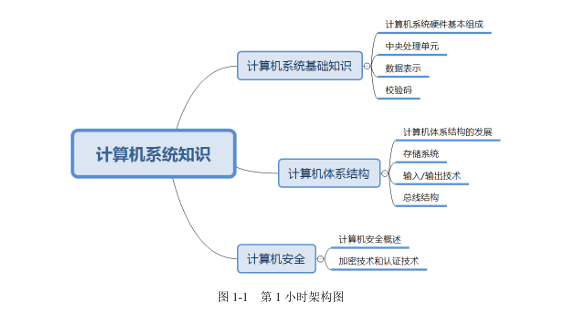

## 1.1.计算机系统基础知识

### 1.1.1.计算机系统硬件基本组成

计算机的基本硬件系统由运算器、控制器、存储器、输入设备和输出设备五大部分组成。

运算器、控制器等部件被集成在一起统称为`中央处理单元（Central Processing Unit，CPU）` 。

存储器是计算机系统中的记忆设备，分为内部存储器和外部存储器。前者速度高、容量小，一般用于临时存放程序、数据及中间结果；而后者容量大、速度慢，可长期保存程序和数据。

输入设备和输出设备合称为外部设备（简称外设），输入设备用于输入原始数据及各种命令，而输出设备则用于输出处理结果。

### 1.1.2.CPU的功能与组成

#### 1.CPU的功能

如图1-2所示：

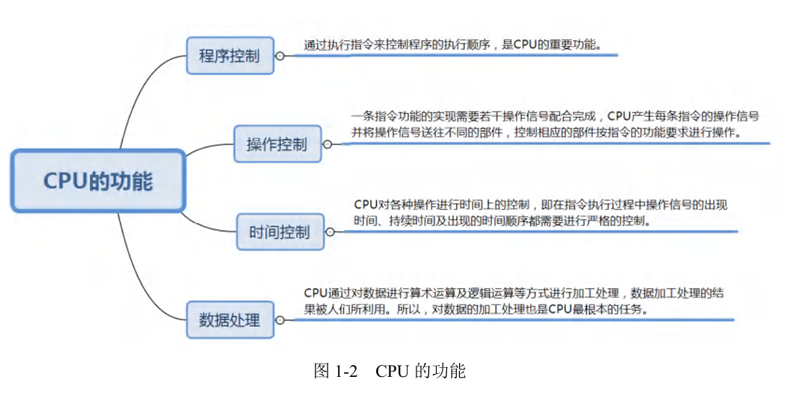

- 程序控制：通过执行指令来控制程序的执行顺序，是CPU的重要功能。
- 操作控制：一条指令功能的实现需要若干操作信号配合完成，CPU产生每条指令的操作信号并将操作信号送往不同的部件，控制相应的部件按指令的功能要求进行操作。
- 时间控制：CPU对各种操作进行时间上的控制，即在指令执行过程中操作信号的出现时间、持续时间及出现的时间顺序都需要进行严格的控制。
- 数据处理：CPU通过对数据进行算术运算及逻辑运算方式进行加工处理，数据加工处理的结果被人们所利用。所以，对数据加工处理也是CPU最根本的任务。

#### 2.CPU的组成

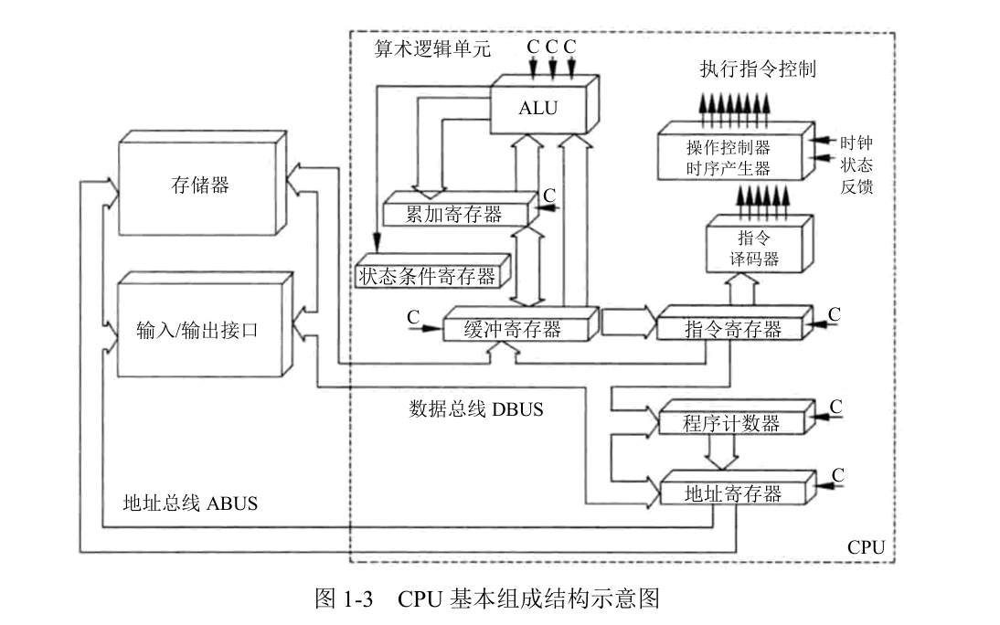

1. 运算器

   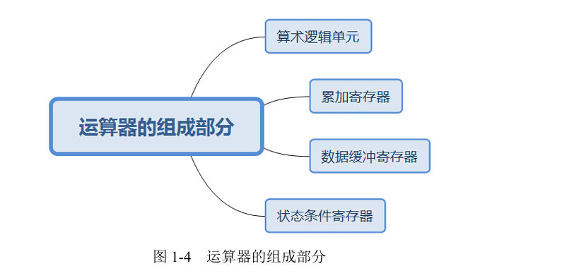

   **1.运算器的组成部分：**

   - 算术逻辑单元
   - 累加寄存器
   - 数据缓冲寄存器
   - 状态条件寄存器

   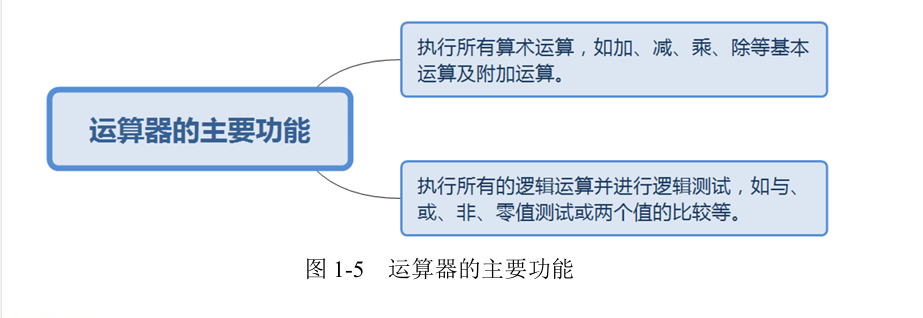

   **2.运算器的主要功能：**

   - 执行所有算术运算，如加、减、乘、除等基本运算及附加运算
   - 执行所有的逻辑运算并进行逻辑测试，如与、或、非、零值测试或两个值的比较等

   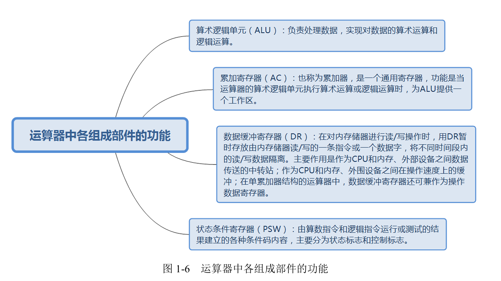

   **3.运算器中各个组成部件的功能**

   - 算术逻辑单元$(ALU)$：负责处理数据，实现对数据的算术运算和逻辑运算。
   - 累加寄存器$(AC)$：也称为累加器，是一个通用寄存器，功能是当运算器的逻辑单元执行算术运算或逻辑运算时，为ALU提供一个工作区。
   - 数据缓冲寄存器$(DR)$：在对内存储器进行读/写操作时，用DR暂时存放由内存储器读/写的一条指令或一个数据字，将不同时间段内的读/写数据隔离。主要作用时作为CPU和内存、外部设备之间的数据传送的中转站；作为CPU和内存、外围设备之间在操作速度上的缓冲；在单累加器结构的运算器中，数据缓冲器还可兼做为操作数据寄存器。
   - 状态条件寄存器$(PSW)$：由算数指令和逻辑指令运行或测试的结果建立的各种条件码内容，主要分为状态标志和控制标志。

   

2. 控制器

   运算器只能完成运算，而控制器用于控制整个CPU的工作，它决定了计算机运行过程的自动化。它不仅 要保证程序的正确执行，而且要能够处理异常事件。一般包括指令控制逻辑、时序控制逻辑、总线控制逻辑和终端控制逻辑等几个部分。

   指令控制逻辑要完成指令、分析指令和执行指令的操作，过程分为取指令、指令译码、按指令操作码执行、形成下一条指令地址等步骤。

   - 指令寄存器$(IR)$：当CPU执行一条指令时，先把它从内存储器取到缓冲寄存器中，再i送入IR暂存，指令译码器根据IR的内容产生各种微操作指令，控制其他的组成部件工作，完成所需的功能。

   - 程序计数器$(PC)$：具有寄存信息和计数两种功能，又称为指令计数器。程序的执行分为两种情况，一是顺序执行，二是转移执行。

   - 地址寄存器$(AR)$：保存当前CPU所访问的内存单元的地址。

   - 指令译码器$(ID)$：指令分为操作码和地址码两个部分，为了执行任何给定的命令，必须对操作码进行分析，以便识别所有完成的操作。

     时序控制逻辑要为每条指令按时间顺序提供应有的控制信号。总线逻辑是为多个功能部件服务的信息通路的控制电路。中断控制逻辑用于控制各种中断请求，并根据优先级的高低对中断请求进行排队，逐个交给CPU处理。

   

3. 寄存器组

   寄存器组分为专用寄存器和通用寄存器。运算器和控制器中的寄存器是专用寄存器，其作用是固定的。通用寄存器的用途广泛，并且由程序员规定其用途，其数目因处理器的不同有所差异。

#### 3.多核CPU

核心又称为内核，是CPU最主要的组成部分。CPU所有的计算、接受/存储命令、处理数据都由核心执行。各种CPU核心都具有固定的逻辑结构，一级缓存、二级缓存、执行单元、指令级单元和总线接口等逻辑单元都会有合理的布局。

CPU主要厂商 AMD 和 Intel 的双核心计数在物理结构上有很大的不同。AMD将两个内核做在一个 Die 上，通过直接结构连接起来，集成度更高；Intel 则是将放在不同核心上的两个内核封装在一起。因此，有人将 Intel 的方案称为`双芯`，将AMD的方案称为`双核`。

### 1.1.3.数据表示

各种数值在计算机中的表现形式称为机器数，特点是采用二进制数制，数的符号用0和1表示，小数点则隐含，表示不占位置。机器数对应的实际数值统称为数的真值。

设机器字长为 $n$ ，各种码制下带符号数的范围如表 1-1 所示。

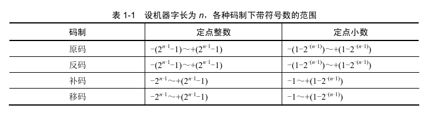

### 1.1.4.校验码

在计算机系统运行时，各部位之间要进行数据交换，为了确保数据在传送过程中正确无误，以实提高硬件电路的可靠性，二是提高代码的校验能力，包括查错和纠错。

常用的三种校验码如图1-7所示。

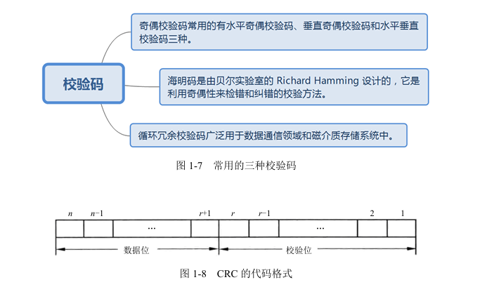

1. **奇偶校验码**

   奇偶校验码$(Parity\ Code)$是一种简单有效的校验方法。这种方法通过在编码中增加以为校验位，使编码中1的个`数为奇数(奇校验)或偶数(偶校验)` ，从而使码距变为2。

   奇偶校验码常用的有水平奇偶校验码、垂直奇偶校验码和水平垂直校验码三种。

2. **海明码**

   海明码$(Hamming\ Code)$是利用奇偶性来查错和纠错的校验方法。

   海明码是由贝尔实验室的 $Richard\ Hamming$ 设计的，它是利用奇偶性来查错和纠错的校验方法。

3. **循环冗余校验码**

   循环冗余校验码$(Cyclic\ Redundancy\ CHeck,\ CRC)$由两部分组成，左边为信息码(数据)，右边为校验码，如图1-8所示。

   循环冗余校验码广泛用于数据通信领域和磁介质存储系统中。

## 1.2.计算机体系结构

### 1.2.1.计算机体系结构的发展

#### 1.计算机体系结构的发展

1964年，阿姆达尔$(G.M.Amdahl)$在介绍$IBM360$系统时指出，计算机体系结构是站在程序 员的角度所看到的计算机属性。

1982年，梅尔斯$(G.J.Myers)$在其所著的《计算机体系结构的进展》一书中定义了组成计算 机系统的若干层次。  

1984年，拜尔$(J.L.Baer)$在一篇题为《计算机体系结构》的文章中给出了一个含义更加广泛 的定义：体系结构是由结构、组织、实现、性能四个基本方面组成的。  计算机体系结构、计算机组织和计算机实现三者的关系，如图1-9所示。

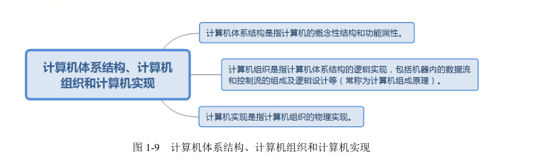

- 计算机体系结构是指计算机的概念性结构和功能属性
- 计算机组织是指计算机体系结构的逻辑实现，包括机器内的数据流和控制流的组成及逻辑设计等(常称为计算机组成原理)
- 计算机实现是指计算机组织的物理实现

#### 2.计算机体系结构分类

- 从宏观上按处理机的数量分类，如图1-10所示。
- 从微观上按并行程度分类，如图1-11所示。

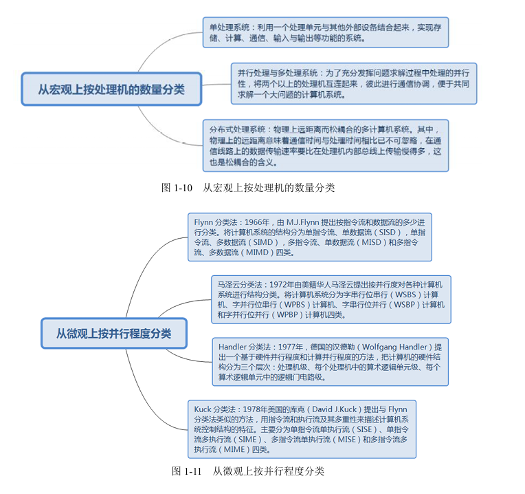

**从宏观上按处理机的数量分类**：

- 单处理系统：利用一个处理单元与其他外部设备结合起来，实现存储、计算、通信、输入与输出等功能的系统
- 并行处理与多处理系统：为了充分发挥问题求解过程中处理的并行性，将两个以上的处理机互连起来，彼此进行通信协调，便于共同求解一个大问题的计算机系统
- 分布式处理系统：物理上远距离而松耦合的多计算机系统，其中，物理上的远距离意味着通信时间与处理时间相比已不可忽略，在通信线路上的数据传输速率要比在处理机内部总线上传输慢得多，这也是松耦合的含义   

**从微观上按并行程度分类**：

- $Flynn$分类法：1966年，由$M.J.Flnn$提出按指令流和数据流的多少进行分类。将计算机系统的结构分为`单指令流、单数据流(SISD)`，`单指令流、多数据流(SIMD)`，`多指令流、单数据流(MISD)`和`多指令流、多数据流(MIMD)`四类。
- 马泽云分类：1972年，由美籍华人马泽云提出按并行度对各种计算机系统进行结构分类。将计算机系统分为`字串行位串行(WSBS)计算机`、`字并行位串行(WPBS)计算机`、`字串行位并行(WSBP)计算机`和`字并行位并行(WPBP)计算机`四类。
- $Handler$分类法：1977年，德国的汉德勒 $(Wolfgang\ Handler)$ 提出一个基于硬件并行程度和计算机并行成都的方法，把计算机的硬件结构分为三个层次：`处理机级`、`每个处理机中的算术逻辑单元级`、`每个算术逻辑单元中的逻辑电门级`。
- $Kuck$分类法：1978年，美国的库克$(David\ J.Kuck)$ 提出与 $Flynn$分类法类似的方法，用指令流和执行流及其多重性来描述计算机系统控制结构的特征，主要分为`单指令流(SISE)`、`单指令多执行流(SIME)`、`多指令流单执行流(MISE)` 和`多指令流多执行流(MIME)`四类。

#### 3.指令系统

1. 指令级系统结构分类如图 1-12 所示。

   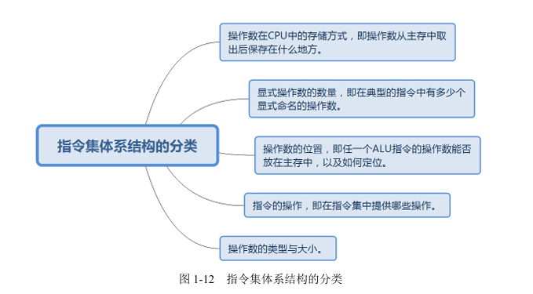

   **指令集体系结构的分类**

   - 操作数在CPU中的存储方式，即操作数从主存中取出后保存在什么地方。
   - 显示操作数的数量，即存在典型的指令中有多少个显示命名的操作数。
   - 操作数的位置，即任一个ALU指令的操作数能否放在主存中，以及如何定位。
   - 指令的操作，即在指令集中提供哪些操作。
   - 操作数的类型与大小。

2. 复杂指令集计算机(CISC)的主要弊端如图 1-13 所示。

   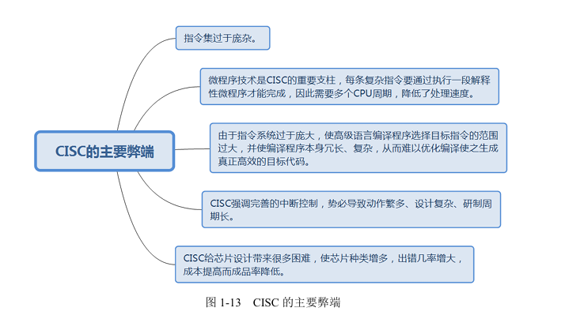

   **CISC的主要弊端**

   - 指令集过于庞杂
   - 微程序技术是CICS的重要支柱，每条复杂指令要通过执行一段解释性微程序才能完成，因此需要多个CPU周期，降低了处理速度。
   - 由于指令系统过于庞大，使高级语言编译程序选择目标指令的范围过大，并使编译程序本身冗长、复杂、从而难以优化编译使之生成真正高效的目标代码。
   - CICS强调完善的中断控制，势必导致动作繁多、设计复杂、研制周期长。
   - CICS给芯片设计带来很多困难，使得芯片种类增多，出错几率增大，成本提高而成品率降低。

3. 指令系统的优化。面向高级语言的优化思路是尽可能缩小高级语言与机器语言之间的语义差异。面向操作系统的优化思路是进一步缩小操作系统与体系架构之间的语义差异。

   `精简指令集计算机(RISC)的关键计数如图 1-14 所示。`

   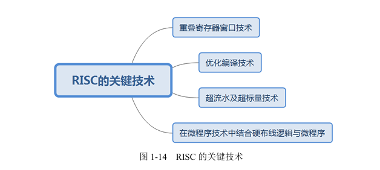

   **PISC的关键技术**：

   - 重叠寄存器窗口计数
   - 优化编译计数
   -  超流水及超标量计数
   - 在微程序技术中结合硬布线逻辑与微程序

   `指令的流水处理如图 1-15 所示。`

   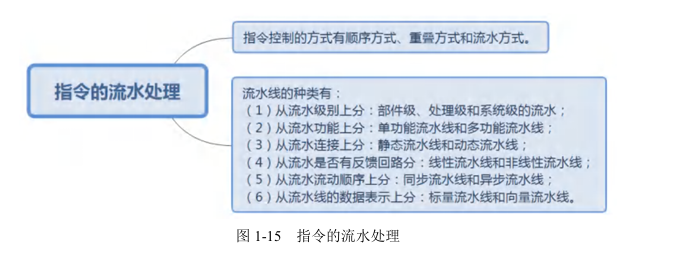

   **指令的流水处理**：

   - 指令控制的方式有顺序方式、重叠方式和流水方式。
   - 流水线的种类有：
     1. 从流水级别上分：部件级、处理级和系统级的流水；
     2. 从流水功能上分：单功能流水线和多功能流水线；
     3. 从流水连接上分：静态流水线和动态流水线；
     4. 从流水是否有反馈回路上分：线性流水线和非线性流水线；
     5. 从流水流动顺序上分：同步流水线和异步流水线；
     6. 从流水线的数据表示上分：标量流水线和向量流水线

4. 阵列处理机、并行处理机和多处理机的区别如下所述：

   - 阵列处理机。将重复设置多个处理单元(PU)按一定的方式连成阵列。在单个控制部件(CU)的控制下，对分配给自己的数据进行处理，并行地完成一条指令所规定的操作。

   - 并行处理机。SIMD、MIMD 是典型的并行计算机，SIMD 有共享存储器和分布式存储器两种形式，如图 1-16所示。

     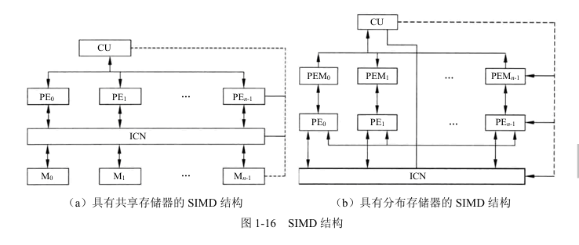

   - 多处理机。由堕胎处理机组成的系统，每台处理机有属于自己的控制部件，可执行独立的程序，共享一个主存储器和所有外部设备。

   

###  1.2.2.存储系统

#### 1.存储器的层次结构

存储器的层次结构如图1-17所示。

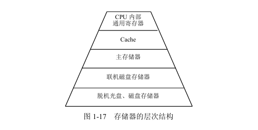

#### 2.存储器的分类

存储器的分类如图1-18所示。

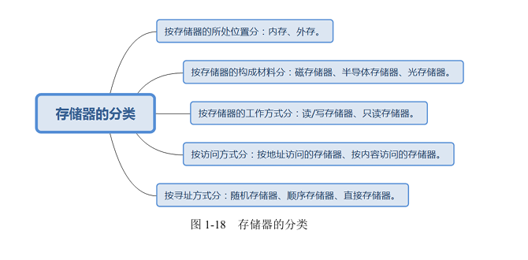

**存储器的分类**：

- 按存储器的所处位置分：内存、外存。
- 按存储其的构成材料分：磁存储器、半导体存储器、光存储器。
- 按存储器的工作方式分：读/写存储器、只读存储器。
- 按访问方式分：按地址访问的存储器、按内容访问的存储器。
- 按寻址方式分：随机存储器、顺序存储器、直接存储器。

#### 3.相联存储器

相联存储器是一种按内容访问的存储器，其结构如图1-19所示。

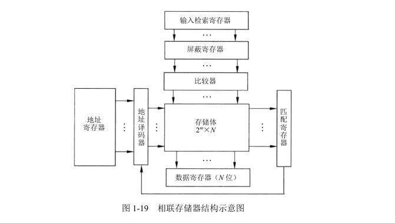

#### 4.高速缓存

高速缓存$(Cache)$的组成部分、地址映像方法、替换算法、性能分析和多级 Cache 如图1-20所示。

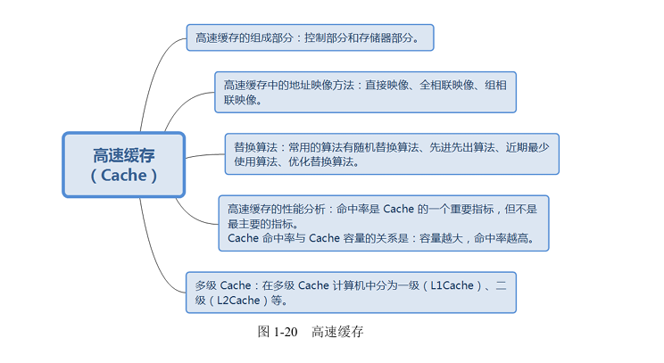

**高速缓存$(Cache)$**：

- 高速缓存的组成部分：控制部分和存储器部分。
- 高速缓存的地址映像方法：直接映像、全相联映像、组相联映像。
- 替换算法：常用的算法有随机替换算法、先进先出算法、近期最少使用算法、优化替换算法。
- 高速缓存的性能分析：命中率是 Cache 的一个重要指标，但不是最主要的指标。Cache 命中率与 Cache 容量的关系是 ===> 容量越大，命中率越高。
- 多级 Cache ：在多级 Cache 计算机中分为一级$(L1Cahce)$、二级$(L2Chache)$等。

#### 5.虚拟存储器

虚拟存储$(Virtual\ Memory)$ 技术是把很大的程序(数据)分成许多较小的块、全部存储在辅存中。运行时把要用到的程序(数据)块先调入主存，并且把马上就要用到的程序块从主存调入高速缓存。这样就可以一边运行程序，一边进行所需程序(数据)块的调进或调出。虚拟存储器管理方式的分类如图1-21所示。

**虚拟存储器管理方式**：

- 页式虚拟存储器
- 段式虚拟存储器
- 段页式虚拟存储器

#### 6.外存储器

常用的两种外存储器如图1-22所示。

**常用的两种外存储器**：

- 磁盘存储器：磁盘存取速度较快，具有较大的存储容量，是目前广泛使用的外存储器。硬盘就是最常见的外存储器。
- 光盘存储器：是一种采用聚焦激光束在盘式介质上非接触地记录高密度信息的新型存储装置。根据性能和用途，分为只读型光盘$(CD-ROM)$、只写一次型光盘$(WORM)$ 和可擦除型光盘。

#### 7.磁盘阵列技术

磁盘阵列是由多台磁盘存储器组成的一个快速、大容量、高可靠的外村子系统，常见的磁盘阵列称为廉价冗余磁盘阵列$(RAID)$ 。常见的 RAID 如表 1-2 所示。

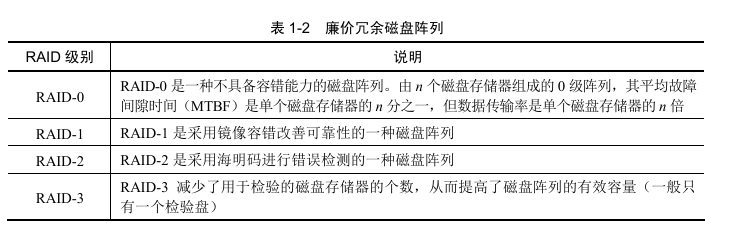

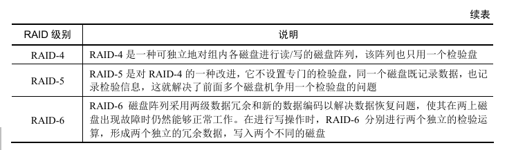

​                                                                        **表1-2  廉价冗余磁盘阵列**
<table>
  <thead>
    <tr>
      <th style="width: 10%">RAID级别</th>
      <th>说明</th>
    </tr>
  </thead>
  <tbody>
    <tr>
      <td>RAID-0</td>
      <td>RAID-0 是一种不具备容错能力的磁盘阵列。由n个磁盘存储器组成的0级阵列，其平均故障间隙时间（MTBF）是单个磁盘存储器的n分之一，但数据传输率是单个磁盘存储器的n倍</td>
    </tr>
    <tr>
      <td>RAID-1</td>
      <td>RAID-1 是采用镜像容错改善可靠性的一种磁盘阵列</td>
    </tr>
    <tr>
      <td>RAID-2</td>
      <td>RAID-2 是采用海明码进行错误检测的一种磁盘阵列</td>
    </tr>
    <tr>
      <td>RAID-3</td>
      <td>RAID-3 减少了用于检验的磁盘存储器的个数，从而提高了磁盘阵列的有效容量（一般只有一个检验盘）</td>
    </tr>
    <tr>
      <td>RAID-4</td>
      <td>RAID-4 是一种可独立地对组内各磁盘进行读/写的磁盘阵列，该阵列也只用一个检验盘</td>
    </tr>
    <tr>
      <td>RAID-5</td>
      <td>RAID-5 是对 RAID-4 的一种改进，它不设置专门的检验盘，同一个磁盘既记录数据，也记录检验信息，这就解决了前面多个磁盘机争用一个检验盘的问题</td>
    </tr>
    <tr>
      <td>RAID-6</td>
      <td>RAID-6 磁盘阵列采用两级数据冗余和新的数据编码以解决数据恢复问题，使其在两个磁盘出现故障时仍然能够正常工作。在进行写操作时，RAID-6 分别进行两个独立的检验运算，形成两个独立的冗余数据，写入两个不同的磁盘</td>
    </tr>
  </tbody>
</table>

### 1.2.3.输入/输出技术

#### 1.微型计算机中常用的内存与接口的编址方法

常用的内存与接口的编址方法如图1-23所示。

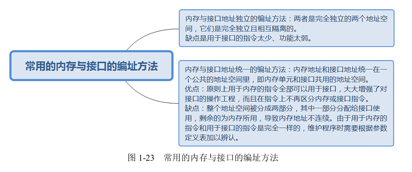

**常用的内存与接口的编址方法**：

内存与接口地址独立的编址方法：两者是完全独立的两个地址空间，它们是完全独立且相互隔离的。缺点是用于接口的指令太少、功能太弱。

内存与接口地址统一的编址方法：内存地址和接口地址统一在一个公共的地址空间里，即内存单元和接口工用的地址空间。优点：原则上用于内存的指令全部可以用于接口，大大增强了对接口的操作工程，而且在指令上不再区分内存或接口的指令。缺点：整个地址空间被分成两部分，其中一部分分配给接口使用，剩余的为内存所用，导致内存地址不连续。由于用于内存的指令和用于接口的指令完全一样，维护程序时需根据参数定义表加以辨认。

#### 2.直接陈鼓型控制

直接程序控制是指外设数据的输入/输出过程是在CPU执行程序的控制下完成的。直接程序控制分为两种情况，如图1-24所示。   

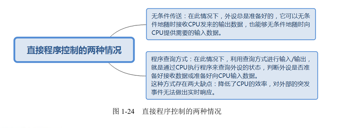

**直接程序控制的两种情况**：

- 无条件传送：在此情况下，外设总是准备好的，它可以无条件地随时接收CPU发送来的输出数据，也能够无条件地随时向CPU提供需要的输入数据。

- 程序查询方式：在此情况下，利用查询方式进行输入/输出，就是通过CPU执行程序来查询外设的状态，判断外设是否准本好接收数据或准备好向CPU输入数据。

  这种方式存在两大缺点：

  - 降低了CPU的效率
  - 对外部的突发事件无法做出实时响应

#### 3.中断方式

中断方式即由程序控制 $I/O$ 的方式，缺点在于CPU必须等待 I/O 系统完成数据的传输任务，而且要定期查询 I/O 系统的状态。确认是否完成。因此，大大降低了整个系统的性能。

利用中断方式完成数据输入/输出的过程为：当 I/O 系统与外设系统交换数据时，CPU 无需等待，也不必去查询 I/O 的状态，从而可以去处理其他任务。当 I/O 系统准备好后，则发出中断请求信号通知CPU，CPU接到中断请求信号后，保存当前正在执行程序的现场，转入I/O中断服务程序的执行，完成I/O系统的数据交换，然后再返回被打断的程序继续执行。

与程序控制方式相比，中断方式因为CPU无需等待而提高了效率。

(1) 中断处理方法如图1-25所示。

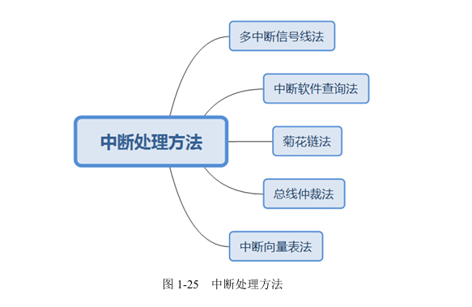

中断处理方法：

- 多中断信号线法
- 中断软件查询法
- 菊花链法
- 总线仲裁法
- 中断向量表法

(2) 在进行中断优先级控制时解决一下两种情况，如图1-26所示。

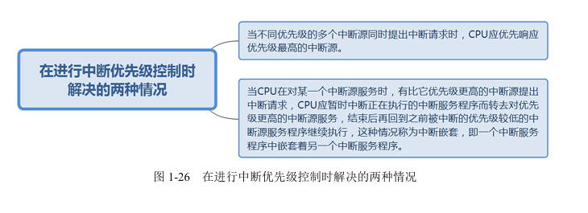

在进行中断优先级控制时解决的两种情况：

- 当不同优先级的多个中断同时提出中断请求时，CPU应优先响应优先级最高的中断源。

