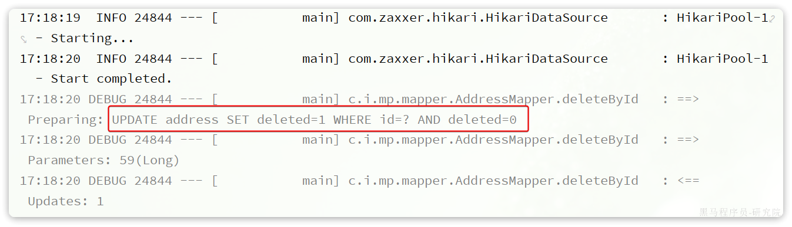
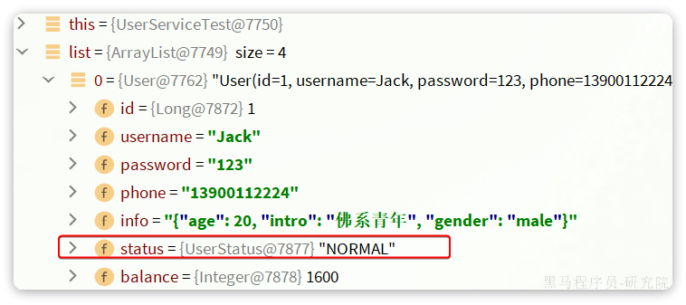
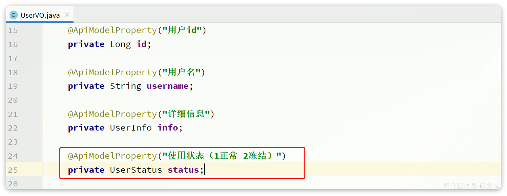
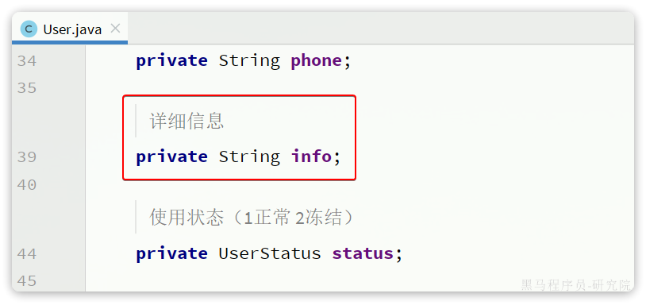

::: tip

1 代码生成

2 静态工具  

3 逻辑删除

4 通用枚举

5 JSON 类型处理器

6 配置加密 (选学)

:::

## 1 代码生成

在使用MybatisPlus以后，基础的`Mapper`、`Service`、`PO`代码相对固定，重复编写也比较麻烦。因此MybatisPlus官方提供了代码生成器根据数据库表结构生成`PO`、`Mapper`、`Service`等相关代码。只不过代码生成器同样要编码使用，也很麻烦。

这里推荐大家使用一款`MybatisPlus`的插件，它可以基于图形化界面完成`MybatisPlus`的代码生成，非常简单。


### 1.1 安装插件

在`Idea`的plugins市场中搜索并安装`MyBatisPlus`插件：


然后重启你的Idea即可使用。


### 1.2 使用

刚好数据库中还有一张address表尚未生成对应的实体和mapper等基础代码。我们利用插件生成一下。 首先需要配置数据库地址


右键address表，弹出


点击Next，在下面是一些配置，我们勾选Mybatis-Plus的最新版本`Mybatix-Plus 3` 和 简化开发的`Lombok`


 点击Finish,我们可以看到MybatisX为我们自动生成了该表对应的实体类、Mapper文件、Service和相对应的接口


## 2 静态工具

有的时候Service之间也会相互调用，为了避免出现循环依赖问题，MybatisPlus提供一个静态工具类：`Db`，其中的一些静态方法与`IService`中方法签名基本一致，也可以帮助我们实现CRUD功能：


示例：

```java
@Test
void testDbGet() {
    User user = Db.getById(1L, User.class);
    System.out.println(user);
}

@Test
void testDbList() {
    // 利用Db实现复杂条件查询
    List<User> list = Db.lambdaQuery(User.class)
            .like(User::getUsername, "o")
            .ge(User::getBalance, 1000)
            .list();
    list.forEach(System.out::println);
}

@Test
void testDbUpdate() {
    Db.lambdaUpdate(User.class)
            .set(User::getBalance, 2000)
            .eq(User::getUsername, "Rose");
}
```

需求：改造根据id用户查询的接口，查询用户的同时返回用户收货地址列表

首先，我们要添加一个收货地址的VO对象：

```java
package com.itheima.mp.domain.vo;

import io.swagger.annotations.ApiModel;
import io.swagger.annotations.ApiModelProperty;
import lombok.Data;

@Data
@ApiModel(description = "收货地址VO")
public class AddressVO{

    @ApiModelProperty("id")
    private Long id;

    @ApiModelProperty("用户ID")
    private Long userId;

    @ApiModelProperty("省")
    private String province;

    @ApiModelProperty("市")
    private String city;

    @ApiModelProperty("县/区")
    private String town;

    @ApiModelProperty("手机")
    private String mobile;

    @ApiModelProperty("详细地址")
    private String street;

    @ApiModelProperty("联系人")
    private String contact;

    @ApiModelProperty("是否是默认 1默认 0否")
    private Boolean isDefault;

    @ApiModelProperty("备注")
    private String notes;
}
```

然后，改造原来的UserVO，添加一个地址属性：


接下来，修改UserController中根据id查询用户的业务接口：

```java
@GetMapping("/{id}")
@ApiOperation("根据id查询用户")
public UserVO queryUserById(@PathVariable("id") Long userId){
    // 基于自定义service方法查询
    return userService.queryUserAndAddressById(userId);
}
```

由于查询业务复杂，所以要在service层来实现。首先在IUserService中定义方法：

```java
package com.itheima.mp.service;

import com.baomidou.mybatisplus.extension.service.IService;
import com.itheima.mp.domain.po.User;
import com.itheima.mp.domain.vo.UserVO;

public interface IUserService extends IService<User> {
    void deduct(Long id, Integer money);

    UserVO queryUserAndAddressById(Long userId);
}
```

然后，在UserServiceImpl中实现该方法：

```java
@Override
public UserVO queryUserAndAddressById(Long userId) {
    // 1.查询用户
    User user = getById(userId);
    if (user == null) {
        return null;
    }
    // 2.查询收货地址
    List<Address> addresses = Db.lambdaQuery(Address.class)
            .eq(Address::getUserId, userId)
            .list();
    // 3.处理vo
    UserVO userVO = BeanUtil.copyProperties(user, UserVO.class);
    userVO.setAddresses(BeanUtil.copyToList(addresses, AddressVO.class));
    return userVO;
}
```

在查询地址时，我们采用了Db的静态方法，因此避免了注入AddressService，减少了循环依赖的风险。

再来实现一个功能：

-  根据id批量查询用户，并查询出用户对应的所有地址


## 3 逻辑删除

对于一些比较重要的数据，我们往往会采用逻辑删除的方案，即：

- 在表中添加一个字段标记数据是否被删除
- 当删除数据时把标记置为true
- 查询时过滤掉标记为true的数据

一旦采用了逻辑删除，所有的查询和删除逻辑都要跟着变化，非常麻烦。

为了解决这个问题，MybatisPlus就添加了对逻辑删除的支持。

**注意**，只有MybatisPlus生成的SQL语句才支持自动的逻辑删除，自定义SQL需要自己手动处理逻辑删除。

例如，我们给`address`表添加一个逻辑删除字段：

```sql
alter table address add deleted bit default b'0' null comment '逻辑删除';
```

然后给`Address`实体添加`deleted`字段：


接下来，我们要在`application.yml`中配置逻辑删除字段：

```yaml
mybatis-plus:
  global-config:
    db-config:
      logic-delete-field: deleted # 全局逻辑删除的实体字段名(since 3.3.0,配置后可以忽略不配置步骤2)
      logic-delete-value: 1 # 逻辑已删除值(默认为 1)
      logic-not-delete-value: 0 # 逻辑未删除值(默认为 0)
```

测试： 首先，我们执行一个删除操作：

```java
@Test
void testDeleteByLogic() {
    // 删除方法与以前没有区别
    addressService.removeById(59L);
}
```

方法与普通删除一模一样，但是底层的SQL逻辑变了：



查询一下试试：

```java
@Test
void testQuery() {
    List<Address> list = addressService.list();
    list.forEach(System.out::println);
}
```

会发现id为59的确实没有查询出来，而且SQL中也对逻辑删除字段做了判断：


综上， 开启了逻辑删除功能以后，我们就可以像普通删除一样做CRUD，基本不用考虑代码逻辑问题。还是非常方便的。

::: warning

**注意**： 逻辑删除本身也有自己的问题，比如：

- 会导致数据库表垃圾数据越来越多，从而影响查询效率
- SQL中全都需要对逻辑删除字段做判断，影响查询效率

因此，我不太推荐采用逻辑删除功能，如果数据不能删除，可以采用把数据迁移到其它表的办法。

:::


## 4 通用枚举

User类中有一个用户状态字段：


像这种字段我们一般会定义一个枚举，做业务判断的时候就可以直接基于枚举做比较。但是我们数据库采用的是`int`类型，对应的PO也是`Integer`。因此业务操作时必须手动把`枚举`与`Integer`转换，非常麻烦。

因此，MybatisPlus提供了一个处理枚举的类型转换器，可以帮我们**把枚举类型与数据库类型自动转换**。


### 4.1 定义枚举

我们定义一个用户状态的枚举：


代码如下：

```java
package com.itheima.mp.enums;

import com.baomidou.mybatisplus.annotation.EnumValue;
import lombok.Getter;

@Getter
public enum UserStatus {
    NORMAL(1, "正常"),
    FREEZE(2, "冻结");
    private final int value;
    private final String desc;

    UserStatus(int value, String desc) {
        this.value = value;
        this.desc = desc;
    }
}
```

然后把`User`类中的`status`字段改为`UserStatus` 类型：


要让`MybatisPlus`处理枚举与数据库类型自动转换，我们必须告诉`MybatisPlus`，枚举中的哪个字段的值作为数据库值。 `MybatisPlus`提供了`@EnumValue`注解来标记枚举属性：


### 4.2配置枚举处理器

在application.yaml文件中添加配置：

```yaml
mybatis-plus:
  configuration:
    default-enum-type-handler: com.baomidou.mybatisplus.core.handlers.MybatisEnumTypeHandler
```


### 4.3 测试

```java
@Test
void testService() {
    List<User> list = userService.list();
    list.forEach(System.out::println);
}
```

最终，查询出的`User`类的`status`字段会是枚举类型：



同时，为了使页面查询结果也是枚举格式，我们需要修改UserVO中的status属性：



并且，在UserStatus枚举中通过`@JsonValue`注解标记JSON序列化时展示的字段：


最后，在页面查询，结果如下：


## 5 JSON 类型处理器

数据库的user表中有一个`info`字段，是JSON类型：


格式像这样：

```json
{"age": 20, "intro": "佛系青年", "gender": "male"}
```

而目前`User`实体类中却是`String`类型：



这样一来，我们要读取info中的属性时就非常不方便。如果要方便获取，info的类型最好是一个`Map`或者实体类。

而一旦我们把`info`改为`对象`类型，就需要在写入数据库时手动转为`String`，再读取数据库时，手动转换为`对象`，这会非常麻烦。

因此MybatisPlus提供了很多特殊类型字段的类型处理器，解决特殊字段类型与数据库类型转换的问题。例如处理JSON就可以使用`JacksonTypeHandler`处理器。

接下来，我们就来看看这个处理器该如何使用。


### 5.1 定义实体

首先，我们定义一个单独实体类来与info字段的属性匹配：


代码如下：

```java
package com.itheima.mp.domain.po;

import lombok.Data;

@Data
public class UserInfo {
    private Integer age;
    private String intro;
    private String gender;
}
```


### 5.2使用类型处理器

接下来，将User类的info字段修改为UserInfo类型，并声明类型处理器：


同时，在User类上添加一个注解，声明自动映射：


测试可以发现，所有数据都正确封装到UserInfo当中了：


同时，为了让页面返回的结果也以对象格式返回，我们要修改UserVO中的info字段：


此时，在页面查询结果如下：


## 6 配置加密 (选学)

目前我们配置文件中的很多参数都是明文，如果开发人员发生流动，很容易导致敏感信息的泄露。所以MybatisPlus支持配置文件的加密和解密功能。

我们以数据库的用户名和密码为例。

### 6.1 生成秘钥

首先，我们利用AES工具生成一个随机秘钥，然后对用户名、密码加密：

```java
package com.itheima.mp;

import com.baomidou.mybatisplus.core.toolkit.AES;
import org.junit.jupiter.api.Test;

class MpDemoApplicationTests {
    @Test
    void contextLoads() {
        // 生成 16 位随机 AES 密钥
        String randomKey = AES.generateRandomKey();
        System.out.println("randomKey = " + randomKey);

        // 利用密钥对用户名加密
        String username = AES.encrypt("root", randomKey);
        System.out.println("username = " + username);

        // 利用密钥对用户名加密
        String password = AES.encrypt("MySQL123", randomKey);
        System.out.println("password = " + password);

    }
}
```

打印结果如下：

```sql
randomKey = 6234633a66fb399f
username = px2bAbnUfiY8K/IgsKvscg==
password = FGvCSEaOuga3ulDAsxw68Q==
```


### 6.2 修改配置

修改application.yaml文件，把jdbc的用户名、密码修改为刚刚加密生成的密文：

```yaml
spring:
  datasource:
    url: jdbc:mysql://127.0.0.1:3306/mp?useUnicode=true&characterEncoding=UTF-8&autoReconnect=true&serverTimezone=Asia/Shanghai&rewriteBatchedStatements=true
    driver-class-name: com.mysql.cj.jdbc.Driver
    username: mpw:QWWVnk1Oal3258x5rVhaeQ== # 密文要以 mpw:开头
    password: mpw:EUFmeH3cNAzdRGdOQcabWg== # 密文要以 mpw:开头
```


### 6.3 测试

在启动项目的时候，需要把刚才生成的秘钥添加到启动参数中，像这样：

`--mpw.key=6234633a66fb399f`

单元测试的时候不能添加启动参数，所以要在测试类的注解上配置：


然后随意运行一个单元测试，可以发现数据库查询正常。