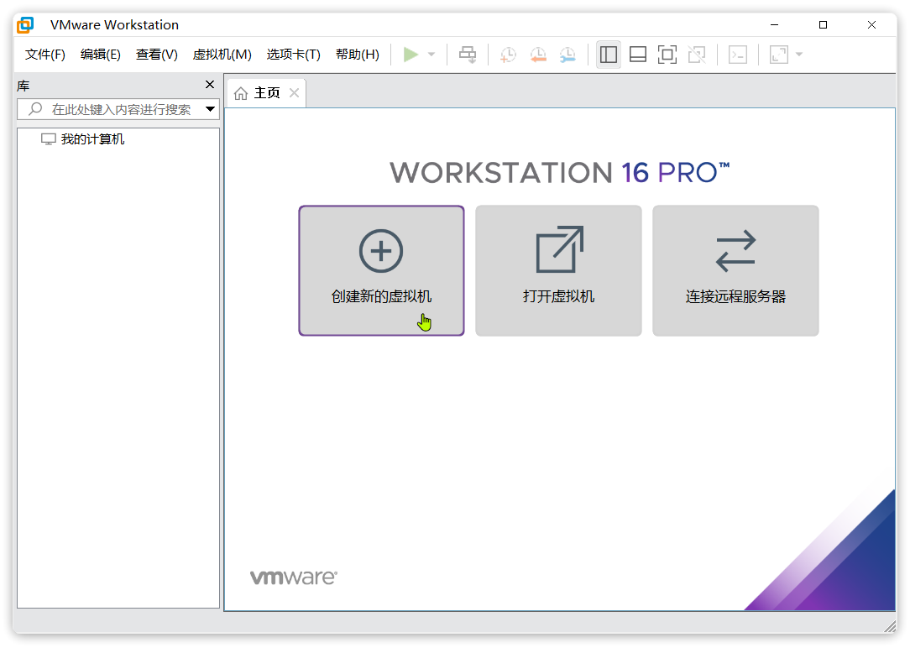
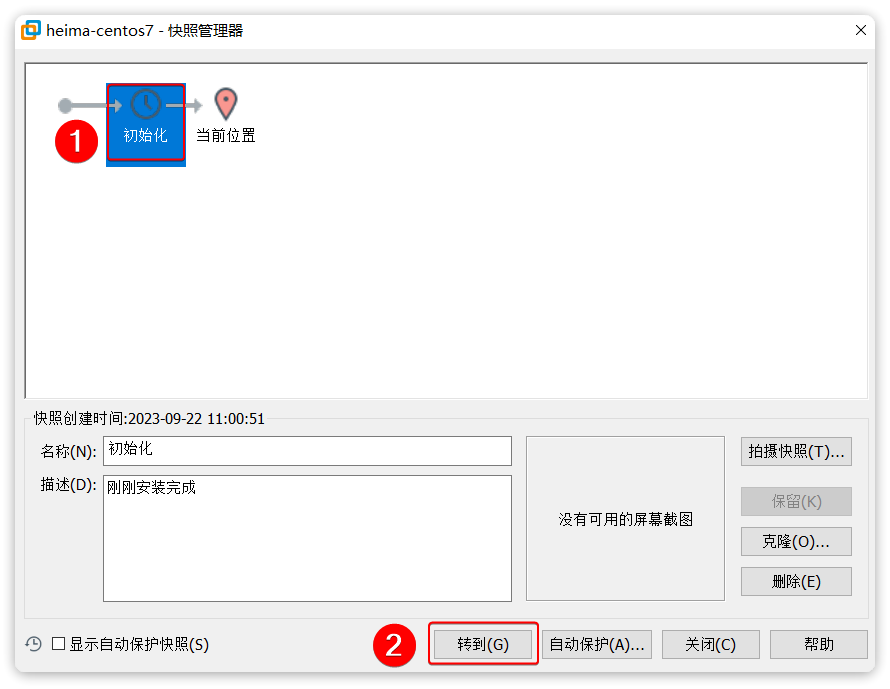

::: tip

1 安装 VMware

2创建虚拟机

3 安装 Centos7

4 设置虚拟机快照

:::

首先，我们要准备一个Linux的系统，成本最低的方式就是在本地安装一台虚拟机。为了统一学习环境，不管是使用MacOS还是Windows系统的同学，都建议安装一台虚拟机。

windows采用VMware，Mac则采用Fusion


## 1 安装 VMware

VMware是业界最好用的虚拟机软件之一。

windows版本的网站如下：

https://www.vmware.com/cn/products/workstation-pro/workstation-pro-evaluation.html

Mac下也有对应版本，叫做VMware Fusion：

https://www.vmware.com/cn/products/fusion.html

::: warning

特别注意，Windows10以上版本操作系统需要下载安装VMware Workstation Pro16及以上版本，安装方式此处略。

如果自己电脑上已经有了低版本的VMware，则需要先卸载，再重新安装。卸载过程比较麻烦。

:::


### 1.1 卸载旧版 VMware(可选)

首先，在控制面板找到程序和功能选项，找到VMware，进行卸载操作：


弹出确认框, 点击"下一步":


下一步之后, 选择删除:


接下来，按照提示完成卸载操作即可。

卸载完成后，还需要看看VMware的安装目录是否有旧数据，一并清理掉。

比如安装在**C盘的****Program Files****(****x86****)**：


则需要直接删除整个VMware目录：


接下来要清理注册表：

首先，按住Windows + R , 在弹出框中输入 "regedit" 调出注册表：


进入注册表编辑器，如图：


打开**`HKEY_CURRENT_USER`**文件夹，找到**`Software`**文件夹并打开


找到“VMware.Inc”，右键删除：


### 1.2 安装 VMware

安装步骤略。。

安装以后可以免费试用，大家可以去官网购买正版许可证，或者去网上看看有没有好心人赠送你一个许可证。启动后的界面如图所示：


### 1.3 常见错误

如果VMware虚拟机运行报错，例如：


这个是由于英特尔的虚拟化技术, 没有开启, 需要进入系统的BIOS界面 , 开启英特尔的虚拟化技术 ; 不同的电脑型号 , 进入BIOS界面的方式不同, 需要百度查询一下自己电脑的型号 , 如何进BIOS ;

windows10系统可以参考: https://blog.csdn.net/biu_code/article/details/107504627

以ThinkPad为例，如图：


## 2创建虚拟机

Centos7是比较常用的一个Linux发行版本，在国内的使用比例还是比较高的。

大家首先要下载一个Centos7的iso文件，我在资料中给大家准备了一个mini的版本，体积不到1G，推荐大家使用：


我们在VMware《主页》界面中点击《创建新的虚拟机》按钮：



然后会弹出一个窗口，我们直接点击下一步：


然后页面中选择你准备好的ISO文件，继续点击下一步：


然后填写`虚拟机的名称`以及虚拟机将来`保存的位置`：


再次下一步，填写虚拟机磁盘大小。这里建议给大一点，否则将来不够用调整起来麻烦。而且这里设置大小并不是立刻占用这么多，而是设置一个上限：


继续下一步，然后选择虚拟机硬件设置：


在弹出的窗口中设置虚拟机硬件，建议CPU给到4核，内存给到8G：


配置完成后，点击`关闭`，回到上一页面，继续点击`完成`：


虚拟机就创建完毕了：


## 3 安装 Centos7

接下来，我们启动刚刚创建的虚拟机，开始安装Centos7系统：


启动后需要选择安装菜单，将鼠标移入黑窗口中后，将无法再使用鼠标，需要按上下键选择菜单。选中Install Centos 7 后按下回车：


然后会提示我们按下enter键继续：


过一会儿后，会进入语言选择菜单，这里可以使用鼠标选择。选择中文-简体中文，然后继续：


接下来，会进入安装配置页面：


鼠标向下滚动后，找到系统-安装位置配置，点击：


选择刚刚添加的磁盘，并点击完成：


然后回到配置页面，这次点击《网络和主机名》：


在网络页面做下面的几件事情：

1. 修改主机名为自己喜欢的主机名，不要出现中文和特殊字符，建议用localhost
2. 点击应用
3. 将网络连接打开
4. 点击配置，设置详细网络信息


最好用一个截图软件，记住上图中的网络详细信息，接下来的配置要参考：


点击配置按钮后，我们需要把网卡地址改为静态IP，这样可以避免每次启动虚拟机IP都变化。所有配置照搬你自己截图的网络信息填写，不要照抄我的：


上图中的四个信息参考之前的**以太网****(ens33)****网卡**的截图，不要照搬我的来写。

最后，点击完成按钮：


回到配置界面后，点击`开始安装`：


接下来需要设置root密码：


填写你要使用的root密码，然后点击完成：


接下来，耐心等待安装即可。


等待安装完成后，点击**重启**：


耐心等待一段时间，不要做任何操作，虚拟机即可启动完毕：


输入用户名root，然后点击回车，会要求你输入密码：


此时你要输入密码，不过需要注意的是密码是**隐藏**的，输入了也看不见。所以放心输入，完成后回车即可：


只要密码输入正确，就可以正常登录。此时可以用命令测试虚拟机网络是否畅通：

```bash
ping www.baidu.com
```

如果看到这样的结果代表网络畅通：


默认ping命令会持续执行，按下`CTRL `+ `C`后命令即可停止。


## 4 设置虚拟机快照

在虚拟机安装完成后，最好立刻设置一个快照，这样一旦将来虚拟机出现问题，可以快速恢复。

我们先停止虚拟机，点击VMware顶部菜单中的`暂停`**`下拉选框`**，选择`关闭客户机`：


接着，点击VMware菜单中的🔧按钮:


然后在弹出的快照管理窗口中，点击**拍摄快照**，填写新的快照信息：


快照拍摄完成了！而且我们可以在不同阶段拍摄多个不同快照作为备份，方便后期恢复数据。

假如以后虚拟机文件受损，需要恢复到初始状态的话，可以选中要恢复的快照，点击转到即可：

