::: tip

1 安装 MobarXterm

2 配置默认编辑器

3 配置右键粘贴

4 SSH 配置

5 关闭 X-Server 服务

:::

在VMware界面中操作虚拟机非常不友好，所以一般推荐使用专门的SSH客户端。市面上常见的有：

- Xshell：个人免费，商业收费，之前爆出过有隐藏后门。不推荐
- Finshell：基础功能免费，高级功能收费，基于Java，内存占用较高（在1个G左右）。不推荐
- MobarXterm：基础功能免费、高级功能收费。开源、功能强大、内存占用低（只有10m左右），但是界面不太漂亮。推荐使用

## 1 安装 MobarXterm

这里我们会选择内存占用较低的MobarXterm作为SSH客户端，其官网地址：

https://mobaxterm.mobatek.net/

安装完成后界面如图所示：

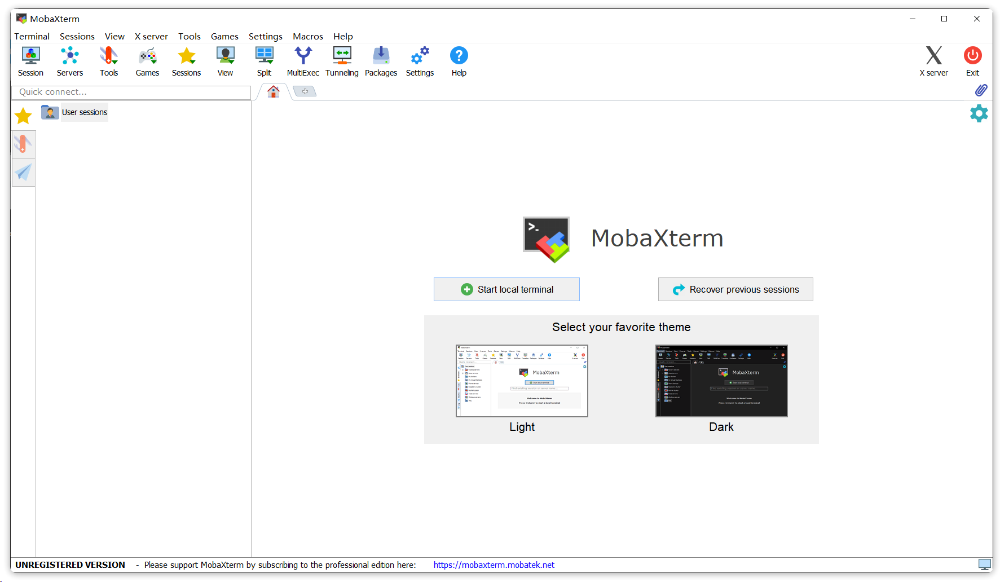

点击session按钮，进入会话管理：

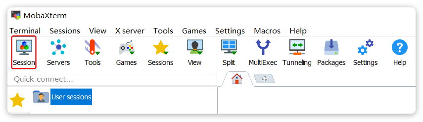

在弹出的session管理页面中，按照下图填写信息并保存：

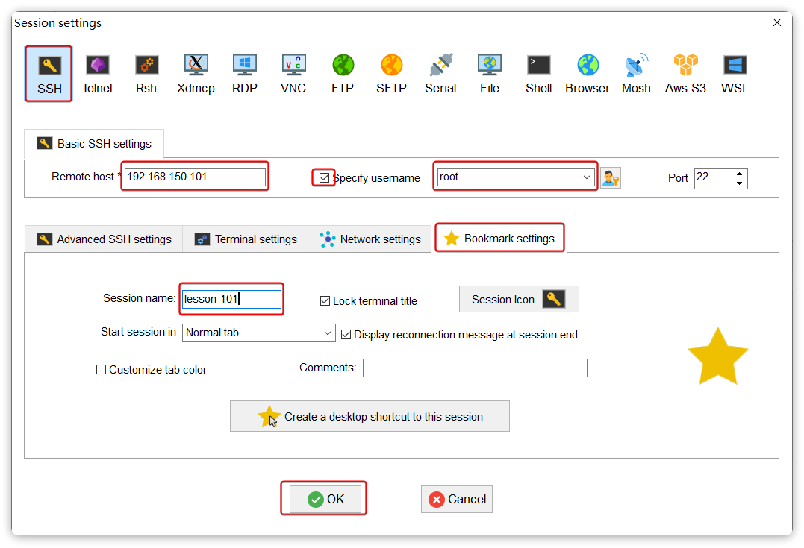

点击OK后会提示你是第一次连接，询问你是信任连接的服务：

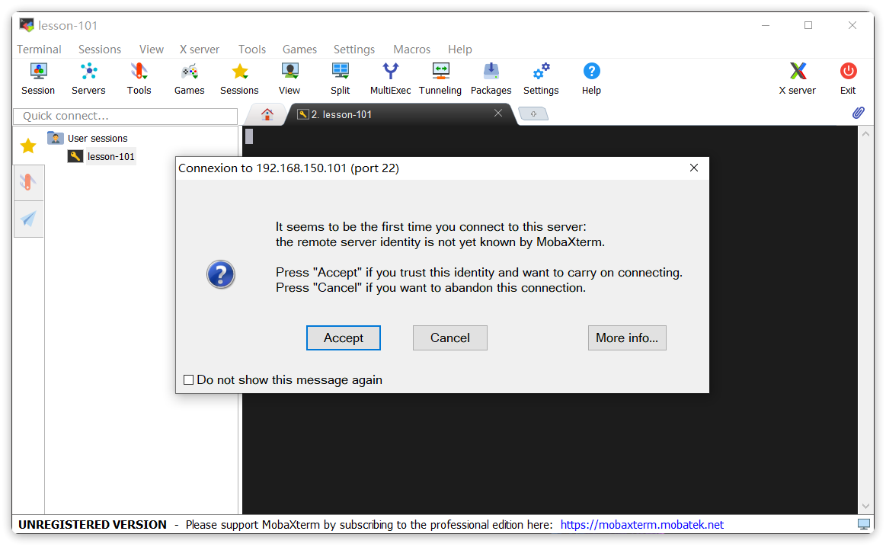

选择accept之后，会询问你是否要记住密码，选择yes：

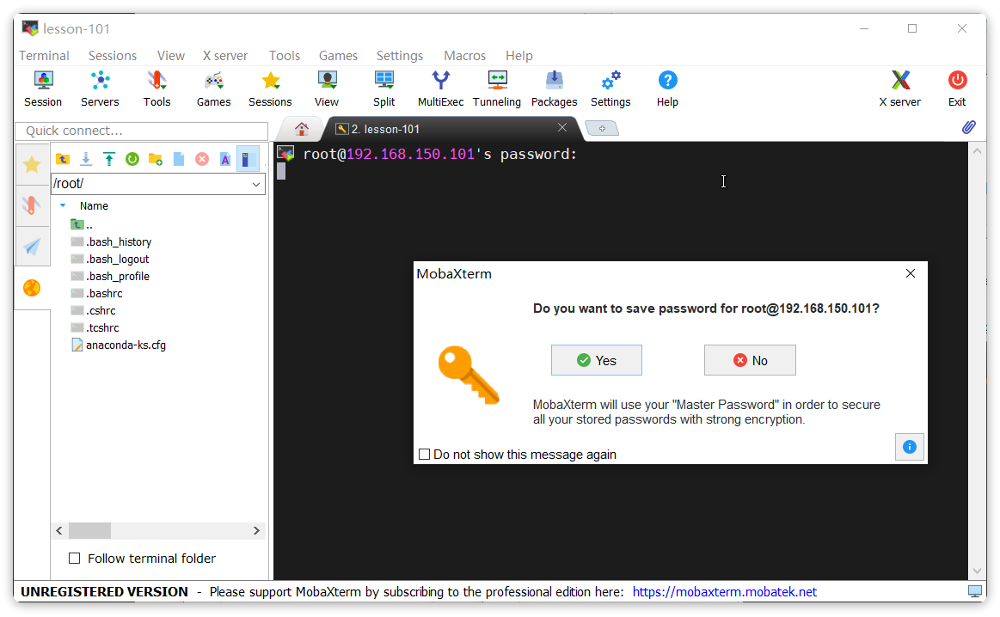

紧接着需要你设置一个MobarXterm的全局密码用于做密码管理，建议设置一个与虚拟机密码不同的：

输入密码：

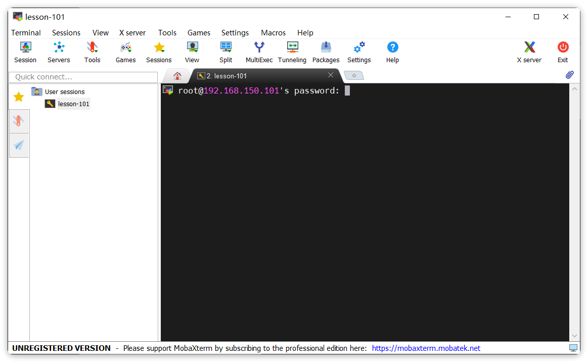

输入成功后，就会连接成功，并进入操作界面了：

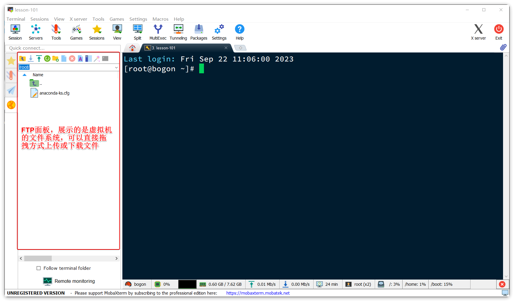

这里需要做一些基础的配置：

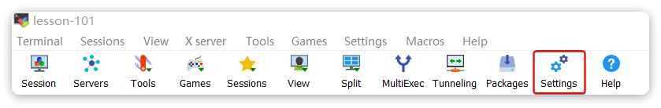

## 2 配置默认编辑器

首先建议设置一下默认编辑器，这样我们通过MobarXterm的FTP工具打开文件时会以指定的编辑器打开，方便修改。我这里配置的是vscode：

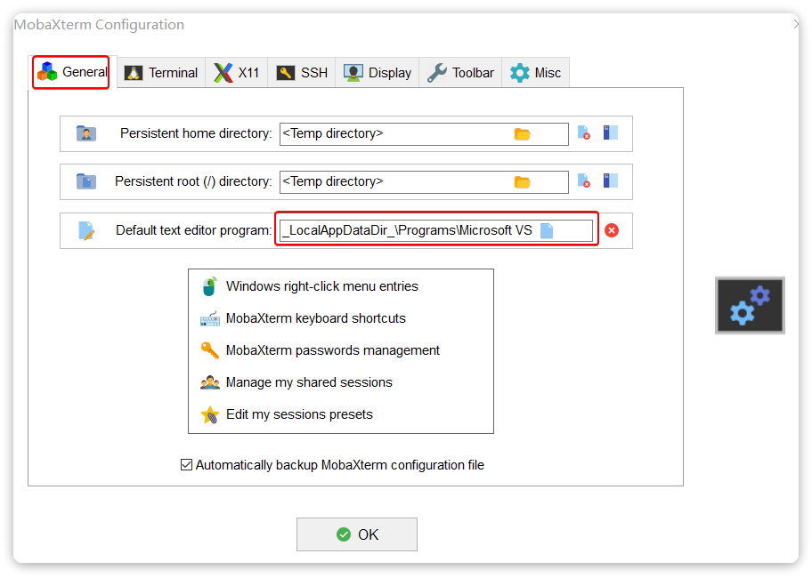

## 3 配置右键粘贴

复制粘贴是很常用的配置，MobarXterm默认左键选中即**复制**，但是需要配置右键点击为**粘贴：**

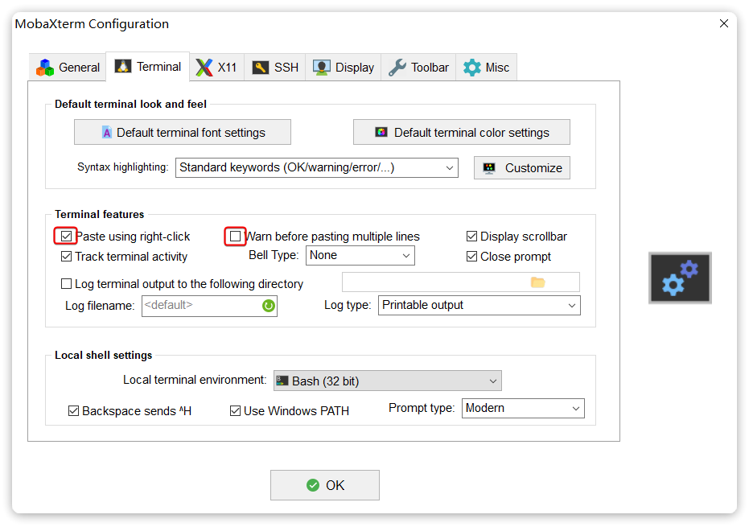

这样，复制和粘贴可以全部通过鼠标操作，无需按键。

## 4 SSH 配置

接下来还有几个ssh配置：

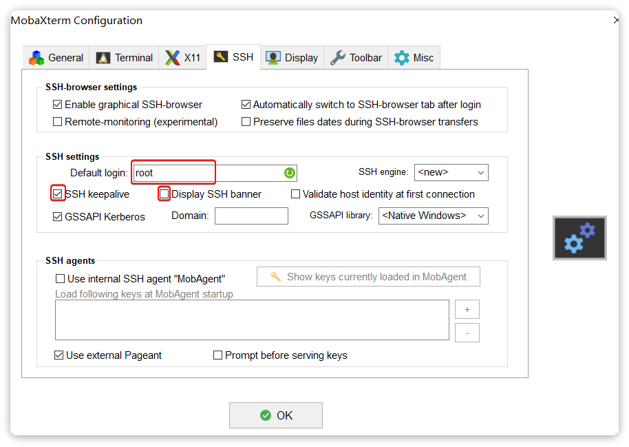

分别是：

- 默认的登录用户
- ssh保持连接
- 取消连接成功后的欢迎banner

## 5 关闭 X-Server 服务

大多数情况下，我们没有x-server的需求，因此可以选择不要自启动：

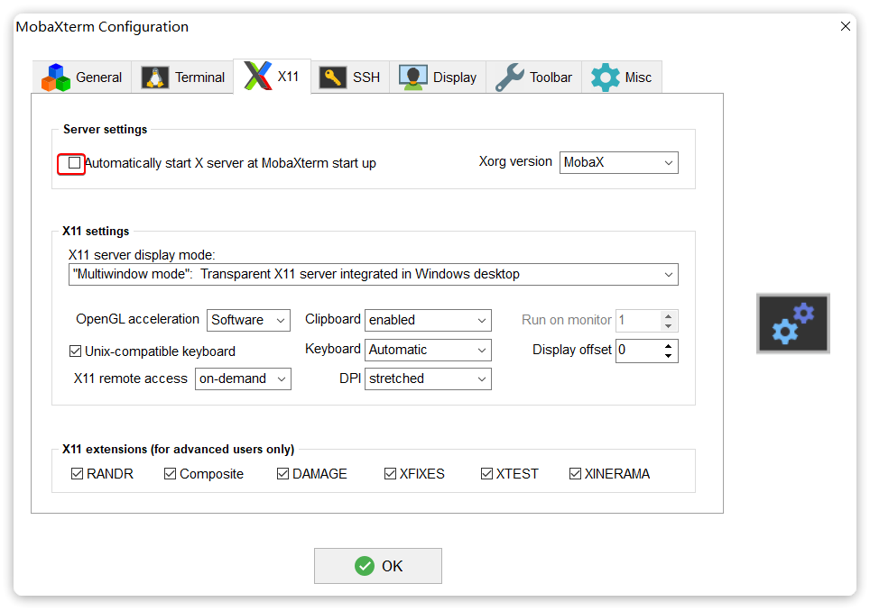