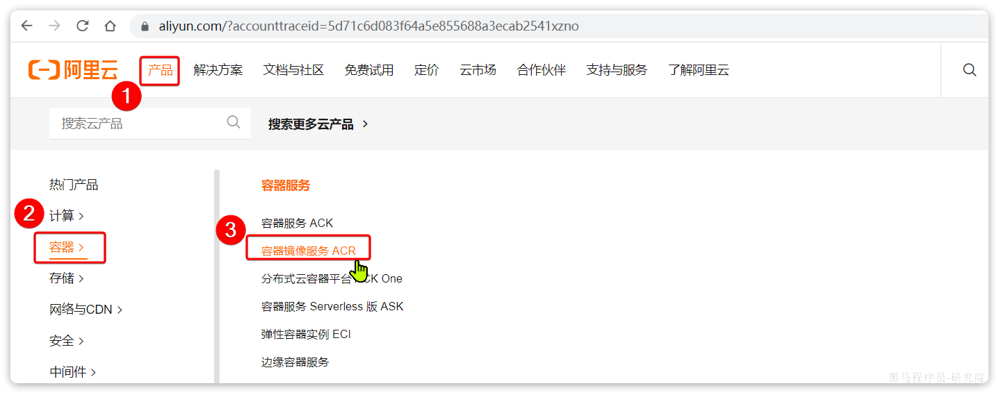

::: tip

1 卸载旧版

2 配置 Docker 的 yum 库

3 安装 Docker

4 启动和校验

5  配置镜像加速

6 配置镜像加速 (阿里云已停用)

:::

本安装教程参考Docker官方文档，地址如下：

https://docs.docker.com/engine/install/centos/


## 1 卸载旧版

首先如果系统中已经存在旧的Docker，则先卸载：

```shell
yum remove docker \
    docker-client \
    docker-client-latest \
    docker-common \
    docker-latest \
    docker-latest-logrotate \
    docker-logrotate \
    docker-engine \
    docker-selinux 
```


## 2 配置 Docker 的 yum 库

首先要安装一个yum工具

```bash
sudo yum install -y yum-utils device-mapper-persistent-data lvm2
```

安装成功后，执行命令，配置Docker的yum源（已更新为阿里云源）：

```bash
sudo yum-config-manager --add-repo https://mirrors.aliyun.com/docker-ce/linux/centos/docker-ce.repo

sudo sed -i 's+download.docker.com+mirrors.aliyun.com/docker-ce+' /etc/yum.repos.d/docker-ce.repo
```

更新yum，建立缓存

```bash
sudo yum makecache fast
```


## 3 安装 Docker

最后，执行命令，安装Docker

```bash
yum install -y docker-ce docker-ce-cli containerd.io docker-buildx-plugin docker-compose-plugin
```


## 4 启动和校验

```bash
# 启动Docker
systemctl start docker

# 停止Docker
systemctl stop docker

# 重启
systemctl restart docker

# 设置开机自启
systemctl enable docker

# 执行docker ps命令，如果不报错，说明安装启动成功
docker ps
```


## 5  配置镜像加速

镜像地址可能会变更，如果失效可以百度找最新的docker镜像。

配置镜像步骤如下：

```bash
# 创建目录
mkdir -p /etc/docker

# 复制内容
tee /etc/docker/daemon.json <<-'EOF'
{
    "registry-mirrors": [
        "http://hub-mirror.c.163.com",
        "https://mirrors.tuna.tsinghua.edu.cn",
        "http://mirrors.sohu.com",
        "https://ustc-edu-cn.mirror.aliyuncs.com",
        "https://ccr.ccs.tencentyun.com",
        "https://docker.m.daocloud.io",
        "https://docker.awsl9527.cn"
    ]
}
EOF

# 重新加载配置
systemctl daemon-reload

# 重启Docker
systemctl restart docker
```


## 6 配置镜像加速 (阿里云已停用)

这里以阿里云镜像加速为例。


### 6.1 注册阿里云账号

首先访问阿里云网站:

https://www.aliyun.com/

注册一个账号。


### 6.2 开通镜像服务

在首页的产品中，找到阿里云的**容器镜像服务**：



点击后进入控制台：


首次可能需要选择立刻开通，然后进入控制台。


### 6.3 配置镜像加速

找到**镜像工具**下的**镜像****加速器**：


页面向下滚动，即可找到配置的文档说明：


具体命令如下：

```bash
# 创建目录
mkdir -p /etc/docker

# 复制内容，注意把其中的镜像加速地址改成你自己的
tee /etc/docker/daemon.json <<-'EOF'
{
  "registry-mirrors": ["https://xxxx.mirror.aliyuncs.com"]
}
EOF

# 重新加载配置
systemctl daemon-reload

# 重启Docker
systemctl restart docker
```