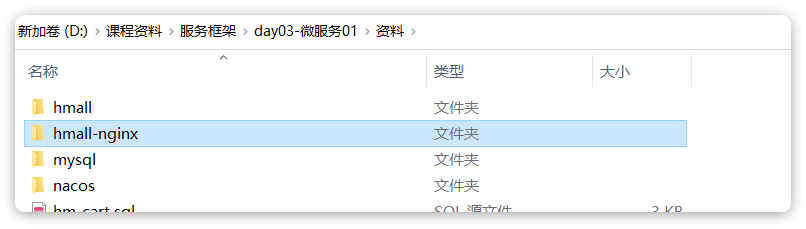

::: tip

1 安装 MySQL

2 后端

3 前端

:::

在课前资料中给大家提供了黑马商城项目的资料，我们需要先导入这个单体项目。不过需要注意的是，本篇及后续的微服务学习都是基于Centos7系统下的Docker部署，因此你必须做好一些准备：

- Centos7的环境及一个好用的SSH客户端
- 安装好Docker
- 会使用Docker

如果你没有这样的Linux环境，或者不是Centos7的话，那么这里有一篇参考文档：

- [Linux环境搭建](https://b11et3un53m.feishu.cn/wiki/FJAnwOhpIihMkLkOKQocdWZ7nUc) 

建议按照上面的文档来搭建虚拟机环境，使用其它版本会出现一些环境问题，比较痛苦。

如果已经有Linux环境，但是没有安装Docker的话，那么这里还有一篇参考文档：

- [安装Docker](https://b11et3un53m.feishu.cn/wiki/Rfocw7ctXij2RBkShcucLZbrn2d) 

如果不会使用Docker的话可以参考黑马的微服务前置Docker课程，B站地址如下：

https://www.bilibili.com/video/BV1HP4118797/?share_source=copy_web&vd_source=3362e6914fb759983690e6e0f1072453

::: warning

注意：

如果是学习过上面Docker课程的同学，虚拟机中已经有了黑马商城项目及MySQL数据库了，不过为了跟其他同学保持一致，可以先将整个项目移除。使用下面的命令：

cd /root

docker compose down

:::


## 1 安装 MySQL

在课前资料提供好了MySQL的一个目录：


其中有MySQL的配置文件和初始化脚本：


我们将其复制到虚拟机的`/root`目录。如果`/root`下已经存在`mysql`目录则删除旧的，如果不存在则直接复制本地的：


然后创建一个通用网络：

```bash
docker network create hm-net
```

使用下面的命令来安装MySQL：

```bash
docker run -d \
  --name mysql \
  -p 3306:3306 \
  -e TZ=Asia/Shanghai \
  -e MYSQL_ROOT_PASSWORD=123 \
  -v /root/mysql/data:/var/lib/mysql \
  -v /root/mysql/conf:/etc/mysql/conf.d \
  -v /root/mysql/init:/docker-entrypoint-initdb.d \
  --network hm-net\
  mysql
```

此时，通过命令查看mysql容器：

```bash
docker ps
```

如图：


发现mysql容器正常运行。

> 注：图片中的dps命令是我设置的别名，等同于docker ps --format，可以简化命令格式。你可以参考黑马的[day02-Docker](https://b11et3un53m.feishu.cn/wiki/MWQIw4Zvhil0I5ktPHwcoqZdnec) 的2.1.3小节来配置。

此时，如果我们使用MySQL的客户端工具连接MySQL，应该能发现已经创建了黑马商城所需要的表：


## 2 后端

然后是Java代码，在课前资料提供了一个hmall目录：


将其复制到你的工作空间，然后利用Idea打开。

项目结构如下：


按下`ALT` + `8`键打开services窗口，新增一个启动项：


在弹出窗口中鼠标向下滚动，找到`Spring Boot`:


点击后应该会在services中出现hmall的启动项：


点击对应按钮，即可实现运行或DEBUG运行。

**不过别着急！！**

我们还需要对这个启动项做简单配置，在`HMallApplication`上点击鼠标右键，会弹出窗口，然后选择`Edit Configuration`：


在弹出窗口中配置SpringBoot的启动环境为local：


点击OK配置完成。接下来就可以运行了！

启动完成后，试试看访问下 http://localhost:8080/hi 吧！


## 3 前端

在课前资料中还提供了一个hmall-nginx的目录：



其中就是一个nginx程序以及我们的前端代码，直接在windows下将其复制到一个非中文、不包含特殊字符的目录下。然后进入hmall-nginx后，利用cmd启动即可：

```powershell
# 启动nginx
start nginx.exe
# 停止
nginx.exe -s stop
# 重新加载配置
nginx.exe -s reload
# 重启
nginx.exe -s restart
```

特别注意：

nginx.exe 不要双击启动，而是打开cmd窗口，通过命令行启动。停止的时候也一样要是用命令停止。如果启动失败不要重复启动，而是查看logs目录中的error.log日志，查看是否是端口冲突。如果是端口冲突则自行修改端口解决。

启动成功后，访问http://localhost:18080，应该能看到我们的门户页面：

