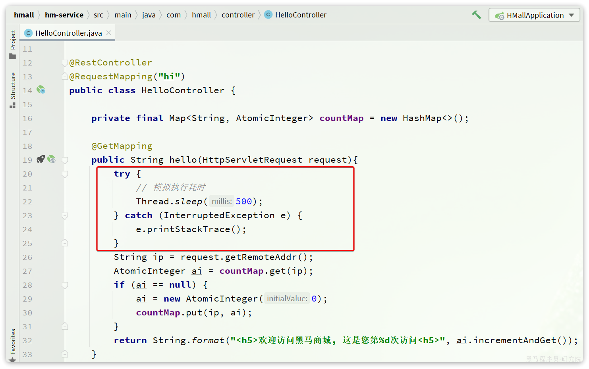

::: tip

1 单体架构

2 微服务

3 SpringCloud

:::

这一章我们从单体架构的优缺点来分析，看看开发大型项目采用单体架构存在哪些问题，而微服务架构又是如何解决这些问题的。

## 1 单体架构

单体架构（monolithic structure）：顾名思义，整个项目中所有功能模块都在一个工程中开发；项目部署时需要对所有模块一起编译、打包；项目的架构设计、开发模式都非常简单。

当项目规模较小时，这种模式上手快，部署、运维也都很方便，因此早期很多小型项目都采用这种模式。

但随着项目的业务规模越来越大，团队开发人员也不断增加，单体架构就呈现出越来越多的问题：

- **团队协作成本高**：试想一下，你们团队数十个人同时协作开发同一个项目，由于所有模块都在一个项目中，不同模块的代码之间物理边界越来越模糊。最终要把功能合并到一个分支，你绝对会陷入到解决冲突的泥潭之中。
- **系统发布效率低**：任何模块变更都需要发布整个系统，而系统发布过程中需要多个模块之间制约较多，需要对比各种文件，任何一处出现问题都会导致发布失败，往往一次发布需要数十分钟甚至数小时。
- **系统可用性差**：单体架构各个功能模块是作为一个服务部署，相互之间会互相影响，一些热点功能会耗尽系统资源，导致其它服务低可用。

在上述问题中，前两点相信大家在实战过程中应该深有体会。对于第三点系统可用性问题，很多同学可能感触不深。接下来我们就通过黑马商城这个项目，给大家做一个简单演示。

首先，我们修改hm-service模块下的`com.hmall.controller.HelloController`中的`hello`方法，模拟方法执行时的耗时：

接下来，启动项目，目前有两个接口是无需登录即可访问的：

- `http://localhost:8080/hi`
- `http://localhost:8080/search/list`

经过测试，目前`/search/list` 是比较正常的，访问耗时在30毫秒左右。

接下来，我们假设`/hi`这个接口是一个并发较高的热点接口，我们通过Jemeter来模拟500个用户不停访问。在课前资料中已经提供了Jemeter的测试脚本：

导入Jemeter并测试：

这个脚本会开启500个线程并发请求`http://localhost/hi`这个接口。由于该接口存在执行耗时（500毫秒），这就服务端导致每秒能处理的请求数量有限，最终会有越来越多请求积压，直至Tomcat资源耗尽。这样，其它本来正常的接口（例如`/search/list`）也都会被拖慢，甚至因超时而无法访问了。

我们测试一下，启动测试脚本，然后在浏览器访问`http://localhost:8080/search/list`这个接口，会发现响应速度非常慢：

如果进一步提高`/hi`这个接口的并发，最终会发现`/search/list`接口的请求响应速度会越来越慢。

可见，单体架构的可用性是比较差的，功能之间相互影响比较大。

当然，有同学会说我们可以做水平扩展。

此时如果我们对系统做水平扩展，增加更多机器，资源还是会被这样的热点接口占用，从而影响到其它接口，并不能从根本上解决问题。这也就是单体架构的扩展性差的一个原因。

而要想解决这些问题，就需要使用微服务架构了。

## 2 微服务

微服务架构，首先是服务化，就是将单体架构中的功能模块从单体应用中拆分出来，独立部署为多个服务。同时要满足下面的一些特点：

- **单一职责**：一个微服务负责一部分业务功能，并且其核心数据不依赖于其它模块。
- **团队自治**：每个微服务都有自己独立的开发、测试、发布、运维人员，团队人员规模不超过10人（2张披萨能喂饱）
- **服务自治**：每个微服务都独立打包部署，访问自己独立的数据库。并且要做好服务隔离，避免对其它服务产生影响

例如，黑马商城项目，我们就可以把商品、用户、购物车、交易等模块拆分，交给不同的团队去开发，并独立部署：

那么，单体架构存在的问题有没有解决呢？

- 团队协作成本高？
  - 由于服务拆分，每个服务代码量大大减少，参与开发的后台人员在1~3名，协作成本大大降低
- 系统发布效率低？
  - 每个服务都是独立部署，当有某个服务有代码变更时，只需要打包部署该服务即可
- 系统可用性差？
  - 每个服务独立部署，并且做好服务隔离，使用自己的服务器资源，不会影响到其它服务。

综上所述，微服务架构解决了单体架构存在的问题，特别适合大型互联网项目的开发，因此被各大互联网公司普遍采用。大家以前可能听说过分布式架构，分布式就是服务拆分的过程，其实微服务架构正式分布式架构的一种最佳实践的方案。

当然，微服务架构虽然能解决单体架构的各种问题，但在拆分的过程中，还会面临很多其它问题。比如：

- 如果出现跨服务的业务该如何处理？
- 页面请求到底该访问哪个服务？
- 如何实现各个服务之间的服务隔离？

这些问题，我们在后续的学习中会给大家逐一解答。

## 3 SpringCloud

微服务拆分以后碰到的各种问题都有对应的解决方案和微服务组件，而SpringCloud框架可以说是目前Java领域最全面的微服务组件的集合了。

而且SpringCloud依托于SpringBoot的自动装配能力，大大降低了其项目搭建、组件使用的成本。对于没有自研微服务组件能力的中小型企业，使用SpringCloud全家桶来实现微服务开发可以说是最合适的选择了！

https://spring.io/projects/spring-cloud#overview

目前SpringCloud最新版本为`2022.0.x`版本，对应的SpringBoot版本为`3.x`版本，但它们全部依赖于JDK17，目前在企业中使用相对较少。

| **SpringCloud版本**                                          | **SpringBoot版本**                    |
| :----------------------------------------------------------- | :------------------------------------ |
| [2022.0.x](https://github.com/spring-cloud/spring-cloud-release/wiki/Spring-Cloud-2022.0-Release-Notes) aka Kilburn | 3.0.x                                 |
| [2021.0.x](https://github.com/spring-cloud/spring-cloud-release/wiki/Spring-Cloud-2021.0-Release-Notes) aka Jubilee | 2.6.x, 2.7.x (Starting with 2021.0.3) |
| [2020.0.x](https://github.com/spring-cloud/spring-cloud-release/wiki/Spring-Cloud-2020.0-Release-Notes) aka Ilford | 2.4.x, 2.5.x (Starting with 2020.0.3) |
| [Hoxton](https://github.com/spring-cloud/spring-cloud-release/wiki/Spring-Cloud-Hoxton-Release-Notes) | 2.2.x, 2.3.x (Starting with SR5)      |
| [Greenwich](https://github.com/spring-projects/spring-cloud/wiki/Spring-Cloud-Greenwich-Release-Notes) | 2.1.x                                 |
| [Finchley](https://github.com/spring-projects/spring-cloud/wiki/Spring-Cloud-Finchley-Release-Notes) | 2.0.x                                 |
| [Edgware](https://github.com/spring-projects/spring-cloud/wiki/Spring-Cloud-Edgware-Release-Notes) | 1.5.x                                 |
| [Dalston](https://github.com/spring-projects/spring-cloud/wiki/Spring-Cloud-Dalston-Release-Notes) | 1.5.x                                 |

因此，我们推荐使用次新版本：Spring Cloud 2021.0.x以及Spring Boot 2.7.x版本。

另外，Alibaba的微服务产品SpringCloudAlibaba目前也成为了SpringCloud组件中的一员，我们课堂中也会使用其中的部分组件。

在我们的父工程hmall中已经配置了SpringCloud以及SpringCloudAlibaba的依赖：

对应的版本：

这样，我们在后续需要使用SpringCloud或者SpringCloudAlibaba组件时，就无需单独指定版本了。