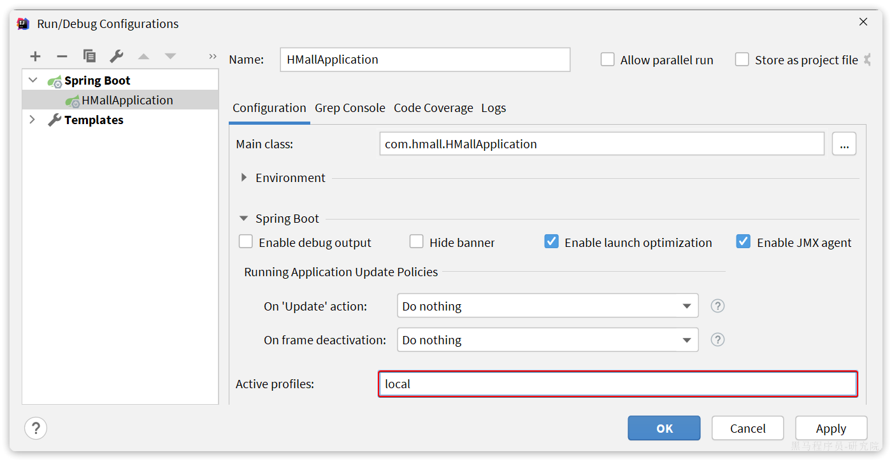
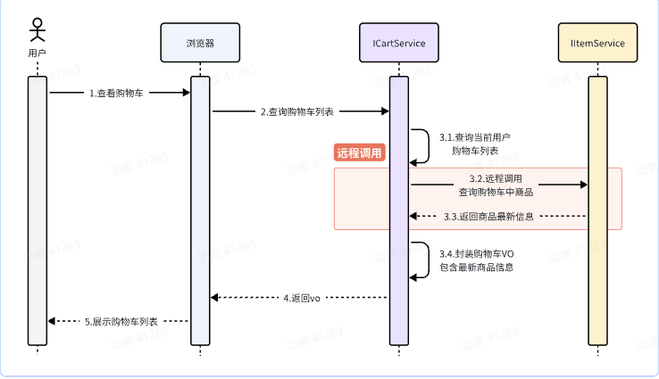
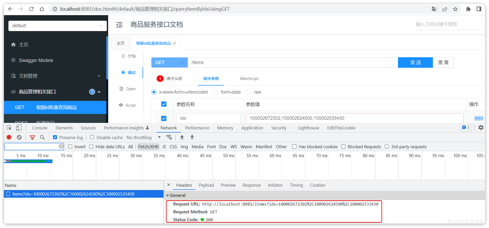
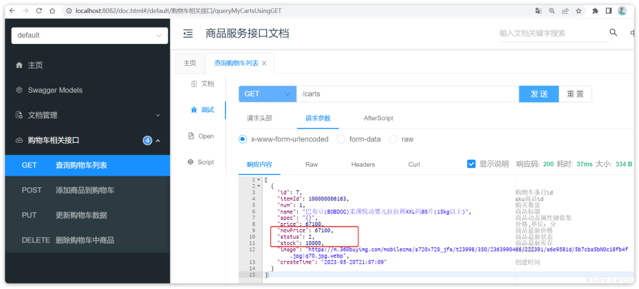

::: tip

1 熟悉黑马商城

2 服务拆分原则

3 拆分购物车、商品服务

4 服务调用

5 总结

:::

接下来，我们就一起将黑马商城这个单体项目拆分为微服务项目，并解决其中出现的各种问题。


## 1 熟悉黑马商城

首先，我们需要熟悉黑马商城项目的基本结构：


大家可以直接启动该项目，测试效果。不过，需要修改数据库连接参数，在application-local.yaml中：

```yaml
hm:
  db:
    host: 192.168.150.101 # 修改为你自己的虚拟机IP地址
    pw: 123 # 修改为docker中的MySQL密码
```

同时配置启动项激活的是local环境：




### 1.1 登录   

首先来看一下登录业务流程：


登录入口在`com.hmall.controller.UserController`中的`login`方法：


### 1.2 搜索商品

在首页搜索框输入关键字，点击搜索即可进入搜索列表页面：


该页面会调用接口：`/search/list`，对应的服务端入口在`com.hmall.controller.SearchController`中的`search`方法：


这里目前是利用数据库实现了简单的分页查询。


### 1.3 购物车

在搜索到的商品列表中，点击按钮`加入购物车`，即可将商品加入购物车：


加入成功后即可进入购物车列表页，查看自己购物车商品列表：


同时这里还可以对购物车实现修改、删除等操作。

相关功能全部在`com.hmall.controller.CartController`中：


其中，查询购物车列表时，由于要判断商品最新的价格和状态，所以还需要查询商品信息，业务流程如下：


### 1.4 下单

在购物车页面点击`结算`按钮，会进入订单结算页面：


点击提交订单，会提交请求到服务端，服务端做3件事情：

- 创建一个新的订单
- 扣减商品库存
- 清理购物车中商品

业务入口在`com.hmall.controller.OrderController`中的`createOrder`方法：


### 1.5 支付

下单完成后会跳转到支付页面，目前只支持**余额支付**：


在选择**余额支付**这种方式后，会发起请求到服务端，服务端会立刻创建一个支付流水单，并返回支付流水单号到前端。

当用户输入用户密码，然后点击确认支付时，页面会发送请求到服务端，而服务端会做几件事情：

- 校验用户密码
- 扣减余额
- 修改支付流水状态
- 修改交易订单状态

请求入口在`com.hmall.controller.PayController`中：


## 2 服务拆分原则

服务拆分一定要考虑几个问题：

- 什么时候拆？
- 如何拆？


### 2.1 什么时候拆

一般情况下，对于一个初创的项目，首先要做的是验证项目的可行性。因此这一阶段的首要任务是敏捷开发，快速产出生产可用的产品，投入市场做验证。为了达成这一目的，该阶段项目架构往往会比较简单，很多情况下会直接采用单体架构，这样开发成本比较低，可以快速产出结果，一旦发现项目不符合市场，损失较小。

如果这一阶段采用复杂的微服务架构，投入大量的人力和时间成本用于架构设计，最终发现产品不符合市场需求，等于全部做了无用功。

所以，对于**大多数小型项目来说，一般是先采用单体架构**，随着用户规模扩大、业务复杂后**再逐渐拆分为**微服务架构**。这样初期成本会比较低，可以快速试错。但是，这么做的问题就在于后期做服务拆分时，可能会遇到很多代码耦合带来的问题，拆分比较困难（**前易后难）。

而对于一些大型项目，在立项之初目的就很明确，为了长远考虑，在架构设计时就直接选择微服务架构。虽然前期投入较多，但后期就少了拆分服务的烦恼（**前难后易**）。


### 2.2 怎么拆

之前我们说过，微服务拆分时**粒度要小**，这其实是拆分的目标。具体可以从两个角度来分析：

- **高内聚**：每个微服务的职责要尽量单一，包含的业务相互关联度高、完整度高。
- **低耦合**：每个微服务的功能要相对独立，尽量减少对其它微服务的依赖，或者依赖接口的稳定性要强。

**高内聚**首先是 **单一职责，**但不能说一个微服务就一个接口，而是要保证微服务内部业务的完整性为前提。目标是当我们要修改某个业务时，最好就只修改当前微服务，这样变更的成本更低。

一旦微服务做到了高内聚，那么服务之间的**耦合度**自然就降低了。

当然，微服务之间不可避免的会有或多或少的业务交互，比如下单时需要查询商品数据。这个时候我们不能在订单服务直接查询商品数据库，否则就导致了数据耦合。而应该由商品服务对应暴露接口，并且一定要保证微服务对外**接口的稳定性**（即：尽量保证接口外观不变）。虽然出现了服务间调用，但此时无论你如何在商品服务做内部修改，都不会影响到订单微服务，服务间的耦合度就降低了。

明确了拆分目标，接下来就是拆分方式了。我们在做服务拆分时一般有两种方式：

- **纵向**拆分
- **横向**拆分

所谓**纵向拆分**，就是按照项目的功能模块来拆分。例如黑马商城中，就有用户管理功能、订单管理功能、购物车功能、商品管理功能、支付功能等。那么按照功能模块将他们拆分为一个个服务，就属于纵向拆分。这种拆分模式可以尽可能提高服务的内聚性。

而**横向拆分**，是看各个功能模块之间有没有公共的业务部分，如果有将其抽取出来作为通用服务。例如用户登录是需要发送消息通知，记录风控数据，下单时也要发送短信，记录风控数据。因此消息发送、风控数据记录就是通用的业务功能，因此可以将他们分别抽取为公共服务：消息中心服务、风控管理服务。这样可以提高业务的复用性，避免重复开发。同时通用业务一般接口稳定性较强，也不会使服务之间过分耦合。

当然，由于黑马商城并不是一个完整的项目，其中的短信发送、风控管理并没有实现，这里就不再考虑了。而其它的业务按照纵向拆分，可以分为以下几个微服务：

- 用户服务
- 商品服务
- 订单服务
- 购物车服务
- 支付服务


## 3 拆分购物车、商品服务

接下来，我们先把商品管理功能、购物车功能抽取为两个独立服务。

一般微服务项目有两种不同的工程结构：

- 完全解耦：每一个微服务都创建为一个独立的工程，甚至可以使用不同的开发语言来开发，项目完全解耦。
  - 优点：服务之间耦合度低
  - 缺点：每个项目都有自己的独立仓库，管理起来比较麻烦
- Maven聚合：整个项目为一个Project，然后每个微服务是其中的一个Module
  - 优点：项目代码集中，管理和运维方便（授课也方便）
  - 缺点：服务之间耦合，编译时间较长

::: warning

**注意**：

为了授课方便，我们会采用Maven聚合工程，大家以后到了企业，可以根据需求自由选择工程结构。

:::

在hmall父工程之中，我已经提前定义了SpringBoot、SpringCloud的依赖版本，所以为了方便期间，我们直接在这个项目中创建微服务module.


### 3.1 商品服务

在hmall中创建module：


选择maven模块，并设定JDK版本为11：


商品模块，我们起名为`item-service`：


引入依赖：

```xml
<?xml version="1.0" encoding="UTF-8"?>
<project xmlns="http://maven.apache.org/POM/4.0.0"
         xmlns:xsi="http://www.w3.org/2001/XMLSchema-instance"
         xsi:schemaLocation="http://maven.apache.org/POM/4.0.0 http://maven.apache.org/xsd/maven-4.0.0.xsd">
    <parent>
        <artifactId>hmall</artifactId>
        <groupId>com.heima</groupId>
        <version>1.0.0</version>
    </parent>
    <modelVersion>4.0.0</modelVersion>

    <artifactId>item-service</artifactId>

    <properties>
        <maven.compiler.source>11</maven.compiler.source>
        <maven.compiler.target>11</maven.compiler.target>
    </properties>
    <dependencies>
        <!--common-->
        <dependency>
            <groupId>com.heima</groupId>
            <artifactId>hm-common</artifactId>
            <version>1.0.0</version>
        </dependency>
        <!--web-->
        <dependency>
            <groupId>org.springframework.boot</groupId>
            <artifactId>spring-boot-starter-web</artifactId>
        </dependency>
        <!--数据库-->
        <dependency>
            <groupId>mysql</groupId>
            <artifactId>mysql-connector-java</artifactId>
        </dependency>
        <!--mybatis-->
        <dependency>
            <groupId>com.baomidou</groupId>
            <artifactId>mybatis-plus-boot-starter</artifactId>
        </dependency>
        <!--单元测试-->
        <dependency>
            <groupId>org.springframework.boot</groupId>
            <artifactId>spring-boot-starter-test</artifactId>
        </dependency>
    </dependencies>
    <build>
        <finalName>${project.artifactId}</finalName>
        <plugins>
            <plugin>
                <groupId>org.springframework.boot</groupId>
                <artifactId>spring-boot-maven-plugin</artifactId>
            </plugin>
        </plugins>
    </build>
</project>
```

编写启动类：


代码如下：

```java
package com.hmall.item;

import org.mybatis.spring.annotation.MapperScan;
import org.springframework.boot.SpringApplication;
import org.springframework.boot.autoconfigure.SpringBootApplication;

@MapperScan("com.hmall.item.mapper")
@SpringBootApplication
public class ItemApplication {
    public static void main(String[] args) {
        SpringApplication.run(ItemApplication.class, args);
    }
}
```

接下来是配置文件，可以从`hm-service`中拷贝：


其中，`application.yaml`内容如下：

```yaml
server:
  port: 8081
spring:
  application:
    name: item-service
  profiles:
    active: dev
  datasource:
    url: jdbc:mysql://${hm.db.host}:3306/hm-item?useUnicode=true&characterEncoding=UTF-8&autoReconnect=true&serverTimezone=Asia/Shanghai
    driver-class-name: com.mysql.cj.jdbc.Driver
    username: root
    password: ${hm.db.pw}
mybatis-plus:
  configuration:
    default-enum-type-handler: com.baomidou.mybatisplus.core.handlers.MybatisEnumTypeHandler
  global-config:
    db-config:
      update-strategy: not_null
      id-type: auto
logging:
  level:
    com.hmall: debug
  pattern:
    dateformat: HH:mm:ss:SSS
  file:
    path: "logs/${spring.application.name}"
knife4j:
  enable: true
  openapi:
    title: 商品服务接口文档
    description: "信息"
    email: zhanghuyi@itcast.cn
    concat: 虎哥
    url: https://www.itcast.cn
    version: v1.0.0
    group:
      default:
        group-name: default
        api-rule: package
        api-rule-resources:
          - com.hmall.item.controller
```

剩下的`application-dev.yaml`和`application-local.yaml`直接从hm-service拷贝即可。

然后拷贝`hm-service`中与商品管理有关的代码到`item-service`，如图：


这里有一个地方的代码需要改动，就是`ItemServiceImpl`中的`deductStock`方法：


**改动前**


**改动后**

这也是因为ItemMapper的所在包发生了变化，因此这里代码必须修改包路径。

最后，还要导入数据库表。默认的数据库连接的是虚拟机，在你docker数据库执行课前资料提供的SQL文件：


最终，会在数据库创建一个名为hm-item的database，将来的每一个微服务都会有自己的一个database：


::: warning

**注意**：在企业开发的生产环境中，每一个微服务都应该有自己的**独立数据库服务**，而不仅仅是database，课堂我们用database来代替。

:::

接下来，就可以启动测试了，在启动前我们要配置一下启动项，让默认激活的配置为`local`而不是`dev`：


在打开的编辑框填写`active profiles`:


接着，启动`item-service`，访问商品微服务的swagger接口文档：http://localhost:8081/doc.html

然后测试其中的根据id批量查询商品这个接口：


测试参数：100002672302,100002624500,100002533430，结果如下：


说明商品微服务抽取成功了。


### 3.2 购物车服务

与商品服务类似，在hmall下创建一个新的`module`，起名为`cart-service`:


然后是依赖：

```xml
<?xml version="1.0" encoding="UTF-8"?>
<project xmlns="http://maven.apache.org/POM/4.0.0"
         xmlns:xsi="http://www.w3.org/2001/XMLSchema-instance"
         xsi:schemaLocation="http://maven.apache.org/POM/4.0.0 http://maven.apache.org/xsd/maven-4.0.0.xsd">
    <parent>
        <artifactId>hmall</artifactId>
        <groupId>com.heima</groupId>
        <version>1.0.0</version>
    </parent>
    <modelVersion>4.0.0</modelVersion>

    <artifactId>cart-service</artifactId>

    <properties>
        <maven.compiler.source>11</maven.compiler.source>
        <maven.compiler.target>11</maven.compiler.target>
    </properties>

    <dependencies>
        <!--common-->
        <dependency>
            <groupId>com.heima</groupId>
            <artifactId>hm-common</artifactId>
            <version>1.0.0</version>
        </dependency>
        <!--web-->
        <dependency>
            <groupId>org.springframework.boot</groupId>
            <artifactId>spring-boot-starter-web</artifactId>
        </dependency>
        <!--数据库-->
        <dependency>
            <groupId>mysql</groupId>
            <artifactId>mysql-connector-java</artifactId>
        </dependency>
        <!--mybatis-->
        <dependency>
            <groupId>com.baomidou</groupId>
            <artifactId>mybatis-plus-boot-starter</artifactId>
        </dependency>
        <!--单元测试-->
        <dependency>
            <groupId>org.springframework.boot</groupId>
            <artifactId>spring-boot-starter-test</artifactId>
        </dependency>
    </dependencies>
    <build>
        <finalName>${project.artifactId}</finalName>
        <plugins>
            <plugin>
                <groupId>org.springframework.boot</groupId>
                <artifactId>spring-boot-maven-plugin</artifactId>
            </plugin>
        </plugins>
    </build>
</project>
```

然后是启动类：

```java
package com.hmall.cart;

import org.mybatis.spring.annotation.MapperScan;
import org.springframework.boot.SpringApplication;
import org.springframework.boot.autoconfigure.SpringBootApplication;

@MapperScan("com.hmall.cart.mapper")
@SpringBootApplication
public class CartApplication {
    public static void main(String[] args) {
        SpringApplication.run(CartApplication.class, args);
    }
}
```

然后是配置文件，同样可以拷贝自`item-service`，不过其中的`application.yaml`需要修改：

```yaml
server:
  port: 8082
spring:
  application:
    name: cart-service
  profiles:
    active: dev
  datasource:
    url: jdbc:mysql://${hm.db.host}:3306/hm-cart?useUnicode=true&characterEncoding=UTF-8&autoReconnect=true&serverTimezone=Asia/Shanghai
    driver-class-name: com.mysql.cj.jdbc.Driver
    username: root
    password: ${hm.db.pw}
mybatis-plus:
  configuration:
    default-enum-type-handler: com.baomidou.mybatisplus.core.handlers.MybatisEnumTypeHandler
  global-config:
    db-config:
      update-strategy: not_null
      id-type: auto
logging:
  level:
    com.hmall: debug
  pattern:
    dateformat: HH:mm:ss:SSS
  file:
    path: "logs/${spring.application.name}"
knife4j:
  enable: true
  openapi:
    title: 商品服务接口文档
    description: "信息"
    email: zhanghuyi@itcast.cn
    concat: 虎哥
    url: https://www.itcast.cn
    version: v1.0.0
    group:
      default:
        group-name: default
        api-rule: package
        api-rule-resources:
          - com.hmall.cart.controller
```

最后，把hm-service中的与购物车有关功能拷贝过来，最终的项目结构如下：


特别注意的是`com.hmall.cart.service.impl.CartServiceImpl`，其中有两个地方需要处理：

- 需要**获取登录用户信息**，但登录校验功能目前没有复制过来，先写死固定用户id
- 查询购物车时需要**查询商品信息**，而商品信息不在当前服务，需要先将这部分代码注释


我们对这部分代码做如下修改：

```java
package com.hmall.cart.service.impl;

import cn.hutool.core.util.StrUtil;
import com.baomidou.mybatisplus.core.conditions.query.QueryWrapper;
import com.baomidou.mybatisplus.extension.service.impl.ServiceImpl;
import com.hmall.cart.domain.dto.CartFormDTO;
import com.hmall.cart.domain.po.Cart;
import com.hmall.cart.domain.vo.CartVO;
import com.hmall.cart.mapper.CartMapper;
import com.hmall.cart.service.ICartService;
import com.hmall.common.exception.BizIllegalException;
import com.hmall.common.utils.BeanUtils;
import com.hmall.common.utils.CollUtils;
import com.hmall.common.utils.UserContext;
import lombok.RequiredArgsConstructor;
import org.springframework.stereotype.Service;

import java.util.Collection;
import java.util.List;

/**
 * <p>
 * 订单详情表 服务实现类
 * </p>
 *
 * @author 虎哥
 * @since 2023-05-05
 */
@Service
@RequiredArgsConstructor
public class CartServiceImpl extends ServiceImpl<CartMapper, Cart> implements ICartService {

    // private final IItemService itemService;

    @Override
    public void addItem2Cart(CartFormDTO cartFormDTO) {
        // 1.获取登录用户
        Long userId = UserContext.getUser();

        // 2.判断是否已经存在
        if (checkItemExists(cartFormDTO.getItemId(), userId)) {
            // 2.1.存在，则更新数量
            baseMapper.updateNum(cartFormDTO.getItemId(), userId);
            return;
        }
        // 2.2.不存在，判断是否超过购物车数量
        checkCartsFull(userId);

        // 3.新增购物车条目
        // 3.1.转换PO
        Cart cart = BeanUtils.copyBean(cartFormDTO, Cart.class);
        // 3.2.保存当前用户
        cart.setUserId(userId);
        // 3.3.保存到数据库
        save(cart);
    }

    @Override
    public List<CartVO> queryMyCarts() {
        // 1.查询我的购物车列表
        List<Cart> carts = lambdaQuery().eq(Cart::getUserId, 1L /*TODO UserContext.getUser()*/).list();
        if (CollUtils.isEmpty(carts)) {
            return CollUtils.emptyList();
        }
        // 2.转换VO
        List<CartVO> vos = BeanUtils.copyList(carts, CartVO.class);
        // 3.处理VO中的商品信息
        handleCartItems(vos);
        // 4.返回
        return vos;
    }

    private void handleCartItems(List<CartVO> vos) {
        // 1.获取商品id TODO 处理商品信息
        /*Set<Long> itemIds = vos.stream().map(CartVO::getItemId).collect(Collectors.toSet());
        // 2.查询商品
        List<ItemDTO> items = itemService.queryItemByIds(itemIds);
        if (CollUtils.isEmpty(items)) {
            throw new BadRequestException("购物车中商品不存在！");
        }
        // 3.转为 id 到 item的map
        Map<Long, ItemDTO> itemMap = items.stream().collect(Collectors.toMap(ItemDTO::getId, Function.identity()));
        // 4.写入vo
        for (CartVO v : vos) {
            ItemDTO item = itemMap.get(v.getItemId());
            if (item == null) {
                continue;
            }
            v.setNewPrice(item.getPrice());
            v.setStatus(item.getStatus());
            v.setStock(item.getStock());
        }*/
    }

    @Override
    public void removeByItemIds(Collection<Long> itemIds) {
        // 1.构建删除条件，userId和itemId
        QueryWrapper<Cart> queryWrapper = new QueryWrapper<Cart>();
        queryWrapper.lambda()
                .eq(Cart::getUserId, UserContext.getUser())
                .in(Cart::getItemId, itemIds);
        // 2.删除
        remove(queryWrapper);
    }

    private void checkCartsFull(Long userId) {
        int count = lambdaQuery().eq(Cart::getUserId, userId).count();
        if (count >= 10) {
            throw new BizIllegalException(StrUtil.format("用户购物车课程不能超过{}", 10));
        }
    }

    private boolean checkItemExists(Long itemId, Long userId) {
        int count = lambdaQuery()
                .eq(Cart::getUserId, userId)
                .eq(Cart::getItemId, itemId)
                .count();
        return count > 0;
    }
}
```

最后，还是要导入数据库表，在本地数据库直接执行课前资料对应的SQL文件：


在数据库中会出现名为`hm-cart`的`database`，以及其中的`cart`表，代表购物车：


接下来，就可以测试了。不过在启动前，同样要配置启动项的`active profile`为`local`：


然后启动`CartApplication`，访问swagger文档页面：http://localhost:8082/doc.html

我们测试其中的`查询我的购物车列表`接口：


无需填写参数，直接访问：


我们注意到，其中与商品有关的几个字段值都为空！这就是因为刚才我们注释掉了查询购物车时，查询商品信息的相关代码。

那么，我们该如何在`cart-service`服务中实现对`item-service`服务的查询呢？


## 4 服务调用

在拆分的时候，我们发现一个问题：就是购物车业务中需要查询商品信息，但商品信息查询的逻辑全部迁移到了`item-service`服务，导致我们无法查询。

最终结果就是查询到的购物车数据不完整，因此要想解决这个问题，我们就必须改造其中的代码，把原本本地方法调用，改造成跨微服务的远程调用（RPC，即**R**emote **P**roduce **C**all）。

因此，现在查询购物车列表的流程变成了这样：



代码中需要变化的就是这一步：


那么问题来了：我们该如何跨服务调用，准确的说，如何在`cart-service`中获取`item-service`服务中的提供的商品数据呢？

大家思考一下，我们以前有没有实现过类似的远程查询的功能呢？

答案是肯定的，我们前端向服务端查询数据，其实就是从浏览器远程查询服务端数据。比如我们刚才通过Swagger测试商品查询接口，就是向`http://localhost:8081/items`这个接口发起的请求：



而这种查询就是通过http请求的方式来完成的，不仅仅可以实现远程查询，还可以实现新增、删除等各种远程请求。

假如我们在cart-service中能模拟浏览器，发送http请求到item-service，是不是就实现了跨微服务的**远程调用**了呢？

那么：我们该如何用Java代码发送Http的请求呢？


### 4.1Rest Template

Spring给我们提供了一个RestTemplate的API，可以方便的实现Http请求的发送。

> org.springframework.web.client public class RestTemplate
>
> extends InterceptingHttpAccessor
>
> implements RestOperations
>
> \----------------------------------------------------------------------------------------------------------------
>
> 同步客户端执行HTTP请求，在底层HTTP客户端库(如JDK HttpURLConnection、Apache HttpComponents等)上公开一个简单的模板方法API。RestTemplate通过HTTP方法为常见场景提供了模板，此外还提供了支持不太常见情况的通用交换和执行方法。 RestTemplate通常用作共享组件。然而，它的配置不支持并发修改，因此它的配置通常是在启动时准备的。如果需要，您可以在启动时创建多个不同配置的RestTemplate实例。如果这些实例需要共享HTTP客户端资源，它们可以使用相同的底层ClientHttpRequestFactory。 注意:从5.0开始，这个类处于维护模式，只有对更改和错误的小请求才会被接受。请考虑使用org.springframework.web.react .client. webclient，它有更现代的API，支持同步、异步和流场景。  
>
> \----------------------------------------------------------------------------------------------------------------
>
> 自: 3.0 参见: HttpMessageConverter, RequestCallback, ResponseExtractor, ResponseErrorHandler

其中提供了大量的方法，方便我们发送Http请求，例如：


可以看到常见的Get、Post、Put、Delete请求都支持，如果请求参数比较复杂，还可以使用exchange方法来构造请求。

我们在`cart-service`服务中定义一个配置类：


先将RestTemplate注册为一个Bean：

```java
package com.hmall.cart.config;

import org.springframework.context.annotation.Bean;
import org.springframework.context.annotation.Configuration;
import org.springframework.web.client.RestTemplate;

@Configuration
public class RemoteCallConfig {

    @Bean
    public RestTemplate restTemplate() {
        return new RestTemplate();
    }
}
```


### 4.2 远程调用

接下来，我们修改`cart-service`中的`com.hmall.cart.service.impl.CartServiceImpl`的`handleCartItems`方法，发送http请求到`item-service`：


可以看到，利用RestTemplate发送http请求与前端ajax发送请求非常相似，都包含四部分信息：

- ① 请求方式
- ② 请求路径
- ③ 请求参数
- ④  返回值类型

`handleCartItems`方法的完整代码如下：

```java
private void handleCartItems(List<CartVO> vos) {
    // TODO 1.获取商品id
    Set<Long> itemIds = vos.stream().map(CartVO::getItemId).collect(Collectors.toSet());
    // 2.查询商品
    // List<ItemDTO> items = itemService.queryItemByIds(itemIds);
    // 2.1.利用RestTemplate发起http请求，得到http的响应
    ResponseEntity<List<ItemDTO>> response = restTemplate.exchange(
            "http://localhost:8081/items?ids={ids}",
            HttpMethod.GET,
            null,
            new ParameterizedTypeReference<List<ItemDTO>>() {
            },
            Map.of("ids", CollUtil.join(itemIds, ","))
    );
    // 2.2.解析响应
    if(!response.getStatusCode().is2xxSuccessful()){
        // 查询失败，直接结束
        return;
    }
    List<ItemDTO> items = response.getBody();
    if (CollUtils.isEmpty(items)) {
        return;
    }
    // 3.转为 id 到 item的map
    Map<Long, ItemDTO> itemMap = items.stream().collect(Collectors.toMap(ItemDTO::getId, Function.identity()));
    // 4.写入vo
    for (CartVO v : vos) {
        ItemDTO item = itemMap.get(v.getItemId());
        if (item == null) {
            continue;
        }
        v.setNewPrice(item.getPrice());
        v.setStatus(item.getStatus());
        v.setStock(item.getStock());
    }
}
```

好了，现在重启`cart-service`，再次测试查询我的购物车列表接口：



可以发现，所有商品相关数据都已经查询到了。

在这个过程中，`item-service`提供了查询接口，`cart-service`利用Http请求调用该接口。因此`item-service`可以称为服务的提供者，而`cart-service`则称为服务的消费者或服务调用者。


## 5 总结

什么时候需要拆分微服务？

- 如果是创业型公司，最好先用单体架构快速迭代开发，验证市场运作模型，快速试错。当业务跑通以后，随着业务规模扩大、人员规模增加，再考虑拆分微服务。
- 如果是大型企业，有充足的资源，可以在项目开始之初就搭建微服务架构。

如何拆分？

- 首先要做到高内聚、低耦合
- 从拆分方式来说，有横向拆分和纵向拆分两种。纵向就是按照业务功能模块，横向则是拆分通用性业务，提高复用性

服务拆分之后，不可避免的会出现跨微服务的业务，此时微服务之间就需要进行远程调用。微服务之间的远程调用被称为RPC，即远程过程调用。RPC的实现方式有很多，比如：

- 基于Http协议
- 基于Dubbo协议

我们课堂中使用的是Http方式，这种方式不关心服务提供者的具体技术实现，只要对外暴露Http接口即可，更符合微服务的需要。

Java发送http请求可以使用Spring提供的RestTemplate，使用的基本步骤如下：

- 注册RestTemplate到Spring容器
- 调用RestTemplate的API发送请求，常见方法有：
  - getForObject：发送Get请求并返回指定类型对象
  - PostForObject：发送Post请求并返回指定类型对象
  - put：发送PUT请求
  - delete：发送Delete请求
  - exchange：发送任意类型请求，返回ResponseEntity