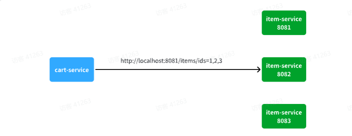
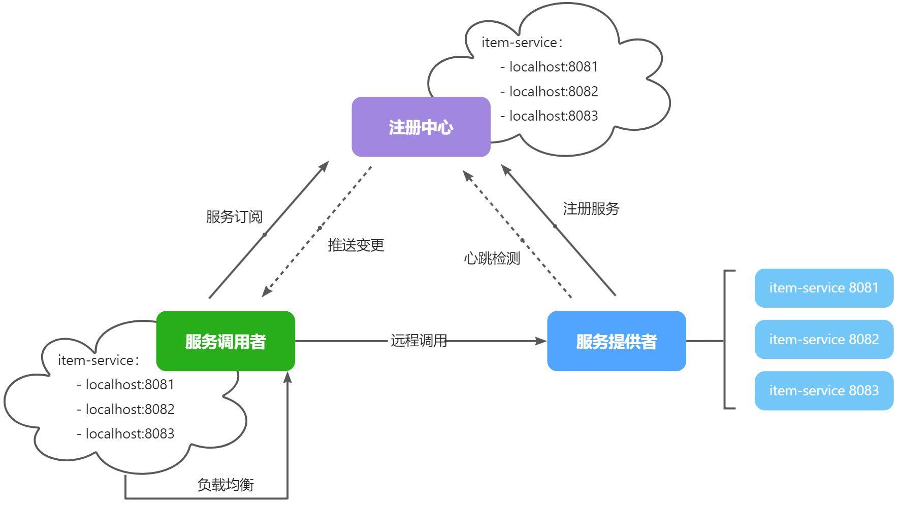

::: tip

1 注册中心原理

2 Nacos 注册中心

3 服务注册

4 服务发现

:::

在上一章我们实现了微服务拆分，并且通过Http请求实现了跨微服务的远程调用。不过这种手动发送Http请求的方式存在一些问题。

试想一下，假如商品微服务被调用较多，为了应对更高的并发，我们进行了多实例部署，如图：



此时，每个`item-service`的实例其IP或端口不同，问题来了：

- item-service这么多实例，cart-service如何知道每一个实例的地址？
- http请求要写url地址，`cart-service`服务到底该调用哪个实例呢？
- 如果在运行过程中，某一个`item-service`实例宕机，`cart-service`依然在调用该怎么办？
- 如果并发太高，`item-service`临时多部署了N台实例，`cart-service`如何知道新实例的地址？

为了解决上述问题，就必须引入注册中心的概念了，接下来我们就一起来分析下注册中心的原理。


## 1 注册中心原理

在微服务远程调用的过程中，包括两个角色：

- 服务提供者：提供接口供其它微服务访问，比如`item-service`
- 服务消费者：调用其它微服务提供的接口，比如`cart-service`

在大型微服务项目中，服务提供者的数量会非常多，为了管理这些服务就引入了**注册中心**的概念。注册中心、服务提供者、服务消费者三者间关系如下：



流程如下：

- 服务启动时就会注册自己的服务信息（服务名、IP、端口）到注册中心
- 调用者可以从注册中心订阅想要的服务，获取服务对应的实例列表（1个服务可能多实例部署）
- 调用者自己对实例列表负载均衡，挑选一个实例
- 调用者向该实例发起远程调用

当服务提供者的实例宕机或者启动新实例时，调用者如何得知呢？

- 服务提供者会定期向注册中心发送请求，报告自己的健康状态（心跳请求）
- 当注册中心长时间收不到提供者的心跳时，会认为该实例宕机，将其从服务的实例列表中剔除
- 当服务有新实例启动时，会发送注册服务请求，其信息会被记录在注册中心的服务实例列表
- 当注册中心服务列表变更时，会主动通知微服务，更新本地服务列表


## 2 Nacos 注册中心

目前开源的注册中心框架有很多，国内比较常见的有：

- Eureka：Netflix公司出品，目前被集成在SpringCloud当中，一般用于Java应用
- Nacos：Alibaba公司出品，目前被集成在SpringCloudAlibaba中，一般用于Java应用
- Consul：HashiCorp公司出品，目前集成在SpringCloud中，不限制微服务语言

以上几种注册中心都遵循SpringCloud中的API规范，因此在业务开发使用上没有太大差异。由于Nacos是国内产品，中文文档比较丰富，而且同时具备**配置管理**功能（后面会学习），因此在国内使用较多，课堂中我们会Nacos为例来学习。

官方网站如下：

暂时无法在飞书文档外展示此内容

我们基于Docker来部署Nacos的注册中心，首先我们要准备MySQL数据库表，用来存储Nacos的数据。由于是Docker部署，所以大家需要将资料中的SQL文件导入到你**Docker中的MySQL容器**中：


最终表结构如下：


然后，找到课前资料下的nacos文件夹：


其中的`nacos/custom.env`文件中，有一个MYSQL_SERVICE_HOST也就是mysql地址，需要修改为你自己的虚拟机IP地址：


然后，将课前资料中的`nacos`目录上传至虚拟机的`/root`目录。

进入root目录，然后执行下面的docker命令：

```PowerShell
docker run -d \
--name nacos \
--env-file ./nacos/custom.env \
-p 8848:8848 \
-p 9848:9848 \
-p 9849:9849 \
--restart=always \
nacos/nacos-server:v2.1.0-slim
```

启动完成后，访问下面地址：http://192.168.150.101:8848/nacos/，注意将`192.168.150.101`替换为你自己的虚拟机IP地址。

首次访问会跳转到登录页，**账号密码都是nacos**

          

## 3 服务注册

### 3.1 添加依赖

### 3.2 配置 Nacos

### 3.3 启动服务实例

## 4 服务发现

### 4.1 引入依赖

### 4.2 配置 Nacos 地址

### 4.3 发现并调用服务