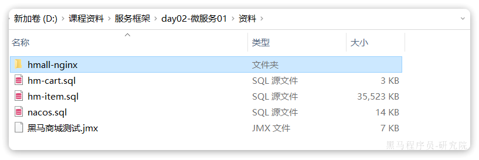

::: tip

1 拆分微服务

2 定义 FeignClient

3 将微服务与前端联调

:::

## 1 拆分微服务

将hm-service中的其它业务也都拆分为微服务，包括：

- user-service：用户微服务，包含用户登录、管理等功能
- trade-service：交易微服务，包含订单相关功能
- pay-service：支付微服务，包含支付相关功能

其中交易服务、支付服务、用户服务中的业务都需要知道当前登录用户是谁，目前暂未实现，先将用户id写死。

**思考**：如何才能在每个微服务中都拿到用户信息？如何在微服务之间传递用户信息？

## 2 定义 FeignClient

在上述业务中，包含大量的微服务调用，将被调用的接口全部定义为FeignClient，将其与对应的DTO放在hm-api模块

## 3 将微服务与前端联调

课前资料提供了一个`hmall-nginx`目录，其中包含了Nginx以及我们的前端代码：

将其拷贝到一个不包含中文、空格、特殊字符的目录，启动后即可访问到页面：

- 18080是用户端页面
- 18081是管理端页面

之前`nginx`内部会将发向服务端请求全部代理到8080端口，但是现在拆分了N个微服务，8080不可用了。请通过`Nginx`配置，完成对不同微服务的反向代理。

**认真思考这种方式存在哪些问题**，**有什么好的解决方案**？