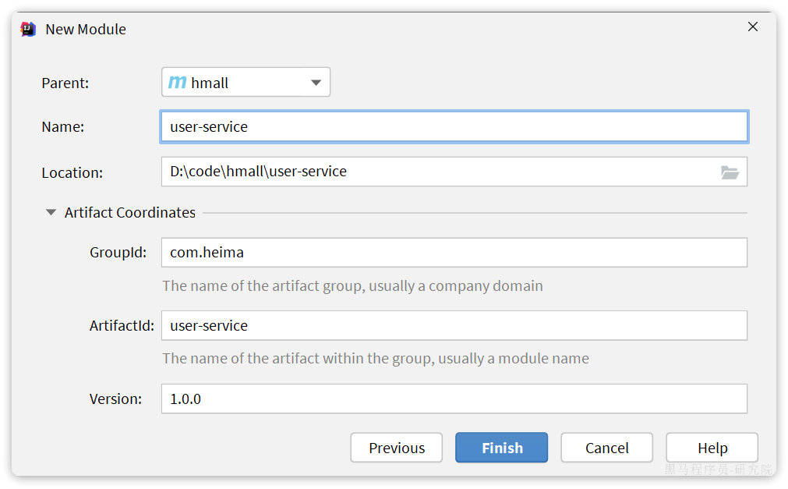

::: tip

1 创建项目

2 依赖

3 启动类

4 配置文件

5 代码

6 数据库

7 配置启动项

8 测试

:::

## 1 创建项目

在hmall下新建一个module，命名为user-service：




## 2 依赖

user-service的pom.xml文件内容如下：

```xml
<?xml version="1.0" encoding="UTF-8"?>
<project xmlns="http://maven.apache.org/POM/4.0.0"
         xmlns:xsi="http://www.w3.org/2001/XMLSchema-instance"
         xsi:schemaLocation="http://maven.apache.org/POM/4.0.0 http://maven.apache.org/xsd/maven-4.0.0.xsd">
    <parent>
        <artifactId>hmall</artifactId>
        <groupId>com.heima</groupId>
        <version>1.0.0</version>
    </parent>
    <modelVersion>4.0.0</modelVersion>

    <artifactId>user-service</artifactId>

    <properties>
        <maven.compiler.source>11</maven.compiler.source>
        <maven.compiler.target>11</maven.compiler.target>
    </properties>

    <dependencies>
        <!--common-->
        <dependency>
            <groupId>com.heima</groupId>
            <artifactId>hm-common</artifactId>
            <version>1.0.0</version>
        </dependency>
        <!--api-->
        <dependency>
            <groupId>com.heima</groupId>
            <artifactId>hm-api</artifactId>
            <version>1.0.0</version>
        </dependency>
        <!--web-->
        <dependency>
            <groupId>org.springframework.boot</groupId>
            <artifactId>spring-boot-starter-web</artifactId>
        </dependency>
        <!--数据库-->
        <dependency>
            <groupId>mysql</groupId>
            <artifactId>mysql-connector-java</artifactId>
        </dependency>
        <!--mybatis-->
        <dependency>
            <groupId>com.baomidou</groupId>
            <artifactId>mybatis-plus-boot-starter</artifactId>
        </dependency>
        <!--nacos 服务注册发现-->
        <dependency>
            <groupId>com.alibaba.cloud</groupId>
            <artifactId>spring-cloud-starter-alibaba-nacos-discovery</artifactId>
        </dependency>
    </dependencies>
    <build>
        <finalName>${project.artifactId}</finalName>
        <plugins>
            <plugin>
                <groupId>org.springframework.boot</groupId>
                <artifactId>spring-boot-maven-plugin</artifactId>
            </plugin>
        </plugins>
    </build>
</project>
```


## 3 启动类

在user-service中的`com.hmall.user`包下创建启动类：

```java
package com.hmall.user;

import org.mybatis.spring.annotation.MapperScan;
import org.springframework.boot.SpringApplication;
import org.springframework.boot.autoconfigure.SpringBootApplication;

@MapperScan("com.hmall.user.mapper")
@SpringBootApplication
public class UserApplication {
    public static void main(String[] args) {
        SpringApplication.run(UserApplication.class, args);
    }
}
```


## 4 配置文件

从`hm-service`项目中复制3个yaml配置文件到`user-service`的`resource`目录。

其中`application-dev.yaml`和`application-local.yaml`保持不变。`application.yaml`如下：

```yaml
server:
  port: 8084
spring:
  application:
    name: user-service # 服务名称
  profiles:
    active: dev
  datasource:
    url: jdbc:mysql://${hm.db.host}:3306/hm-user?useUnicode=true&characterEncoding=UTF-8&autoReconnect=true&serverTimezone=Asia/Shanghai
    driver-class-name: com.mysql.cj.jdbc.Driver
    username: root
    password: ${hm.db.pw}
  cloud:
    nacos:
      server-addr: 192.168.150.101 # nacos地址
mybatis-plus:
  configuration:
    default-enum-type-handler: com.baomidou.mybatisplus.core.handlers.MybatisEnumTypeHandler
  global-config:
    db-config:
      update-strategy: not_null
      id-type: auto
logging:
  level:
    com.hmall: debug
  pattern:
    dateformat: HH:mm:ss:SSS
  file:
    path: "logs/${spring.application.name}"
knife4j:
  enable: true
  openapi:
    title: 用户服务接口文档
    description: "信息"
    email: zhanghuyi@itcast.cn
    concat: 虎哥
    url: https://www.itcast.cn
    version: v1.0.0
    group:
      default:
        group-name: default
        api-rule: package
        api-rule-resources:
          - com.hmall.user.controller
hm:
  jwt:
    location: classpath:hmall.jks
    alias: hmall
    password: hmall123
    tokenTTL: 30m
```

将hm-service下的hmall.jks文件拷贝到user-service下的resources目录，这是JWT加密的秘钥文件：


## 5 代码

复制hm-service中所有与user、address、jwt有关的代码，最终项目结构如下：


## 6 数据库

user-service也需要自己的独立的database，向MySQL中导入课前资料提供的SQL：


导入结果如下：


## 7 配置启动项

给user-service配置启动项，设置profile为local：


## 8 测试

启动UserApplication，访问http://localhost:8084/doc.html#/default/用户相关接口/loginUsingPOST，测试登录接口：


用户服务测试通过。