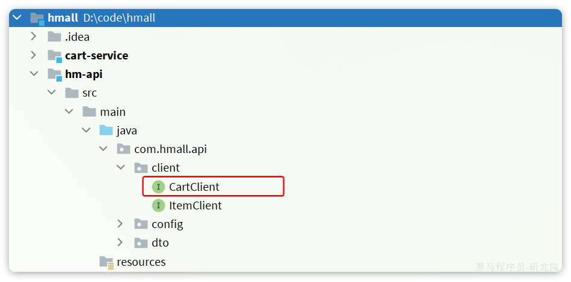

::: tip

1 创建项目

2 依赖

3 启动类

4 配置文件

5 代码

6 数据库

7 配置启动项

8 测试

:::

## 1 创建项目

在hmall下新建一个module，命名为trade-service：


## 2 依赖

trade-service的pom.xml文件内容如下：

```xml
<?xml version="1.0" encoding="UTF-8"?>
<project xmlns="http://maven.apache.org/POM/4.0.0"
         xmlns:xsi="http://www.w3.org/2001/XMLSchema-instance"
         xsi:schemaLocation="http://maven.apache.org/POM/4.0.0 http://maven.apache.org/xsd/maven-4.0.0.xsd">
    <parent>
        <artifactId>hmall</artifactId>
        <groupId>com.heima</groupId>
        <version>1.0.0</version>
    </parent>
    <modelVersion>4.0.0</modelVersion>

    <artifactId>trade-service</artifactId>

    <properties>
        <maven.compiler.source>11</maven.compiler.source>
        <maven.compiler.target>11</maven.compiler.target>
    </properties>

    <dependencies>
        <!--common-->
        <dependency>
            <groupId>com.heima</groupId>
            <artifactId>hm-common</artifactId>
            <version>1.0.0</version>
        </dependency>
        <!--api-->
        <dependency>
            <groupId>com.heima</groupId>
            <artifactId>hm-api</artifactId>
            <version>1.0.0</version>
        </dependency>
        <!--web-->
        <dependency>
            <groupId>org.springframework.boot</groupId>
            <artifactId>spring-boot-starter-web</artifactId>
        </dependency>
        <!--数据库-->
        <dependency>
            <groupId>mysql</groupId>
            <artifactId>mysql-connector-java</artifactId>
        </dependency>
        <!--mybatis-->
        <dependency>
            <groupId>com.baomidou</groupId>
            <artifactId>mybatis-plus-boot-starter</artifactId>
        </dependency>
        <!--nacos 服务注册发现-->
        <dependency>
            <groupId>com.alibaba.cloud</groupId>
            <artifactId>spring-cloud-starter-alibaba-nacos-discovery</artifactId>
        </dependency>
    </dependencies>
    <build>
        <finalName>${project.artifactId}</finalName>
        <plugins>
            <plugin>
                <groupId>org.springframework.boot</groupId>
                <artifactId>spring-boot-maven-plugin</artifactId>
            </plugin>
        </plugins>
    </build>
</project>
```


## 3 启动类

在trade-service中的`com.hmall.trade`包下创建启动类：

```java
package com.hmall.trade;

import org.mybatis.spring.annotation.MapperScan;
import org.springframework.boot.SpringApplication;
import org.springframework.boot.autoconfigure.SpringBootApplication;
import org.springframework.cloud.openfeign.EnableFeignClients;

@EnableFeignClients(basePackages = "com.hmall.api.client", defaultConfiguration = DefaultFeignConfig.class)
@MapperScan("com.hmall.trade.mapper")
@SpringBootApplication
public class TradeApplication {
    public static void main(String[] args) {
        SpringApplication.run(TradeApplication.class, args);
    }
}
```


## 4 配置文件

从`hm-service`项目中复制3个yaml配置文件到`trade-service`的`resource`目录。

其中`application-dev.yaml`和`application-local.yaml`保持不变。`application.yaml`如下：

```yaml
server:
  port: 8085
spring:
  application:
    name: trade-service # 服务名称
  profiles:
    active: dev
  datasource:
    url: jdbc:mysql://${hm.db.host}:3306/hm-trade?useUnicode=true&characterEncoding=UTF-8&autoReconnect=true&serverTimezone=Asia/Shanghai
    driver-class-name: com.mysql.cj.jdbc.Driver
    username: root
    password: ${hm.db.pw}
  cloud:
    nacos:
      server-addr: 192.168.150.101 # nacos地址
mybatis-plus:
  configuration:
    default-enum-type-handler: com.baomidou.mybatisplus.core.handlers.MybatisEnumTypeHandler
  global-config:
    db-config:
      update-strategy: not_null
      id-type: auto
logging:
  level:
    com.hmall: debug
  pattern:
    dateformat: HH:mm:ss:SSS
  file:
    path: "logs/${spring.application.name}"
knife4j:
  enable: true
  openapi:
    title: 交易服务接口文档
    description: "信息"
    email: zhanghuyi@itcast.cn
    concat: 虎哥
    url: https://www.itcast.cn
    version: v1.0.0
    group:
      default:
        group-name: default
        api-rule: package
        api-rule-resources:
          - com.hmall.trade.controller
```


## 5 代码

### 5.1 基础代码

复制hm-service中所有与trade有关的代码，最终项目结构如下：


在交易服务中，用户下单时需要做下列事情：

- **根据id查询商品列表**
- **计算商品总价**
- **保存订单**
- **扣减库存**
- **清理购物车商品**

其中，查询商品、扣减库存都是与商品有关的业务，在item-service中有相关功能；清理购物车商品是购物车业务，在cart-service中有相关功能。

因此交易服务要调用他们，必须通过OpenFeign远程调用。我们需要将上述功能抽取为FeignClient.


### 5.2 抽取 ItemClient 接口

首先是**扣减库存**，在`item-service`中的对应业务接口如下：


我们将这个接口抽取到`hm-api`模块的`com.hmall.api.client.ItemClient`中:


将接口参数的`OrderDetailDTO`抽取到`hm-api`模块的`com.hmall.api.dto`包下：


### 5.3 抽取 CartClient 接口

接下来是**清理购物车商品**，在`cart-service`中的对应业务接口如下：


我们在`hm-api`模块的`com.hmall.api.client`包下定义一个`CartClient`接口：



代码如下：

```java
package com.hmall.api.client;

import org.springframework.cloud.openfeign.FeignClient;
import org.springframework.web.bind.annotation.DeleteMapping;
import org.springframework.web.bind.annotation.RequestParam;

import java.util.Collection;

@FeignClient("cart-service")
public interface CartClient {
    @DeleteMapping("/carts")
    void deleteCartItemByIds(@RequestParam("ids") Collection<Long> ids);
}
```


### 5.4 改造 OrderServiceImpl

接下来，就可以改造OrderServiceImpl中的逻辑，将本地方法调用改造为基于FeignClient的调用，完整代码如下：

```java
package com.hmall.trade.service.impl;

import com.baomidou.mybatisplus.extension.service.impl.ServiceImpl;
import com.hmall.api.client.CartClient;
import com.hmall.api.client.ItemClient;
import com.hmall.api.dto.ItemDTO;
import com.hmall.api.dto.OrderDetailDTO;
import com.hmall.common.exception.BadRequestException;
import com.hmall.common.utils.UserContext;
import com.hmall.trade.domain.dto.OrderFormDTO;
import com.hmall.trade.domain.po.Order;
import com.hmall.trade.domain.po.OrderDetail;
import com.hmall.trade.mapper.OrderMapper;
import com.hmall.trade.service.IOrderDetailService;
import com.hmall.trade.service.IOrderService;
import lombok.RequiredArgsConstructor;
import org.springframework.stereotype.Service;
import org.springframework.transaction.annotation.Transactional;

import java.util.ArrayList;
import java.util.List;
import java.util.Map;
import java.util.Set;
import java.util.stream.Collectors;

/**
 * <p>
 * 服务实现类
 * </p>
 */
@Service
@RequiredArgsConstructor
public class OrderServiceImpl extends ServiceImpl<OrderMapper, Order> implements IOrderService {

    private final ItemClient itemClient;
    private final IOrderDetailService detailService;
    private final CartClient cartClient;

    @Override
    @Transactional
    public Long createOrder(OrderFormDTO orderFormDTO) {
        // 1.订单数据
        Order order = new Order();
        // 1.1.查询商品
        List<OrderDetailDTO> detailDTOS = orderFormDTO.getDetails();
        // 1.2.获取商品id和数量的Map
        Map<Long, Integer> itemNumMap = detailDTOS.stream()
                .collect(Collectors.toMap(OrderDetailDTO::getItemId, OrderDetailDTO::getNum));
        Set<Long> itemIds = itemNumMap.keySet();
        // 1.3.查询商品
        List<ItemDTO> items = itemClient.queryItemByIds(itemIds);
        if (items == null || items.size() < itemIds.size()) {
            throw new BadRequestException("商品不存在");
        }
        // 1.4.基于商品价格、购买数量计算商品总价：totalFee
        int total = 0;
        for (ItemDTO item : items) {
            total += item.getPrice()  itemNumMap.get(item.getId());
        }
        order.setTotalFee(total);
        // 1.5.其它属性
        order.setPaymentType(orderFormDTO.getPaymentType());
        order.setUserId(UserContext.getUser());
        order.setStatus(1);
        // 1.6.将Order写入数据库order表中
        save(order);

        // 2.保存订单详情
        List<OrderDetail> details = buildDetails(order.getId(), items, itemNumMap);
        detailService.saveBatch(details);

        // 3.扣减库存
        try {
            itemClient.deductStock(detailDTOS);
        } catch (Exception e) {
            throw new RuntimeException("库存不足！");
        }

        // 4.清理购物车商品
        cartClient.deleteCartItemByIds(itemIds);
        return order.getId();
    }

    private List<OrderDetail> buildDetails(Long orderId, List<ItemDTO> items, Map<Long, Integer> numMap) {
        List<OrderDetail> details = new ArrayList<>(items.size());
        for (ItemDTO item : items) {
            OrderDetail detail = new OrderDetail();
            detail.setName(item.getName());
            detail.setSpec(item.getSpec());
            detail.setPrice(item.getPrice());
            detail.setNum(numMap.get(item.getId()));
            detail.setItemId(item.getId());
            detail.setImage(item.getImage());
            detail.setOrderId(orderId);
            details.add(detail);
        }
        return details;
    }
}
```


## 6 数据库

trade-service也需要自己的独立的database，向MySQL中导入课前资料提供的SQL：


导入结果如下：


## 7 配置启动项

给trade-service配置启动项，设置profile为local：


## 8 测试

启动TradeApplication，访问[http://localhost:8085/doc.html](http://localhost:8085/doc.html#/default/订单管理接口/queryOrderByIdUsingGET)，测试查询订单接口：


请求参数：1654779387523936258，交易服务测试通过。

注意，创建订单接口无法测试，因为无法获取登录用户信息。