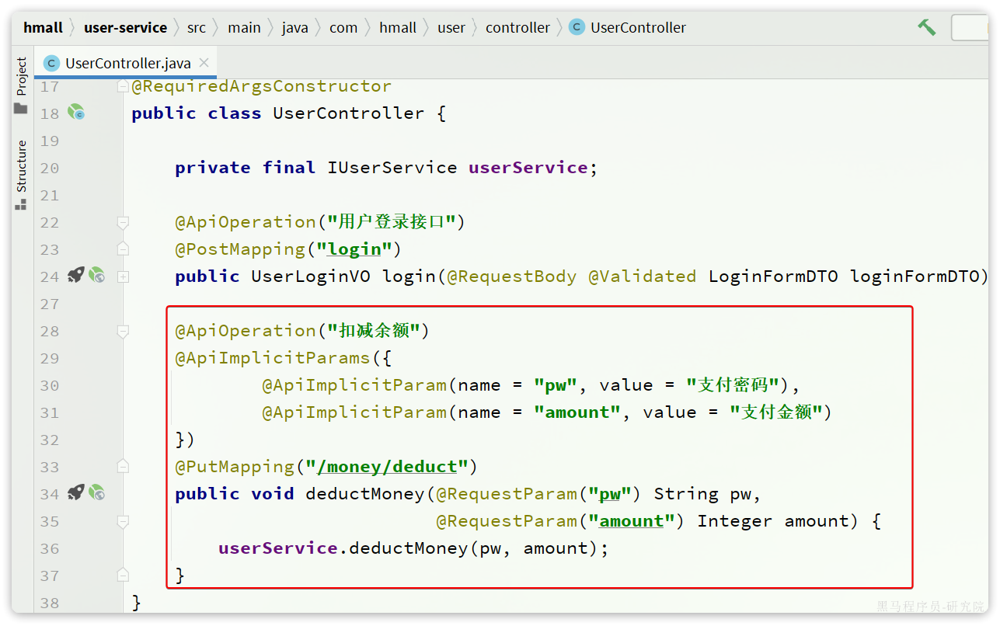
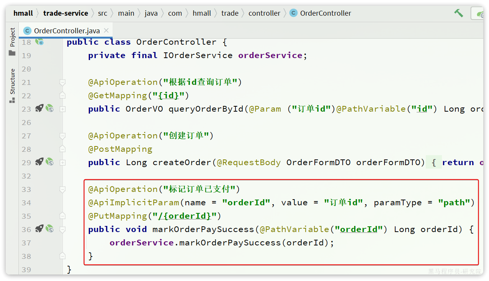
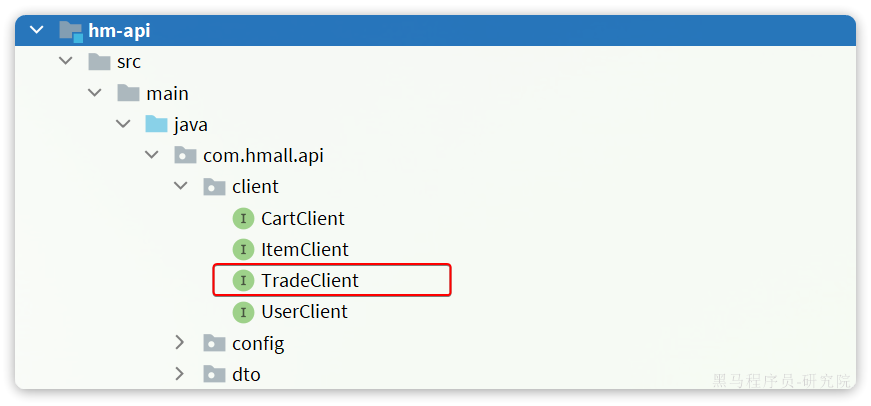
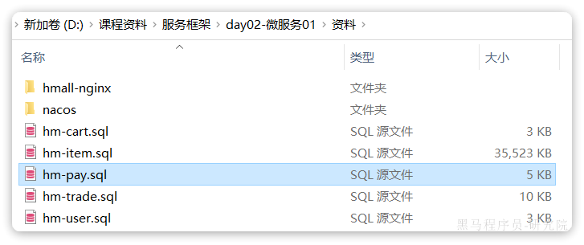
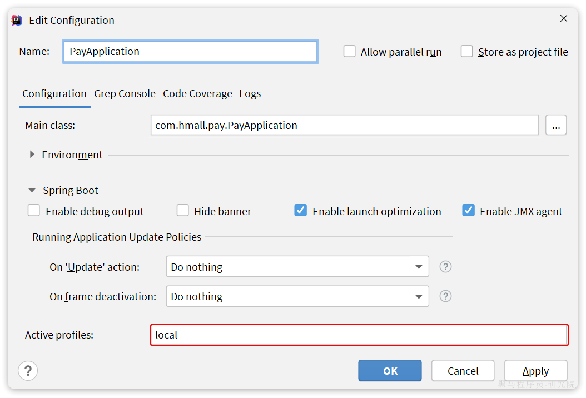

::: tip

1 创建项目

2 依赖

3 启动类

4 配置文件

5 代码

6 数据库

7 配置启动项

8 测试

:::

## 1 创建项目

在`hmall`下新建一个module，命名为`pay-service`：


## 2 依赖

`pay-service`的`pom.xml`文件内容如下：

```xml
<?xml version="1.0" encoding="UTF-8"?>
<project xmlns="http://maven.apache.org/POM/4.0.0"
         xmlns:xsi="http://www.w3.org/2001/XMLSchema-instance"
         xsi:schemaLocation="http://maven.apache.org/POM/4.0.0 http://maven.apache.org/xsd/maven-4.0.0.xsd">
    <parent>
        <artifactId>hmall</artifactId>
        <groupId>com.heima</groupId>
        <version>1.0.0</version>
    </parent>
    <modelVersion>4.0.0</modelVersion>

    <artifactId>pay-service</artifactId>

    <properties>
        <maven.compiler.source>11</maven.compiler.source>
        <maven.compiler.target>11</maven.compiler.target>
    </properties>

    <dependencies>
        <!--common-->
        <dependency>
            <groupId>com.heima</groupId>
            <artifactId>hm-common</artifactId>
            <version>1.0.0</version>
        </dependency>
        <!--api-->
        <dependency>
            <groupId>com.heima</groupId>
            <artifactId>hm-api</artifactId>
            <version>1.0.0</version>
        </dependency>
        <!--web-->
        <dependency>
            <groupId>org.springframework.boot</groupId>
            <artifactId>spring-boot-starter-web</artifactId>
        </dependency>
        <!--数据库-->
        <dependency>
            <groupId>mysql</groupId>
            <artifactId>mysql-connector-java</artifactId>
        </dependency>
        <!--mybatis-->
        <dependency>
            <groupId>com.baomidou</groupId>
            <artifactId>mybatis-plus-boot-starter</artifactId>
        </dependency>
        <!--nacos 服务注册发现-->
        <dependency>
            <groupId>com.alibaba.cloud</groupId>
            <artifactId>spring-cloud-starter-alibaba-nacos-discovery</artifactId>
        </dependency>
    </dependencies>
    <build>
        <finalName>${project.artifactId}</finalName>
        <plugins>
            <plugin>
                <groupId>org.springframework.boot</groupId>
                <artifactId>spring-boot-maven-plugin</artifactId>
            </plugin>
        </plugins>
    </build>
</project>
```


## 3 启动类

在pay-service中的`com.hmall.pay`包下创建启动类：

```java
package com.hmall.pay;

import org.mybatis.spring.annotation.MapperScan;
import org.springframework.boot.SpringApplication;
import org.springframework.boot.autoconfigure.SpringBootApplication;
import org.springframework.cloud.openfeign.EnableFeignClients;

@EnableFeignClients(basePackages = "com.hmall.api.client", defaultConfiguration = DefaultFeignConfig.class)
@MapperScan("com.hmall.pay.mapper")
@SpringBootApplication
public class PayApplication {
    public static void main(String[] args) {
        SpringApplication.run(PayApplication.class, args);
    }
}
```


## 4 配置文件

从`hm-service`项目中复制3个yaml配置文件到`trade-service`的`resource`目录。

其中`application-dev.yaml`和`application-local.yaml`保持不变。`application.yaml`如下：

```yaml
server:
  port: 8086
spring:
  application:
    name: pay-service
  profiles:
    active: dev
  datasource:
    url: jdbc:mysql://${hm.db.host}:3306/hm-pay?useUnicode=true&characterEncoding=UTF-8&autoReconnect=true&serverTimezone=Asia/Shanghai
    driver-class-name: com.mysql.cj.jdbc.Driver
    username: root
    password: ${hm.db.pw}
  cloud:
    nacos:
      server-addr: 192.168.150.101
mybatis-plus:
  configuration:
    default-enum-type-handler: com.baomidou.mybatisplus.core.handlers.MybatisEnumTypeHandler
  global-config:
    db-config:
      update-strategy: not_null
      id-type: auto
logging:
  level:
    com.hmall: debug
  pattern:
    dateformat: HH:mm:ss:SSS
  file:
    path: "logs/${spring.application.name}"
knife4j:
  enable: true
  openapi:
    title: 支付服务接口文档
    description: "支付服务接口文档"
    email: zhanghuyi@itcast.cn
    concat: 虎哥
    url: https://www.itcast.cn
    version: v1.0.0
    group:
      default:
        group-name: default
        api-rule: package
        api-rule-resources:
          - com.hmall.pay.controller
```


## 5 代码

### 5.1 基础代码

复制hm-service中所有与支付有关的代码，最终项目结构如下：


在支付服务中，基于用户余额支付时需要做下列事情：

- **扣减用户余额**
- 标记支付单状态为已支付
- **标记订单状态为已支付**

其中，**扣减用户余额**是在`user-service`中有相关功能；**标记订单状态**则是在`trade-service`中有相关功能。因此交易服务要调用他们，必须通过OpenFeign远程调用。我们需要将上述功能抽取为FeignClient.


### 5.2 抽取 UserClient 接口

首先是**扣减用户余额**，在`user-service`中的对应业务接口如下：



我们将这个接口抽取到`hm-api`模块的`com.hmall.api.client.UserClient`中:


具体代码如下：

```java
package com.hmall.api.client;

import org.springframework.cloud.openfeign.FeignClient;
import org.springframework.web.bind.annotation.PutMapping;
import org.springframework.web.bind.annotation.RequestParam;

@FeignClient("user-service")
public interface UserClient {
    @PutMapping("/users/money/deduct")
    void deductMoney(@RequestParam("pw") String pw,@RequestParam("amount") Integer amount);
}
```


### 5.3 抽取 TradeClient 接口

接下来是**标记订单状态**，在`trade-service`中的对应业务接口如下：



我们将这个接口抽取到`hm-api`模块的`com.hmall.api.client.TradeClient`中:



代码如下：

```java
package com.hmall.api.client;

import org.springframework.cloud.openfeign.FeignClient;
import org.springframework.web.bind.annotation.PathVariable;
import org.springframework.web.bind.annotation.PutMapping;

@FeignClient("trade-service")
public interface TradeClient {
    @PutMapping("/orders/{orderId}")
    void markOrderPaySuccess(@PathVariable("orderId") Long orderId);
}
```


### 5.4 改造 PayOrder ServiceImpl

接下来，就可以改造`PayOrderServiceImpl`中的逻辑，将本地方法调用改造为基于`FeignClient`的调用，完整代码如下：

```java
package com.hmall.pay.service.impl;

import com.baomidou.mybatisplus.core.toolkit.IdWorker;
import com.baomidou.mybatisplus.core.toolkit.StringUtils;
import com.baomidou.mybatisplus.extension.service.impl.ServiceImpl;
import com.hmall.api.client.TradeClient;
import com.hmall.api.client.UserClient;
import com.hmall.common.exception.BizIllegalException;
import com.hmall.common.utils.BeanUtils;
import com.hmall.common.utils.UserContext;
import com.hmall.pay.domain.dto.PayApplyDTO;
import com.hmall.pay.domain.dto.PayOrderFormDTO;
import com.hmall.pay.domain.po.PayOrder;
import com.hmall.pay.enums.PayStatus;
import com.hmall.pay.mapper.PayOrderMapper;
import com.hmall.pay.service.IPayOrderService;
import lombok.RequiredArgsConstructor;
import org.springframework.stereotype.Service;
import org.springframework.transaction.annotation.Transactional;

import java.time.LocalDateTime;

/**
 * <p>
 * 支付订单 服务实现类
 * </p>
 *
 */
@Service
@RequiredArgsConstructor
public class PayOrderServiceImpl extends ServiceImpl<PayOrderMapper, PayOrder> implements IPayOrderService {

    private final UserClient userClient;

    private final TradeClient tradeClient;

    @Override
    public String applyPayOrder(PayApplyDTO applyDTO) {
        // 1.幂等性校验
        PayOrder payOrder = checkIdempotent(applyDTO);
        // 2.返回结果
        return payOrder.getId().toString();
    }

    @Override
    @Transactional
    public void tryPayOrderByBalance(PayOrderFormDTO payOrderDTO) {
        // 1.查询支付单
        PayOrder po = getById(payOrderDTO.getId());
        // 2.判断状态
        if(!PayStatus.WAIT_BUYER_PAY.equalsValue(po.getStatus())){
            // 订单不是未支付，状态异常
            throw new BizIllegalException("交易已支付或关闭！");
        }
        // 3.尝试扣减余额
        userClient.deductMoney(payOrderDTO.getPw(), po.getAmount());
        // 4.修改支付单状态
        boolean success = markPayOrderSuccess(payOrderDTO.getId(), LocalDateTime.now());
        if (!success) {
            throw new BizIllegalException("交易已支付或关闭！");
        }
        // 5.修改订单状态
        tradeClient.markOrderPaySuccess(po.getBizOrderNo());
    }

    public boolean markPayOrderSuccess(Long id, LocalDateTime successTime) {
        return lambdaUpdate()
                .set(PayOrder::getStatus, PayStatus.TRADE_SUCCESS.getValue())
                .set(PayOrder::getPaySuccessTime, successTime)
                .eq(PayOrder::getId, id)
                // 支付状态的乐观锁判断
                .in(PayOrder::getStatus, PayStatus.NOT_COMMIT.getValue(), PayStatus.WAIT_BUYER_PAY.getValue())
                .update();
    }


    private PayOrder checkIdempotent(PayApplyDTO applyDTO) {
        // 1.首先查询支付单
        PayOrder oldOrder = queryByBizOrderNo(applyDTO.getBizOrderNo());
        // 2.判断是否存在
        if (oldOrder == null) {
            // 不存在支付单，说明是第一次，写入新的支付单并返回
            PayOrder payOrder = buildPayOrder(applyDTO);
            payOrder.setPayOrderNo(IdWorker.getId());
            save(payOrder);
            return payOrder;
        }
        // 3.旧单已经存在，判断是否支付成功
        if (PayStatus.TRADE_SUCCESS.equalsValue(oldOrder.getStatus())) {
            // 已经支付成功，抛出异常
            throw new BizIllegalException("订单已经支付！");
        }
        // 4.旧单已经存在，判断是否已经关闭
        if (PayStatus.TRADE_CLOSED.equalsValue(oldOrder.getStatus())) {
            // 已经关闭，抛出异常
            throw new BizIllegalException("订单已关闭");
        }
        // 5.旧单已经存在，判断支付渠道是否一致
        if (!StringUtils.equals(oldOrder.getPayChannelCode(), applyDTO.getPayChannelCode())) {
            // 支付渠道不一致，需要重置数据，然后重新申请支付单
            PayOrder payOrder = buildPayOrder(applyDTO);
            payOrder.setId(oldOrder.getId());
            payOrder.setQrCodeUrl("");
            updateById(payOrder);
            payOrder.setPayOrderNo(oldOrder.getPayOrderNo());
            return payOrder;
        }
        // 6.旧单已经存在，且可能是未支付或未提交，且支付渠道一致，直接返回旧数据
        return oldOrder;
    }

    private PayOrder buildPayOrder(PayApplyDTO payApplyDTO) {
        // 1.数据转换
        PayOrder payOrder = BeanUtils.toBean(payApplyDTO, PayOrder.class);
        // 2.初始化数据
        payOrder.setPayOverTime(LocalDateTime.now().plusMinutes(120L));
        payOrder.setStatus(PayStatus.WAIT_BUYER_PAY.getValue());
        payOrder.setBizUserId(UserContext.getUser());
        return payOrder;
    }
    public PayOrder queryByBizOrderNo(Long bizOrderNo) {
        return lambdaQuery()
                .eq(PayOrder::getBizOrderNo, bizOrderNo)
                .one();
    }
}
```


## 6 数据库

`pay-service`也需要自己的独立的database，向MySQL中导入课前资料提供的SQL：



导入结果如下：


## 7 配置启动项

给`pay-service`配置启动项，设置profile为`local`：




## 8 测试

在支付服务的PayController中添加一个接口方便测试：

```java
@ApiOperation("查询支付单")
@GetMapping
public List<PayOrderVO> queryPayOrders(){
    return BeanUtils.copyList(payOrderService.list(), PayOrderVO.class);
}
```

启动PayApplication，访问[http://localhost:8086/doc.html](http://localhost:8086/doc.html#/default/支付相关接口/queryPayOrdersUsingGET)，测试查询订单接口：


支付服务测试通过。