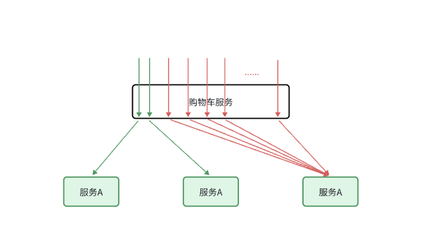
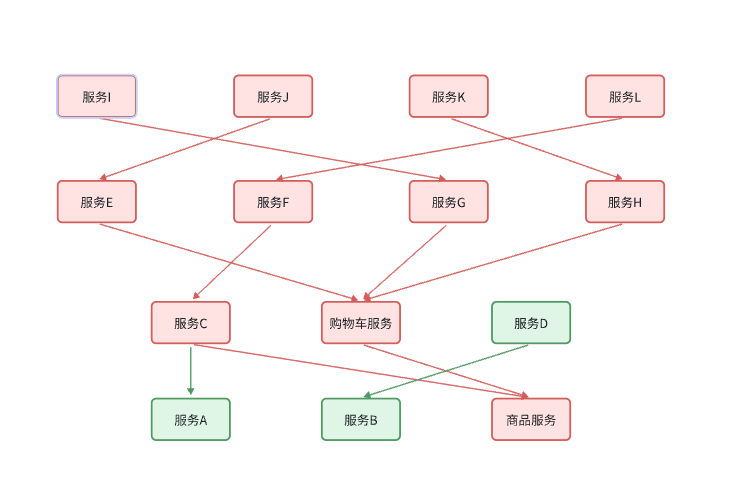
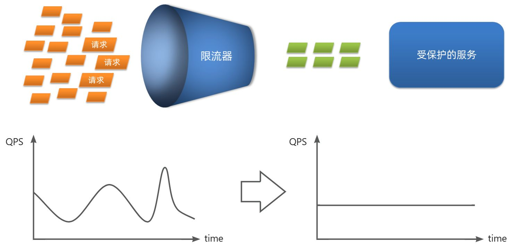
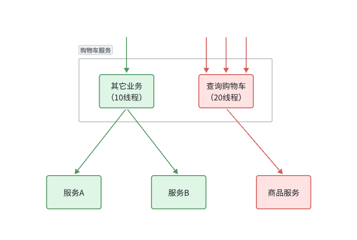
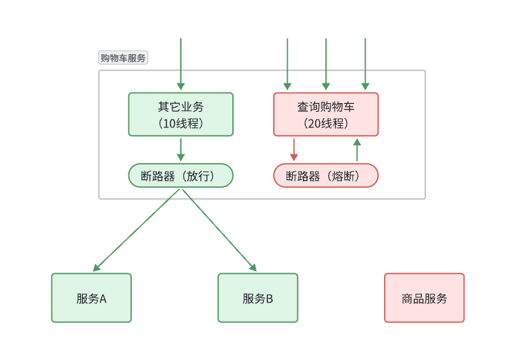

::: tip

1 服务保护方案

2 Sentinel

3 请求限流

4 线程隔离

5 服务熔断

:::

在微服务远程调用的过程中，还存在几个问题需要解决。

首先是**业务健壮性**问题：

例如在之前的查询购物车列表业务中，购物车服务需要查询最新的商品信息，与购物车数据做对比，提醒用户。大家设想一下，如果商品服务查询时发生故障，查询购物车列表在调用商品服 务时，是不是也会异常？从而导致购物车查询失败。但从业务角度来说，为了提升用户体验，即便是商品查询失败，购物车列表也应该正确展示出来，哪怕是不包含最新的商品信息。

还有**级联** **失败** 问题：

还是查询购物车的业务，假如商品服务业务并发较高，占用过多Tomcat连接。可能会导致商品服务的所有接口响应时间增加，延迟变高，甚至是长时间阻塞直至查询失败。

此时查询购物车业务需要查询并等待商品查询结果，从而导致查询购物车列表业务的响应时间也变长，甚至也阻塞直至无法访问。而此时如果查询购物车的请求较多，可能导致购物车服务的Tomcat连接占用较多，所有接口的响应时间都会增加，整个服务性能很差， 甚至不可用。

依次类推，整个微服务群中与购物车服务、商品服务等有调用关系的服务可能都会出现问题，最终导致整个集群不可用。

这就是**级联 ** **失败** 问题，或者叫**雪崩**问题。

还有跨服务的事务问题：

比如昨天讲到过的下单业务，下单的过程中需要调用多个微服务：

- 商品服务：扣减库存
- 订单服务：保存订单
- 购物车服务：清理购物车

这些业务全部都是数据库的写操作，我们必须确保所有操作的同时成功或失败。但是这些操作在不同微服务，也就是不同的Tomcat，这样的情况如何确保事务特性呢？

这些问题都会在今天找到答案。

今天的内容会分成几部分：

- 微服务保护
  - 服务保护方案
  - 请求限流
  - 隔离和熔断
- 分布式事务
  - 初识分布式事务
  - Seata

通过今天的学习，你将能掌握下面的能力：

- 知道雪崩问题产生原因及常见解决方案
- 能使用Sentinel实现服务保护
- 理解分布式事务产生的原因
- 能使用Seata解决分布式事务问题
- 理解AT模式基本原理

保证服务运行的健壮性，避免级联失败导致的雪崩问题，就属于微服务保护。这章我们就一起来学习一下微服务保护的常见方案以及对应的技术。

## 1 服务保护方案

微服务保护的方案有很多，比如：

- 请求限流
- 线程隔离
- 服务熔断

这些方案或多或少都会导致服务的体验上略有下降，比如请求限流，降低了并发上限；线程隔离，降低了可用资源数量；服务熔断，降低了服务的完整度，部分服务变的不可用或弱可用。因此这些方案都属于服务**降级**的方案。但通过这些方案，服务的健壮性得到了提升，

接下来，我们就逐一了解这些方案的原理。

### 1.1 请求限流

服务故障最重要原因，就是并发太高！解决了这个问题，就能避免大部分故障。当然，接口的并发不是一直很高，而是突发的。因此请求限流，就是**限制或控制**接口访问的并发流量，避免服务因流量激增而出现故障。

请求限流往往会有一个限流器，数量高低起伏的并发请求曲线，经过限流器就变的非常平稳。这就像是水电站的大坝，起到蓄水的作用，可以通过开关控制水流出的大小，让下游水流始终维持在一个平稳的量。

### 1.2 线程隔离

当一个业务接口响应时间长，而且并发高时，就可能耗尽服务器的线程资源，导致服务内的其它接口受到影响。所以我们必须把这种影响降低，或者缩减影响的范围。线程隔离正是解决这个问题的好办法。

线程隔离的思想来自轮船的舱壁模式：

轮船的船舱会被隔板分割为N个相互隔离的密闭舱，假如轮船触礁进水，只有损坏的部分密闭舱会进水，而其他舱由于相互隔离，并不会进水。这样就把进水控制在部分船体，避免了整个船舱进水而沉没。

为了避免某个接口故障或压力过大导致整个服务不可用，我们可以限定每个接口可以使用的资源范围，也就是将其“隔离”起来。

如图所示，我们给查询购物车业务限定可用线程数量上限为20，这样即便查询购物车的请求因为查询商品服务而出现故障，也不会导致服务器的线程资源被耗尽，不会影响到其它接口。

### 1.3 服务熔断

线程隔离虽然避免了雪崩问题，但故障服务（商品服务）依然会拖慢购物车服务（服务调用方）的接口响应速度。而且商品查询的故障依然会导致查询购物车功能出现故障，购物车业务也变的不可用了。

所以，我们要做两件事情：

- **编写服务降级逻辑**：就是服务调用失败后的处理逻辑，根据业务场景，可以抛出异常，也可以返回友好提示或默认数据。
- **异常统计和熔断**：统计服务提供方的异常比例，当比例过高表明该接口会影响到其它服务，应该拒绝调用该接口，而是直接走降级逻辑。

## 2 Sentinel

### 2.1 介绍和安装

### 2.2 微服务整合

## 3 请求限流

## 4 线程隔离

### 4.1 OpenFeign 整合 Sentinel

### 4.2 配置线程隔离

## 5 服务熔断

### 5.1 编写降级逻辑

### 5.2 服务熔断