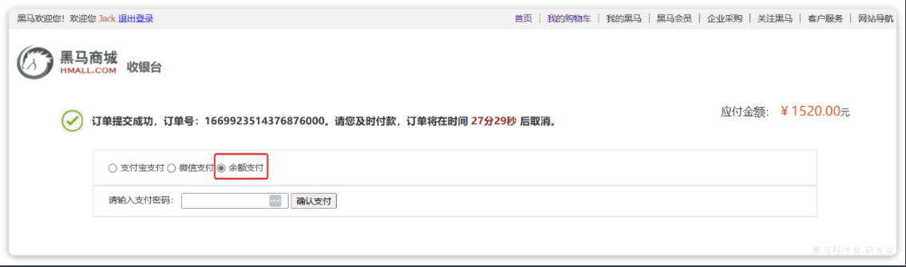
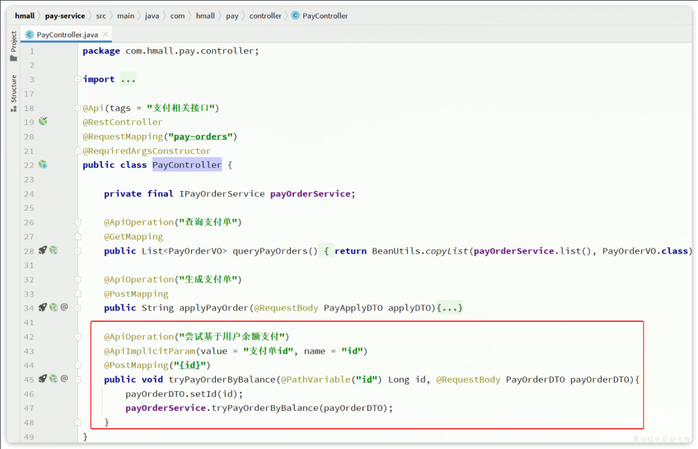

::: tip

1 编写降级逻辑

2 解决分布式事务

:::

## 1 编写降级逻辑

给黑马商城中现有的FeignClient都编写对应的降级逻辑，并且改造项目中每一个微服务，将OpenFeign与Sentinel整合。


## 2 解决分布式事务

除了下单业务以外，用户如果选择余额支付，前端会将请求发送到pay-service模块。而这个模块要做三件事情：

- 直接从user-service模块调用接口，扣除余额付款
- 更新本地（pay-service）交易流水表状态
- 通知交易服务（trade-service）更新其中的业务订单状态

流程如图：

暂时无法在飞书文档外展示此内容

显然，这里也存在分布式事务问题。

对应的页面如下：



当我们提交订单成功后，进入支付页面，选择余额支付，输入密码后点击确认支付即可。

前端会提交支付请求，业务接口的入口在`com.hmall.pay.controller.PayController`类的`tryPayOrderByBalance`方法：



对应的service方法如下：

```java
@Override
@Transactional
public void tryPayOrderByBalance(PayOrderDTO payOrderDTO) {
    // 1.查询支付单
    PayOrder po = getById(payOrderDTO.getId());
    // 2.判断状态
    if(!PayStatus.WAIT_BUYER_PAY.equalsValue(po.getStatus())){
        // 订单不是未支付，状态异常
        throw new BizIllegalException("交易已支付或关闭！");
    }
    // 3.尝试扣减余额
    userClient.deductMoney(payOrderDTO.getPw(), po.getAmount());
    // 4.修改支付单状态
    boolean success = markPayOrderSuccess(payOrderDTO.getId(), LocalDateTime.now());
    if (!success) {
        throw new BizIllegalException("交易已支付或关闭！");
    }
    // 5.修改订单状态
    tradeClient.markOrderPaySuccess(po.getBizOrderNo());
}
```

利用seata解决这里的分布式事务问题，并思考这个业务实现有没有什么值得改进的地方

