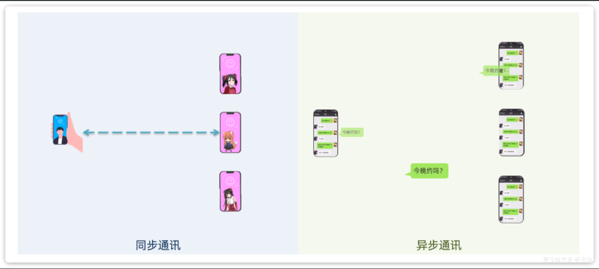
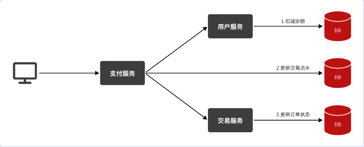
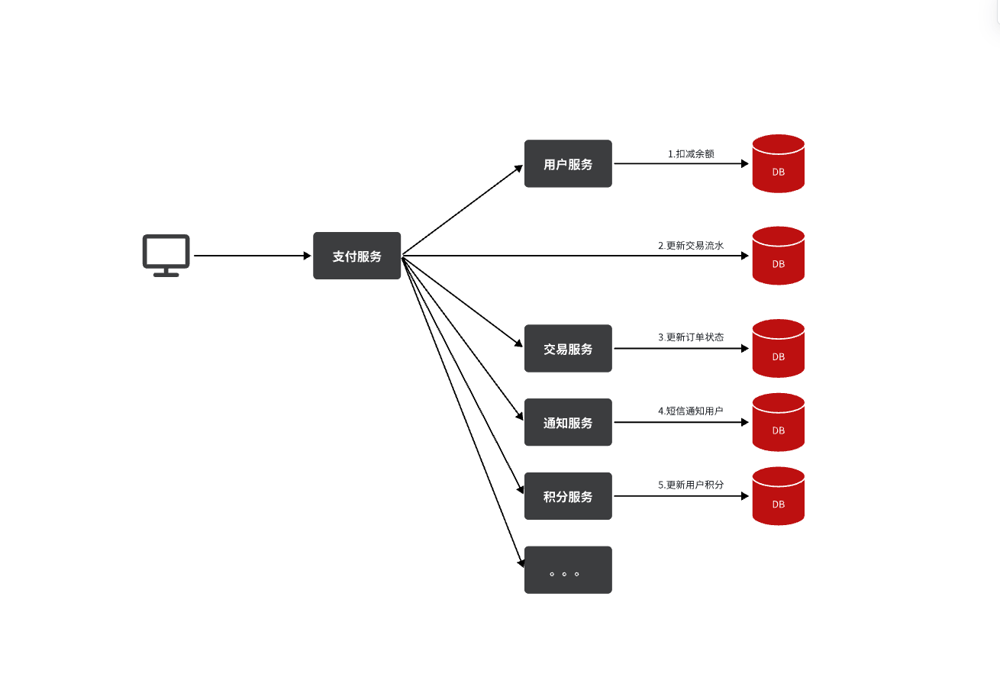
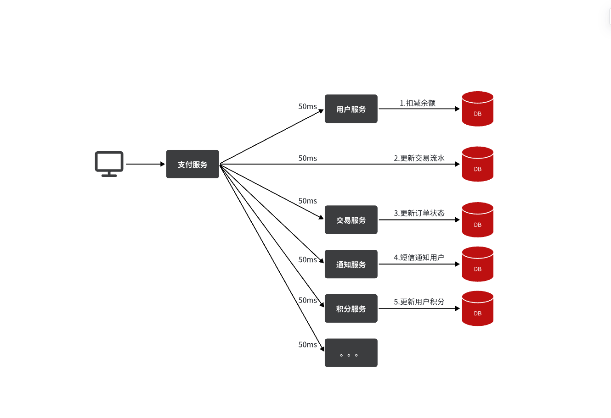
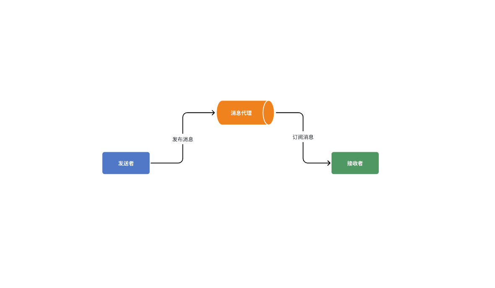
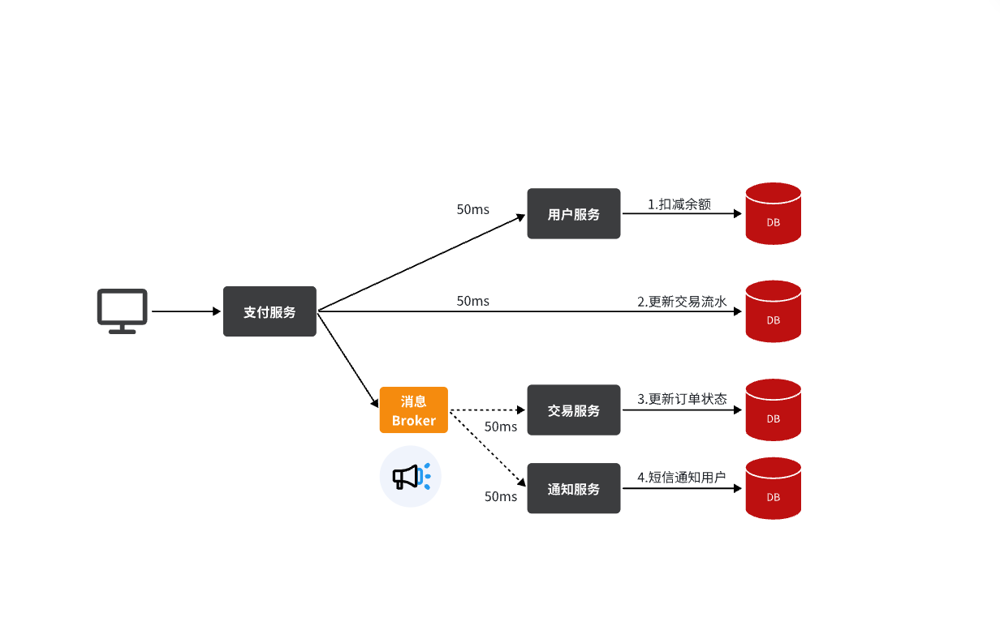
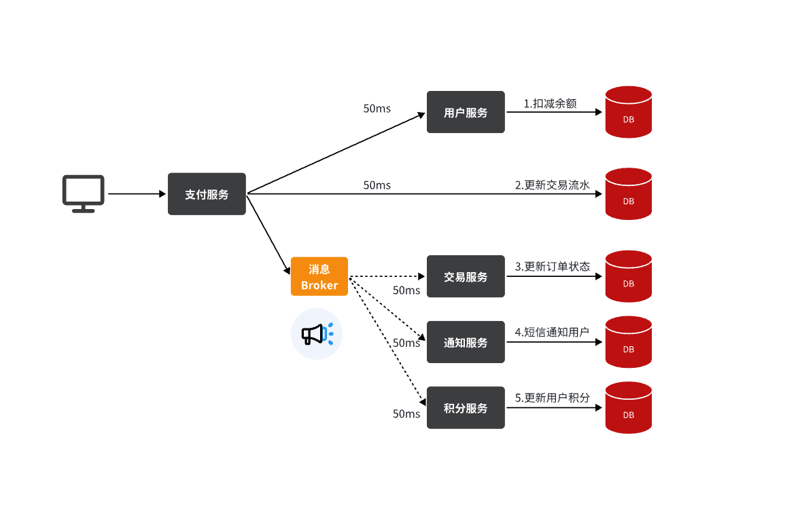
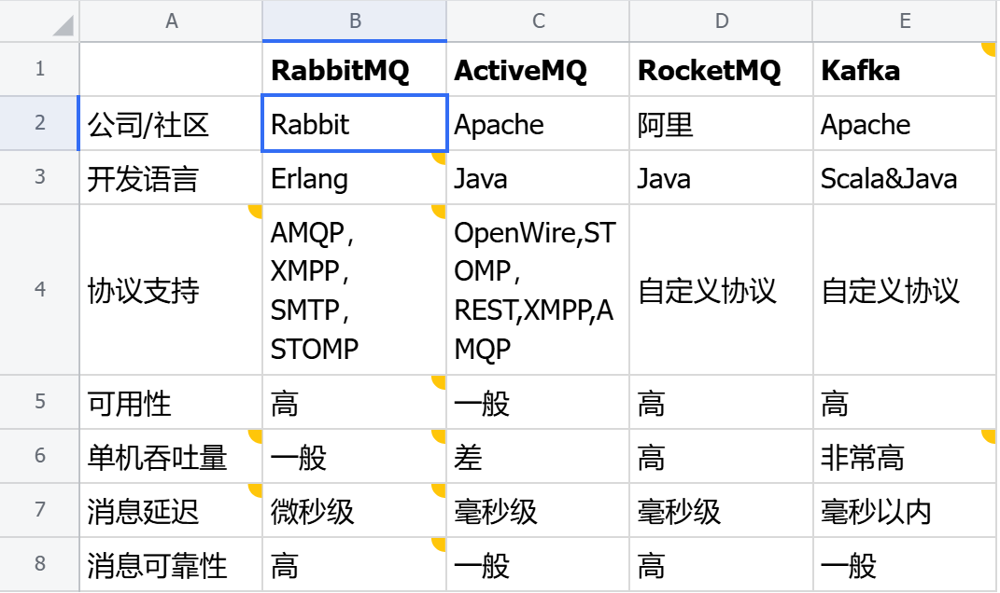

::: tip

1 同步调用

2 异步调用

3 技术选型

:::

微服务一旦拆分，必然涉及到服务之间的相互调用，目前我们服务之间调用采用的都是基于OpenFeign的调用。这种调用中，调用者发起请求后需要**等待**服务提供者执行业务返回结果后，才能继续执行后面的业务。也就是说调用者在调用过程中处于阻塞状态，因此我们称这种调用方式为**同步调用**，也可以叫**同步通****讯**。但在很多场景下，我们可能需要采用**异步通讯**的方式，为什么呢？

我们先来看看什么是同步通讯和异步通讯。如图：

解读：

- 同步通讯：就如同打视频电话，双方的交互都是实时的。因此同一时刻你只能跟一个人打视频电话。
- 异步通讯：就如同发微信聊天，双方的交互不是实时的，你不需要立刻给对方回应。因此你可以多线操作，同时跟多人聊天。

两种方式各有优劣，打电话可以立即得到响应，但是你却不能跟多个人同时通话。发微信可以同时与多个人收发微信，但是往往响应会有延迟。

所以，如果我们的业务需要实时得到服务提供方的响应，则应该选择同步通讯（同步调用）。而如果我们追求更高的效率，并且不需要实时响应，则应该选择异步通讯（异步调用）。 

同步调用的方式我们已经学过了，之前的OpenFeign调用就是。但是：

- 异步调用又该如何实现？
- 哪些业务适合用异步调用来实现呢？

通过今天的学习你就能明白这些问题了。

## 1 同步调用

之前说过，我们现在基于OpenFeign的调用都属于是同步调用，那么这种方式存在哪些问题呢？

举个例子，我们以昨天留给大家作为作业的**余额支付功能**为例来分析，首先看下整个流程：

目前我们采用的是基于OpenFeign的同步调用，也就是说业务执行流程是这样的：

- 支付服务需要先调用用户服务完成余额扣减
- 然后支付服务自己要更新支付流水单的状态
- 然后支付服务调用交易服务，更新业务订单状态为已支付

三个步骤依次执行。

这其中就存在3个问题：

**第一**，**拓展性差**

我们目前的业务相对简单，但是随着业务规模扩大，产品的功能也在不断完善。

在大多数电商业务中，用户支付成功后都会以短信或者其它方式通知用户，告知支付成功。假如后期产品经理提出这样新的需求，你怎么办？是不是要在上述业务中再加入通知用户的业务？

某些电商项目中，还会有积分或金币的概念。假如产品经理提出需求，用户支付成功后，给用户以积分奖励或者返还金币，你怎么办？是不是要在上述业务中再加入积分业务、返还金币业务？

最终你的支付业务会越来越臃肿：

也就是说每次有新的需求，现有支付逻辑都要跟着变化，代码经常变动，不符合开闭原则，拓展性不好。

**第二**，**性能下降**

由于我们采用了同步调用，调用者需要等待服务提供者执行完返回结果后，才能继续向下执行，也就是说每次远程调用，调用者都是阻塞等待状态。最终整个业务的响应时长就是每次远程调用的执行时长之和：

假如每个微服务的执行时长都是50ms，则最终整个业务的耗时可能高达300ms，性能太差了。

**第三，级联失败**

由于我们是基于OpenFeign调用交易服务、通知服务。当交易服务、通知服务出现故障时，整个事务都会回滚，交易失败。

这其实就是同步调用的**级联失败**问题。

但是大家思考一下，我们假设用户余额充足，扣款已经成功，此时我们应该确保支付流水单更新为已支付，确保交易成功。毕竟收到手里的钱没道理再退回去吧。

因此，这里不能因为短信通知、更新订单状态失败而回滚整个事务。

综上，同步调用的方式存在下列问题：

- 拓展性差
- 性能下降
- 级联失败

而要解决这些问题，我们就必须用**异步调用**的方式来代替**同步调用**。

## 2 异步调用

异步调用方式其实就是基于消息通知的方式，一般包含三个角色：

- 消息发送者：投递消息的人，就是原来的调用方
- 消息Broker：管理、暂存、转发消息，你可以把它理解成微信服务器
- 消息接收者：接收和处理消息的人，就是原来的服务提供方

在异步调用中，发送者不再直接同步调用接收者的业务接口，而是发送一条消息投递给消息Broker。然后接收者根据自己的需求从消息Broker那里订阅消息。每当发送方发送消息后，接受者都能获取消息并处理。

这样，发送消息的人和接收消息的人就完全解耦了。

还是以余额支付业务为例：

除了扣减余额、更新支付流水单状态以外，其它调用逻辑全部取消。而是改为发送一条消息到Broker。而相关的微服务都可以订阅消息通知，一旦消息到达Broker，则会分发给每一个订阅了的微服务，处理各自的业务。

假如产品经理提出了新的需求，比如要在支付成功后更新用户积分。支付代码完全不用变更，而仅仅是让积分服务也订阅消息即可：

不管后期增加了多少消息订阅者，作为支付服务来讲，执行问扣减余额、更新支付流水状态后，发送消息即可。业务耗时仅仅是这三部分业务耗时，仅仅100ms，大大提高了业务性能。

另外，不管是交易服务、通知服务，还是积分服务，他们的业务与支付关联度低。现在采用了异步调用，解除了耦合，他们即便执行过程中出现了故障，也不会影响到支付服务。

综上，异步调用的优势包括：

- 耦合度更低
- 性能更好
- 业务拓展性强
- 故障隔离，避免级联失败

当然，异步通信也并非完美无缺，它存在下列缺点：

- 完全依赖于Broker的可靠性、安全性和性能
- 架构复杂，后期维护和调试麻烦

## 3 技术选型

消息Broker，目前常见的实现方案就是消息队列（MessageQueue），简称为MQ.

目比较常见的MQ实现：

- ActiveMQ
- RabbitMQ
- RocketMQ
- Kafka

几种常见MQ的对比：

追求可用性：Kafka、 RocketMQ 、RabbitMQ

追求可靠性：RabbitMQ、RocketMQ

追求吞吐能力：RocketMQ、Kafka

追求消息低延迟：RabbitMQ、Kafka

据统计，目前国内消息队列使用最多的还是RabbitMQ，再加上其各方面都比较均衡，稳定性也好，因此我们课堂上选择RabbitMQ来学习。