::: tip

1 安装

2 收发消息

3 数据隔离

:::

RabbitMQ是基于Erlang语言开发的开源消息通信中间件，官网地址：

https://www.rabbitmq.com/

接下来，我们就学习它的基本概念和基础用法。


## 1 安装

我们同样基于Docker来安装RabbitMQ，使用下面的命令即可：

```Shell
docker run \
 -e RABBITMQ_DEFAULT_USER=itheima \
 -e RABBITMQ_DEFAULT_PASS=123321 \
 -v mq-plugins:/plugins \
 --name mq \
 --hostname mq \
 -p 15672:15672 \
 -p 5672:5672 \
 --network hm-net\
 -d \
 rabbitmq:3.8-management
```

如果拉取镜像困难的话，可以使用课前资料给大家准备的镜像，利用docker load命令加载：

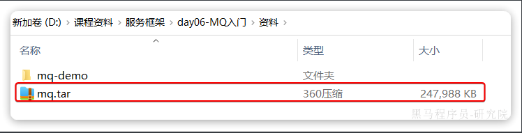

可以看到在安装命令中有两个映射的端口：

- 15672：RabbitMQ提供的管理控制台的端口
- 5672：RabbitMQ的消息发送处理接口

安装完成后，我们访问 http://192.168.150.101:15672即可看到管理控制台。首次访问需要登录，默认的用户名和密码在配置文件中已经指定了。

登录后即可看到管理控制台总览页面：

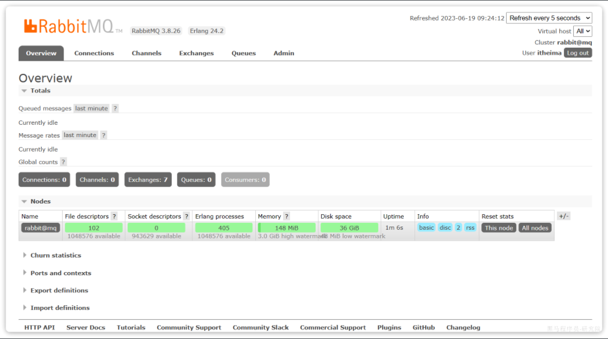

RabbitMQ对应的架构如图：

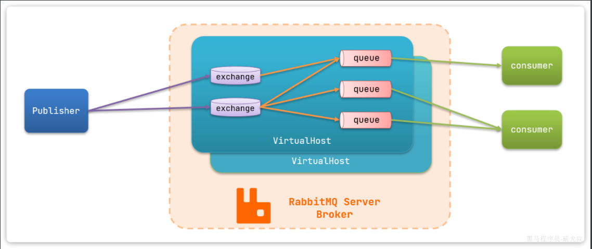

其中包含几个概念：

- **`publisher`**：生产者，也就是发送消息的一方
- **`consumer`**：消费者，也就是消费消息的一方
- **`queue`**：队列，存储消息。生产者投递的消息会暂存在消息队列中，等待消费者处理
- **`exchange`**：交换机，负责消息路由。生产者发送的消息由交换机决定投递到哪个队列。
- **`virtual host`**：虚拟主机，起到数据隔离的作用。每个虚拟主机相互独立，有各自的exchange、queue

上述这些东西都可以在RabbitMQ的管理控制台来管理，下一节我们就一起来学习控制台的使用。


## 2 收发消息

### 2.1 交换机

我们打开Exchanges选项卡，可以看到已经存在很多交换机：

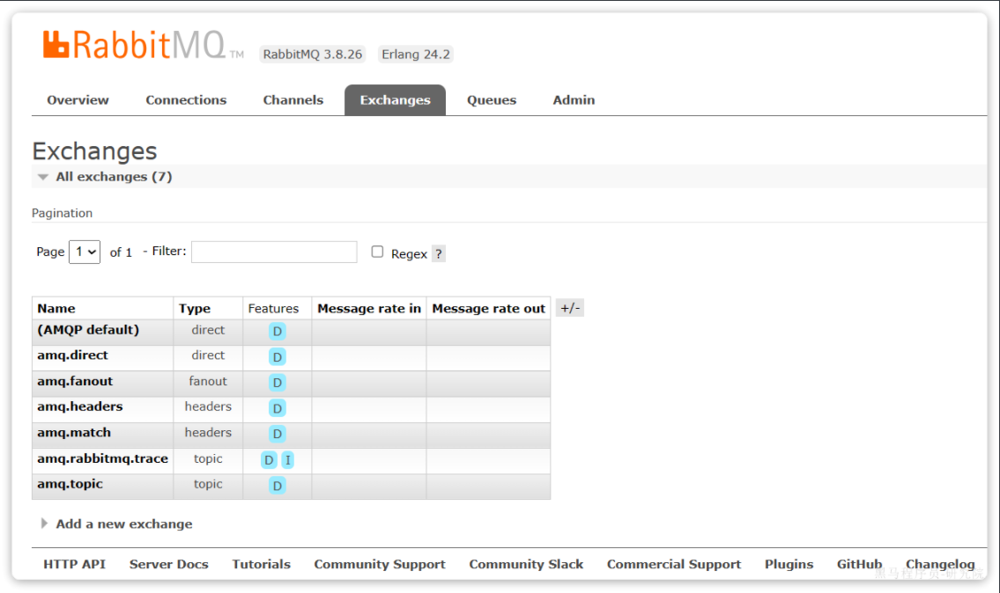

我们点击任意交换机，即可进入交换机详情页面。仍然会利用控制台中的publish message 发送一条消息：

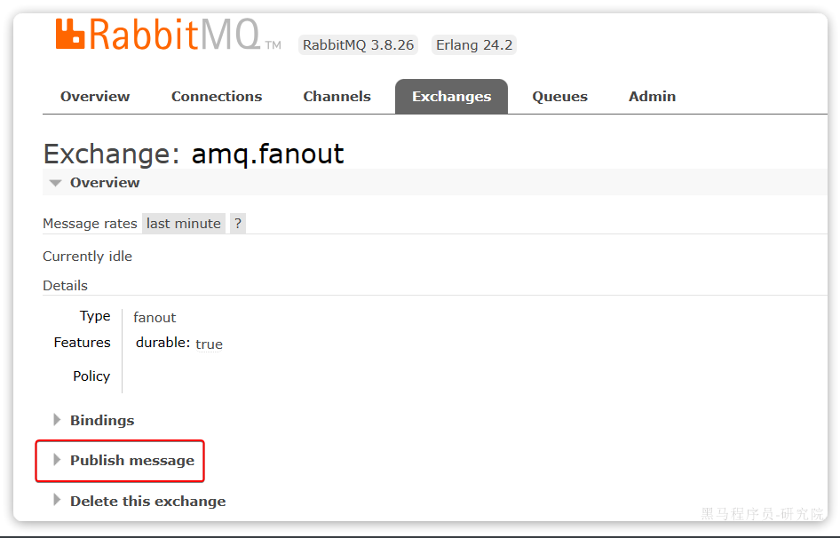

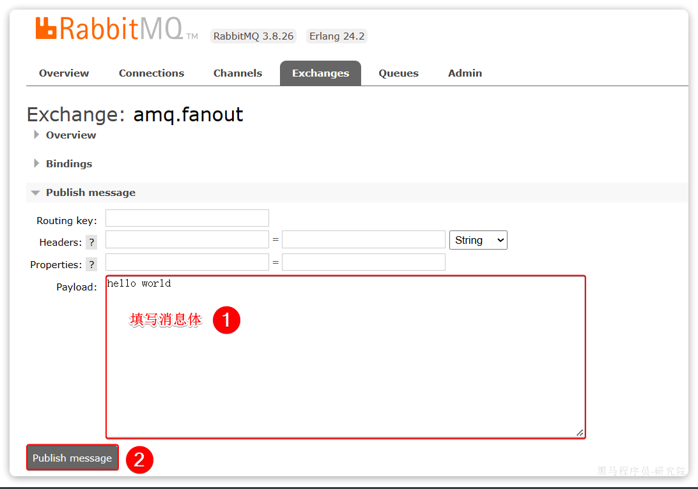

这里是由控制台模拟了生产者发送的消息。由于没有消费者存在，最终消息丢失了，这样说明交换机没有存储消息的能力。


### 2.2 队列

我们打开`Queues`选项卡，新建一个队列：

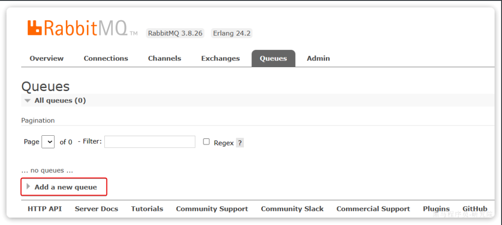

命名为`hello.queue1`：

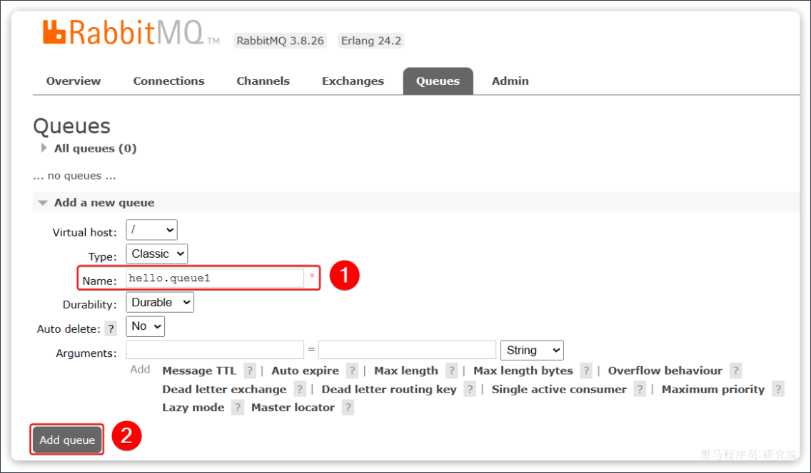

再以相同的方式，创建一个队列，密码为`hello.queue2`，最终队列列表如下：

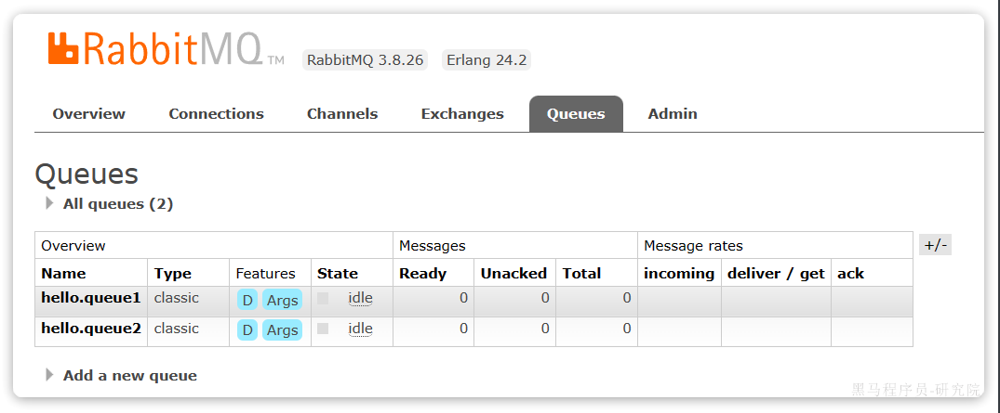

此时，我们再次向`amq.fanout`交换机发送一条消息。会发现消息依然没有到达队列！！

怎么回事呢？

发送到交换机的消息，只会路由到与其绑定的队列，因此仅仅创建队列是不够的，我们还需要将其与交换机绑定。


### 2.3 绑定关系

点击`Exchanges`选项卡，点击`amq.fanout`交换机，进入交换机详情页，然后点击`Bindings`菜单，在表单中填写要绑定的队列名称：

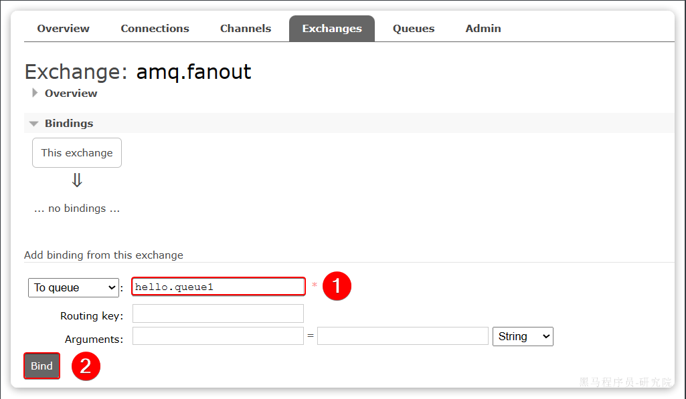

相同的方式，将hello.queue2也绑定到改交换机。

最终，绑定结果如下：

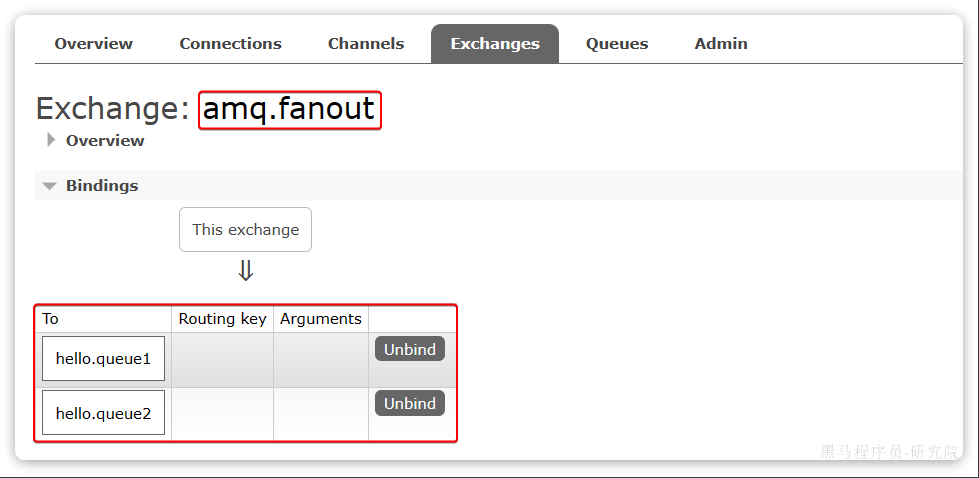


### 2.4 发送消息

再次回到exchange页面，找到刚刚绑定的`amq.fanout`，点击进入详情页，再次发送一条消息：

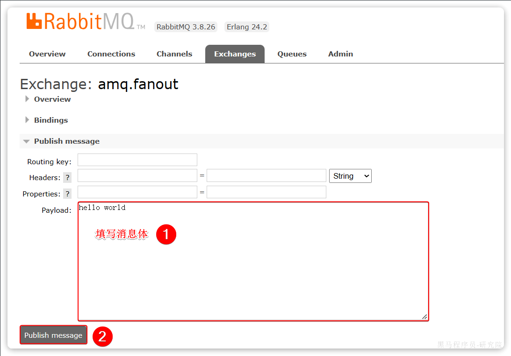

回到`Queues`页面，可以发现`hello.queue`中已经有一条消息了：

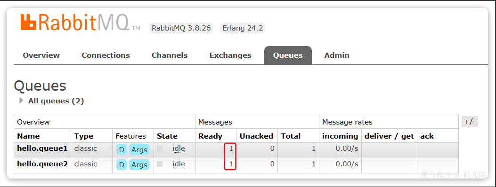

点击队列名称，进入详情页，查看队列详情，这次我们点击get message：

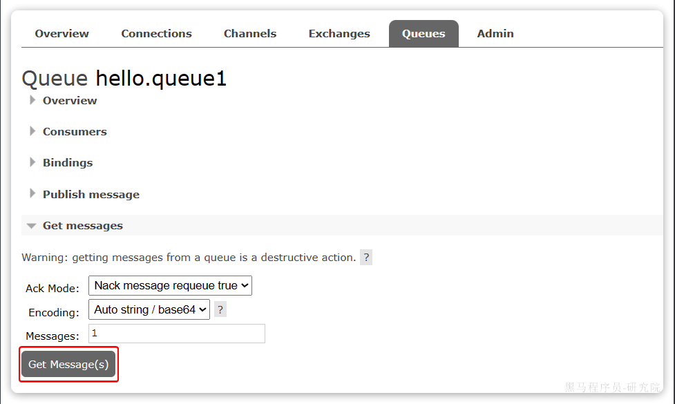

可以看到消息到达队列了：

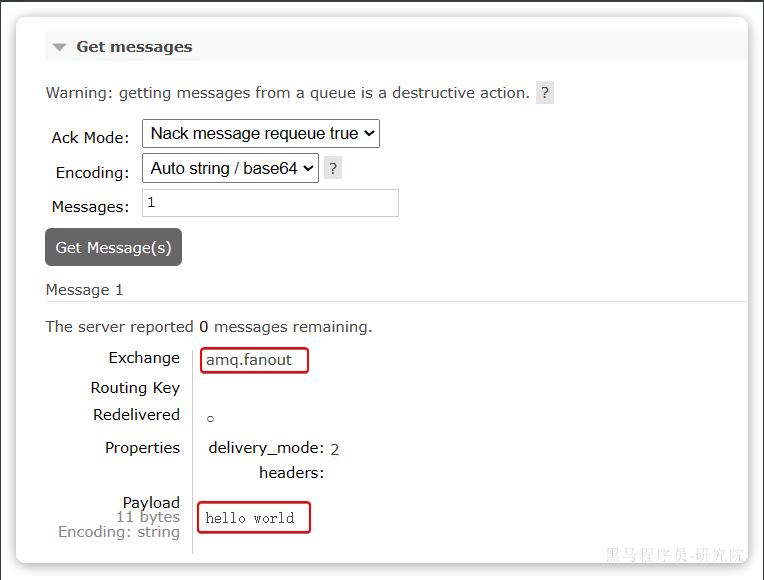

这个时候如果有消费者监听了MQ的`hello.queue1`或`hello.queue2`队列，自然就能接收到消息了。


## 3 数据隔离

### 3.1 用户管理

点击`Admin`选项卡，首先会看到RabbitMQ控制台的用户管理界面：

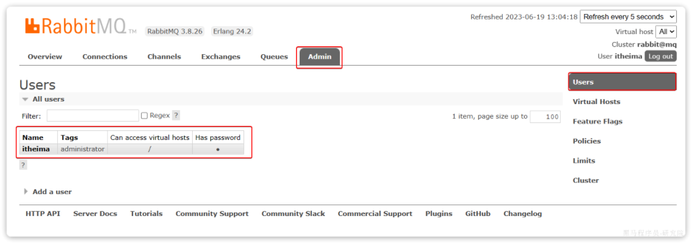

这里的用户都是RabbitMQ的管理或运维人员。目前只有安装RabbitMQ时添加的`itheima`这个用户。仔细观察用户表格中的字段，如下：

- `Name`：`itheima`，也就是用户名
- `Tags`：`administrator`，说明`itheima`用户是超级管理员，拥有所有权限
- `Can access virtual host`： `/`，可以访问的`virtual host`，这里的`/`是默认的`virtual host`

对于小型企业而言，出于成本考虑，我们通常只会搭建一套MQ集群，公司内的多个不同项目同时使用。这个时候为了避免互相干扰， 我们会利用`virtual host`的隔离特性，将不同项目隔离。一般会做两件事情：

- 给每个项目创建独立的运维账号，将管理权限分离。
- 给每个项目创建不同的`virtual host`，将每个项目的数据隔离。

比如，我们给黑马商城创建一个新的用户，命名为`hmall`：

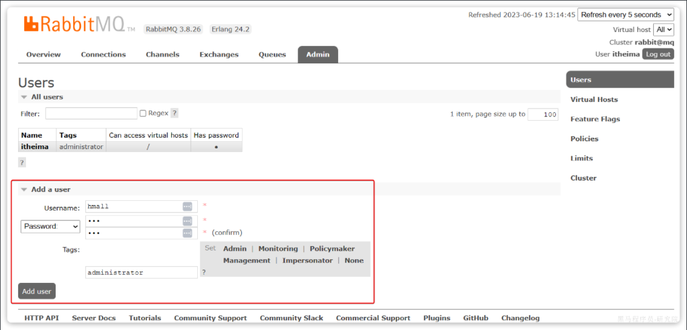

你会发现此时hmall用户没有任何`virtual host`的访问权限：

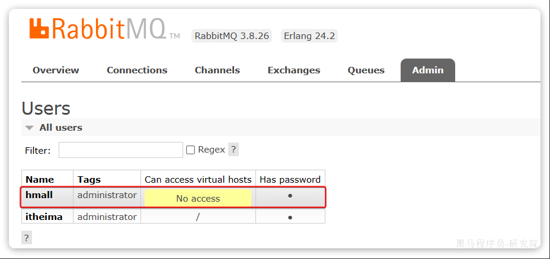

别急，接下来我们就来授权。


### 3.2 virtual host

我们先退出登录：

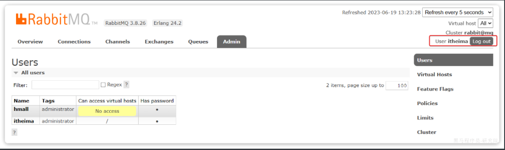

切换到刚刚创建的hmall用户登录，然后点击`Virtual Hosts`菜单，进入`virtual host`管理页：

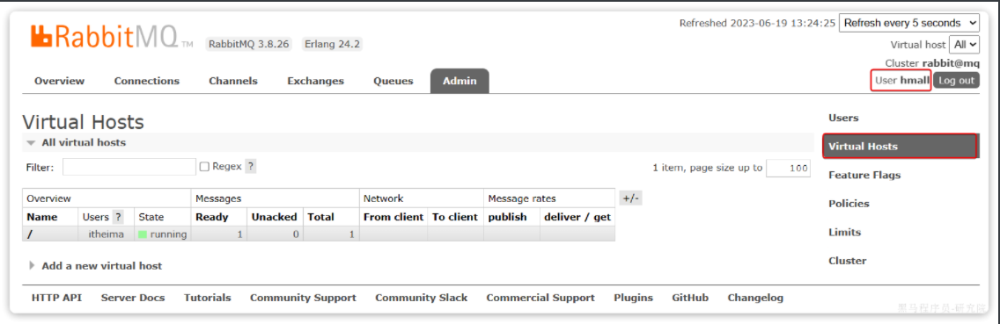

可以看到目前只有一个默认的`virtual host`，名字为 `/`。

 我们可以给黑马商城项目创建一个单独的`virtual host`，而不是使用默认的`/`。

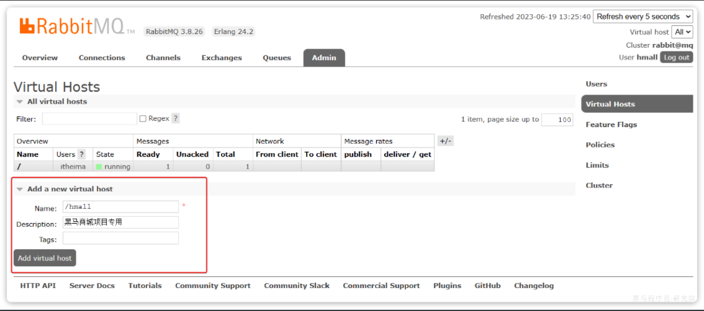

创建完成后如图：

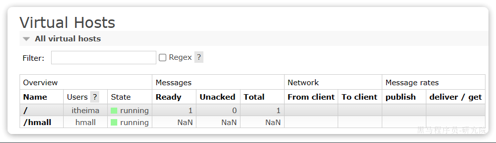

由于我们是登录`hmall`账户后创建的`virtual host`，因此回到`users`菜单，你会发现当前用户已经具备了对`/hmall`这个`virtual host`的访问权限了：

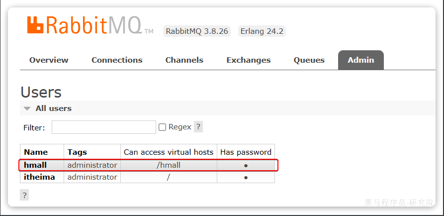

此时，点击页面右上角的`virtual host`下拉菜单，切换`virtual host`为 `/hmall`：

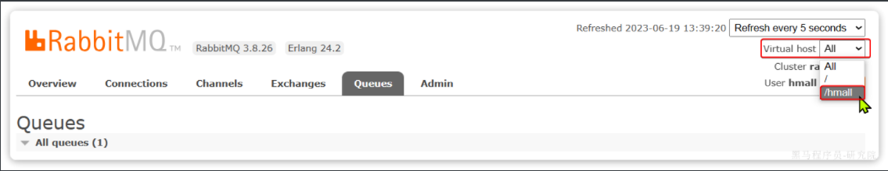

然后再次查看queues选项卡，会发现之前的队列已经看不到了：

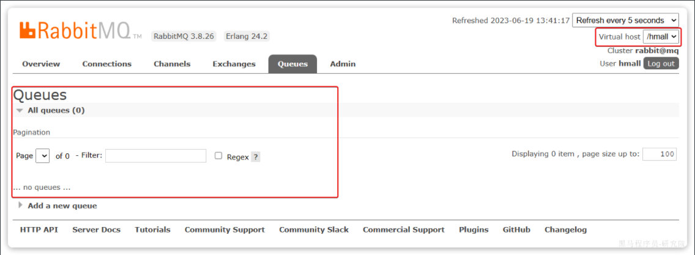

这就是基于`virtual host `的隔离效果。