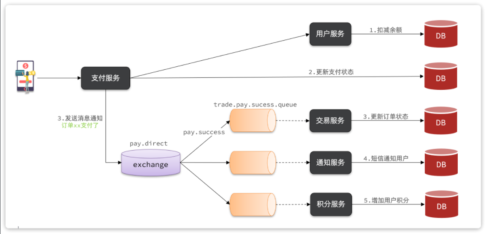
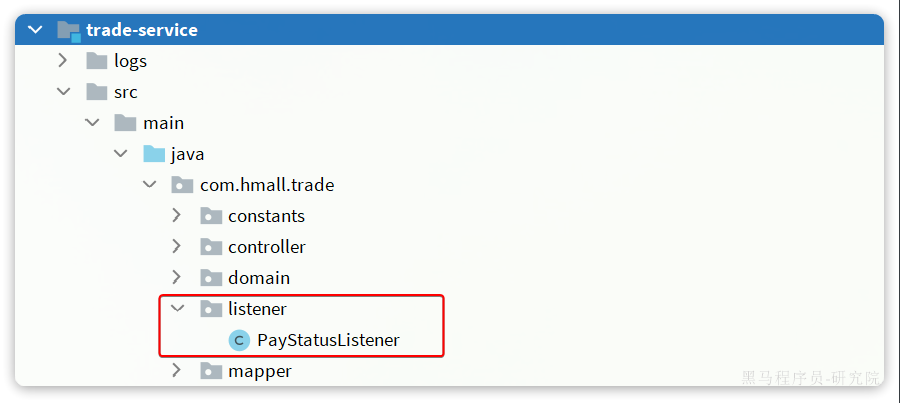

:: tip

1 配置 MQ

2 接收消息

3 发送消息

:::

案例需求：改造余额支付功能，将支付成功后基于OpenFeign的交易服务的更新订单状态接口的同步调用，改为基于RabbitMQ的异步通知。

如图：



说明：目前没有通知服务和积分服务，因此我们只关注交易服务，步骤如下：

- 定义`direct`类型交换机，命名为`pay.direct`
- 定义消息队列，命名为`trade.pay.success.queue`
- 将`trade.pay.success.queue`与`pay.direct`绑定，`BindingKey`为`pay.success`
- 支付成功时不再调用交易服务更新订单状态的接口，而是发送一条消息到`pay.direct`，发送消息的`RoutingKey`  为`pay.success`，消息内容是订单id
- 交易服务监听`trade.pay.success.queue`队列，接收到消息后更新订单状态为已支付


## 1 配置 MQ

不管是生产者还是消费者，都需要配置MQ的基本信息。分为两步：

1）添加依赖：

```xml
  <!--消息发送-->
  <dependency>
      <groupId>org.springframework.boot</groupId>
      <artifactId>spring-boot-starter-amqp</artifactId>
  </dependency>
```

2）配置MQ地址：

```yaml
spring:
  rabbitmq:
    host: 192.168.150.101 # 你的虚拟机IP
    port: 5672 # 端口
    virtual-host: /hmall # 虚拟主机
    username: hmall # 用户名
    password: 123 # 密码
```


## 2 接收消息

在trade-service服务中定义一个消息监听类：



其代码如下：

```java
package com.hmall.trade.listener;

import com.hmall.trade.service.IOrderService;
import lombok.RequiredArgsConstructor;
import org.springframework.amqp.core.ExchangeTypes;
import org.springframework.amqp.rabbit.annotation.Exchange;
import org.springframework.amqp.rabbit.annotation.Queue;
import org.springframework.amqp.rabbit.annotation.QueueBinding;
import org.springframework.amqp.rabbit.annotation.RabbitListener;
import org.springframework.stereotype.Component;

@Component
@RequiredArgsConstructor
public class PayStatusListener {

    private final IOrderService orderService;

    @RabbitListener(bindings = @QueueBinding(
            value = @Queue(name = "trade.pay.success.queue", durable = "true"),
            exchange = @Exchange(name = "pay.topic"),
            key = "pay.success"
    ))
    public void listenPaySuccess(Long orderId){
        orderService.markOrderPaySuccess(orderId);
    }
}
```


## 3 发送消息

修改`pay-service`服务下的`com.hmall.pay.``service``.impl.``PayOrderServiceImpl`类中的`tryPayOrderByBalance`方法：

```java
private final RabbitTemplate rabbitTemplate;

@Override
@Transactional
public void tryPayOrderByBalance(PayOrderDTO payOrderDTO) {
    // 1.查询支付单
    PayOrder po = getById(payOrderDTO.getId());
    // 2.判断状态
    if(!PayStatus.WAIT_BUYER_PAY.equalsValue(po.getStatus())){
        // 订单不是未支付，状态异常
        throw new BizIllegalException("交易已支付或关闭！");
    }
    // 3.尝试扣减余额
    userClient.deductMoney(payOrderDTO.getPw(), po.getAmount());
    // 4.修改支付单状态
    boolean success = markPayOrderSuccess(payOrderDTO.getId(), LocalDateTime.now());
    if (!success) {
        throw new BizIllegalException("交易已支付或关闭！");
    }
    // 5.修改订单状态
    // tradeClient.markOrderPaySuccess(po.getBizOrderNo());
    try {
        rabbitTemplate.convertAndSend("pay.direct", "pay.success", po.getBizOrderNo());
    } catch (Exception e) {
        log.error("支付成功的消息发送失败，支付单id：{}， 交易单id：{}", po.getId(), po.getBizOrderNo(), e);
    }
}
```