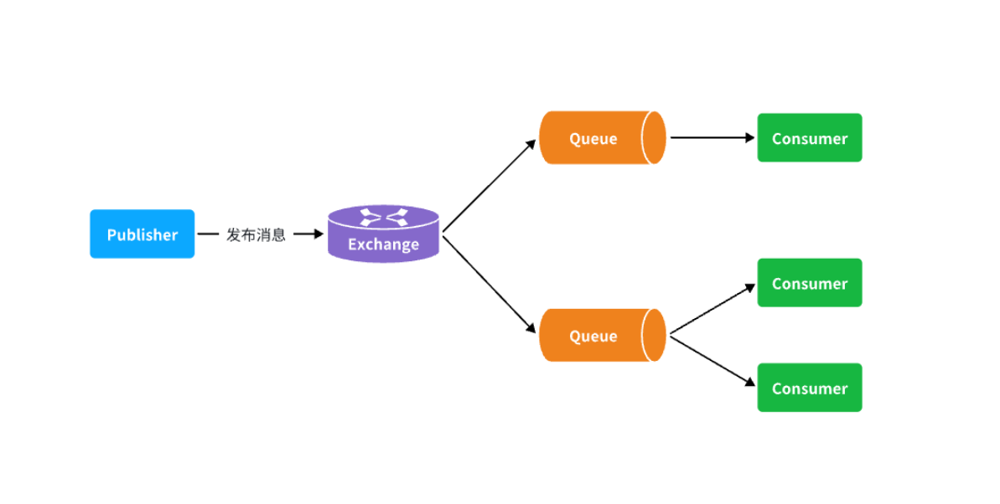

::: tip

1 生产者重试机制

2 生产者确认机制

3 实现生产者确认

:::

在昨天的练习作业中，我们改造了余额支付功能，在支付成功后利用RabbitMQ通知交易服务，更新业务订单状态为已支付。

但是大家思考一下，如果这里MQ通知失败，支付服务中支付流水显示支付成功，而交易服务中的订单状态却显示未支付，数据出现了不一致。

此时前端发送请求查询支付状态时，肯定是查询交易服务状态，会发现业务订单未支付，而用户自己知道已经支付成功，这就导致用户体验不一致。

因此，这里我们必须尽可能确保MQ消息的可靠性，即：消息应该至少被消费者处理1次

那么问题来了：

- **我们该如何确保MQ消息的可靠性？**
- **如果真的发送失败，有没有其它的兜底方案？**

这些问题，在今天的学习中都会找到答案。

首先，我们一起分析一下消息丢失的可能性有哪些。

消息从发送者发送消息，到消费者处理消息，需要经过的流程是这样的：



消息从生产者到消费者的每一步都可能导致消息丢失：

- 发送消息时丢失：
  - 生产者发送消息时连接MQ失败
  - 生产者发送消息到达MQ后未找到`Exchange`
  - 生产者发送消息到达MQ的`Exchange`后，未找到合适的`Queue`
  - 消息到达MQ后，处理消息的进程发生异常
- MQ导致消息丢失：
  - 消息到达MQ，保存到队列后，尚未消费就突然宕机
- 消费者处理消息时：
  - 消息接收后尚未处理突然宕机
  - 消息接收后处理过程中抛出异常

综上，我们要解决消息丢失问题，保证MQ的可靠性，就必须从3个方面入手：

- 确保生产者一定把消息发送到MQ
- 确保MQ不会将消息弄丢
- 确保消费者一定要处理消息

这一章我们先来看如何确保生产者一定能把消息发送到MQ。


## 1 生产者重试机制

首先第一种情况，就是生产者发送消息时，出现了网络故障，导致与MQ的连接中断。

为了解决这个问题，SpringAMQP提供的消息发送时的重试机制。即：当`RabbitTemplate`与MQ连接超时后，多次重试。

修改`publisher`模块的`application.yaml`文件，添加下面的内容：

```yaml
spring:
  rabbitmq:
    connection-timeout: 1s # 设置MQ的连接超时时间
    template:
      retry:
        enabled: true # 开启超时重试机制
        initial-interval: 1000ms # 失败后的初始等待时间
        multiplier: 1 # 失败后下次的等待时长倍数，下次等待时长 = initial-interval * multiplier
        max-attempts: 3 # 最大重试次数
```

我们利用命令停掉RabbitMQ服务：

```shell
docker stop mq
```

然后测试发送一条消息，会发现会每隔1秒重试1次，总共重试了3次。消息发送的超时重试机制配置成功了！

**注意**：当网络不稳定的时候，利用重试机制可以有效提高消息发送的成功率。不过SpringAMQP提供的重试机制是**阻塞式**的重试，也就是说多次重试等待的过程中，当前线程是被阻塞的。

如果对于业务性能有要求，建议禁用重试机制。如果一定要使用，请合理配置等待时长和重试次数，当然也可以考虑使用异步线程来执行发送消息的代码。


## 2 生产者确认机制

一般情况下，只要生产者与MQ之间的网路连接顺畅，基本不会出现发送消息丢失的情况，因此大多数情况下我们无需考虑这种问题。

不过，在少数情况下，也会出现消息发送到MQ之后丢失的现象，比如：

- MQ内部处理消息的进程发生了异常
- 生产者发送消息到达MQ后未找到`Exchange`
- 生产者发送消息到达MQ的`Exchange`后，未找到合适的`Queue`，因此无法路由

针对上述情况，RabbitMQ提供了生产者消息确认机制，包括`Publisher Confirm`和`Publisher Return`两种。在开启确认机制的情况下，当生产者发送消息给MQ后，MQ会根据消息处理的情况返回不同的**回执**。

具体如图所示：


总结如下：

- 当消息投递到MQ，但是路由失败时，通过**Publisher Return**返回异常信息，同时返回ack的确认信息，代表投递成功
- 临时消息投递到了MQ，并且入队成功，返回ACK，告知投递成功
- 持久消息投递到了MQ，并且入队完成持久化，返回ACK ，告知投递成功
- 其它情况都会返回NACK，告知投递失败

其中`ack`和`nack`属于**Publisher Confirm**机制，`ack`是投递成功；`nack`是投递失败。而`return`则属于**Publisher Return**机制。

默认两种机制都是关闭状态，需要通过配置文件来开启。


## 3 实现生产者确认

### 3.1.开启生产者确认

在publisher模块的`application.yaml`中添加配置：

```yaml
spring:
  rabbitmq:
    publisher-confirm-type: correlated # 开启publisher confirm机制，并设置confirm类型
    publisher-returns: true # 开启publisher return机制
```

这里`publisher-confirm-type`有三种模式可选：

- `none`：关闭confirm机制
- `simple`：同步阻塞等待MQ的回执
- `correlated`：MQ异步回调返回回执

一般我们推荐使用`correlated`，回调机制。


### 3.2.定义ReturnCallback

每个`RabbitTemplate`只能配置一个`ReturnCallback`，因此我们可以在配置类中统一设置。我们在publisher模块定义一个配置类：


内容如下：

```java
package com.itheima.publisher.config;

import lombok.AllArgsConstructor;
import lombok.extern.slf4j.Slf4j;
import org.springframework.amqp.core.ReturnedMessage;
import org.springframework.amqp.rabbit.core.RabbitTemplate;
import org.springframework.context.annotation.Configuration;

import javax.annotation.PostConstruct;

@Slf4j
@AllArgsConstructor
@Configuration
public class MqConfig {
    private final RabbitTemplate rabbitTemplate;

    @PostConstruct
    public void init(){
        rabbitTemplate.setReturnsCallback(new RabbitTemplate.ReturnsCallback() {
            @Override
            public void returnedMessage(ReturnedMessage returned) {
                log.error("触发return callback,");
                log.debug("exchange: {}", returned.getExchange());
                log.debug("routingKey: {}", returned.getRoutingKey());
                log.debug("message: {}", returned.getMessage());
                log.debug("replyCode: {}", returned.getReplyCode());
                log.debug("replyText: {}", returned.getReplyText());
            }
        });
    }
}
```


### 3.3.定义ConfirmCallback

由于每个消息发送时的处理逻辑不一定相同，因此ConfirmCallback需要在每次发消息时定义。具体来说，是在调用RabbitTemplate中的convertAndSend方法时，多传递一个参数：


这里的CorrelationData中包含两个核心的东西：

- `id`：消息的唯一标示，MQ对不同的消息的回执以此做判断，避免混淆
- `SettableListenableFuture`：回执结果的Future对象

将来MQ的回执就会通过这个`Future`来返回，我们可以提前给`CorrelationData`中的`Future`添加回调函数来处理消息回执：


我们新建一个测试，向系统自带的交换机发送消息，并且添加`ConfirmCallback`：

```java
@Test
void testPublisherConfirm() {
    // 1.创建CorrelationData
    CorrelationData cd = new CorrelationData();
    // 2.给Future添加ConfirmCallback
    cd.getFuture().addCallback(new ListenableFutureCallback<CorrelationData.Confirm>() {
        @Override
        public void onFailure(Throwable ex) {
            // 2.1.Future发生异常时的处理逻辑，基本不会触发
            log.error("send message fail", ex);
        }
        @Override
        public void onSuccess(CorrelationData.Confirm result) {
            // 2.2.Future接收到回执的处理逻辑，参数中的result就是回执内容
            if(result.isAck()){ // result.isAck()，boolean类型，true代表ack回执，false 代表 nack回执
                log.debug("发送消息成功，收到 ack!");
            }else{ // result.getReason()，String类型，返回nack时的异常描述
                log.error("发送消息失败，收到 nack, reason : {}", result.getReason());
            }
        }
    });
    // 3.发送消息
    rabbitTemplate.convertAndSend("hmall.direct", "q", "hello", cd);
}
```

执行结果如下：


可以看到，由于传递的`RoutingKey`是错误的，路由失败后，触发了`return callback`，同时也收到了ack。

当我们修改为正确的`RoutingKey`以后，就不会触发`return callback`了，只收到ack。

而如果连交换机都是错误的，则只会收到nack。

**注意**：

开启生产者确认比较消耗MQ性能，一般不建议开启。而且大家思考一下触发确认的几种情况：

- 路由失败：一般是因为RoutingKey错误导致，往往是编程导致
- 交换机名称错误：同样是编程错误导致
- MQ内部故障：这种需要处理，但概率往往较低。因此只有对消息可靠性要求非常高的业务才需要开启，而且仅仅需要开启ConfirmCallback处理nack就可以了。
