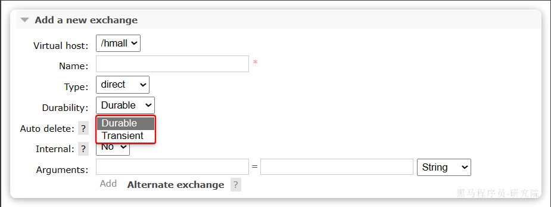
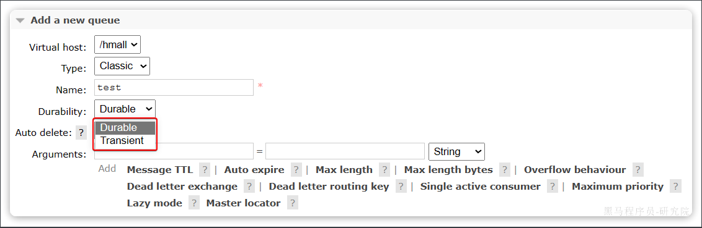
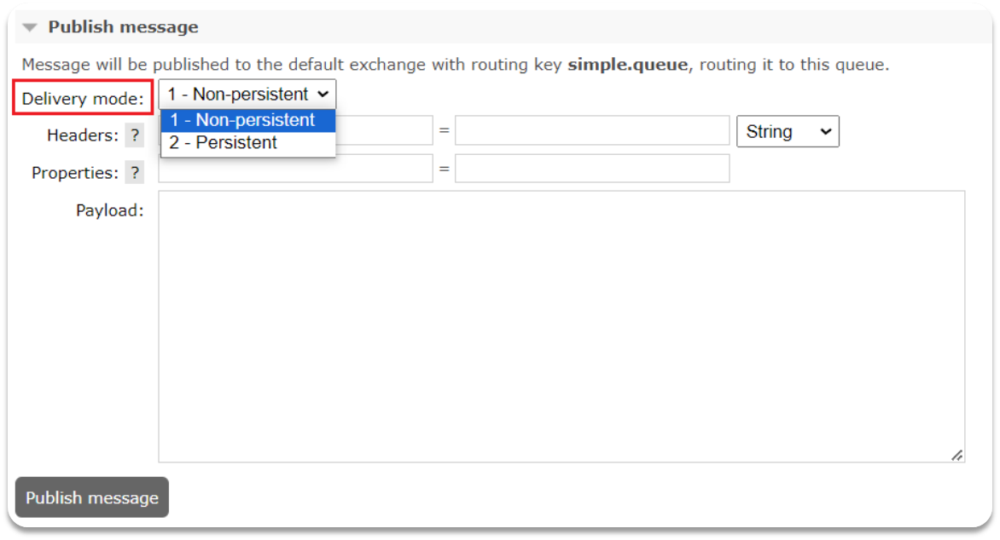
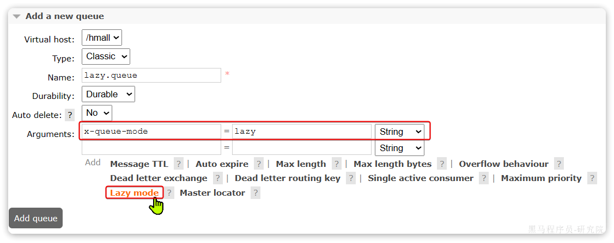
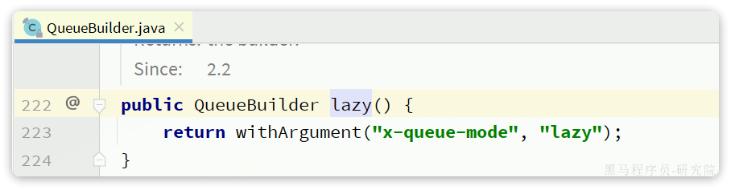
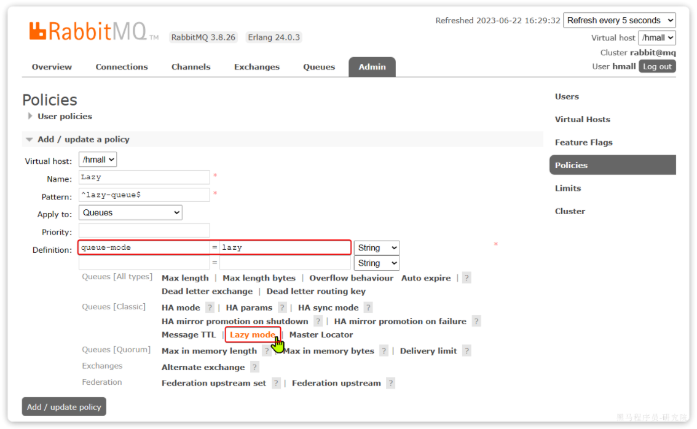

::: tip

1 数据持久化

2 LazyQueue

:::

消息到达MQ以后，如果MQ不能及时保存，也会导致消息丢失，所以MQ的可靠性也非常重要。


## 1 数据持久化

为了提升性能，默认情况下MQ的数据都是在内存存储的临时数据，重启后就会消失。为了保证数据的可靠性，必须配置数据持久化，包括：

- 交换机持久化
- 队列持久化
- 消息持久化

我们以控制台界面为例来说明。


### 1.1 交换机持久化

在控制台的`Exchanges`页面，添加交换机时可以配置交换机的`Durability`参数：



设置为`Durable`就是持久化模式，`Transient`就是临时模式。


### 1.2 队列持久化

在控制台的Queues页面，添加队列时，同样可以配置队列的`Durability`参数：



除了持久化以外，你可以看到队列还有很多其它参数，有一些我们会在后期学习。


### 1.3 消息持久化

在控制台发送消息的时候，可以添加很多参数，而消息的持久化是要配置一个`properties`：



**说明**：在开启持久化机制以后，如果同时还开启了生产者确认，那么MQ会在消息持久化以后才发送ACK回执，进一步确保消息的可靠性。

不过出于性能考虑，为了减少IO次数，发送到MQ的消息并不是逐条持久化到数据库的，而是每隔一段时间批量持久化。一般间隔在100毫秒左右，这就会导致ACK有一定的延迟，因此建议生产者确认全部采用异步方式。


## 2 LazyQueue

在默认情况下，RabbitMQ会将接收到的信息保存在内存中以降低消息收发的延迟。但在某些特殊情况下，这会导致消息积压，比如：

- 消费者宕机或出现网络故障
- 消息发送量激增，超过了消费者处理速度
- 消费者处理业务发生阻塞

一旦出现消息堆积问题，RabbitMQ的内存占用就会越来越高，直到触发内存预警上限。此时RabbitMQ会将内存消息刷到磁盘上，这个行为成为`PageOut`. `PageOut`会耗费一段时间，并且会阻塞队列进程。因此在这个过程中RabbitMQ不会再处理新的消息，生产者的所有请求都会被阻塞。

为了解决这个问题，从RabbitMQ的3.6.0版本开始，就增加了Lazy Queues的模式，也就是惰性队列。惰性队列的特征如下：

- 接收到消息后直接存入磁盘而非内存
- 消费者要消费消息时才会从磁盘中读取并加载到内存（也就是懒加载）
- 支持数百万条的消息存储

而在3.12版本之后，LazyQueue已经成为所有队列的默认格式。因此官方推荐升级MQ为3.12版本或者所有队列都设置为LazyQueue模式。


### 2.1. 控制台配置 Lazy 模式

在添加队列的时候，添加`x-queue-mod=lazy`参数即可设置队列为Lazy模式：




### 2.2. 代码配置 Lazy 模式

在利用SpringAMQP声明队列的时候，添加`x-queue-mod=lazy`参数也可设置队列为Lazy模式：

```java
@Bean
public Queue lazyQueue(){
    return QueueBuilder
            .durable("lazy.queue")
            .lazy() // 开启Lazy模式
            .build();
}
```

这里是通过`QueueBuilder`的`lazy()`函数配置Lazy模式，底层源码如下：



当然，我们也可以基于注解来声明队列并设置为Lazy模式：

```java
@RabbitListener(queuesToDeclare = @Queue(
        name = "lazy.queue",
        durable = "true",
        arguments = @Argument(name = "x-queue-mode", value = "lazy")
))
public void listenLazyQueue(String msg){
    log.info("接收到 lazy.queue的消息：{}", msg);
}
```


### 2.3. 更新已有队列为 lazy 模式

对于已经存在的队列，也可以配置为lazy模式，但是要通过设置policy实现。

可以基于命令行设置policy：

```shell
rabbitmqctl set_policy Lazy "^lazy-queue$" '{"queue-mode":"lazy"}' --apply-to queues  
```

命令解读：

- `rabbitmqctl` ：RabbitMQ的命令行工具
- `set_policy` ：添加一个策略
- `Lazy` ：策略名称，可以自定义
- `"^lazy-queue$"` ：用正则表达式匹配队列的名字
- `'{"queue-mode":"lazy"}'` ：设置队列模式为lazy模式
- `--apply-to queues`：策略的作用对象，是所有的队列

当然，也可以在控制台配置policy，进入在控制台的`Admin`页面，点击`Policies`，即可添加配置：

