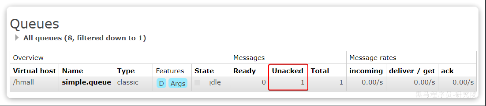
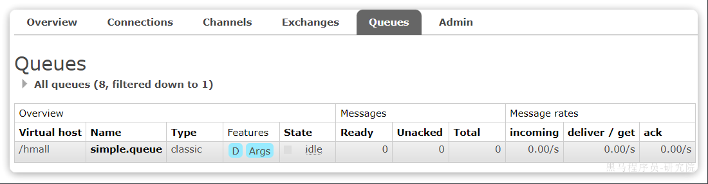
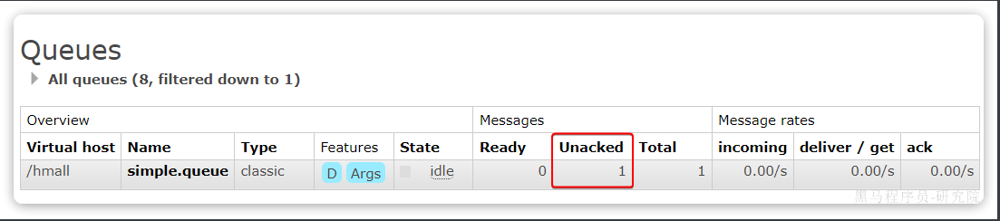
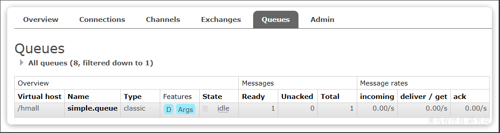
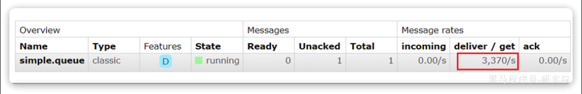
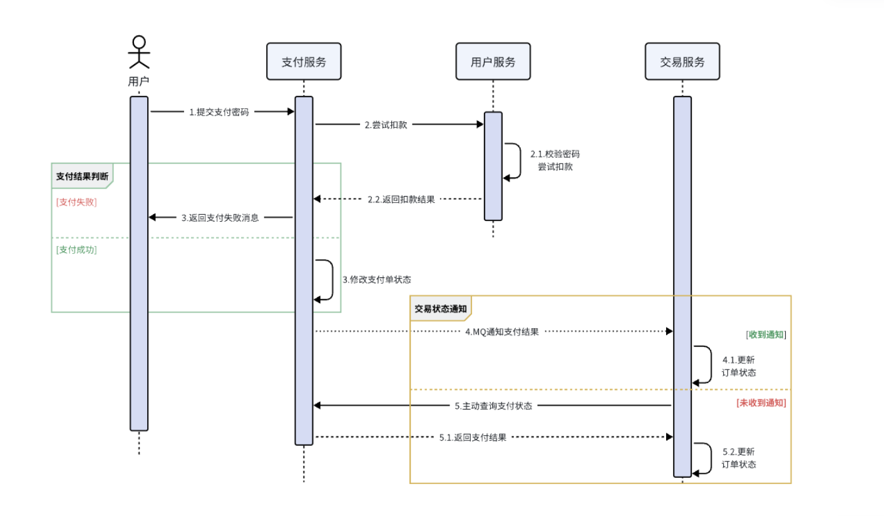

::: tip

1 消费者确认机制

2 失败重试机制

3 失败处理策略

4 业务幕等性

5 兜底方案

:::

当RabbitMQ向消费者投递消息以后，需要知道消费者的处理状态如何。因为消息投递给消费者并不代表就一定被正确消费了，可能出现的故障有很多，比如：

- 消息投递的过程中出现了网络故障
- 消费者接收到消息后突然宕机
- 消费者接收到消息后，因处理不当导致异常
- ...

一旦发生上述情况，消息也会丢失。因此，RabbitMQ必须知道消费者的处理状态，一旦消息处理失败才能重新投递消息。

但问题来了：RabbitMQ如何得知消费者的处理状态呢？

本章我们就一起研究一下消费者处理消息时的可靠性解决方案。


## 1 消费者确认机制

为了确认消费者是否成功处理消息，RabbitMQ提供了消费者确认机制（**Consumer Acknowledgement**）。即：当消费者处理消息结束后，应该向RabbitMQ发送一个回执，告知RabbitMQ自己消息处理状态。回执有三种可选值：

- ack：成功处理消息，RabbitMQ从队列中删除该消息
- nack：消息处理失败，RabbitMQ需要再次投递消息
- reject：消息处理失败并拒绝该消息，RabbitMQ从队列中删除该消息

一般reject方式用的较少，除非是消息格式有问题，那就是开发问题了。因此大多数情况下我们需要将消息处理的代码通过`try catch`机制捕获，消息处理成功时返回ack，处理失败时返回nack.

由于消息回执的处理代码比较统一，因此SpringAMQP帮我们实现了消息确认。并允许我们通过配置文件设置ACK处理方式，有三种模式：

- **`none`**：不处理。即消息投递给消费者后立刻ack，消息会立刻从MQ删除。非常不安全，不建议使用
- **`manual`**：手动模式。需要自己在业务代码中调用api，发送`ack`或`reject`，存在业务入侵，但更灵活
- **`auto`**：自动模式。SpringAMQP利用AOP对我们的消息处理逻辑做了环绕增强，当业务正常执行时则自动返回`ack`.  当业务出现异常时，根据异常判断返回不同结果：
  - 如果是**业务异常**，会自动返回`nack`；
  - 如果是**消息处理或校验异常**，自动返回`reject`;

返回Reject的常见异常有：

> Starting with version 1.3.2, the default ErrorHandler is now a ConditionalRejectingErrorHandler that rejects (and does not requeue) messages that fail with an irrecoverable error. Specifically, it rejects messages that fail with the following errors:
>
> - o.s.amqp…MessageConversionException: Can be thrown when converting the incoming message payload using a MessageConverter.
> - o.s.messaging…MessageConversionException: Can be thrown by the conversion service if additional conversion is required when mapping to a @RabbitListener method.
> - o.s.messaging…MethodArgumentNotValidException: Can be thrown if validation (for example, @Valid) is used in the listener and the validation fails.
> - o.s.messaging…MethodArgumentTypeMismatchException: Can be thrown if the inbound message was converted to a type that is not correct for the target method. For example, the parameter is declared as Message`<Foo>` but Message`<Bar>` is received.
> - java.lang.NoSuchMethodException: Added in version 1.6.3.
> - java.lang.ClassCastException: Added in version 1.6.3.

通过下面的配置可以修改SpringAMQP的ACK处理方式：

```yaml
spring:
  rabbitmq:
    listener:
      simple:
        acknowledge-mode: none # 不做处理
```

修改consumer服务的SpringRabbitListener类中的方法，模拟一个消息处理的异常：

```java
@RabbitListener(queues = "simple.queue")
public void listenSimpleQueueMessage(String msg) throws InterruptedException {
    log.info("spring 消费者接收到消息：【" + msg + "】");
    if (true) {
        throw new MessageConversionException("故意的");
    }
    log.info("消息处理完成");
}
```

测试可以发现：当消息处理发生异常时，消息依然被RabbitMQ删除了。

我们再次把确认机制修改为auto：

```yaml
spring:
  rabbitmq:
    listener:
      simple:
        acknowledge-mode: auto # 自动ack
```

在异常位置打断点，再次发送消息，程序卡在断点时，可以发现此时消息状态为`unacked`（未确定状态）：



放行以后，由于抛出的是**消息转换异常**，因此Spring会自动返回`reject`，所以消息依然会被删除：



我们将异常改为RuntimeException类型：

```java
@RabbitListener(queues = "simple.queue")
public void listenSimpleQueueMessage(String msg) throws InterruptedException {
    log.info("spring 消费者接收到消息：【" + msg + "】");
    if (true) {
        throw new RuntimeException("故意的");
    }
    log.info("消息处理完成");
}
```

在异常位置打断点，然后再次发送消息测试，程序卡在断点时，可以发现此时消息状态为`unacked`（未确定状态）：



放行以后，由于抛出的是业务异常，所以Spring返回`ack`，最终消息恢复至`Ready`状态，并且没有被RabbitMQ删除：



当我们把配置改为`auto`时，消息处理失败后，会回到RabbitMQ，并重新投递到消费者。


## 2 失败重试机制

当消费者出现异常后，消息会不断requeue（重入队）到队列，再重新发送给消费者。如果消费者再次执行依然出错，消息会再次requeue到队列，再次投递，直到消息处理成功为止。

极端情况就是消费者一直无法执行成功，那么消息requeue就会无限循环，导致mq的消息处理飙升，带来不必要的压力：



当然，上述极端情况发生的概率还是非常低的，不过不怕一万就怕万一。为了应对上述情况Spring又提供了消费者失败重试机制：在消费者出现异常时利用本地重试，而不是无限制的requeue到mq队列。

修改consumer服务的application.yml文件，添加内容：

```yaml
spring:
  rabbitmq:
    listener:
      simple:
        retry:
          enabled: true # 开启消费者失败重试
          initial-interval: 1000ms # 初识的失败等待时长为1秒
          multiplier: 1 # 失败的等待时长倍数，下次等待时长 = multiplier * last-interval
          max-attempts: 3 # 最大重试次数
          stateless: true # true无状态；false有状态。如果业务中包含事务，这里改为false
```

重启consumer服务，重复之前的测试。可以发现：

- 消费者在失败后消息没有重新回到MQ无限重新投递，而是在本地重试了3次
- 本地重试3次以后，抛出了`AmqpRejectAndDontRequeueException`异常。查看RabbitMQ控制台，发现消息被删除了，说明最后SpringAMQP返回的是`reject`

结论：

- 开启本地重试时，消息处理过程中抛出异常，不会requeue到队列，而是在消费者本地重试
- 重试达到最大次数后，Spring会返回reject，消息会被丢弃


## 3 失败处理策略

在之前的测试中，本地测试达到最大重试次数后，消息会被丢弃。这在某些对于消息可靠性要求较高的业务场景下，显然不太合适了。

因此Spring允许我们自定义重试次数耗尽后的消息处理策略，这个策略是由`MessageRecovery`接口来定义的，它有3个不同实现：

-  `RejectAndDontRequeueRecoverer`：重试耗尽后，直接`reject`，丢弃消息。默认就是这种方式 
-  `ImmediateRequeueMessageRecoverer`：重试耗尽后，返回`nack`，消息重新入队 
-  `RepublishMessageRecoverer`：重试耗尽后，将失败消息投递到指定的交换机 

比较优雅的一种处理方案是`RepublishMessageRecoverer`，失败后将消息投递到一个指定的，专门存放异常消息的队列，后续由人工集中处理。

1）在consumer服务中定义处理失败消息的交换机和队列

```java
@Bean
public DirectExchange errorMessageExchange(){
    return new DirectExchange("error.direct");
}
@Bean
public Queue errorQueue(){
    return new Queue("error.queue", true);
}
@Bean
public Binding errorBinding(Queue errorQueue, DirectExchange errorMessageExchange){
    return BindingBuilder.bind(errorQueue).to(errorMessageExchange).with("error");
}
```

2）定义一个RepublishMessageRecoverer，关联队列和交换机

```java
@Bean
public MessageRecoverer republishMessageRecoverer(RabbitTemplate rabbitTemplate){
    return new RepublishMessageRecoverer(rabbitTemplate, "error.direct", "error");
}
```

完整代码如下：

```java
package com.itheima.consumer.config;

import org.springframework.amqp.core.Binding;
import org.springframework.amqp.core.BindingBuilder;
import org.springframework.amqp.core.DirectExchange;
import org.springframework.amqp.core.Queue;
import org.springframework.amqp.rabbit.core.RabbitTemplate;
import org.springframework.amqp.rabbit.retry.MessageRecoverer;
import org.springframework.amqp.rabbit.retry.RepublishMessageRecoverer;
import org.springframework.context.annotation.Bean;

@Configuration
@ConditionalOnProperty(name = "spring.rabbitmq.listener.simple.retry.enabled", havingValue = "true")
public class ErrorMessageConfig {
    @Bean
    public DirectExchange errorMessageExchange(){
        return new DirectExchange("error.direct");
    }
    @Bean
    public Queue errorQueue(){
        return new Queue("error.queue", true);
    }
    @Bean
    public Binding errorBinding(Queue errorQueue, DirectExchange errorMessageExchange){
        return BindingBuilder.bind(errorQueue).to(errorMessageExchange).with("error");
    }

    @Bean
    public MessageRecoverer republishMessageRecoverer(RabbitTemplate rabbitTemplate){
        return new RepublishMessageRecoverer(rabbitTemplate, "error.direct", "error");
    }
}
```


## 4 业务幕等性

何为幂等性？

**幂等**是一个数学概念，用函数表达式来描述是这样的：`f(x) = f(f(x))`，例如求绝对值函数。

在程序开发中，则是指同一个业务，执行一次或多次对业务状态的影响是一致的。例如：

- 根据id删除数据
- 查询数据
- 新增数据

但数据的更新往往不是幂等的，如果重复执行可能造成不一样的后果。比如：

- 取消订单，恢复库存的业务。如果多次恢复就会出现库存重复增加的情况
- 退款业务。重复退款对商家而言会有经济损失。

所以，我们要尽可能避免业务被重复执行。

然而在实际业务场景中，由于意外经常会出现业务被重复执行的情况，例如：

- 页面卡顿时频繁刷新导致表单重复提交
- 服务间调用的重试
- MQ消息的重复投递

我们在用户支付成功后会发送MQ消息到交易服务，修改订单状态为已支付，就可能出现消息重复投递的情况。如果消费者不做判断，很有可能导致消息被消费多次，出现业务故障。

举例：

1. 假如用户刚刚支付完成，并且投递消息到交易服务，交易服务更改订单为**已支付**状态。
2. 由于某种原因，例如网络故障导致生产者没有得到确认，隔了一段时间后**重新投递**给交易服务。
3. 但是，在新投递的消息被消费之前，用户选择了退款，将订单状态改为了**已退款**状态。
4. 退款完成后，新投递的消息才被消费，那么订单状态会被再次改为**已支付**。业务异常。

因此，我们必须想办法保证消息处理的幂等性。这里给出两种方案：

- 唯一消息ID
- 业务状态判断


### 4.1 唯一消息 ID

这个思路非常简单：

1. 每一条消息都生成一个唯一的id，与消息一起投递给消费者。
2. 消费者接收到消息后处理自己的业务，业务处理成功后将消息ID保存到数据库
3. 如果下次又收到相同消息，去数据库查询判断是否存在，存在则为重复消息放弃处理。

我们该如何给消息添加唯一ID呢？

其实很简单，SpringAMQP的MessageConverter自带了MessageID的功能，我们只要开启这个功能即可。

以Jackson的消息转换器为例：

```java
@Bean
public MessageConverter messageConverter(){
    // 1.定义消息转换器
    Jackson2JsonMessageConverter jjmc = new Jackson2JsonMessageConverter();
    // 2.配置自动创建消息id，用于识别不同消息，也可以在业务中基于ID判断是否是重复消息
    jjmc.setCreateMessageIds(true);
    return jjmc;
}
```


### 4.2 业务判断

业务判断就是基于业务本身的逻辑或状态来判断是否是重复的请求或消息，不同的业务场景判断的思路也不一样。

例如我们当前案例中，处理消息的业务逻辑是把订单状态从未支付修改为已支付。因此我们就可以在执行业务时判断订单状态是否是未支付，如果不是则证明订单已经被处理过，无需重复处理。

相比较而言，消息ID的方案需要改造原有的数据库，所以我更推荐使用业务判断的方案。

以支付修改订单的业务为例，我们需要修改`OrderServiceImpl`中的`markOrderPaySuccess`方法：

```java
    @Override
    public void markOrderPaySuccess(Long orderId) {
        // 1.查询订单
        Order old = getById(orderId);
        // 2.判断订单状态
        if (old == null || old.getStatus() != 1) {
            // 订单不存在或者订单状态不是1，放弃处理
            return;
        }
        // 3.尝试更新订单
        Order order = new Order();
        order.setId(orderId);
        order.setStatus(2);
        order.setPayTime(LocalDateTime.now());
        updateById(order);
    }
```

上述代码逻辑上符合了幂等判断的需求，但是由于判断和更新是两步动作，因此在极小概率下可能存在线程安全问题。

我们可以合并上述操作为这样：

```java
@Override
public void markOrderPaySuccess(Long orderId) {
    // UPDATE `order` SET status = ? , pay_time = ? WHERE id = ? AND status = 1
    lambdaUpdate()
            .set(Order::getStatus, 2)
            .set(Order::getPayTime, LocalDateTime.now())
            .eq(Order::getId, orderId)
            .eq(Order::getStatus, 1)
            .update();
}
```

注意看，上述代码等同于这样的SQL语句：

```sql
UPDATE `order` SET status = ? , pay_time = ? WHERE id = ? AND status = 1
```

我们在where条件中除了判断id以外，还加上了status必须为1的条件。如果条件不符（说明订单已支付），则SQL匹配不到数据，根本不会执行。


## 5 兜底方案

虽然我们利用各种机制尽可能增加了消息的可靠性，但也不好说能保证消息100%的可靠。万一真的MQ通知失败该怎么办呢？

有没有其它兜底方案，能够确保订单的支付状态一致呢？

其实思想很简单：既然MQ通知不一定发送到交易服务，那么交易服务就必须自己**主动去查询**支付状态。这样即便支付服务的MQ通知失败，我们依然能通过主动查询来保证订单状态的一致。

流程如下：



图中黄色线圈起来的部分就是MQ通知失败后的兜底处理方案，由交易服务自己主动去查询支付状态。

不过需要注意的是，交易服务并不知道用户会在什么时候支付，如果查询的时机不正确（比如查询的时候用户正在支付中），可能查询到的支付状态也不正确。

那么问题来了，我们到底该在什么时间主动查询支付状态呢？

这个时间是无法确定的，因此，通常我们采取的措施就是利用**定时任务**定期查询，例如每隔20秒就查询一次，并判断支付状态。如果发现订单已经支付，则立刻更新订单状态为已支付即可。

定时任务大家之前学习过，具体的实现这里就不再赘述了。

至此，消息可靠性的问题已经解决了。

综上，支付服务与交易服务之间的订单状态一致性是如何保证的？

- 首先，支付服务会正在用户支付成功以后利用MQ消息通知交易服务，完成订单状态同步。
- 其次，为了保证MQ消息的可靠性，我们采用了生产者确认机制、消费者确认、消费者失败重试等策略，确保消息投递的可靠性
- 最后，我们还在交易服务设置了定时任务，定期查询订单支付状态。这样即便MQ通知失败，还可以利用定时任务作为兜底方案，确保订单支付状态的最终一致性。