::: tip

1 死信交换机和延迟消息

2 DelayExchange 插件

3 超时订单问题

:::

在电商的支付业务中，对于一些库存有限的商品，为了更好的用户体验，通常都会在用户下单时立刻扣减商品库存。例如电影院购票、高铁购票，下单后就会锁定座位资源，其他人无法重复购买。

但是这样就存在一个问题，假如用户下单后一直不付款，就会一直占有库存资源，导致其他客户无法正常交易，最终导致商户利益受损！

因此，电商中通常的做法就是：**对于超过一定时间未支付的订单，应该立刻取消订单并释放占用的库存**。

例如，订单支付超时时间为30分钟，则我们应该在用户下单后的第30分钟检查订单支付状态，如果发现未支付，应该立刻取消订单，释放库存。

但问题来了：如何才能准确的实现在下单后第30分钟去检查支付状态呢？

像这种在一段时间以后才执行的任务，我们称之为**延迟任务**，而要实现延迟任务，最简单的方案就是利用MQ的延迟消息了。

在RabbitMQ中实现延迟消息也有两种方案：

- 死信交换机+TTL
- 延迟消息插件

这一章我们就一起研究下这两种方案的实现方式，以及优缺点。


## 1 死信交换机和延迟消息

首先我们来学习一下基于死信交换机的延迟消息方案。

### 1.1 死信交换机

什么是死信？

当一个队列中的消息满足下列情况之一时，可以成为死信（dead letter）：

- 消费者使用`basic.reject`或 `basic.nack`声明消费失败，并且消息的`requeue`参数设置为false
- 消息是一个过期消息，超时无人消费
- 要投递的队列消息满了，无法投递

如果一个队列中的消息已经成为死信，并且这个队列通过**`dead-letter-exchange`**属性指定了一个交换机，那么队列中的死信就会投递到这个交换机中，而这个交换机就称为**死信交换机**（Dead Letter Exchange）。而此时加入有队列与死信交换机绑定，则最终死信就会被投递到这个队列中。

死信交换机有什么作用呢？

1. 收集那些因处理失败而被拒绝的消息
2. 收集那些因队列满了而被拒绝的消息
3. 收集因TTL（有效期）到期的消息


### 1.2 延迟消息

前面两种作用场景可以看做是把死信交换机当做一种消息处理的最终兜底方案，与消费者重试时讲的`RepublishMessageRecoverer`作用类似。

而最后一种场景，大家设想一下这样的场景：

如图，有一组绑定的交换机（`ttl.fanout`）和队列（`ttl.queue`）。但是`ttl.queue`没有消费者监听，而是设定了死信交换机`hmall.direct`，而队列`direct.queue1`则与死信交换机绑定，RoutingKey是blue：

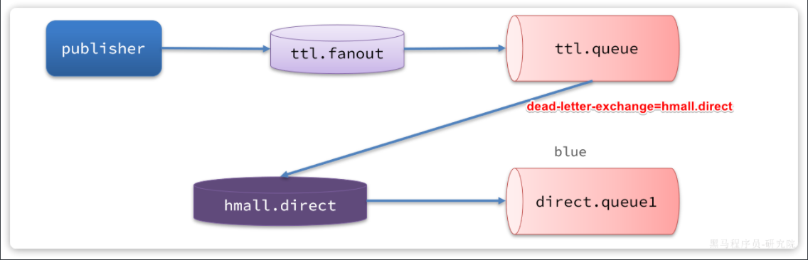

假如我们现在发送一条消息到`ttl.fanout`，RoutingKey为blue，并设置消息的**有效期**为5000毫秒：

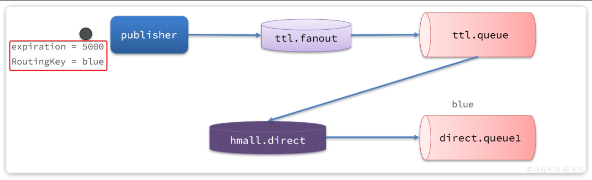

**注意**：尽管这里的`ttl.fanout`不需要RoutingKey，但是当消息变为死信并投递到死信交换机时，会沿用之前的RoutingKey，这样`hmall.direct`才能正确路由消息。

消息肯定会被投递到`ttl.queue`之后，由于没有消费者，因此消息无人消费。5秒之后，消息的有效期到期，成为死信：

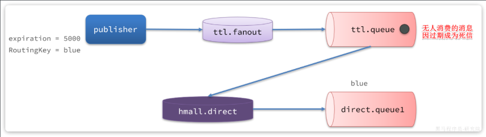

死信被再次投递到死信交换机`hmall.direct`，并沿用之前的RoutingKey，也就是`blue`：

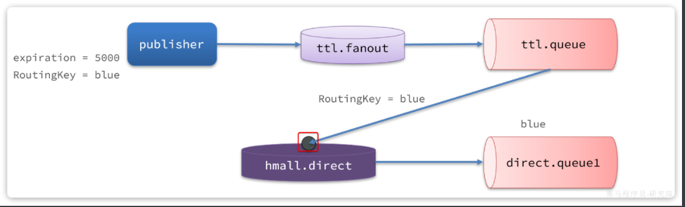

由于`direct.queue1`与`hmall.direct`绑定的key是blue，因此最终消息被成功路由到`direct.queue1`，如果此时有消费者与`direct.queue1`绑定， 也就能成功消费消息了。但此时已经是5秒钟以后了：

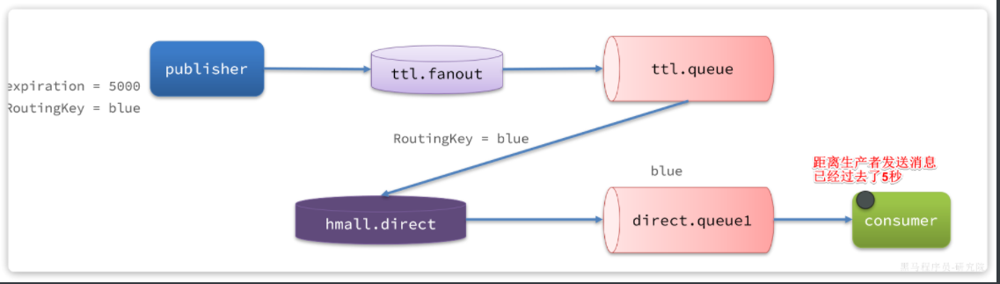

也就是说，publisher发送了一条消息，但最终consumer在5秒后才收到消息。我们成功实现了**延迟消息**。


### 1.3 总结

> **注意：**
>
> RabbitMQ的消息过期是基于追溯方式来实现的，也就是说当一个消息的TTL到期以后不一定会被移除或投递到死信交换机，而是在消息恰好处于队首时才会被处理。
>
> 当队列中消息堆积很多的时候，过期消息可能不会被按时处理，因此你设置的TTL时间不一定准确。


## 2 DelayExchange 插件

> 基于死信队列虽然可以实现延迟消息，但是太麻烦了。因此RabbitMQ社区提供了一个延迟消息插件来实现相同的效果。
>
> 官方文档说明：
>
> https://blog.rabbitmq.com/posts/2015/04/scheduling-messages-with-rabbitmq


### 2.1 下载

插件下载地址：

https://github.com/rabbitmq/rabbitmq-delayed-message-exchange

由于我们安装的MQ是`3.8`版本，因此这里下载`3.8.17`版本：

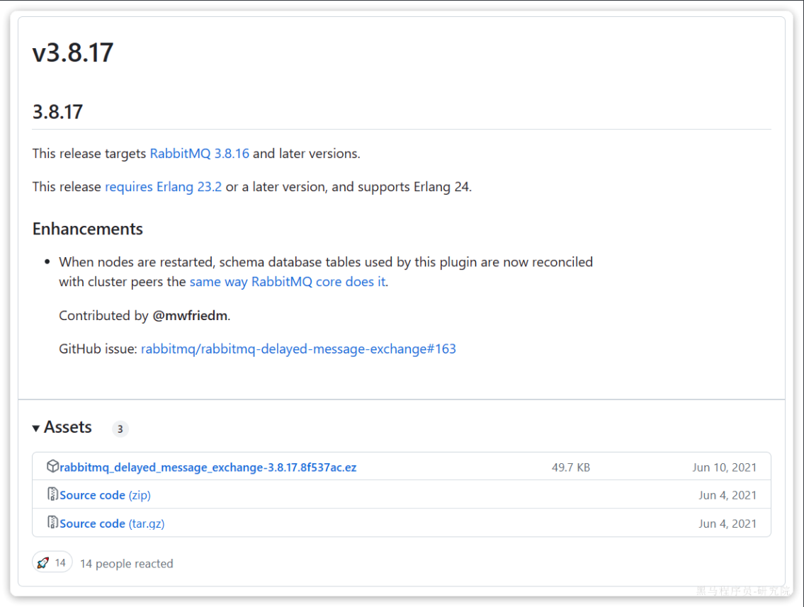

当然，也可以直接使用课前资料提供好的插件：

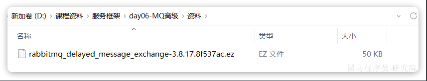


### 2.2 安装

因为我们是基于Docker安装，所以需要先查看RabbitMQ的插件目录对应的数据卷。

```Shell
docker volume inspect mq-plugins
```

结果如下：

```json
[
    {
        "CreatedAt": "2024-06-19T09:22:59+08:00",
        "Driver": "local",
        "Labels": null,
        "Mountpoint": "/var/lib/docker/volumes/mq-plugins/_data",
        "Name": "mq-plugins",
        "Options": null,
        "Scope": "local"
    }
]
```

插件目录被挂载到了`/var/lib/docker/volumes/mq-plugins/_data`这个目录，我们上传插件到该目录下。

接下来执行命令，安装插件：

```shell
docker exec -it mq rabbitmq-plugins enable rabbitmq_delayed_message_exchange
```

运行结果如下：

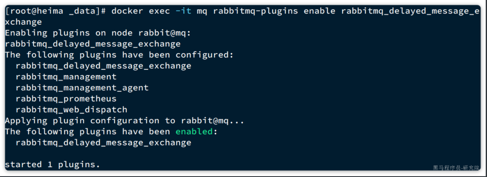


### 2.3 声明延迟交换机

基于注解方式：

```java
@RabbitListener(bindings = @QueueBinding(
        value = @Queue(name = "delay.queue", durable = "true"),
        exchange = @Exchange(name = "delay.direct", delayed = "true"),
        key = "delay"
))
public void listenDelayMessage(String msg){
    log.info("接收到delay.queue的延迟消息：{}", msg);
}
```

基于`@Bean`的方式：

```java
package com.itheima.consumer.config;

import lombok.extern.slf4j.Slf4j;
import org.springframework.amqp.core.*;
import org.springframework.context.annotation.Bean;
import org.springframework.context.annotation.Configuration;

@Slf4j
@Configuration
public class DelayExchangeConfig {

    @Bean
    public DirectExchange delayExchange(){
        return ExchangeBuilder
                .directExchange("delay.direct") // 指定交换机类型和名称
                .delayed() // 设置delay的属性为true
                .durable(true) // 持久化
                .build();
    }

    @Bean
    public Queue delayedQueue(){
        return new Queue("delay.queue");
    }
    
    @Bean
    public Binding delayQueueBinding(){
        return BindingBuilder.bind(delayedQueue()).to(delayExchange()).with("delay");
    }
}
```


### 2.4 发送延迟消息

发送消息时，必须通过x-delay属性设定延迟时间：

```java
@Test
void testPublisherDelayMessage() {
    // 1.创建消息
    String message = "hello, delayed message";
    // 2.发送消息，利用消息后置处理器添加消息头
    rabbitTemplate.convertAndSend("delay.direct", "delay", message, new MessagePostProcessor() {
        @Override
        public Message postProcessMessage(Message message) throws AmqpException {
            // 添加延迟消息属性
            message.getMessageProperties().setDelay(5000);
            return message;
        }
    });
}
```

> **注意：**
>
> 延迟消息插件内部会维护一个本地数据库表，同时使用Elang Timers功能实现计时。如果消息的延迟时间设置较长，可能会导致堆积的延迟消息非常多，会带来较大的CPU开销，同时延迟消息的时间会存在误差。
>
> 因此，**不建议设置延迟时间过长的延迟消息**。


## 3 超时订单问题

接下来，我们就在交易服务中利用延迟消息实现订单超时取消功能。其大概思路如下：

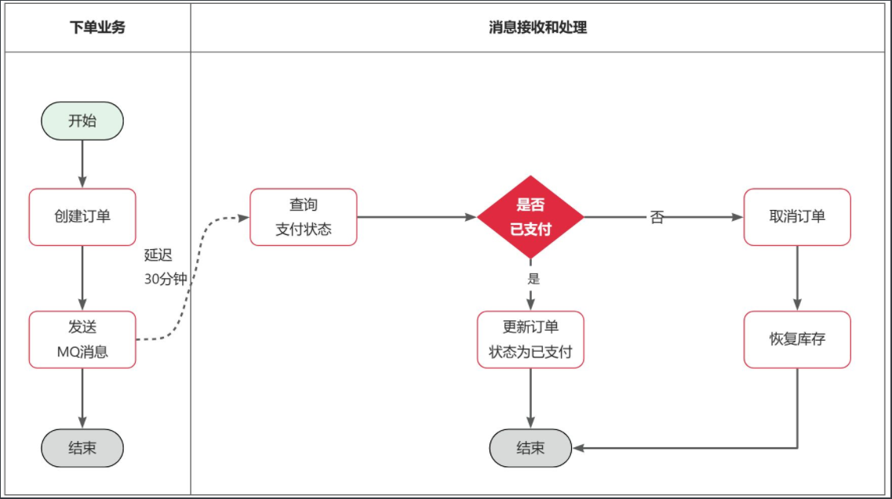

假如订单超时支付时间为30分钟，理论上说我们应该在下单时发送一条延迟消息，延迟时间为30分钟。这样就可以在接收到消息时检验订单支付状态，关闭未支付订单。


### 3.1 定义常量

无论是消息发送还是接收都是在交易服务完成，因此我们在`trade-service`中定义一个常量类，用于记录交换机、队列、RoutingKey等常量：

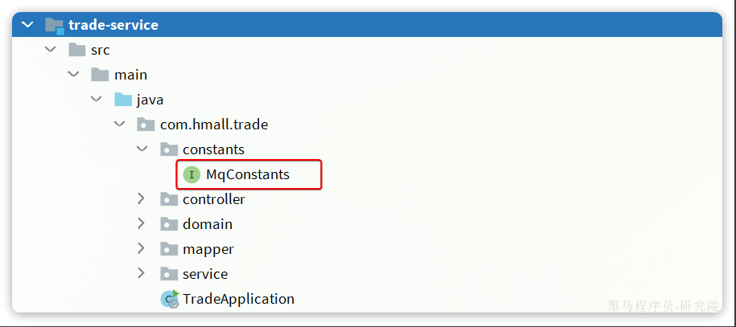

内容如下：

```java
package com.hmall.trade.constants;

public interface MQConstants {
    String DELAY_EXCHANGE_NAME = "trade.delay.direct";
    String DELAY_ORDER_QUEUE_NAME = "trade.delay.order.queue";
    String DELAY_ORDER_KEY = "delay.order.query";
}
```


### 3.2 配置 MQ

在`trade-service`模块的`pom.xml`中引入amqp的依赖：

```xml
  <!--amqp-->
  <dependency>
      <groupId>org.springframework.boot</groupId>
      <artifactId>spring-boot-starter-amqp</artifactId>
  </dependency>
```

在`trade-service`的`application.yaml`中添加MQ的配置：

```yaml
spring:
  rabbitmq:
    host: 192.168.150.101
    port: 5672
    virtual-host: /hmall
    username: hmall
    password: 123
```


### 3.3 改造下单业务，发送延迟消息

接下来，我们改造下单业务，在下单完成后，发送延迟消息，查询支付状态。

修改`trade-service`模块的`com.hmall.trade.service.impl.OrderServiceImpl`类的`createOrder`方法，添加消息发送的代码：

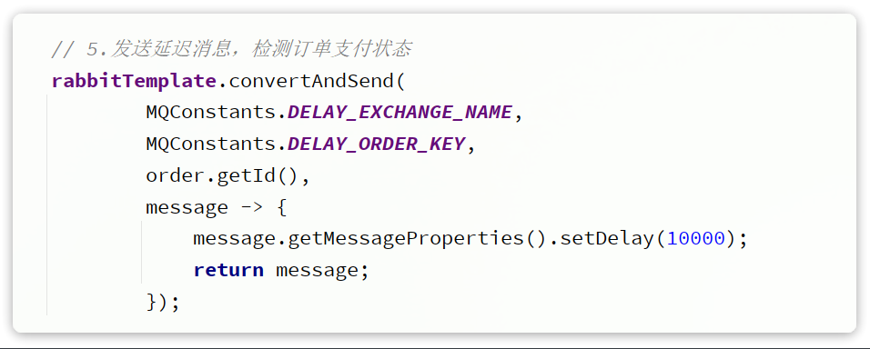

这里延迟消息的时间应该是15分钟，不过我们为了测试方便，改成10秒。


### 3.4 编写查询支付状态接口

由于MQ消息处理时需要查询支付状态，因此我们要在`pay-service`模块定义一个这样的接口，并提供对应的`FeignClient`.

首先，在`hm-api`模块定义三个类：

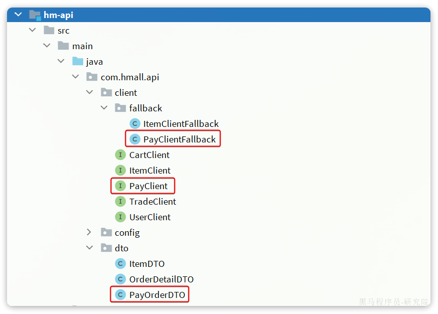

说明：

- PayOrderDTO：支付单的数据传输实体
- PayClient：支付系统的Feign客户端
- PayClientFallback：支付系统的fallback逻辑

`PayOrderDTO`代码如下：

```java
package com.hmall.api.dto;

import io.swagger.annotations.ApiModel;
import io.swagger.annotations.ApiModelProperty;
import lombok.Data;

import java.time.LocalDateTime;

/**
 * <p>
 * 支付订单
 * </p>
 */
@Data
@ApiModel(description = "支付单数据传输实体")
public class PayOrderDTO {
    @ApiModelProperty("id")
    private Long id;
    @ApiModelProperty("业务订单号")
    private Long bizOrderNo;
    @ApiModelProperty("支付单号")
    private Long payOrderNo;
    @ApiModelProperty("支付用户id")
    private Long bizUserId;
    @ApiModelProperty("支付渠道编码")
    private String payChannelCode;
    @ApiModelProperty("支付金额，单位分")
    private Integer amount;
    @ApiModelProperty("付类型，1：h5,2:小程序，3：公众号，4：扫码，5：余额支付")
    private Integer payType;
    @ApiModelProperty("付状态，0：待提交，1:待支付，2：支付超时或取消，3：支付成功")
    private Integer status;
    @ApiModelProperty("拓展字段，用于传递不同渠道单独处理的字段")
    private String expandJson;
    @ApiModelProperty("第三方返回业务码")
    private String resultCode;
    @ApiModelProperty("第三方返回提示信息")
    private String resultMsg;
    @ApiModelProperty("支付成功时间")
    private LocalDateTime paySuccessTime;
    @ApiModelProperty("支付超时时间")
    private LocalDateTime payOverTime;
    @ApiModelProperty("支付二维码链接")
    private String qrCodeUrl;
    @ApiModelProperty("创建时间")
    private LocalDateTime createTime;
    @ApiModelProperty("更新时间")
    private LocalDateTime updateTime;
}
```

`PayClient`代码如下：

```java
package com.hmall.api.client;

import com.hmall.api.client.fallback.PayClientFallback;
import com.hmall.api.dto.PayOrderDTO;
import org.springframework.cloud.openfeign.FeignClient;
import org.springframework.web.bind.annotation.GetMapping;
import org.springframework.web.bind.annotation.PathVariable;

@FeignClient(value = "pay-service", fallbackFactory = PayClientFallback.class)
public interface PayClient {
    /**
     * 根据交易订单id查询支付单
     * @param id 业务订单id
     * @return 支付单信息
     */
    @GetMapping("/pay-orders/biz/{id}")
    PayOrderDTO queryPayOrderByBizOrderNo(@PathVariable("id") Long id);
}
```

`PayClientFallback`代码如下：

```java
package com.hmall.api.client.fallback;

import com.hmall.api.client.PayClient;
import com.hmall.api.dto.PayOrderDTO;
import lombok.extern.slf4j.Slf4j;
import org.springframework.cloud.openfeign.FallbackFactory;

@Slf4j
public class PayClientFallback implements FallbackFactory<PayClient> {
    @Override
    public PayClient create(Throwable cause) {
        return new PayClient() {
            @Override
            public PayOrderDTO queryPayOrderByBizOrderNo(Long id) {
                return null;
            }
        };
    }
}
```

最后，在`pay-service`模块的`PayController`中实现该接口：

```java
@ApiOperation("根据id查询支付单")
@GetMapping("/biz/{id}")
public PayOrderDTO queryPayOrderByBizOrderNo(@PathVariable("id") Long id){
    PayOrder payOrder = payOrderService.lambdaQuery().eq(PayOrder::getBizOrderNo, id).one();
    return BeanUtils.copyBean(payOrder, PayOrderDTO.class);
}
```


### 3.5 监听消息，查询支付状态

接下来，我们在`trader-service`编写一个监听器，监听延迟消息，查询订单支付状态：

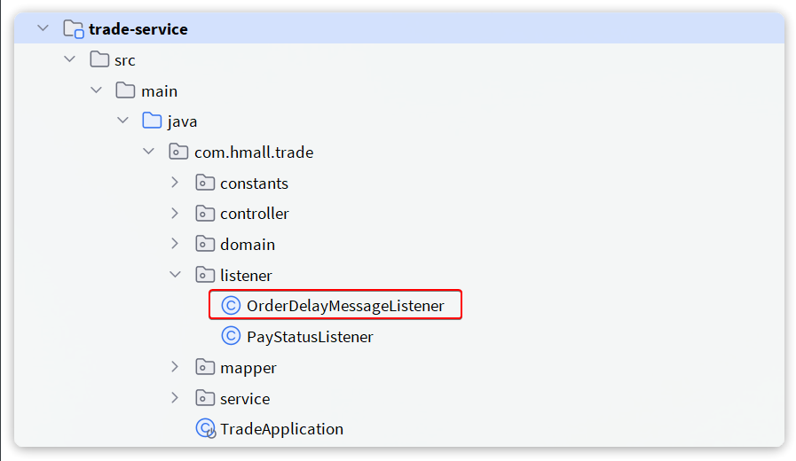

代码如下：

```java
package com.hmall.trade.listener;

import com.hmall.api.client.PayClient;
import com.hmall.api.dto.PayOrderDTO;
import com.hmall.trade.constants.MQConstants;
import com.hmall.trade.domain.po.Order;
import com.hmall.trade.service.IOrderService;
import lombok.RequiredArgsConstructor;
import org.springframework.amqp.rabbit.annotation.Exchange;
import org.springframework.amqp.rabbit.annotation.Queue;
import org.springframework.amqp.rabbit.annotation.QueueBinding;
import org.springframework.amqp.rabbit.annotation.RabbitListener;
import org.springframework.stereotype.Component;

@Component
@RequiredArgsConstructor
public class OrderDelayMessageListener {

    private final IOrderService orderService;
    private final PayClient payClient;

    @RabbitListener(bindings = @QueueBinding(
            value = @Queue(name = MQConstants.DELAY_ORDER_QUEUE_NAME),
            exchange = @Exchange(name = MQConstants.DELAY_EXCHANGE_NAME, delayed = "true"),
            key = MQConstants.DELAY_ORDER_KEY
    ))
    public void listenOrderDelayMessage(Long orderId){
        // 1.查询订单
        Order order = orderService.getById(orderId);
        // 2.检测订单状态，判断是否已支付
        if(order == null || order.getStatus() != 1){
            // 订单不存在或者已经支付
            return;
        }
        // 3.未支付，需要查询支付流水状态
        PayOrderDTO payOrder = payClient.queryPayOrderByBizOrderNo(orderId);
        // 4.判断是否支付
        if(payOrder != null && payOrder.getStatus() == 3){
            // 4.1.已支付，标记订单状态为已支付
            orderService.markOrderPaySuccess(orderId);
        }else{
            // TODO 4.2.未支付，取消订单，回复库存
            orderService.cancelOrder(orderId);
        }
    }
}
```

注意，这里要在OrderServiceImpl中实现cancelOrder方法，留作作业大家自行实现。