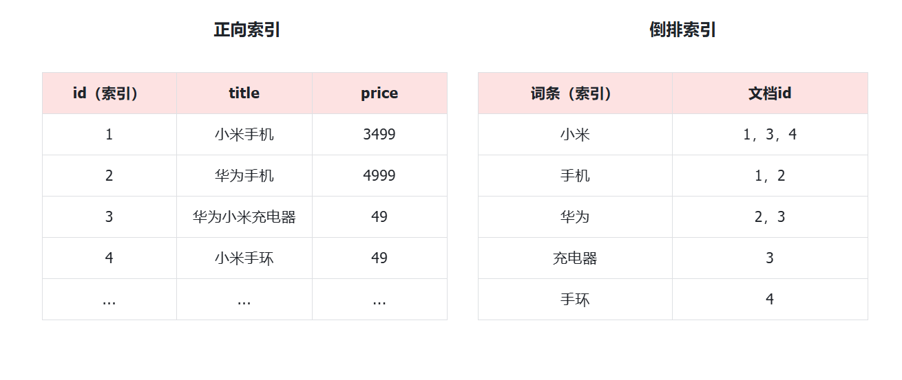

::: tip

1 认识和安装

2 倒排索引

3 基础概念

4 IK 分词器

:::

黑马商城作为一个电商项目，商品的搜索肯定是访问频率最高的页面之一。目前搜索功能是基于数据库的模糊搜索来实现的，存在很多问题。

**首先**，查询效率较低。

由于数据库模糊查询不走索引，在数据量较大的时候，查询性能很差。黑马商城的商品表中仅仅有不到9万条数据，基于数据库查询时，搜索接口的表现如图：


改为基于搜索引擎后，查询表现如下：


需要注意的是，数据库模糊查询随着表数据量的增多，查询性能的下降会非常明显，而搜索引擎的性能则不会随着数据增多而下降太多。目前仅10万不到的数据量差距就如此明显，如果数据量达到百万、千万、甚至上亿级别，这个性能差距会非常夸张。

**其次**，功能单一

数据库的模糊搜索功能单一，匹配条件非常苛刻，必须恰好包含用户搜索的关键字。而在搜索引擎中，用户输入出现个别错字，或者用拼音搜索、同义词搜索都能正确匹配到数据。

综上，在面临海量数据的搜索，或者有一些复杂搜索需求的时候，推荐使用专门的搜索引擎来实现搜索功能。

目前全球的搜索引擎技术排名如下：


排名第一的就是我们今天要学习的elasticsearch.

elasticsearch是一款非常强大的开源搜索引擎，支持的功能非常多，例如：


**解决方案搜索**

**地图搜索**

通过今天的学习大家要达成下列学习目标：

- 理解倒排索引原理
- 会使用IK分词器
- 理解索引库Mapping映射的属性含义
- 能创建索引库及映射
- 能实现文档的CRUD

> Elasticsearch的官方网站如下：
>
> https://www.elastic.co/cn/elasticsearch/
>
> 本章我们一起来初步了解一下Elasticsearch的基本原理和一些基础概念。


## 1 认识和安装

Elasticsearch是由elastic公司开发的一套搜索引擎技术，它是elastic技术栈中的一部分。完整的技术栈包括：

- Elasticsearch：用于数据存储、计算和搜索
- Logstash/Beats：用于数据收集
- Kibana：用于数据可视化

整套技术栈被称为ELK，经常用来做日志收集、系统监控和状态分析等等：


整套技术栈的核心就是用来**存储**、**搜索**、**计算**的Elasticsearch，因此我们接下来学习的核心也是Elasticsearch。

我们要安装的内容包含2部分：

- elasticsearch：存储、搜索和运算
- kibana：图形化展示

首先Elasticsearch不用多说，是提供核心的数据存储、搜索、分析功能的。

然后是Kibana，Elasticsearch对外提供的是Restful风格的API，任何操作都可以通过发送http请求来完成。不过http请求的方式、路径、还有请求参数的格式都有严格的规范。这些规范我们肯定记不住，因此我们要借助于Kibana这个服务。

Kibana是elastic公司提供的用于操作Elasticsearch的可视化控制台。它的功能非常强大，包括：

- 对Elasticsearch数据的搜索、展示
- 对Elasticsearch数据的统计、聚合，并形成图形化报表、图形
- 对Elasticsearch的集群状态监控
- 它还提供了一个开发控制台（DevTools），在其中对Elasticsearch的Restful的API接口提供了**语法提示**


### 1.1 安装 elasticsearch

通过下面的Docker命令即可安装单机版本的elasticsearch：

```bash
docker run -d \
  --name es \
  -e "ES_JAVA_OPTS=-Xms512m -Xmx512m" \
  -e "discovery.type=single-node" \
  -v es-data:/usr/share/elasticsearch/data \
  -v es-plugins:/usr/share/elasticsearch/plugins \
  --privileged \
  --network hm-net \
  -p 9200:9200 \
  -p 9300:9300 \
  elasticsearch:7.12.1
```

注意，这里我们采用的是elasticsearch的7.12.1版本，由于8以上版本的JavaAPI变化很大，在企业中应用并不广泛，企业中应用较多的还是8以下的版本。

如果拉取镜像困难，可以直接导入课前资料提供的镜像tar包：


安装完成后，访问9200端口，即可看到响应的Elasticsearch服务的基本信息：


### 1.2 安装 Kibana

通过下面的Docker命令，即可部署Kibana：

```bash
docker run -d \
--name kibana \
-e ELASTICSEARCH_HOSTS=http://es:9200 \
--network=hm-net \
-p 5601:5601  \
kibana:7.12.1
```

如果拉取镜像困难，可以直接导入课前资料提供的镜像tar包：


安装完成后，直接访问5601端口，即可看到控制台页面：


选择`Explore on my own`之后，进入主页面：


然后选中`Dev tools`，进入开发工具页面：


## 2 倒排索引

elasticsearch之所以有如此高性能的搜索表现，正是得益于底层的倒排索引技术。那么什么是倒排索引呢？

**倒排**索引的概念是基于MySQL这样的**正向**索引而言的。


### 2.1 正向索引

我们先来回顾一下正向索引。

例如有一张名为`tb_goods`的表：

| **id** | **title**      | **price** |
| :----- | :------------- | :-------- |
| 1      | 小米手机       | 3499      |
| 2      | 华为手机       | 4999      |
| 3      | 华为小米充电器 | 49        |
| 4      | 小米手环       | 49        |
| ...    | ...            | ...       |

其中的`id`字段已经创建了索引，由于索引底层采用了B+树结构，因此我们根据id搜索的速度会非常快。但是其他字段例如`title`，只在叶子节点上存在。

因此要根据`title`搜索的时候只能遍历树中的每一个叶子节点，判断title数据是否符合要求。

比如用户的SQL语句为：

```SQL
select * from tb_goods where title like '%手机%';
```

那搜索的大概流程如图：


说明：

- 1）检查到搜索条件为`like '%手机%'`，需要找到`title`中包含`手机`的数据
- 2）逐条遍历每行数据（每个叶子节点），比如第1次拿到`id`为1的数据
- 3）判断数据中的`title`字段值是否符合条件
- 4）如果符合则放入结果集，不符合则丢弃
- 5）回到步骤1

综上，根据id精确匹配时，可以走索引，查询效率较高。而当搜索条件为模糊匹配时，由于索引无法生效，导致从索引查询退化为全表扫描，效率很差。

因此，正向索引适合于根据索引字段的精确搜索，不适合基于部分词条的模糊匹配。

而倒排索引恰好解决的就是根据部分词条模糊匹配的问题。


### 2.2 倒排索引

倒排索引中有两个非常重要的概念：

- 文档（`Document`）：用来搜索的数据，其中的每一条数据就是一个文档。例如一个网页、一个商品信息
- 词条（`Term`）：对文档数据或用户搜索数据，利用某种算法分词，得到的具备含义的词语就是词条。例如：我是中国人，就可以分为：我、是、中国人、中国、国人这样的几个词条

**创建倒排索引**是对正向索引的一种特殊处理和应用，流程如下：

- 将每一个文档的数据利用**分词算法**根据语义拆分，得到一个个词条
- 创建表，每行数据包括词条、词条所在文档id、位置等信息
- 因为词条唯一性，可以给词条创建**正向**索引

此时形成的这张以词条为索引的表，就是倒排索引表，两者对比如下：



倒排索引的**搜索流程**如下（以搜索"华为手机"为例），如图：


流程描述：

1）用户输入条件`"华为手机"`进行搜索。

2）对用户输入条件**分词**，得到词条：`华为`、`手机`。

3）拿着词条在倒排索引中查找（**由于词条有索引，查询效率很高**），即可得到包含词条的文档id：`1、2、3`。

4）拿着文档`id`到正向索引中查找具体文档即可（由于`id`也有索引，查询效率也很高）。

虽然要先查询倒排索引，再查询倒排索引，但是无论是词条、还是文档id都建立了索引，查询速度非常快！无需全表扫描。


### 2.3 正向和倒排

那么为什么一个叫做正向索引，一个叫做倒排索引呢？

-  **正向索引**是最传统的，根据id索引的方式。但根据词条查询时，必须先逐条获取每个文档，然后判断文档中是否包含所需要的词条，是**根据文档找词条的过程**。 
-  而**倒排索引**则相反，是先找到用户要搜索的词条，根据词条得到保护词条的文档的id，然后根据id获取文档。是**根据词条找文档的过程**。 

是不是恰好反过来了？

那么两者方式的优缺点是什么呢？

**正向索引**：

- 优点： 
  - 可以给多个字段创建索引
  - 根据索引字段搜索、排序速度非常快
- 缺点： 
  - 根据非索引字段，或者索引字段中的部分词条查找时，只能全表扫描。

**倒排索引**：

- 优点： 
  - 根据词条搜索、模糊搜索时，速度非常快
- 缺点： 
  - 只能给词条创建索引，而不是字段
  - 无法根据字段做排序


## 3 基础概念

elasticsearch中有很多独有的概念，与mysql中略有差别，但也有相似之处。

### 3.1 文档和字段

elasticsearch是面向**文档（Document）**存储的，可以是数据库中的一条商品数据，一个订单信息。文档数据会被序列化为`json`格式后存储在`elasticsearch`中：


```json
{
    "id": 1,
    "title": "小米手机",
    "price": 3499
}
{
    "id": 2,
    "title": "华为手机",
    "price": 4999
}
{
    "id": 3,
    "title": "华为小米充电器",
    "price": 49
}
{
    "id": 4,
    "title": "小米手环",
    "price": 299
}
```

因此，原本数据库中的一行数据就是ES中的一个JSON文档；而数据库中每行数据都包含很多列，这些列就转换为JSON文档中的**字段（Field）**。


### 3.2 索引和映射

随着业务发展，需要在es中存储的文档也会越来越多，比如有商品的文档、用户的文档、订单文档等等：


所有文档都散乱存放显然非常混乱，也不方便管理。

因此，我们要将类型相同的文档集中在一起管理，称为**索引（Index）**。例如：

**商品索引**

```json
{
    "id": 1,
    "title": "小米手机",
    "price": 3499
}

{
    "id": 2,
    "title": "华为手机",
    "price": 4999
}

{
    "id": 3,
    "title": "三星手机",
    "price": 3999
}
```

**用户索引**

```json
{
    "id": 101,
    "name": "张三",
    "age": 21
}

{
    "id": 102,
    "name": "李四",
    "age": 24
}

{
    "id": 103,
    "name": "麻子",
    "age": 18
}
```

**订单索引**

```json
{
    "id": 10,
    "userId": 101,
    "goodsId": 1,
    "totalFee": 294
}

{
    "id": 11,
    "userId": 102,
    "goodsId": 2,
    "totalFee": 328
}
```

- 所有用户文档，就可以组织在一起，称为用户的索引；
- 所有商品的文档，可以组织在一起，称为商品的索引；
- 所有订单的文档，可以组织在一起，称为订单的索引；

因此，我们可以把索引当做是数据库中的表。

数据库的表会有约束信息，用来定义表的结构、字段的名称、类型等信息。因此，索引库中就有**映射（mapping）**，是索引中文档的字段约束信息，类似表的结构约束。


### 3.3 mysql 与 elasticsearch

我们统一的把mysql与elasticsearch的概念做一下对比：

| **MySQL** | **Elasticsearch** | **说明**                                                     |
| :-------- | :---------------- | :----------------------------------------------------------- |
| Table     | Index             | 索引(index)，就是文档的集合，类似数据库的表(table)           |
| Row       | Document          | 文档（Document），就是一条条的数据，类似数据库中的行（Row），文档都是JSON格式 |
| Column    | Field             | 字段（Field），就是JSON文档中的字段，类似数据库中的列（Column） |
| Schema    | Mapping           | Mapping（映射）是索引中文档的约束，例如字段类型约束。类似数据库的表结构（Schema） |
| SQL       | DSL               | DSL是elasticsearch提供的JSON风格的请求语句，用来操作elasticsearch，实现CRUD |

如图：


那是不是说，我们学习了elasticsearch就不再需要mysql了呢？

并不是如此，两者各自有自己的擅长之处：

-  Mysql：擅长事务类型操作，可以确保数据的安全和一致性 
-  Elasticsearch：擅长海量数据的搜索、分析、计算 

因此在企业中，往往是两者结合使用：

- 对安全性要求较高的写操作，使用mysql实现
- 对查询性能要求较高的搜索需求，使用elasticsearch实现
- 两者再基于某种方式，实现数据的同步，保证一致性


## 4 IK 分词器

Elasticsearch的关键就是倒排索引，而倒排索引依赖于对文档内容的分词，而分词则需要高效、精准的分词算法，IK分词器就是这样一个中文分词算法。

### 4.1 安装 IK 分词器

**方案一**：在线安装

运行一个命令即可：

```shell
docker exec -it es ./bin/elasticsearch-plugin  install https://github.com/medcl/elasticsearch-analysis-ik/releases/download/v7.12.1/elasticsearch-analysis-ik-7.12.1.zip
```

然后重启es容器：

```shell
docker restart es
```

**方案二**：离线安装

如果网速较差，也可以选择离线安装。

首先，查看之前安装的Elasticsearch容器的plugins数据卷目录：

```shell
docker volume inspect es-plugins
```

结果如下：

```json
[
    {
        "CreatedAt": "2024-11-06T10:06:34+08:00",
        "Driver": "local",
        "Labels": null,
        "Mountpoint": "/var/lib/docker/volumes/es-plugins/_data",
        "Name": "es-plugins",
        "Options": null,
        "Scope": "local"
    }
]
```

可以看到elasticsearch的插件挂载到了`/var/lib/docker/volumes/es-plugins/_data`这个目录。我们需要把IK分词器上传至这个目录。

找到课前资料提供的ik分词器插件，课前资料提供了`7.12.1`版本的ik分词器压缩文件，你需要对其解压：


然后上传至虚拟机的`/var/lib/docker/volumes/es-plugins/_data`这个目录：


最后，重启es容器：

```shell
docker restart es
```


### 4.2 使用 IK 分词器

IK分词器包含两种模式：

-  `ik_smart`：智能语义切分 
-  `ik_max_word`：最细粒度切分 

我们在Kibana的DevTools上来测试分词器，首先测试Elasticsearch官方提供的标准分词器：

```json
POST /_analyze
{
  "analyzer": "standard",
  "text": "黑马程序员学习java太棒了"
}
```

结果如下：

```json
{
  "tokens" : [
    {
      "token" : "黑",
      "start_offset" : 0,
      "end_offset" : 1,
      "type" : "<IDEOGRAPHIC>",
      "position" : 0
    },
    {
      "token" : "马",
      "start_offset" : 1,
      "end_offset" : 2,
      "type" : "<IDEOGRAPHIC>",
      "position" : 1
    },
    {
      "token" : "程",
      "start_offset" : 2,
      "end_offset" : 3,
      "type" : "<IDEOGRAPHIC>",
      "position" : 2
    },
    {
      "token" : "序",
      "start_offset" : 3,
      "end_offset" : 4,
      "type" : "<IDEOGRAPHIC>",
      "position" : 3
    },
    {
      "token" : "员",
      "start_offset" : 4,
      "end_offset" : 5,
      "type" : "<IDEOGRAPHIC>",
      "position" : 4
    },
    {
      "token" : "学",
      "start_offset" : 5,
      "end_offset" : 6,
      "type" : "<IDEOGRAPHIC>",
      "position" : 5
    },
    {
      "token" : "习",
      "start_offset" : 6,
      "end_offset" : 7,
      "type" : "<IDEOGRAPHIC>",
      "position" : 6
    },
    {
      "token" : "java",
      "start_offset" : 7,
      "end_offset" : 11,
      "type" : "<ALPHANUM>",
      "position" : 7
    },
    {
      "token" : "太",
      "start_offset" : 11,
      "end_offset" : 12,
      "type" : "<IDEOGRAPHIC>",
      "position" : 8
    },
    {
      "token" : "棒",
      "start_offset" : 12,
      "end_offset" : 13,
      "type" : "<IDEOGRAPHIC>",
      "position" : 9
    },
    {
      "token" : "了",
      "start_offset" : 13,
      "end_offset" : 14,
      "type" : "<IDEOGRAPHIC>",
      "position" : 10
    }
  ]
}
```

可以看到，标准分词器智能1字1词条，无法正确对中文做分词。

我们再测试IK分词器：

```json
POST /_analyze
{
  "analyzer": "ik_smart",
  "text": "黑马程序员学习java太棒了"
}
```

执行结果如下：

```json
{
  "tokens" : [
    {
      "token" : "黑马",
      "start_offset" : 0,
      "end_offset" : 2,
      "type" : "CN_WORD",
      "position" : 0
    },
    {
      "token" : "程序员",
      "start_offset" : 2,
      "end_offset" : 5,
      "type" : "CN_WORD",
      "position" : 1
    },
    {
      "token" : "学习",
      "start_offset" : 5,
      "end_offset" : 7,
      "type" : "CN_WORD",
      "position" : 2
    },
    {
      "token" : "java",
      "start_offset" : 7,
      "end_offset" : 11,
      "type" : "ENGLISH",
      "position" : 3
    },
    {
      "token" : "太棒了",
      "start_offset" : 11,
      "end_offset" : 14,
      "type" : "CN_WORD",
      "position" : 4
    }
  ]
}
```


### 4.3 拓展词典

随着互联网的发展，“造词运动”也越发的频繁。出现了很多新的词语，在原有的词汇列表中并不存在。比如：“泰裤辣”，“传智播客” 等。

IK分词器无法对这些词汇分词，测试一下：

```json
POST /_analyze
{
  "analyzer": "ik_max_word",
  "text": "传智播客开设大学,真的泰裤辣！"
}
```

结果：

```json
{
  "tokens" : [
    {
      "token" : "传",
      "start_offset" : 0,
      "end_offset" : 1,
      "type" : "CN_CHAR",
      "position" : 0
    },
    {
      "token" : "智",
      "start_offset" : 1,
      "end_offset" : 2,
      "type" : "CN_CHAR",
      "position" : 1
    },
    {
      "token" : "播",
      "start_offset" : 2,
      "end_offset" : 3,
      "type" : "CN_CHAR",
      "position" : 2
    },
    {
      "token" : "客",
      "start_offset" : 3,
      "end_offset" : 4,
      "type" : "CN_CHAR",
      "position" : 3
    },
    {
      "token" : "开设",
      "start_offset" : 4,
      "end_offset" : 6,
      "type" : "CN_WORD",
      "position" : 4
    },
    {
      "token" : "大学",
      "start_offset" : 6,
      "end_offset" : 8,
      "type" : "CN_WORD",
      "position" : 5
    },
    {
      "token" : "真的",
      "start_offset" : 9,
      "end_offset" : 11,
      "type" : "CN_WORD",
      "position" : 6
    },
    {
      "token" : "泰",
      "start_offset" : 11,
      "end_offset" : 12,
      "type" : "CN_CHAR",
      "position" : 7
    },
    {
      "token" : "裤",
      "start_offset" : 12,
      "end_offset" : 13,
      "type" : "CN_CHAR",
      "position" : 8
    },
    {
      "token" : "辣",
      "start_offset" : 13,
      "end_offset" : 14,
      "type" : "CN_CHAR",
      "position" : 9
    }
  ]
}
```

可以看到，`传智播客`和`泰裤辣`都无法正确分词。

所以要想正确分词，IK分词器的词库也需要不断的更新，IK分词器提供了扩展词汇的功能。

1）打开IK分词器config目录：


注意，如果采用在线安装的通过，默认是没有config目录的，需要把课前资料提供的ik下的config上传至对应目录。

2）在IKAnalyzer.cfg.xml配置文件内容添加：

```xml
<?xml version="1.0" encoding="UTF-8"?>
<!DOCTYPE properties SYSTEM "http://java.sun.com/dtd/properties.dtd">
<properties>
        <comment>IK Analyzer 扩展配置</comment>
        <!--用户可以在这里配置自己的扩展字典 *** 添加扩展词典-->
        <entry key="ext_dict">ext.dic</entry>
</properties>
```

3）在IK分词器的config目录新建一个 `ext.dic`，可以参考config目录下复制一个配置文件进行修改

```plsql
传智播客
泰裤辣
```

4）重启elasticsearch

```shell
docker restart es

# 查看 日志
docker logs -f elasticsearch
```

再次测试，可以发现`传智播客`和`泰裤辣`都正确分词了：

```json
{
  "tokens" : [
    {
      "token" : "传智播客",
      "start_offset" : 0,
      "end_offset" : 4,
      "type" : "CN_WORD",
      "position" : 0
    },
    {
      "token" : "开设",
      "start_offset" : 4,
      "end_offset" : 6,
      "type" : "CN_WORD",
      "position" : 1
    },
    {
      "token" : "大学",
      "start_offset" : 6,
      "end_offset" : 8,
      "type" : "CN_WORD",
      "position" : 2
    },
    {
      "token" : "真的",
      "start_offset" : 9,
      "end_offset" : 11,
      "type" : "CN_WORD",
      "position" : 3
    },
    {
      "token" : "泰裤辣",
      "start_offset" : 11,
      "end_offset" : 14,
      "type" : "CN_WORD",
      "position" : 4
    }
  ]
}
```


### 4.4 总结

分词器的作用是什么？

- 创建倒排索引时，对文档分词
- 用户搜索时，对输入的内容分词

IK分词器有几种模式？

- `ik_smart`：智能切分，粗粒度
- `ik_max_word`：最细切分，细粒度

IK分词器如何拓展词条？如何停用词条？

- 利用config目录的`IkAnalyzer.cfg.xml`文件添加拓展词典和停用词典
- 在词典中添加拓展词条或者停用词条