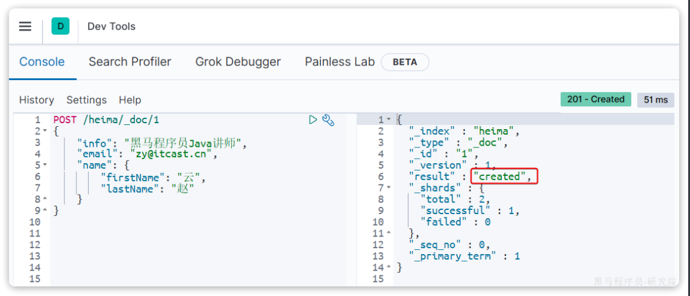
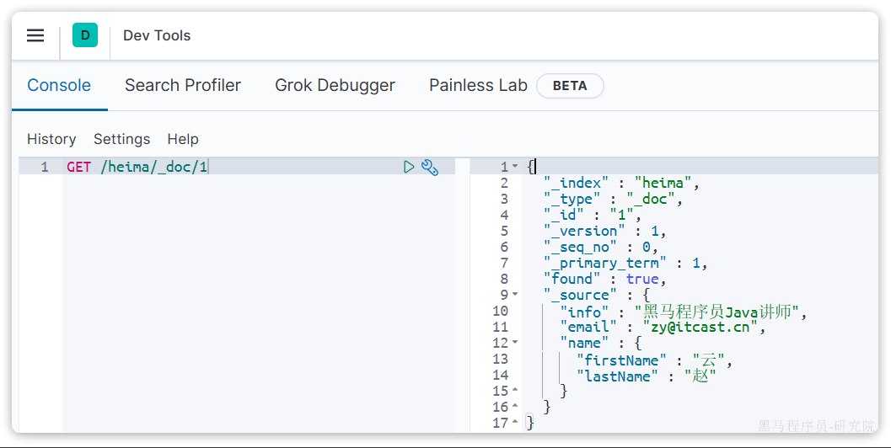
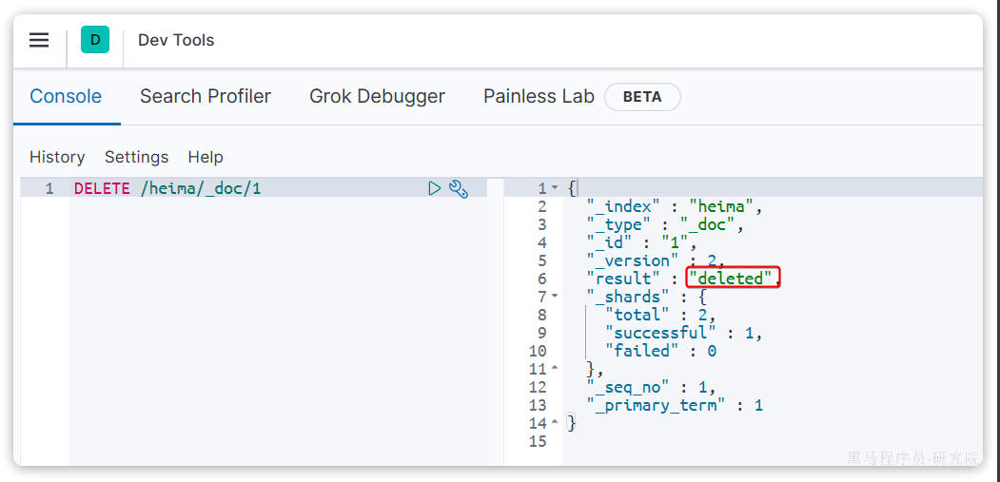
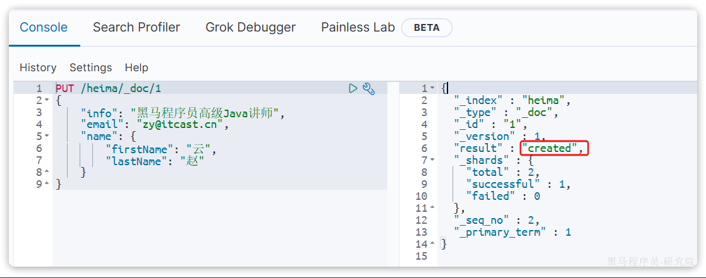
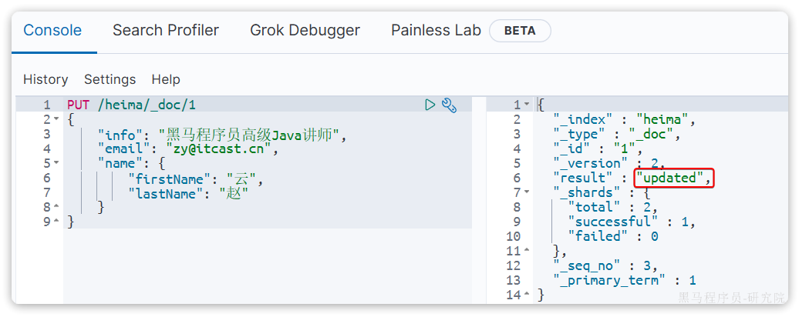
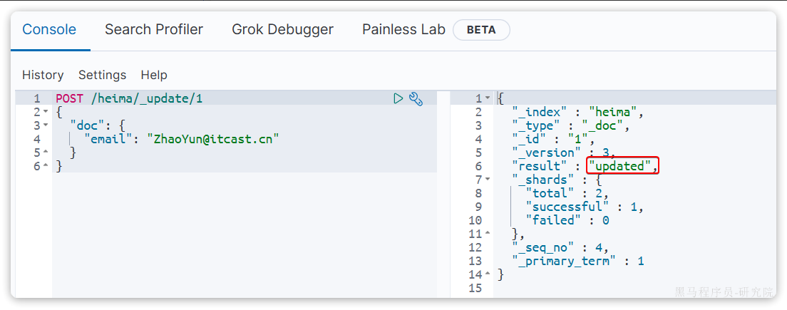

::: tip

1 新增文档

2 查询文档

3 删除文档

4 修改文档

5 批处理

6 总结

:::

有了索引库，接下来就可以向索引库中添加数据了。

Elasticsearch中的数据其实就是JSON风格的文档。操作文档自然保护`增`、`删`、`改`、`查`等几种常见操作，我们分别来学习。

## 1 新增文档

**语法：**

```json
POST /索引库名/_doc/文档id
{
    "字段1": "值1",
    "字段2": "值2",
    "字段3": {
        "子属性1": "值3",
        "子属性2": "值4"
    },
}
```

**示例：**

```json
POST /heima/_doc/1
{
    "info": "黑马程序员Java讲师",
    "email": "zy@itcast.cn",
    "name": {
        "firstName": "云",
        "lastName": "赵"
    }
}
```

**响应：**




## 2 查询文档

根据rest风格，新增是post，查询应该是get，不过查询一般都需要条件，这里我们把文档id带上。

**语法：**

```json
GET /{索引库名称}/_doc/{id}
```

**示例：**

```js
GET /heima/_doc/1
```

**查看结果：**




## 3 删除文档

删除使用DELETE请求，同样，需要根据id进行删除：

**语法：**

```js
DELETE /{索引库名}/_doc/id值
```

**示例：**

```json
DELETE /heima/_doc/1
```

**结果：**




## 4 修改文档

修改有两种方式：

- 全量修改：直接覆盖原来的文档
- 局部修改：修改文档中的部分字段

### 4.1 全量修改

全量修改是覆盖原来的文档，其本质是两步操作：

- 根据指定的id删除文档
- 新增一个相同id的文档

**注意**：如果根据id删除时，id不存在，第二步的新增也会执行，也就从修改变成了新增操作了。

**语法：**

```json
PUT /{索引库名}/_doc/文档id
{
    "字段1": "值1",
    "字段2": "值2",
    // ... 略
}
```

**示例：**

```json
PUT /heima/_doc/1
{
    "info": "黑马程序员高级Java讲师",
    "email": "zy@itcast.cn",
    "name": {
        "firstName": "云",
        "lastName": "赵"
    }
}
```

由于`id`为`1`的文档已经被删除，所以第一次执行时，得到的反馈是`created`：



所以如果执行第2次时，得到的反馈则是`updated`：




### 4.2 局部修改

局部修改是只修改指定id匹配的文档中的部分字段。

**语法：**

```json
POST /{索引库名}/_update/文档id
{
    "doc": {
         "字段名": "新的值",
    }
}
```

**示例：**

```json
POST /heima/_update/1
{
  "doc": {
    "email": "ZhaoYun@itcast.cn"
  }
}
```

**执行结果**：




## 5 批处理

批处理采用POST请求，基本语法如下：

```java
POST _bulk
{ "index" : { "_index" : "test", "_id" : "1" } }
{ "field1" : "value1" }
{ "delete" : { "_index" : "test", "_id" : "2" } }
{ "create" : { "_index" : "test", "_id" : "3" } }
{ "field1" : "value3" }
{ "update" : {"_id" : "1", "_index" : "test"} }
{ "doc" : {"field2" : "value2"} }
```

其中：

- `index`代表新增操作
  - `_index`：指定索引库名
  - `_id`指定要操作的文档id
  - `{ "field1" : "value1" }`：则是要新增的文档内容
- `delete`代表删除操作
  - `_index`：指定索引库名
  - `_id`指定要操作的文档id
- `update`代表更新操作
  - `_index`：指定索引库名
  - `_id`指定要操作的文档id
  - `{ "doc" : {"field2" : "value2"} }`：要更新的文档字段

示例，批量新增：

```java
POST /_bulk
{"index": {"_index":"heima", "_id": "3"}}
{"info": "黑马程序员C++讲师", "email": "ww@itcast.cn", "name":{"firstName": "五", "lastName":"王"}}
{"index": {"_index":"heima", "_id": "4"}}
{"info": "黑马程序员前端讲师", "email": "zhangsan@itcast.cn", "name":{"firstName": "三", "lastName":"张"}}
```

批量删除：

```java
POST /_bulk
{"delete":{"_index":"heima", "_id": "3"}}
{"delete":{"_index":"heima", "_id": "4"}}
```


## 6 总结

文档操作有哪些？

- 创建文档：`POST /{索引库名}/_doc/文档id   { json文档 }`
- 查询文档：`GET /{索引库名}/_doc/文档id`
- 删除文档：`DELETE /{索引库名}/_doc/文档id`
- 修改文档： 
  - 全量修改：`PUT /{索引库名}/_doc/文档id { json文档 }`
  - 局部修改：`POST /{索引库名}/``_update``/文档id { "doc": {字段}}`