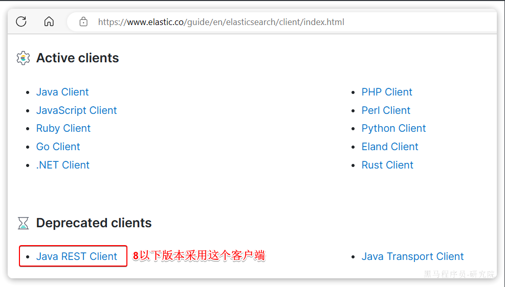
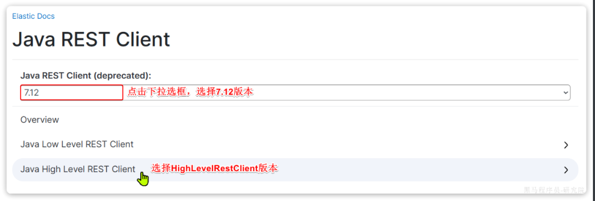
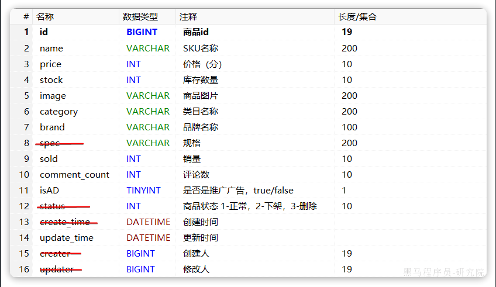
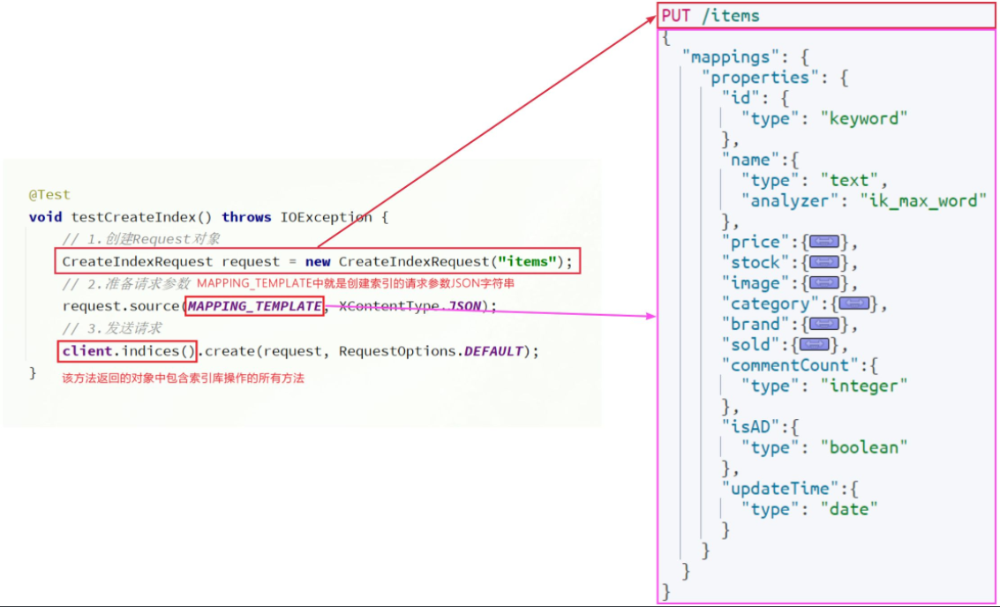

::: tip

1 初始化 RestClient

2 创建索引库

3 删除索引库

4 判断索引库是否存在

5 总结

:::

ES官方提供了各种不同语言的客户端，用来操作ES。这些客户端的本质就是组装DSL语句，通过http请求发送给ES。

官方文档地址：

https://www.elastic.co/guide/en/elasticsearch/client/index.html

由于ES目前最新版本是8.8，提供了全新版本的客户端，老版本的客户端已经被标记为过时。而我们采用的是7.12版本，因此只能使用老版本客户端：



然后选择7.12版本，HighLevelRestClient版本：




## 1 初始化 RestClient

在elasticsearch提供的API中，与elasticsearch一切交互都封装在一个名为`RestHighLevelClient`的类中，必须先完成这个对象的初始化，建立与elasticsearch的连接。

分为三步：

1）在`item-service`模块中引入`es`的`RestHighLevelClient`依赖：

```xml
<dependency>
    <groupId>org.elasticsearch.client</groupId>
    <artifactId>elasticsearch-rest-high-level-client</artifactId>
</dependency>
```

2）因为SpringBoot默认的ES版本是`7.17.10`，所以我们需要覆盖默认的ES版本：

```xml
  <properties>
      <maven.compiler.source>11</maven.compiler.source>
      <maven.compiler.target>11</maven.compiler.target>
      <elasticsearch.version>7.12.1</elasticsearch.version>
  </properties>
```

3）初始化RestHighLevelClient：

初始化的代码如下：

```java
RestHighLevelClient client = new RestHighLevelClient(RestClient.builder(
        HttpHost.create("http://192.168.150.101:9200")
));
```

这里为了单元测试方便，我们创建一个测试类`IndexTest`，然后将初始化的代码编写在`@BeforeEach`方法中：

```java
package com.hmall.item.es;

import org.apache.http.HttpHost;
import org.elasticsearch.client.RestClient;
import org.elasticsearch.client.RestHighLevelClient;
import org.junit.jupiter.api.AfterEach;
import org.junit.jupiter.api.BeforeEach;
import org.junit.jupiter.api.Test;

import java.io.IOException;

public class IndexTest {

    private RestHighLevelClient client;

    @BeforeEach
    void setUp() {
        this.client = new RestHighLevelClient(RestClient.builder(
                HttpHost.create("http://192.168.150.101:9200")
        ));
    }

    @Test
    void testConnect() {
        System.out.println(client);
    }

    @AfterEach
    void tearDown() throws IOException {
        this.client.close();
    }
}
```


## 2 创建索引库

由于要实现对商品搜索，所以我们需要将商品添加到Elasticsearch中，不过需要根据搜索业务的需求来设定索引库结构，而不是一股脑的把MySQL数据写入Elasticsearch.


### 1.1 Mapping 映射

搜索页面的效果如图所示：


实现搜索功能需要的字段包括三大部分：

- 搜索过滤字段
  - 分类
  - 品牌
  - 价格
- 排序字段
  - 默认：按照更新时间降序排序
  - 销量
  - 价格
- 展示字段
  - 商品id：用于点击后跳转
  - 图片地址
  - 是否是广告推广商品
  - 名称
  - 价格
  - 评价数量
  - 销量

对应的商品表结构如下，索引库无关字段已经划掉：



结合数据库表结构，以上字段对应的mapping映射属性如下：

| **字段名**   | **字段类型** | **类型说明**           | **是否****参与搜索** | **是否****参与分词** | **分词器** |
| ------------ | ------------ | ---------------------- | -------------------- | -------------------- | ---------- |
| id           | `long`       | 长整数                 |                      |                      | ——         |
| name         | `text`       | 字符串，参与分词搜索   |                      |                      | IK         |
| price        | `integer`    | 以分为单位，所以是整数 |                      |                      | ——         |
| stock        | `integer`    | 字符串，但需要分词     |                      |                      | ——         |
| image        | `keyword`    | 字符串，但是不分词     |                      |                      | ——         |
| category     | `keyword`    | 字符串，但是不分词     |                      |                      | ——         |
| brand        | `keyword`    | 字符串，但是不分词     |                      |                      | ——         |
| sold         | `integer`    | 销量，整数             |                      |                      | ——         |
| commentCount | `integer`    | 评价，整数             |                      |                      | ——         |
| isAD         | `boolean`    | 布尔类型               |                      |                      | ——         |
| updateTime   | `Date`       | 更新时间               |                      |                      | ——         |

因此，最终我们的索引库文档结构应该是这样：

```json
PUT /items
{
  "mappings": {
    "properties": {
      "id": {
        "type": "keyword"
      },
      "name":{
        "type": "text",
        "analyzer": "ik_max_word"
      },
      "price":{
        "type": "integer"
      },
      "stock":{
        "type": "integer"
      },
      "image":{
        "type": "keyword",
        "index": false
      },
      "category":{
        "type": "keyword"
      },
      "brand":{
        "type": "keyword"
      },
      "sold":{
        "type": "integer"
      },
      "commentCount":{
        "type": "integer",
        "index": false
      },
      "isAD":{
        "type": "boolean"
      },
      "updateTime":{
        "type": "date"
      }
    }
  }
}
```


### 1.2 创建索引

创建索引库的API如下：



代码分为三步：

- 1）创建Request对象。
  - 因为是创建索引库的操作，因此Request是`CreateIndexRequest`。
- 2）添加请求参数
  - 其实就是Json格式的Mapping映射参数。因为json字符串很长，这里是定义了静态字符串常量`MAPPING_TEMPLATE`，让代码看起来更加优雅。
- 3）发送请求
  - `client.indices()`方法的返回值是`IndicesClient`类型，封装了所有与索引库操作有关的方法。例如创建索引、删除索引、判断索引是否存在等

在`item-service`中的`IndexTest`测试类中，具体代码如下：

```java
@Test
void testCreateIndex() throws IOException {
    // 1.创建Request对象
    CreateIndexRequest request = new CreateIndexRequest("items");
    // 2.准备请求参数
    request.source(MAPPING_TEMPLATE, XContentType.JSON);
    // 3.发送请求
    client.indices().create(request, RequestOptions.DEFAULT);
}

static final String MAPPING_TEMPLATE = "{\n" +
            "  \"mappings\": {\n" +
            "    \"properties\": {\n" +
            "      \"id\": {\n" +
            "        \"type\": \"keyword\"\n" +
            "      },\n" +
            "      \"name\":{\n" +
            "        \"type\": \"text\",\n" +
            "        \"analyzer\": \"ik_max_word\"\n" +
            "      },\n" +
            "      \"price\":{\n" +
            "        \"type\": \"integer\"\n" +
            "      },\n" +
            "      \"stock\":{\n" +
            "        \"type\": \"integer\"\n" +
            "      },\n" +
            "      \"image\":{\n" +
            "        \"type\": \"keyword\",\n" +
            "        \"index\": false\n" +
            "      },\n" +
            "      \"category\":{\n" +
            "        \"type\": \"keyword\"\n" +
            "      },\n" +
            "      \"brand\":{\n" +
            "        \"type\": \"keyword\"\n" +
            "      },\n" +
            "      \"sold\":{\n" +
            "        \"type\": \"integer\"\n" +
            "      },\n" +
            "      \"commentCount\":{\n" +
            "        \"type\": \"integer\"\n" +
            "      },\n" +
            "      \"isAD\":{\n" +
            "        \"type\": \"boolean\"\n" +
            "      },\n" +
            "      \"updateTime\":{\n" +
            "        \"type\": \"date\"\n" +
            "      }\n" +
            "    }\n" +
            "  }\n" +
            "}";
```


## 3 删除索引库

删除索引库的请求非常简单：

```json
DELETE /hotel
```

与创建索引库相比：

- 请求方式从PUT变为DELTE
- 请求路径不变
- 无请求参数

所以代码的差异，注意体现在Request对象上。流程如下：

- 1）创建Request对象。这次是DeleteIndexRequest对象
- 2）准备参数。这里是无参，因此省略
- 3）发送请求。改用delete方法

在`item-service`中的`IndexTest`测试类中，编写单元测试，实现删除索引：

```java
@Test
void testDeleteIndex() throws IOException {
    // 1.创建Request对象
    DeleteIndexRequest request = new DeleteIndexRequest("items");
    // 2.发送请求
    client.indices().delete(request, RequestOptions.DEFAULT);
}
```


## 4 判断索引库是否存在

判断索引库是否存在，本质就是查询，对应的请求语句是：

```json
GET /hotel
```

因此与删除的Java代码流程是类似的，流程如下：

- 1）创建Request对象。这次是GetIndexRequest对象
- 2）准备参数。这里是无参，直接省略
- 3）发送请求。改用exists方法

```java
@Test
void testExistsIndex() throws IOException {
    // 1.创建Request对象
    GetIndexRequest request = new GetIndexRequest("items");
    // 2.发送请求
    boolean exists = client.indices().exists(request, RequestOptions.DEFAULT);
    // 3.输出
    System.err.println(exists ? "索引库已经存在！" : "索引库不存在！");
}
```


## 5 总结

索引库准备好以后，就可以操作文档了。为了与索引库操作分离，我们再次创建一个测试类，做两件事情：

- 初始化RestHighLevelClient
- 我们的商品数据在数据库，需要利用IHotelService去查询，所以注入这个接口

```java
package com.hmall.item.es;

import com.hmall.item.service.IItemService;
import org.apache.http.HttpHost;
import org.elasticsearch.client.RestClient;
import org.elasticsearch.client.RestHighLevelClient;
import org.junit.jupiter.api.AfterEach;
import org.junit.jupiter.api.BeforeEach;
import org.springframework.beans.factory.annotation.Autowired;
import org.springframework.boot.test.context.SpringBootTest;

import java.io.IOException;

@SpringBootTest(properties = "spring.profiles.active=local")
public class DocumentTest {

    private RestHighLevelClient client;
    @Autowired
    private IItemService itemService;

    @BeforeEach
    void setUp() {
        this.client = new RestHighLevelClient(RestClient.builder(
                HttpHost.create("http://192.168.150.101:9200")
        ));
    }
    
    @AfterEach
    void tearDown() throws IOException {
        this.client.close();
    }
}
```