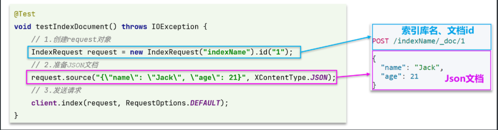
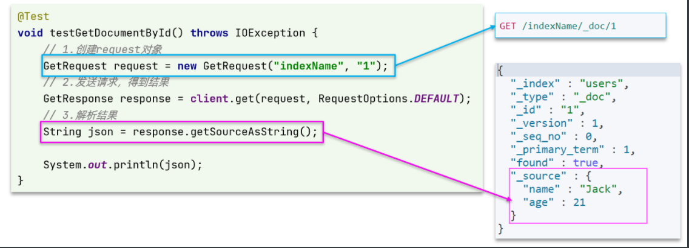
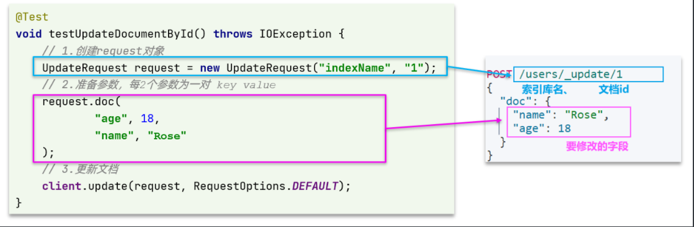
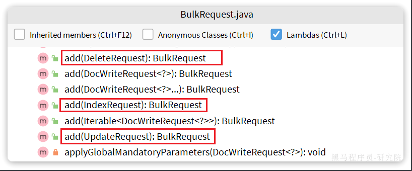

::: tip

1 新增文档

2 查询文档

3 删除文档

4 修改文档

5 批量导入文档

6 小结

:::

## 1 新增文档

我们需要将数据库中的商品信息导入elasticsearch中，而不是造假数据了。

### 1.1 实体类

索引库结构与数据库结构还存在一些差异，因此我们要定义一个索引库结构对应的实体。

在`hm-service`模块的`com.hmall.item.domain.dto`包中定义一个新的DTO：

```java
package com.hmall.item.domain.po;

import io.swagger.annotations.ApiModel;
import io.swagger.annotations.ApiModelProperty;
import lombok.Data;

import java.time.LocalDateTime;

@Data
@ApiModel(description = "索引库实体")
public class ItemDoc{

    @ApiModelProperty("商品id")
    private String id;

    @ApiModelProperty("商品名称")
    private String name;

    @ApiModelProperty("价格（分）")
    private Integer price;

    @ApiModelProperty("商品图片")
    private String image;

    @ApiModelProperty("类目名称")
    private String category;

    @ApiModelProperty("品牌名称")
    private String brand;

    @ApiModelProperty("销量")
    private Integer sold;

    @ApiModelProperty("评论数")
    private Integer commentCount;

    @ApiModelProperty("是否是推广广告，true/false")
    private Boolean isAD;

    @ApiModelProperty("更新时间")
    private LocalDateTime updateTime;
}
```


### 1.2 API 语法

新增文档的请求语法如下：

```JSON
POST /{索引库名}/_doc/1
{
    "name": "Jack",
    "age": 21
}
```

对应的JavaAPI如下：



可以看到与索引库操作的API非常类似，同样是三步走：

- 1）创建Request对象，这里是`IndexRequest`，因为添加文档就是创建倒排索引的过程
- 2）准备请求参数，本例中就是Json文档
- 3）发送请求

变化的地方在于，这里直接使用`client.xxx()`的API，不再需要`client.indices()`了。


### 1.3 完整代码

我们导入商品数据，除了参考API模板“三步走”以外，还需要做几点准备工作：

- 商品数据来自于数据库，我们需要先查询出来，得到`Item`对象
- `Item`对象需要转为`ItemDoc`对象
- `ItemDTO`需要序列化为`json`格式

因此，代码整体步骤如下：

- 1）根据id查询商品数据`Item`
- 2）将`Item`封装为`ItemDoc`
- 3）将`ItemDoc`序列化为JSON
- 4）创建IndexRequest，指定索引库名和id
- 5）准备请求参数，也就是JSON文档
- 6）发送请求

在`item-service`的`DocumentTest`测试类中，编写单元测试：

```java
@Test
void testAddDocument() throws IOException {
    // 1.根据id查询商品数据
    Item item = itemService.getById(100002644680L);
    // 2.转换为文档类型
    ItemDoc itemDoc = BeanUtil.copyProperties(item, ItemDoc.class);
    // 3.将ItemDTO转json
    String doc = JSONUtil.toJsonStr(itemDoc);

    // 1.准备Request对象
    IndexRequest request = new IndexRequest("items").id(itemDoc.getId());
    // 2.准备Json文档
    request.source(doc, XContentType.JSON);
    // 3.发送请求
    client.index(request, RequestOptions.DEFAULT);
}
```


## 2 查询文档

我们以根据id查询文档为例

### 2.1 语法说明

查询的请求语句如下：

```JSON
GET /{索引库名}/_doc/{id}
```

与之前的流程类似，代码大概分2步：

- 创建Request对象
- 准备请求参数，这里是无参，直接省略
- 发送请求

不过查询的目的是得到结果，解析为ItemDTO，还要再加一步对结果的解析。示例代码如下：



可以看到，响应结果是一个JSON，其中文档放在一个`_source`属性中，因此解析就是拿到`_source`，反序列化为Java对象即可。

其它代码与之前类似，流程如下：

- 1）准备Request对象。这次是查询，所以是`GetRequest`
- 2）发送请求，得到结果。因为是查询，这里调用`client.get()`方法
- 3）解析结果，就是对JSON做反序列化


### 2.2 完整代码

在`item-service`的`DocumentTest`测试类中，编写单元测试：

```java
@Test
void testGetDocumentById() throws IOException {
    // 1.准备Request对象
    GetRequest request = new GetRequest("items").id("100002644680");
    // 2.发送请求
    GetResponse response = client.get(request, RequestOptions.DEFAULT);
    // 3.获取响应结果中的source
    String json = response.getSourceAsString();
    
    ItemDoc itemDoc = JSONUtil.toBean(json, ItemDoc.class);
    System.out.println("itemDoc= " + ItemDoc);
}
```


## 3 删除文档

删除的请求语句如下：

```JSON
DELETE /hotel/_doc/{id}
```

与查询相比，仅仅是请求方式从`DELETE`变成`GET`，可以想象Java代码应该依然是2步走：

- 1）准备Request对象，因为是删除，这次是`DeleteRequest`对象。要指定索引库名和id
- 2）
- 3）发送请求。因为是删除，所以是`client.delete()`方法

在`item-service`的`DocumentTest`测试类中，编写单元测试：

```Java
@Test
void testDeleteDocument() throws IOException {
    // 1.准备Request，两个参数，第一个是索引库名，第二个是文档id
    DeleteRequest request = new DeleteRequest("item", "100002644680");
    // 2.发送请求
    client.delete(request, RequestOptions.DEFAULT);
}
```


## 4 修改文档

修改我们讲过两种方式：

- 全量修改：本质是先根据id删除，再新增
- 局部修改：修改文档中的指定字段值

在RestClient的API中，全量修改与新增的API完全一致，判断依据是ID：

- 如果新增时，ID已经存在，则修改
- 如果新增时，ID不存在，则新增

这里不再赘述，我们主要关注局部修改的API即可。


### 4.1  语法说明

局部修改的请求语法如下：

```json
POST /{索引库名}/_update/{id}
{
  "doc": {
    "字段名": "字段值",
    "字段名": "字段值"
  }
}
```

代码示例如图：



与之前类似，也是三步走：

- 1）准备`Request`对象。这次是修改，所以是`UpdateRequest`
- 2）准备参数。也就是JSON文档，里面包含要修改的字段
- 3）更新文档。这里调用`client.update()`方法


### 4.2  完整代码

在`item-service`的`DocumentTest`测试类中，编写单元测试：

```java
@Test
void testUpdateDocument() throws IOException {
    // 1.准备Request
    UpdateRequest request = new UpdateRequest("items", "100002644680");
    // 2.准备请求参数
    request.doc(
            "price", 58800,
            "commentCount", 1
    );
    // 3.发送请求
    client.update(request, RequestOptions.DEFAULT);
}
```


## 5 批量导入文档

在之前的案例中，我们都是操作单个文档。而数据库中的商品数据实际会达到数十万条，某些项目中可能达到数百万条。

我们如果要将这些数据导入索引库，肯定不能逐条导入，而是采用批处理方案。常见的方案有：

- 利用Logstash批量导入
  - 需要安装Logstash
  - 对数据的再加工能力较弱
  - 无需编码，但要学习编写Logstash导入配置
- 利用JavaAPI批量导入
  - 需要编码，但基于JavaAPI，学习成本低
  - 更加灵活，可以任意对数据做再加工处理后写入索引库

接下来，我们就学习下如何利用JavaAPI实现批量文档导入。


### 5.1 语法说明

批处理与前面讲的文档的CRUD步骤基本一致：

- 创建Request，但这次用的是`BulkRequest`
- 准备请求参数
- 发送请求，这次要用到`client.bulk()`方法

`BulkRequest`本身其实并没有请求参数，其本质就是将多个普通的CRUD请求组合在一起发送。例如：

- 批量新增文档，就是给每个文档创建一个`IndexRequest`请求，然后封装到`BulkRequest`中，一起发出。
- 批量删除，就是创建N个`DeleteRequest`请求，然后封装到`BulkRequest`，一起发出

因此`BulkRequest`中提供了`add`方法，用以添加其它CRUD的请求：



可以看到，能添加的请求有：

- `IndexRequest`，也就是新增
- `UpdateRequest`，也就是修改
- `DeleteRequest`，也就是删除

因此Bulk中添加了多个`IndexRequest`，就是批量新增功能了。示例：

```java
@Test
void testBulk() throws IOException {
    // 1.创建Request
    BulkRequest request = new BulkRequest();
    // 2.准备请求参数
    request.add(new IndexRequest("items").id("1").source("json doc1", XContentType.JSON));
    request.add(new IndexRequest("items").id("2").source("json doc2", XContentType.JSON));
    // 3.发送请求
    client.bulk(request, RequestOptions.DEFAULT);
}
```


### 5.2 完整代码

当我们要导入商品数据时，由于商品数量达到数十万，因此不可能一次性全部导入。建议采用循环遍历方式，每次导入1000条左右的数据。

`item-service`的`DocumentTest`测试类中，编写单元测试：

```java
@Test
void testLoadItemDocs() throws IOException {
    // 分页查询商品数据
    int pageNo = 1;
    int size = 1000;
    while (true) {
        Page<Item> page = itemService.lambdaQuery().eq(Item::getStatus, 1).page(new Page<Item>(pageNo, size));
        // 非空校验
        List<Item> items = page.getRecords();
        if (CollUtils.isEmpty(items)) {
            return;
        }
        log.info("加载第{}页数据，共{}条", pageNo, items.size());
        // 1.创建Request
        BulkRequest request = new BulkRequest("items");
        // 2.准备参数，添加多个新增的Request
        for (Item item : items) {
            // 2.1.转换为文档类型ItemDTO
            ItemDoc itemDoc = BeanUtil.copyProperties(item, ItemDoc.class);
            // 2.2.创建新增文档的Request对象
            request.add(new IndexRequest()
                            .id(itemDoc.getId())
                            .source(JSONUtil.toJsonStr(itemDoc), XContentType.JSON));
        }
        // 3.发送请求
        client.bulk(request, RequestOptions.DEFAULT);

        // 翻页
        pageNo++;
    }
}
```


## 6 小结

文档操作的基本步骤：

- 初始化`RestHighLevelClient`
- 创建XxxRequest。
  - XXX是`Index`、`Get`、`Update`、`Delete`、`Bulk`
- 准备参数（`Index`、`Update`、`Bulk`时需要）
- 发送请求。
  - 调用`RestHighLevelClient#.xxx()`方法，xxx是`index`、`get`、`update`、`delete`、`bulk`
- 解析结果（`Get`时需要）