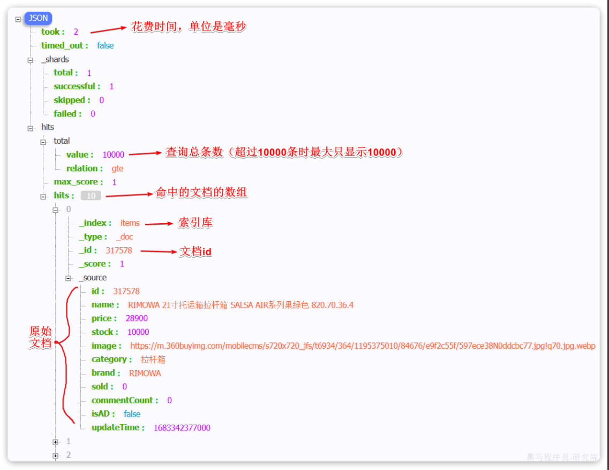

::: tip

1 快速入门

2 叶子查询

3 复合查询

4 排序

5 分页

6 高亮

7 总结

:::

在昨天的学习中，我们已经导入了大量数据到elasticsearch中，实现了商品数据的存储。不过查询商品数据时依然采用的是根据id查询，而非模糊搜索。

所以今天，我们来研究下elasticsearch的数据搜索功能。Elasticsearch提供了基于JSON的DSL（[Domain Specific Language](https://www.elastic.co/guide/en/elasticsearch/reference/7.12/query-dsl.html)）语句来定义查询条件，其JavaAPI就是在组织DSL条件。

因此，我们先学习DSL的查询语法，然后再基于DSL来对照学习JavaAPI，就会事半功倍。

Elasticsearch的查询可以分为两大类：

- **叶子查询（Leaf** **query** **clauses）**：一般是在特定的字段里查询特定值，属于简单查询，很少单独使用。
- **复合查询（Compound** **query** **clauses）**：以逻辑方式组合多个叶子查询或者更改叶子查询的行为方式。


## 1 快速入门

我们依然在Kibana的DevTools中学习查询的DSL语法。首先来看查询的语法结构：

```json
GET /{索引库名}/_search
{
  "query": {
    "查询类型": {
      // .. 查询条件
    }
  }
}
```

说明：

- `GET /{索引库名}/_search`：其中的`_search`是固定路径，不能修改

例如，我们以最简单的无条件查询为例，无条件查询的类型是：match_all，因此其查询语句如下：

```json
GET /items/_search
{
  "query": {
    "match_all": {
      
    }
  }
}
```

由于match_all无条件，所以条件位置不写即可。

执行结果如下：



你会发现虽然是match_all，但是响应结果中并不会包含索引库中的所有文档，而是仅有10条。这是因为处于安全考虑，elasticsearch设置了默认的查询页数。


## 2 叶子查询

叶子查询的类型也可以做进一步细分，详情大家可以查看官方文档：

https://www.elastic.co/guide/en/elasticsearch/reference/7.12/query-dsl.html

如图：


这里列举一些常见的，例如：

- **全文检索查询（Full Text Queries）**：利用分词器对用户输入搜索条件先分词，得到词条，然后再利用倒排索引搜索词条。例如：
  - `match`：
  - `multi_match`
- **精确查询（Term-level queries）**：不对用户输入搜索条件分词，根据字段内容精确值匹配。但只能查找keyword、数值、日期、boolean类型的字段。例如：
  - `ids`
  - `term`
  - `range`
- **地理坐标查询****：**用于搜索地理位置，搜索方式很多，例如：
  - `geo_bounding_box`：按矩形搜索
  - `geo_distance`：按点和半径搜索
- ...略


### 2.1 全文检索查询

全文检索的种类也很多，详情可以参考官方文档：

https://www.elastic.co/guide/en/elasticsearch/reference/7.12/full-text-queries.html

以全文检索中的`match`为例，语法如下：

```json
GET /{索引库名}/_search
{
  "query": {
    "match": {
      "字段名": "搜索条件"
    }
  }
}
```

示例：


与`match`类似的还有`multi_match`，区别在于可以同时对多个字段搜索，而且多个字段都要满足，语法示例：

```json
GET /{索引库名}/_search
{
  "query": {
    "multi_match": {
      "query": "搜索条件",
      "fields": ["字段1", "字段2"]
    }
  }
}
```

示例：


### 2.2 精确查询

精确查询，英文是`Term-level query`，顾名思义，词条级别的查询。也就是说不会对用户输入的搜索条件再分词，而是作为一个词条，与搜索的字段内容精确值匹配。因此推荐查找`keyword`、数值、日期、`boolean`类型的字段。例如：

- id
- price
- 城市
- 地名
- 人名

等等，作为一个整体才有含义的字段。

详情可以查看官方文档：

https://www.elastic.co/guide/en/elasticsearch/reference/7.12/term-level-queries.html

以`term`查询为例，其语法如下：

```json
GET /{索引库名}/_search
{
  "query": {
    "term": {
      "字段名": {
        "value": "搜索条件"
      }
    }
  }
}
```

示例：


当你输入的搜索条件不是词条，而是短语时，由于不做分词，你反而搜索不到：


再来看下`range`查询，语法如下：

```json
GET /{索引库名}/_search
{
  "query": {
    "range": {
      "字段名": {
        "gte": {最小值},
        "lte": {最大值}
      }
    }
  }
}
```

`range`是范围查询，对于范围筛选的关键字有：

- `gte`：大于等于
- `gt`：大于
- `lte`：小于等于
- `lt`：小于

示例：


## 3 复合查询

> 复合查询大致可以分为两类：
>
> - 第一类：基于逻辑运算组合叶子查询，实现组合条件，例如
>   - bool
> - 第二类：基于某种算法修改查询时的文档相关性算分，从而改变文档排名。例如：
>   - function_score
>   - dis_max
>
> 其它复合查询及相关语法可以参考官方文档：
>
> https://www.elastic.co/guide/en/elasticsearch/reference/7.12/compound-queries.html


### 3.1 算分函数查询 (选讲)

当我们利用match查询时，文档结果会根据与搜索词条的**关联度打分**（**_score**），返回结果时按照分值降序排列。

例如，我们搜索 "手机"，结果如下：


从elasticsearch5.1开始，采用的相关性打分算法是BM25算法，公式如下：


基于这套公式，就可以判断出某个文档与用户搜索的关键字之间的关联度，还是比较准确的。但是，在实际业务需求中，常常会有竞价排名的功能。不是相关度越高排名越靠前，而是掏的钱多的排名靠前。

例如在百度中搜索Java培训，排名靠前的就是广告推广：


要想认为控制相关性算分，就需要利用elasticsearch中的function score 查询了。

**基本语法**：

function score 查询中包含四部分内容：

- **原始查询**条件：query部分，基于这个条件搜索文档，并且基于BM25算法给文档打分，**原始算分**（query score)
- **过滤条件**：filter部分，符合该条件的文档才会重新算分
- **算分函数**：符合filter条件的文档要根据这个函数做运算，得到的**函数算分**（function score），有四种函数 
  - weight：函数结果是常量
  - field_value_factor：以文档中的某个字段值作为函数结果
  - random_score：以随机数作为函数结果
  - script_score：自定义算分函数算法
- **运算模式**：算分函数的结果、原始查询的相关性算分，两者之间的运算方式，包括： 
  - multiply：相乘
  - replace：用function score替换query score
  - 其它，例如：sum、avg、max、min

function score的运行流程如下：

- 1）根据**原始条件**查询搜索文档，并且计算相关性算分，称为**原始算分**（query score）
- 2）根据**过滤条件**，过滤文档
- 3）符合**过滤条件**的文档，基于**算分函数**运算，得到**函数算分**（function score）
- 4）将**原始算分**（query score）和**函数算分**（function score）基于**运算模式**做运算，得到最终结果，作为相关性算分。

因此，其中的关键点是：

- 过滤条件：决定哪些文档的算分被修改
- 算分函数：决定函数算分的算法
- 运算模式：决定最终算分结果

示例：给IPhone这个品牌的手机算分提高十倍，分析如下：

- 过滤条件：品牌必须为IPhone
- 算分函数：常量weight，值为10
- 算分模式：相乘multiply

对应代码如下：

```json
GET /hotel/_search
{
  "query": {
    "function_score": {
      "query": {  .... }, // 原始查询，可以是任意条件
      "functions": [ // 算分函数
        {
          "filter": { // 满足的条件，品牌必须是Iphone
            "term": {
              "brand": "Iphone"
            }
          },
          "weight": 10 // 算分权重为2
        }
      ],
      "boost_mode": "multipy" // 加权模式，求乘积
    }
  }
}
```


### 3.2 bool 查询

bool查询，即布尔查询。就是利用逻辑运算来组合一个或多个查询子句的组合。bool查询支持的逻辑运算有：

- must：必须匹配每个子查询，类似“与”
- should：选择性匹配子查询，类似“或”
- must_not：必须不匹配，**不参与算分**，类似“非”
- filter：必须匹配，**不参与算分**

bool查询的语法如下：

```json
GET /items/_search
{
  "query": {
    "bool": {
      "must": [
        {"match": {"name": "手机"}}
      ],
      "should": [
        {"term": {"brand": { "value": "vivo" }}},
        {"term": {"brand": { "value": "小米" }}}
      ],
      "must_not": [
        {"range": {"price": {"gte": 2500}}}
      ],
      "filter": [
        {"range": {"price": {"lte": 1000}}}
      ]
    }
  }
}
```

出于性能考虑，与搜索关键字无关的查询尽量采用must_not或filter逻辑运算，避免参与相关性算分。

例如黑马商城的搜索页面：


其中输入框的搜索条件肯定要参与相关性算分，可以采用match。但是价格范围过滤、品牌过滤、分类过滤等尽量采用filter，不要参与相关性算分。

比如，我们要搜索`手机`，但品牌必须是`华为`，价格必须是`900~1599`，那么可以这样写：

```json
GET /items/_search
{
  "query": {
    "bool": {
      "must": [
        {"match": {"name": "手机"}}
      ],
      "filter": [
        {"term": {"brand": { "value": "华为" }}},
        {"range": {"price": {"gte": 90000, "lt": 159900}}}
      ]
    }
  }
}
```


## 4 排序

elasticsearch默认是根据相关度算分（`_score`）来排序，但是也支持自定义方式对搜索结果排序。不过分词字段无法排序，能参与排序字段类型有：`keyword`类型、数值类型、地理坐标类型、日期类型等。

详细说明可以参考官方文档：

https://www.elastic.co/guide/en/elasticsearch/reference/7.12/sort-search-results.html

语法说明：

```json
GET /indexName/_search
{
  "query": {
    "match_all": {}
  },
  "sort": [
    {
      "排序字段": {
        "order": "排序方式asc和desc"
      }
    }
  ]
}
```

示例，我们按照商品价格排序：

```json
GET /items/_search
{
  "query": {
    "match_all": {}
  },
  "sort": [
    {
      "price": {
        "order": "desc"
      }
    }
  ]
}
```


## 5 分页

elasticsearch 默认情况下只返回top10的数据。而如果要查询更多数据就需要修改分页参数了。    

### 5.1 基础分页

elasticsearch中通过修改`from`、`size`参数来控制要返回的分页结果：

- `from`：从第几个文档开始
- `size`：总共查询几个文档

类似于mysql中的`limit ?, ?`

官方文档如下：

https://www.elastic.co/guide/en/elasticsearch/reference/7.12/paginate-search-results.html

语法如下：

```json
GET /items/_search
{
  "query": {
    "match_all": {}
  },
  "from": 0, // 分页开始的位置，默认为0
  "size": 10,  // 每页文档数量，默认10
  "sort": [
    {
      "price": {
        "order": "desc"
      }
    }
  ]
}
```


### 5.2 深度分页

elasticsearch的数据一般会采用分片存储，也就是把一个索引中的数据分成N份，存储到不同节点上。这种存储方式比较有利于数据扩展，但给分页带来了一些麻烦。

比如一个索引库中有100000条数据，分别存储到4个分片，每个分片25000条数据。现在每页查询10条，查询第99页。那么分页查询的条件如下：

```json
GET /items/_search
{
  "from": 990, // 从第990条开始查询
  "size": 10, // 每页查询10条
  "sort": [
    {
      "price": "asc"
    }
  ]
}
```

从语句来分析，要查询第990~1000名的数据。

从实现思路来分析，肯定是将所有数据排序，找出前1000名，截取其中的990~1000的部分。但问题来了，我们如何才能找到所有数据中的前1000名呢？

要知道每一片的数据都不一样，第1片上的第900~1000，在另1个节点上并不一定依然是900~1000名。所以我们只能在每一个分片上都找出排名前1000的数据，然后汇总到一起，重新排序，才能找出整个索引库中真正的前1000名，此时截取990~1000的数据即可。

如图：


试想一下，假如我们现在要查询的是第999页数据呢，是不是要找第9990~10000的数据，那岂不是需要把每个分片中的前10000名数据都查询出来，汇总在一起，在内存中排序？如果查询的分页深度更深呢，需要一次检索的数据岂不是更多？

由此可知，当查询分页深度较大时，汇总数据过多，对内存和CPU会产生非常大的压力。

因此elasticsearch会禁止`from+ size`` `超过10000的请求。

针对深度分页，elasticsearch提供了两种解决方案：

- `search after`：分页时需要排序，原理是从上一次的排序值开始，查询下一页数据。官方推荐使用的方式。
- `scroll`：原理将排序后的文档id形成快照，保存下来，基于快照做分页。官方已经不推荐使用。

详情见文档：

https://www.elastic.co/guide/en/elasticsearch/reference/7.12/paginate-search-results.html

> **总结：**
>
> 大多数情况下，我们采用普通分页就可以了。查看百度、京东等网站，会发现其分页都有限制。例如百度最多支持77页，每页不足20条。京东最多100页，每页最多60条。
>
> 因此，一般我们采用限制分页深度的方式即可，无需实现深度分页。


## 6 高亮

### 6.1 高亮原理

什么是高亮显示呢？

我们在百度，京东搜索时，关键字会变成红色，比较醒目，这叫高亮显示：


观察页面源码，你会发现两件事情：

- 高亮词条都被加了`<em>`标签
- `<em>`标签都添加了红色样式

css样式肯定是前端实现页面的时候写好的，但是前端编写页面的时候是不知道页面要展示什么数据的，不可能给数据加标签。而服务端实现搜索功能，要是有`elasticsearch`做分词搜索，是知道哪些词条需要高亮的。

因此词条的**高亮标签肯定是由服务端提供数据的时候已经加上的**。

因此实现高亮的思路就是：

- 用户输入搜索关键字搜索数据
- 服务端根据搜索关键字到elasticsearch搜索，并给搜索结果中的关键字词条添加`html`标签
- 前端提前给约定好的`html`标签添加`CSS`样式


### 6.2 实现高亮

事实上elasticsearch已经提供了给搜索关键字加标签的语法，无需我们自己编码。

基本语法如下：

```json
GET /{索引库名}/_search
{
  "query": {
    "match": {
      "搜索字段": "搜索关键字"
    }
  },
  "highlight": {
    "fields": {
      "高亮字段名称": {
        "pre_tags": "<em>",
        "post_tags": "</em>"
      }
    }
  }
}
```

**注意**：

- 搜索必须有查询条件，而且是全文检索类型的查询条件，例如`match`
- 参与高亮的字段必须是`text`类型的字段
- 默认情况下参与高亮的字段要与搜索字段一致，除非添加：`required_field_match=false`

示例：


## 7 总结

查询的DSL是一个大的JSON对象，包含下列属性：

- `query`：查询条件
- `from`和`size`：分页条件
- `sort`：排序条件
- `highlight`：高亮条件

示例：

