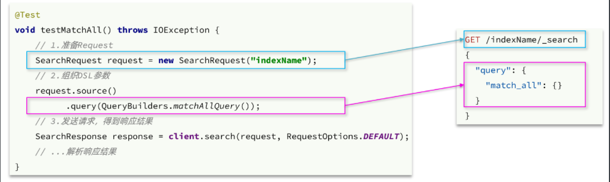
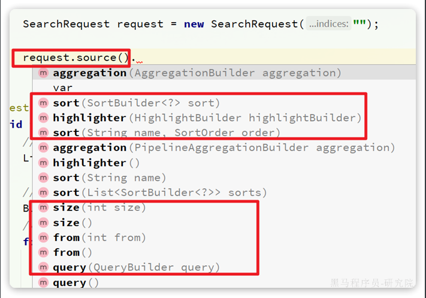
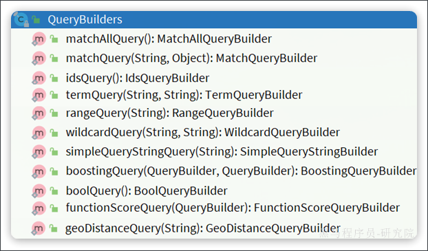
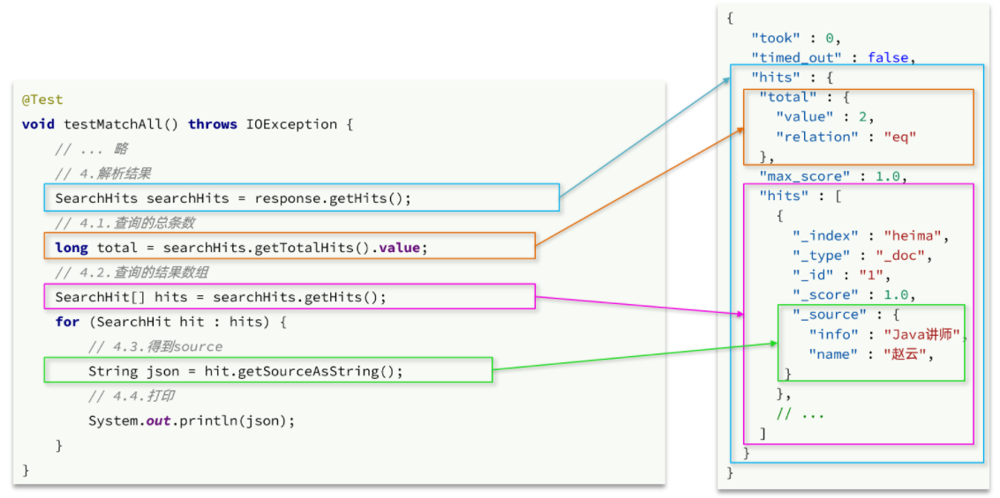
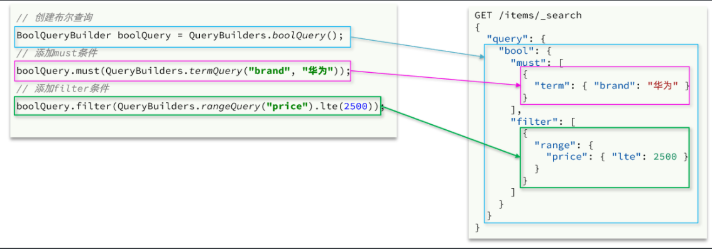
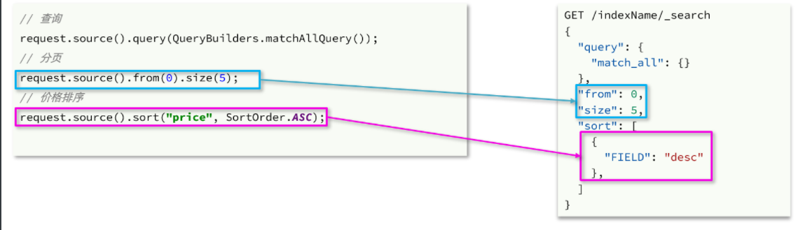
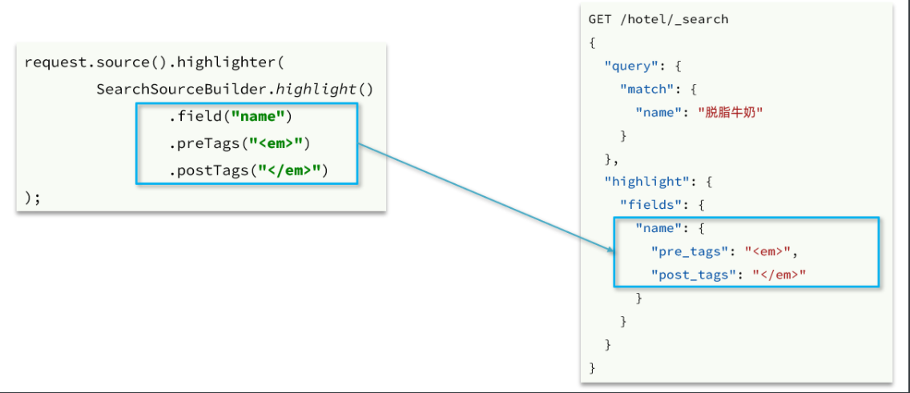
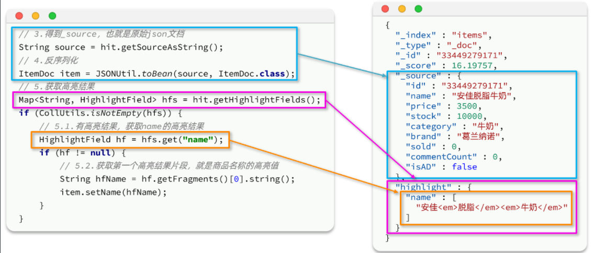

::: tip

1 快速入门

2 叶子查询

3 复合查询

4 排序和分页

5 高亮

:::

文档的查询依然使用昨天学习的 `RestHighLevelClient`对象，查询的基本步骤如下：

- 1）创建`request`对象，这次是搜索，所以是`SearchRequest`
- 2）准备请求参数，也就是查询DSL对应的JSON参数
- 3）发起请求
- 4）解析响应，响应结果相对复杂，需要逐层解析


## 1 快速入门

之前说过，由于Elasticsearch对外暴露的接口都是Restful风格的接口，因此JavaAPI调用就是在发送Http请求。而我们核心要做的就是利用**利用Java代码组织请求参数**，**解析响应结果**。

这个参数的格式完全参考DSL查询语句的JSON结构，因此我们在学习的过程中，会不断的把JavaAPI与DSL语句对比。大家在学习记忆的过程中，也应该这样对比学习。


### 1.1 发送请求

首先以`match_all`查询为例，其DSL和JavaAPI的对比如图：



代码解读：

-  第一步，创建`SearchRequest`对象，指定索引库名 
-  第二步，利用`request.source()`构建DSL，DSL中可以包含查询、分页、排序、高亮等 
  - `query()`：代表查询条件，利用`QueryBuilders.matchAllQuery()`构建一个`match_all`查询的DSL
-  第三步，利用`client.search()`发送请求，得到响应 

这里关键的API有两个，一个是`request.source()`，它构建的就是DSL中的完整JSON参数。其中包含了`query`、`sort`、`from`、`size`、`highlight`等所有功能：



另一个是`QueryBuilders`，其中包含了我们学习过的各种**叶子查询**、**复合查询**等：




### 1.2 解析响应结果

在发送请求以后，得到了响应结果`SearchResponse`，这个类的结构与我们在kibana中看到的响应结果JSON结构完全一致：

```json
{
    "took" : 0,
    "timed_out" : false,
    "hits" : {
        "total" : {
            "value" : 2,
            "relation" : "eq"
        },
        "max_score" : 1.0,
        "hits" : [
            {
                "_index" : "heima",
                "_type" : "_doc",
                "_id" : "1",
                "_score" : 1.0,
                "_source" : {
                "info" : "Java讲师",
                "name" : "赵云"
                }
            }
        ]
    }
}
```

因此，我们解析`SearchResponse`的代码就是在解析这个JSON结果，对比如下：



**代码解读**：

elasticsearch返回的结果是一个JSON字符串，结构包含：

- `hits`：命中的结果 
  - `total`：总条数，其中的value是具体的总条数值
  - `max_score`：所有结果中得分最高的文档的相关性算分
  - `hits`：搜索结果的文档数组，其中的每个文档都是一个json对象 
    - `_source`：文档中的原始数据，也是json对象

因此，我们解析响应结果，就是逐层解析JSON字符串，流程如下：

- `SearchHits`：通过`response.getHits()`获取，就是JSON中的最外层的`hits`，代表命中的结果 
  - `SearchHits#getTotalHits().value`：获取总条数信息
  - `SearchHits#getHits()`：获取`SearchHit`数组，也就是文档数组 
    - `SearchHit#getSourceAsString()`：获取文档结果中的`_source`，也就是原始的`json`文档数据


### 1.3 总结

文档搜索的基本步骤是：

1. 创建`SearchRequest`对象
2. 准备`request.source()`，也就是DSL。
   1. `QueryBuilders`来构建查询条件
   2. 传入`request.source()` 的` query() `方法
3. 发送请求，得到结果
4. 解析结果（参考JSON结果，从外到内，逐层解析）

完整代码如下：

```java
@Test
void testMatchAll() throws IOException {
    // 1.创建Request
    SearchRequest request = new SearchRequest("items");
    // 2.组织请求参数
    request.source().query(QueryBuilders.matchAllQuery());
    // 3.发送请求
    SearchResponse response = client.search(request, RequestOptions.DEFAULT);
    // 4.解析响应
    handleResponse(response);
}

private void handleResponse(SearchResponse response) {
    SearchHits searchHits = response.getHits();
    // 1.获取总条数
    long total = searchHits.getTotalHits().value;
    System.out.println("共搜索到" + total + "条数据");
    // 2.遍历结果数组
    SearchHit[] hits = searchHits.getHits();
    for (SearchHit hit : hits) {
        // 3.得到_source，也就是原始json文档
        String source = hit.getSourceAsString();
        // 4.反序列化并打印
        ItemDoc item = JSONUtil.toBean(source, ItemDoc.class);
        System.out.println(item);
    }
}
```


## 2 叶子查询

所有的查询条件都是由QueryBuilders来构建的，叶子查询也不例外。因此整套代码中变化的部分仅仅是query条件构造的方式，其它不动。

例如`match`查询：

```java
@Test
void testMatch() throws IOException {
    // 1.创建Request
    SearchRequest request = new SearchRequest("items");
    // 2.组织请求参数
    request.source().query(QueryBuilders.matchQuery("name", "脱脂牛奶"));
    // 3.发送请求
    SearchResponse response = client.search(request, RequestOptions.DEFAULT);
    // 4.解析响应
    handleResponse(response);
}
```

再比如`multi_match`查询：

```java
@Test
void testMultiMatch() throws IOException {
    // 1.创建Request
    SearchRequest request = new SearchRequest("items");
    // 2.组织请求参数
    request.source().query(QueryBuilders.multiMatchQuery("脱脂牛奶", "name", "category"));
    // 3.发送请求
    SearchResponse response = client.search(request, RequestOptions.DEFAULT);
    // 4.解析响应
    handleResponse(response);
}
```

还有`range`查询：

```java
@Test
void testRange() throws IOException {
    // 1.创建Request
    SearchRequest request = new SearchRequest("items");
    // 2.组织请求参数
    request.source().query(QueryBuilders.rangeQuery("price").gte(10000).lte(30000));
    // 3.发送请求
    SearchResponse response = client.search(request, RequestOptions.DEFAULT);
    // 4.解析响应
    handleResponse(response);
}
```

还有`term`查询：

```java
@Test
void testTerm() throws IOException {
    // 1.创建Request
    SearchRequest request = new SearchRequest("items");
    // 2.组织请求参数
    request.source().query(QueryBuilders.termQuery("brand", "华为"));
    // 3.发送请求
    SearchResponse response = client.search(request, RequestOptions.DEFAULT);
    // 4.解析响应
    handleResponse(response);
}
```


## 3 复合查询

复合查询也是由`QueryBuilders`来构建，我们以`bool`查询为例，DSL和JavaAPI的对比如图：



完整代码如下：

```java
@Test
void testBool() throws IOException {
    // 1.创建Request
    SearchRequest request = new SearchRequest("items");
    // 2.组织请求参数
    // 2.1.准备bool查询
    BoolQueryBuilder bool = QueryBuilders.boolQuery();
    // 2.2.关键字搜索
    bool.must(QueryBuilders.matchQuery("name", "脱脂牛奶"));
    // 2.3.品牌过滤
    bool.filter(QueryBuilders.termQuery("brand", "德亚"));
    // 2.4.价格过滤
    bool.filter(QueryBuilders.rangeQuery("price").lte(30000));
    request.source().query(bool);
    // 3.发送请求
    SearchResponse response = client.search(request, RequestOptions.DEFAULT);
    // 4.解析响应
    handleResponse(response);
}
```


## 4 排序和分页

之前说过，`requeset.source()`就是整个请求JSON参数，所以排序、分页都是基于这个来设置，其DSL和JavaAPI的对比如下：



完整示例代码：

```java
@Test
void testPageAndSort() throws IOException {
    int pageNo = 1, pageSize = 5;

    // 1.创建Request
    SearchRequest request = new SearchRequest("items");
    // 2.组织请求参数
    // 2.1.搜索条件参数
    request.source().query(QueryBuilders.matchQuery("name", "脱脂牛奶"));
    // 2.2.排序参数
    request.source().sort("price", SortOrder.ASC);
    // 2.3.分页参数
    request.source().from((pageNo - 1) * pageSize).size(pageSize);
    // 3.发送请求
    SearchResponse response = client.search(request, RequestOptions.DEFAULT);
    // 4.解析响应
    handleResponse(response);
}
```


## 5 高亮

高亮查询与前面的查询有两点不同：

- 条件同样是在`request.source()`中指定，只不过高亮条件要基于`HighlightBuilder`来构造
- 高亮响应结果与搜索的文档结果不在一起，需要单独解析

首先来看高亮条件构造，其DSL和JavaAPI的对比如图：



示例代码如下：

```java
@Test
void testHighlight() throws IOException {
    // 1.创建Request
    SearchRequest request = new SearchRequest("items");
    // 2.组织请求参数
    // 2.1.query条件
    request.source().query(QueryBuilders.matchQuery("name", "脱脂牛奶"));
    // 2.2.高亮条件
    request.source().highlighter(
            SearchSourceBuilder.highlight()
                    .field("name")
                    .preTags("<em>")
                    .postTags("</em>")
    );
    // 3.发送请求
    SearchResponse response = client.search(request, RequestOptions.DEFAULT);
    // 4.解析响应
    handleResponse(response);
}
```

再来看结果解析，文档解析的部分不变，主要是高亮内容需要单独解析出来，其DSL和JavaAPI的对比如图：



代码解读：

- 第`3、4`步：从结果中获取`_source`。`hit.getSourceAsString()`，这部分是非高亮结果，json字符串。还需要反序列为`ItemDoc`对象
- 第`5`步：获取高亮结果。`hit.getHighlightFields()`，返回值是一个`Map`，key是高亮字段名称，值是`HighlightField`对象，代表高亮值
- 第`5.1`步：从`Map`中根据高亮字段名称，获取高亮字段值对象`HighlightField`
- 第`5.2`步：从`HighlightField`中获取`Fragments`，并且转为字符串。这部分就是真正的高亮字符串了
- 最后：用高亮的结果替换`ItemDoc`中的非高亮结果

完整代码如下：

```java
private void handleResponse(SearchResponse response) {
    SearchHits searchHits = response.getHits();
    // 1.获取总条数
    long total = searchHits.getTotalHits().value;
    System.out.println("共搜索到" + total + "条数据");
    // 2.遍历结果数组
    SearchHit[] hits = searchHits.getHits();
    for (SearchHit hit : hits) {
        // 3.得到_source，也就是原始json文档
        String source = hit.getSourceAsString();
        // 4.反序列化
        ItemDoc item = JSONUtil.toBean(source, ItemDoc.class);
        // 5.获取高亮结果
        Map<String, HighlightField> hfs = hit.getHighlightFields();
        if (CollUtils.isNotEmpty(hfs)) {
            // 5.1.有高亮结果，获取name的高亮结果
            HighlightField hf = hfs.get("name");
            if (hf != null) {
                // 5.2.获取第一个高亮结果片段，就是商品名称的高亮值
                String hfName = hf.getFragments()[0].string();
                item.setName(hfName);
            }
        }
        System.out.println(item);
    }
}
```