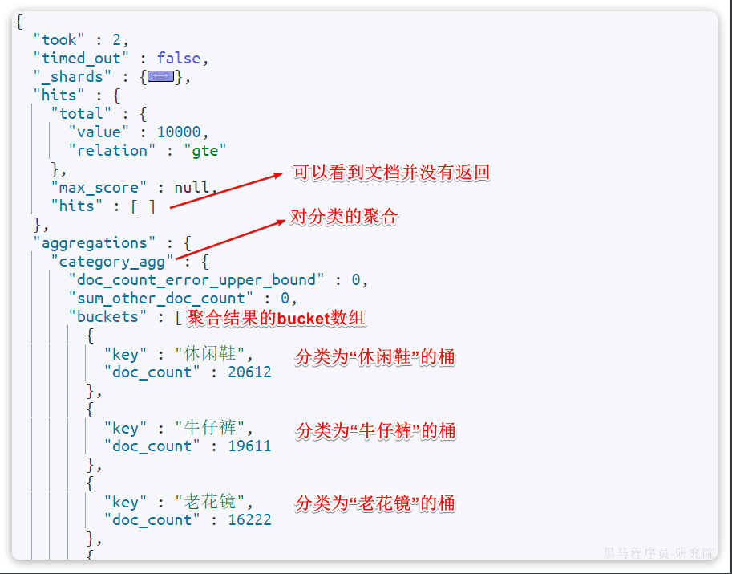
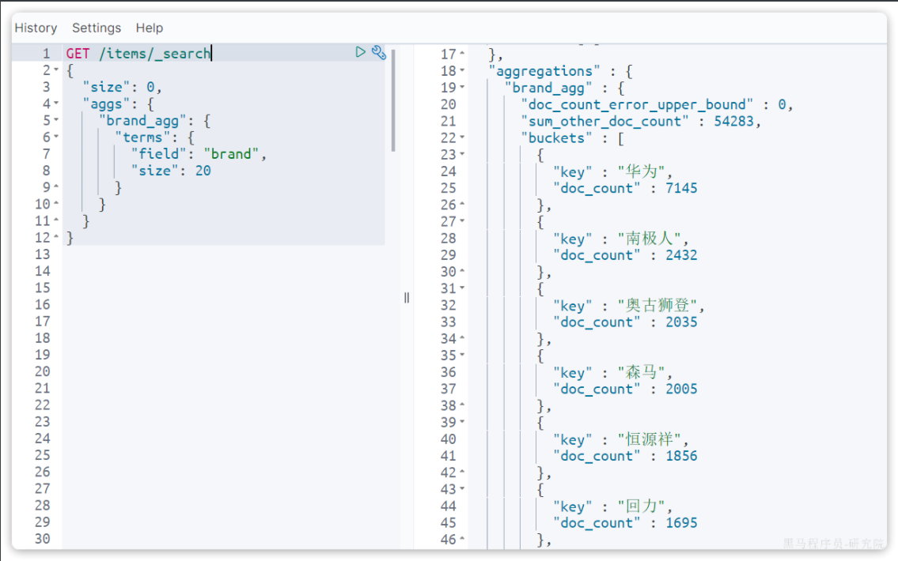
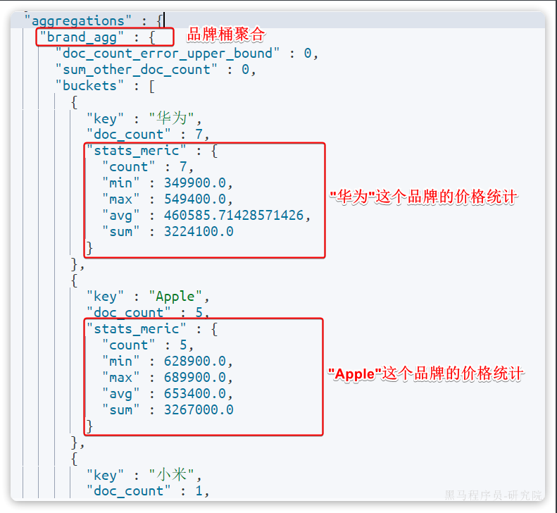
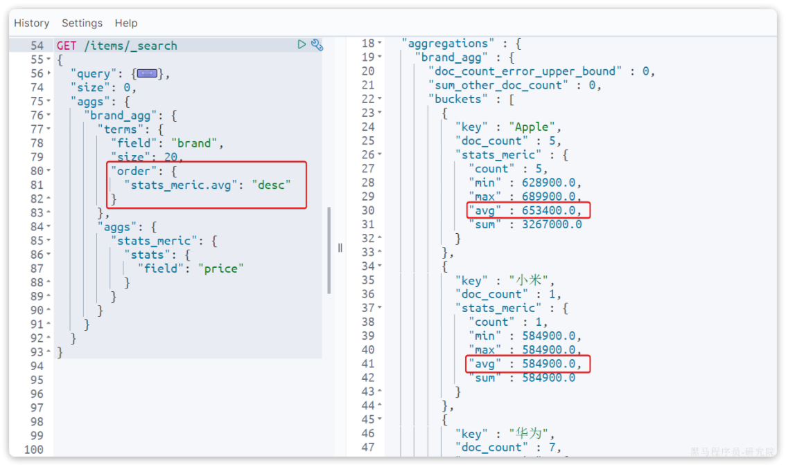
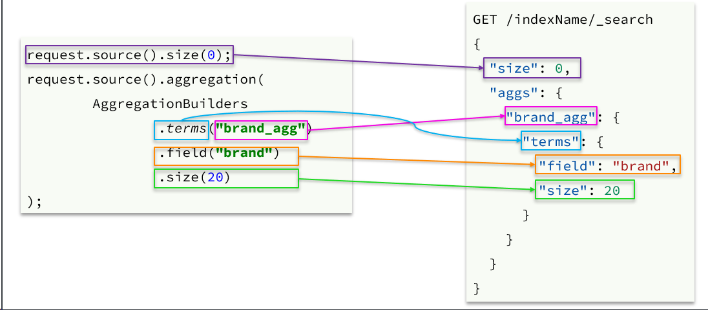
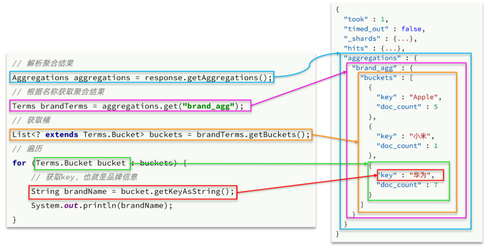

::: tip

1 DSL 实现聚合

2 RestClient 实现聚合

:::

聚合（`aggregations`）可以让我们极其方便的实现对数据的统计、分析、运算。例如：

- 什么品牌的手机最受欢迎？
- 这些手机的平均价格、最高价格、最低价格？
- 这些手机每月的销售情况如何？

实现这些统计功能的比数据库的sql要方便的多，而且查询速度非常快，可以实现近实时搜索效果。

官方文档：

https://www.elastic.co/guide/en/elasticsearch/reference/7.12/search-aggregations.html

聚合常见的有三类：

-  **桶（****`Bucket`****）**聚合：用来对文档做分组 
  - `TermAggregation`：按照文档字段值分组，例如按照品牌值分组、按照国家分组
  - `Date Histogram`：按照日期阶梯分组，例如一周为一组，或者一月为一组
-  **度量（****`Metric`****）**聚合：用以计算一些值，比如：最大值、最小值、平均值等 
  - `Avg`：求平均值
  - `Max`：求最大值
  - `Min`：求最小值
  - `Stats`：同时求`max`、`min`、`avg`、`sum`等
-  **管道（****`pipeline`****）**聚合：其它聚合的结果为基础做进一步运算 

**注意：**参加聚合的字段必须是keyword、日期、数值、布尔类型


## 1 DSL 实现聚合

与之前的搜索功能类似，我们依然先学习DSL的语法，再学习JavaAPI.

### 1.1 Bucket 聚合

例如我们要统计所有商品中共有哪些商品分类，其实就是以分类（category）字段对数据分组。category值一样的放在同一组，属于`Bucket`聚合中的`Term`聚合。

基本语法如下：

```json
GET /items/_search
{
  "size": 0, 
  "aggs": {
    "category_agg": {
      "terms": {
        "field": "category",
        "size": 20
      }
    }
  }
}
```

语法说明：

- `size`：设置`size`为0，就是每页查0条，则结果中就不包含文档，只包含聚合
- `aggs`：定义聚合
  - `category_agg`：聚合名称，自定义，但不能重复
    - `terms`：聚合的类型，按分类聚合，所以用`term`
      - `field`：参与聚合的字段名称
      - `size`：希望返回的聚合结果的最大数量

来看下查询的结果：




### 1.2 带条件聚合

默认情况下，Bucket聚合是对索引库的所有文档做聚合，例如我们统计商品中所有的品牌，结果如下：



可以看到统计出的品牌非常多。

但真实场景下，用户会输入搜索条件，因此聚合必须是对搜索结果聚合。那么聚合必须添加限定条件。

例如，我想知道价格高于3000元的手机品牌有哪些，该怎么统计呢？

我们需要从需求中分析出搜索查询的条件和聚合的目标：

- 搜索查询条件：
  - 价格高于3000
  - 必须是手机
- 聚合目标：统计的是品牌，肯定是对brand字段做term聚合

语法如下：

```json
GET /items/_search
{
  "query": {
    "bool": {
      "filter": [
        {
          "term": {
            "category": "手机"
          }
        },
        {
          "range": {
            "price": {
              "gte": 300000
            }
          }
        }
      ]
    }
  }, 
  "size": 0, 
  "aggs": {
    "brand_agg": {
      "terms": {
        "field": "brand",
        "size": 20
      }
    }
  }
}
```

聚合结果如下：

```json
{
  "took" : 2,
  "timed_out" : false,
  "hits" : {
    "total" : {
      "value" : 13,
      "relation" : "eq"
    },
    "max_score" : null,
    "hits" : [ ]
  },
  "aggregations" : {
    "brand_agg" : {
      "doc_count_error_upper_bound" : 0,
      "sum_other_doc_count" : 0,
      "buckets" : [
        {
          "key" : "华为",
          "doc_count" : 7
        },
        {
          "key" : "Apple",
          "doc_count" : 5
        },
        {
          "key" : "小米",
          "doc_count" : 1
        }
      ]
    }
  }
}
```

可以看到，结果中只剩下3个品牌了。


### 1.3 Metric 聚合

上节课，我们统计了价格高于3000的手机品牌，形成了一个个桶。现在我们需要对桶内的商品做运算，获取每个品牌价格的最小值、最大值、平均值。

这就要用到`Metric`聚合了，例如`stat`聚合，就可以同时获取`min`、`max`、`avg`等结果。

语法如下：

```json
GET /items/_search
{
  "query": {
    "bool": {
      "filter": [
        {
          "term": {
            "category": "手机"
          }
        },
        {
          "range": {
            "price": {
              "gte": 300000
            }
          }
        }
      ]
    }
  }, 
  "size": 0, 
  "aggs": {
    "brand_agg": {
      "terms": {
        "field": "brand",
        "size": 20
      },
      "aggs": {
        "stats_meric": {
          "stats": {
            "field": "price"
          }
        }
      }
    }
  }
}
```

`query`部分就不说了，我们重点解读聚合部分语法。

可以看到我们在`brand_agg`聚合的内部，我们新加了一个`aggs`参数。这个聚合就是`brand_agg`的子聚合，会对`brand_agg`形成的每个桶中的文档分别统计。

- `stats_meric`：聚合名称
  - `stats`：聚合类型，stats是`metric`聚合的一种
    - `field`：聚合字段，这里选择`price`，统计价格

由于stats是对brand_agg形成的每个品牌桶内文档分别做统计，因此每个品牌都会统计出自己的价格最小、最大、平均值。

结果如下：



另外，我们还可以让聚合按照每个品牌的价格平均值排序：




### 1.4 总结

aggs代表聚合，与query同级，此时query的作用是？

- 限定聚合的的文档范围

聚合必须的三要素：

- 聚合名称
- 聚合类型
- 聚合字段

聚合可配置属性有：

- size：指定聚合结果数量
- order：指定聚合结果排序方式
- field：指定聚合字段


## 2 RestClient 实现聚合

可以看到在DSL中，`aggs`聚合条件与`query`条件是同一级别，都属于查询JSON参数。因此依然是利用`request.source()`方法来设置。

不过聚合条件的要利用`AggregationBuilders`这个工具类来构造。DSL与JavaAPI的语法对比如下：



聚合结果与搜索文档同一级别，因此需要单独获取和解析。具体解析语法如下：



完整代码如下：

```java
@Test
void testAgg() throws IOException {
    // 1.创建Request
    SearchRequest request = new SearchRequest("items");
    // 2.准备请求参数
    BoolQueryBuilder bool = QueryBuilders.boolQuery()
            .filter(QueryBuilders.termQuery("category", "手机"))
            .filter(QueryBuilders.rangeQuery("price").gte(300000));
    request.source().query(bool).size(0);
    // 3.聚合参数
    request.source().aggregation(
            AggregationBuilders.terms("brand_agg").field("brand").size(5)
    );
    // 4.发送请求
    SearchResponse response = client.search(request, RequestOptions.DEFAULT);
    // 5.解析聚合结果
    Aggregations aggregations = response.getAggregations();
    // 5.1.获取品牌聚合
    Terms brandTerms = aggregations.get("brand_agg");
    // 5.2.获取聚合中的桶
    List<? extends Terms.Bucket> buckets = brandTerms.getBuckets();
    // 5.3.遍历桶内数据
    for (Terms.Bucket bucket : buckets) {
        // 5.4.获取桶内key
        String brand = bucket.getKeyAsString();
        System.out.print("brand = " + brand);
        long count = bucket.getDocCount();
        System.out.println("; count = " + count);
    }
}
```