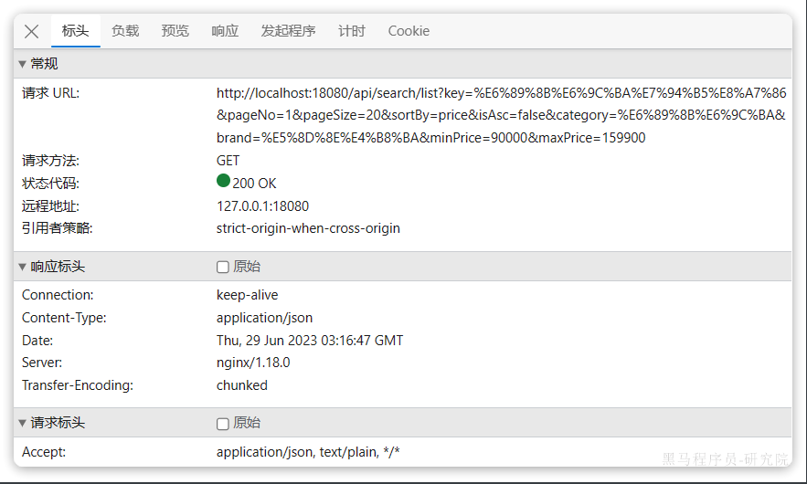
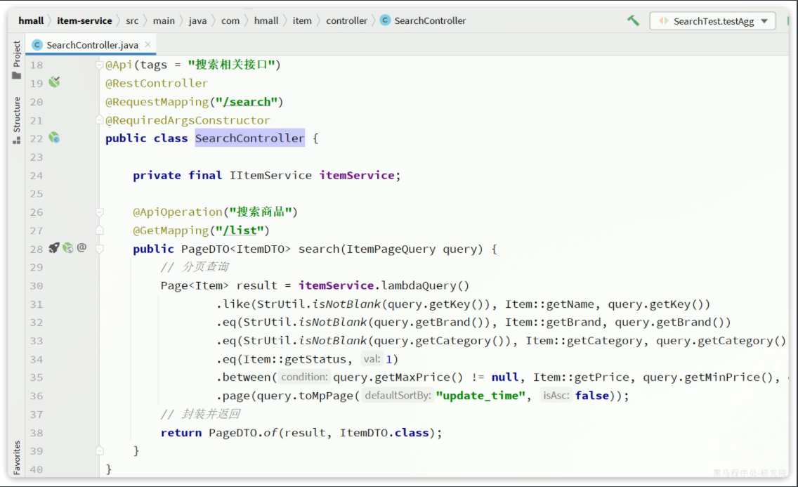
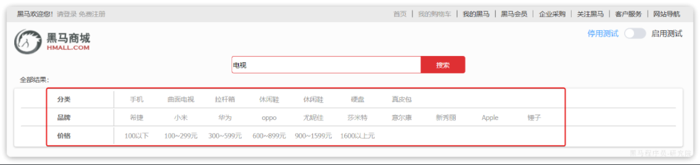
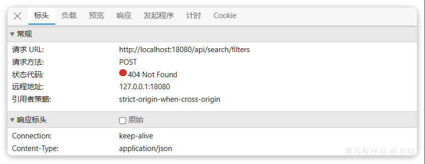
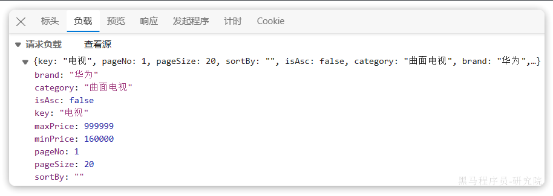

::: tip

1 实现搜索接口

2 过滤条件聚合

3 竞价排名

:::

Elasticsearch的基本语法我们已经学完，足以应对大多数搜索业务需求了。接下来大家就可以基于学习的知识实现商品搜索的业务了。

在昨天的作业中要求大家拆分一个独立的微服务：`search-service`，在这个微服务中实现搜索数据的导入、商品数据库数据与elasticsearch索引库数据的同步。

接下来的搜索功能也要在`search-service`服务中实现。


## 1 实现搜索接口

在黑马商城的搜索页面，输入关键字，点击搜索时，会发现前端会发起查询商品的请求：



请求的接口信息如下：

- **请求方式**：`GET`
- **请求路径**：`/search/list`
- **请求参数**：
  - **key**：搜索关键字
  - **pageNo**：页码
  - **pageSize**：每页大小
  - **sortBy**：排序字段
  - **isAsc**：是否升序
  - **category**：分类
  - **brand**：品牌
  - **minPrice**：价格最小值
  - **maxPrice**：价格最大值

请求参数可以参考原本`item-service`中`com.hmall.item.controller.SearchController`类中的基于数据库查询的接口：




## 2 过滤条件聚合

搜索页面的过滤项目前是写死的：



但是大家思考一下，随着搜索条件的变化，过滤条件展示的过滤项是不是应该跟着变化。

例如搜索`电视`，那么搜索结果中展示的肯定只有电视，而此时过滤条件中的**分类**就不能还出现手机、拉杆箱等内容。过滤条件的**品牌**中就不能出现与电视无关的品牌。而是应该展示搜索结果中存在的分类和品牌。

那么问题来，我们怎么知道搜索结果中存在哪些分类和品牌呢？

大家应该能想到，就是利用聚合，而且是带有限定条件的聚合。用户搜索的条件是什么，我们在对分类、品牌聚合时的条件也就是什么，这样就能统计出搜索结果中包含的分类、品牌了。

事实上，搜索时，前端已经发出了请求，尝试搜索栏中除价格以外的过滤项：



由于采用的是POST请求，所以参数在请求体中：



接口信息如下：

- **请求方式**：`POST`
- **请求路径**：`/search/filters`
- **请求参数**：
  - **key**：搜索关键字
  - **pageNo**：页码
  - **pageSize**：每页大小
  - **sortBy**：排序字段
  - **isAsc**：是否升序
  - **category**：分类
  - **brand**：品牌
  - **minPrice**：价格最小值
  - **maxPrice**：价格最大值

可见参数与搜索参数一致，不过这里大家可以忽略分页和排序参数。

返回值参考这个格式：

```json
{
  "category": ["手机", "曲面电视", "拉杆箱", "休闲鞋", "休闲鞋", "硬盘", "真皮包"],
  "brand": ["希捷", "小米", "华为", "oppo", "新秀丽", "Apple","锤子"]
}
```


## 3 竞价排名

elasticsearch的默认排序规则是按照相关性打分排序，而这个打分是可以通过API来控制的。详情可以参考复合查询中的算分函数查询（1.3.1小节）

对应的JavaAPI可以参考文档：

https://www.elastic.co/guide/en/elasticsearch/client/java-api/7.12/java-compound-queries.html

在商品的数据库表中，已经设计了`isAD`字段来标记广告商品，请利用`function_score`查询在原本搜索的结果基础上，让这些`isAD`字段值为`true`的商品排名到最前面。