::: tip

1 主从集群结构

2 搭建主从集群

3 主从同步原理

4 主从同步优化

:::

经过前几天的学习，大家已经掌握了微服务相关技术的实际应用，能够应对企业开发的要求了。不过大家都知道在IT领域往往都是面试造火箭，实际工作拧螺丝。

为了更好的应对面试，让大家能拿到更高的offer，我们接下来就讲讲“造火箭”的事情。

接下来的内容主要包括以下几方面：

Redis高级：

- Redis主从
- Redis哨兵
- Redis分片集群
- Redis数据结构
- Redis内存回收
- Redis缓存一致性

微服务高级：

- Eureka和Nacos对比
- Ribbon和SpringCloudLoadBalancer
- Hystix和Sentinel
- 限流算法

单节点Redis的并发能力是有上限的，要进一步提高Redis的并发能力，就需要搭建主从集群，实现读写分离。


## 1 主从集群结构

下图就是一个简单的Redis主从集群结构：

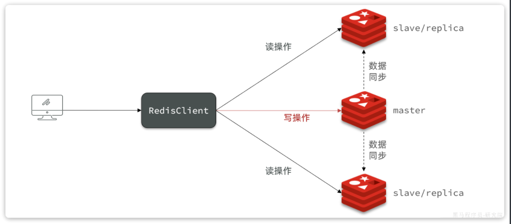

如图所示，集群中有一个master节点、两个slave节点（现在叫replica）。当我们通过Redis的Java客户端访问主从集群时，应该做好路由：

- 如果是写操作，应该访问master节点，master会自动将数据同步给两个slave节点
- 如果是读操作，建议访问各个slave节点，从而分担并发压力


## 2 搭建主从集群

我们会在同一个虚拟机中利用3个Docker容器来搭建主从集群，容器信息如下：

| **容器名** | **角色** | **IP**          | **映射****端口** |
| :--------- | :------- | :-------------- | :--------------- |
| r1         | master   | 192.168.150.101 | 7001             |
| r2         | slave    | 192.168.150.101 | 7002             |
| r3         | slave    | 192.168.150.101 | 7003             |


### 2.1 启动多个 Redis 实例

我们利用课前资料提供的docker-compose文件来构建主从集群：

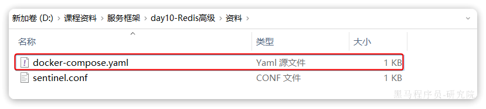

文件内容如下：

```yaml
version: "3.2"

services:
  r1:
    image: redis
    container_name: r1
    network_mode: "host"
    entrypoint: ["redis-server", "--port", "7001"]
  r2:
    image: redis
    container_name: r2
    network_mode: "host"
    entrypoint: ["redis-server", "--port", "7002"]
  r3:
    image: redis
    container_name: r3
    network_mode: "host"
    entrypoint: ["redis-server", "--port", "7003"]
```

将其上传至虚拟机的`/root/redis`目录下：

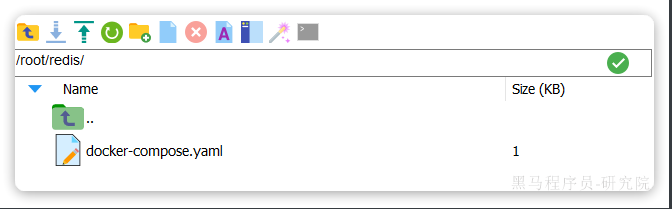

执行命令，运行集群：

```Bash
docker compose up -d
```

结果：

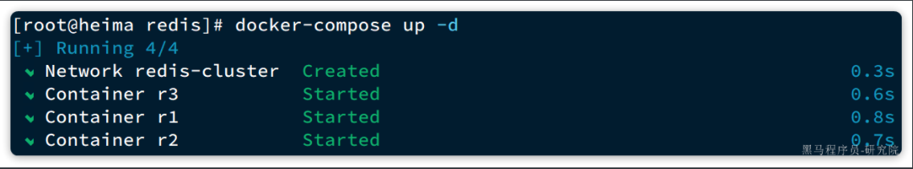

查看docker容器，发现都正常启动了：

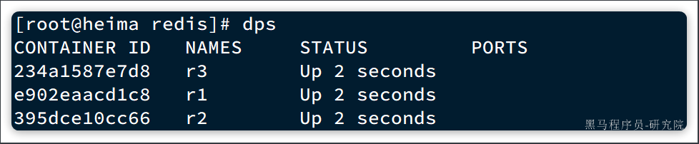

由于采用的是host模式，我们看不到端口映射。不过能直接在宿主机通过ps命令查看到Redis进程：

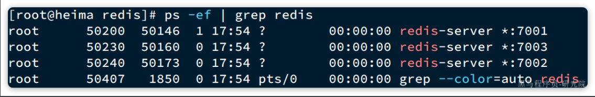


### 2.2 建立集群

虽然我们启动了3个Redis实例，但是它们并没有形成主从关系。我们需要通过命令来配置主从关系：

```bash
# Redis5.0以前
slaveof <masterip> <masterport>
# Redis5.0以后
replicaof <masterip> <masterport>
```

有临时和永久两种模式：

- 永久生效：在redis.conf文件中利用`slaveof`命令指定`master`节点
- 临时生效：直接利用redis-cli控制台输入`slaveof`命令，指定`master`节点

我们测试临时模式，首先连接`r2`，让其以`r1`为master

```bash
# 连接r2
docker exec -it r2 redis-cli -p 7002
# 认r1主，也就是7001
slaveof 192.168.150.101 7001
```

然后连接`r3`，让其以`r1`为master

```bash
# 连接r3
docker exec -it r3 redis-cli -p 7003
# 认r1主，也就是7001
slaveof 192.168.150.101 7001
```

然后连接`r1`，查看集群状态：

```bash
# 连接r1
docker exec -it r1 redis-cli -p 7001
# 查看集群状态
info replication
```

结果如下：

```bash
127.0.0.1:7001> info replication
# Replication
role:master
connected_slaves:2
slave0:ip=192.168.150.101,port=7002,state=online,offset=140,lag=1
slave1:ip=192.168.150.101,port=7003,state=online,offset=140,lag=1
master_failover_state:no-failover
master_replid:16d90568498908b322178ca12078114e6c518b86
master_replid2:0000000000000000000000000000000000000000
master_repl_offset:140
second_repl_offset:-1
repl_backlog_active:1
repl_backlog_size:1048576
repl_backlog_first_byte_offset:1
repl_backlog_histlen:140
```

可以看到，当前节点`r1:7001`的角色是`master`，有两个slave与其连接：

- `slave0`：`port`是`7002`，也就是`r2`节点
- `slave1`：`port`是`7003`，也就是`r3`节点


### 2.3 测试

依次在`r1`、`r2`、`r3`节点上执行下面命令：

```bash
set num 123

get num
```

你会发现，只有在`r1`这个节点上可以执行`set`命令（**写操作**），其它两个节点只能执行`get`命令（**读操作**）。也就是说读写操作已经分离了。


## 3 主从同步原理

在刚才的主从测试中，我们发现`r1`上写入Redis的数据，在`r2`和`r3`上也能看到，这说明主从之间确实完成了数据同步。

那么这个同步是如何完成的呢？


### 3.1 全量同步

主从第一次建立连接时，会执行**全量同步**，将master节点的所有数据都拷贝给slave节点，流程：

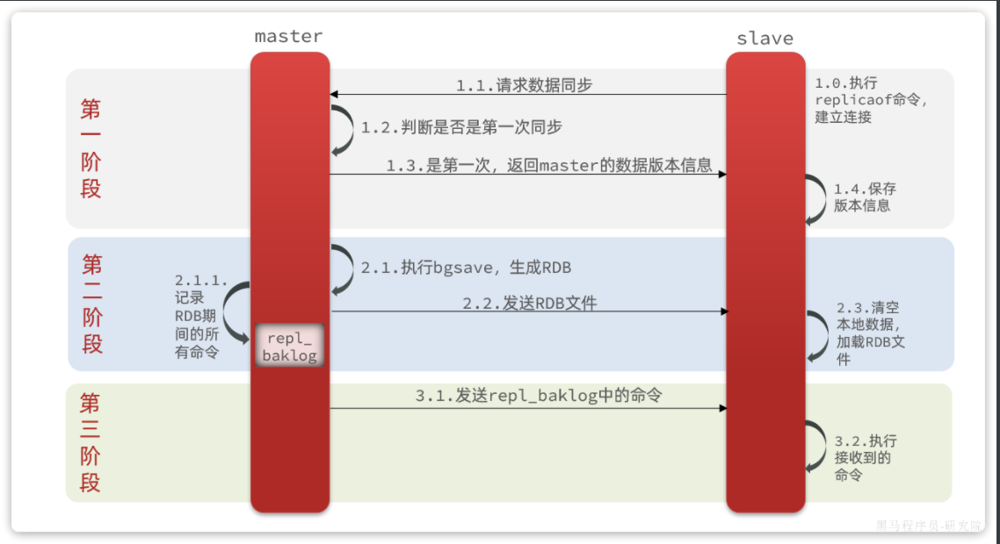

这里有一个问题，`master`如何得知`salve`是否是第一次来同步呢？？

有几个概念，可以作为判断依据：

- **`Replication Id`**：简称`replid`，是数据集的标记，replid一致则是同一数据集。每个`master`都有唯一的`replid`，`slave`则会继承`master`节点的`replid`
- **`offset`**：偏移量，随着记录在`repl_baklog`中的数据增多而逐渐增大。`slave`完成同步时也会记录当前同步的`offset`。如果`slave`的`offset`小于`master`的`offset`，说明`slave`数据落后于`master`，需要更新。

因此`slave`做数据同步，必须向`master`声明自己的`replication id `和`offset`，`master`才可以判断到底需要同步哪些数据。

由于我们在执行`slaveof`命令之前，所有redis节点都是`master`，有自己的`replid`和`offset`。

当我们第一次执行`slaveof`命令，与`master`建立主从关系时，发送的`replid`和`offset`是自己的，与`master`肯定不一致。

`master`判断发现`slave`发送来的`replid`与自己的不一致，说明这是一个全新的slave，就知道要做全量同步了。

`master`会将自己的`replid`和`offset`都发送给这个`slave`，`slave`保存这些信息到本地。自此以后`slave`的`replid`就与`master`一致了。

因此，**master****判断一个节点是否是第一次同步的依据，就是看replid是否一致**。流程如图：

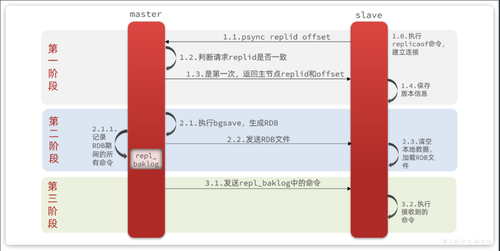

完整流程描述：

- `slave`节点请求增量同步
- `master`节点判断`replid`，发现不一致，拒绝增量同步
- `master`将完整内存数据生成`RDB`，发送`RDB`到`slave`
- `slave`清空本地数据，加载`master`的`RDB`
- `master`将`RDB`期间的命令记录在`repl_baklog`，并持续将log中的命令发送给`slave`
- `slave`执行接收到的命令，保持与`master`之间的同步

来看下`r1`节点的运行日志：

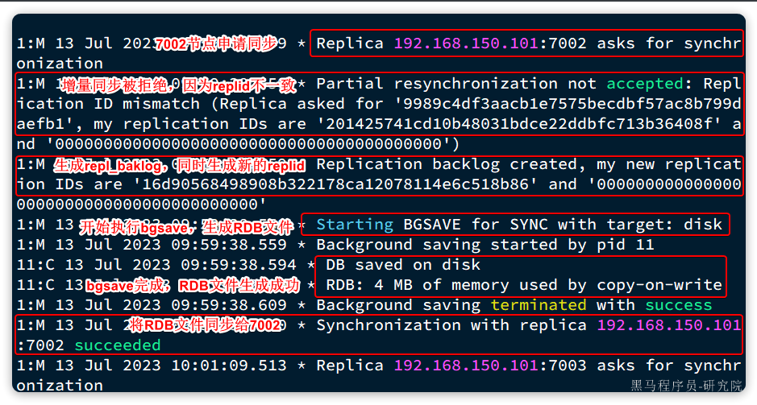

再看下`r2`节点执行`replicaof`命令时的日志：

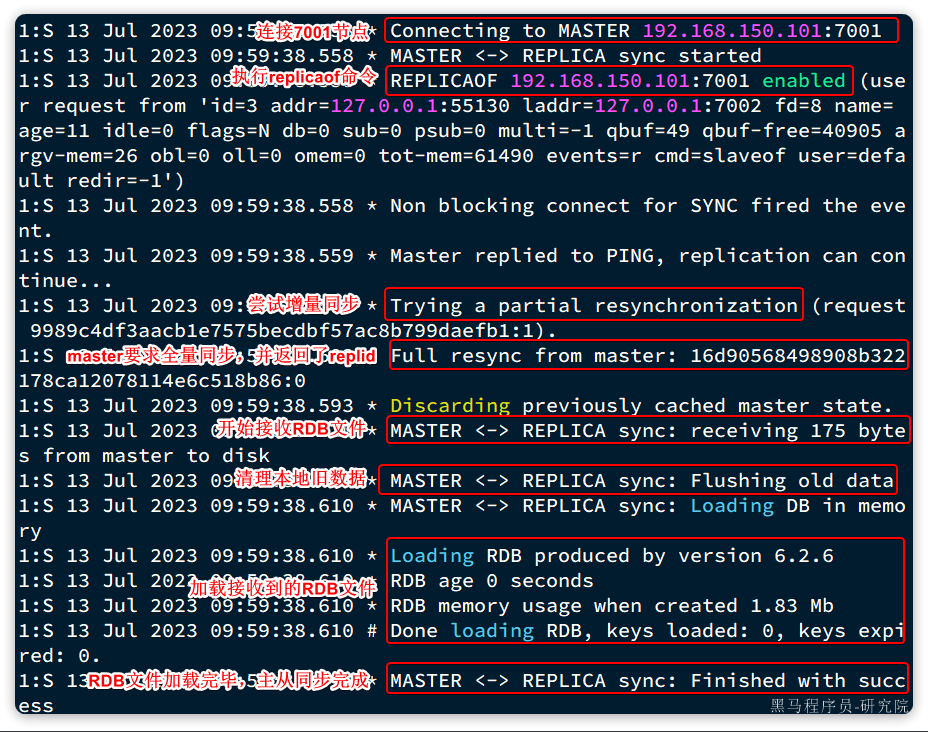

与我们描述的完全一致。


### 3.2 增量同步

全量同步需要先做RDB，然后将RDB文件通过网络传输个slave，成本太高了。因此除了第一次做全量同步，其它大多数时候slave与master都是做**增量同步**。

什么是增量同步？就是只更新slave与master存在差异的部分数据。如图：

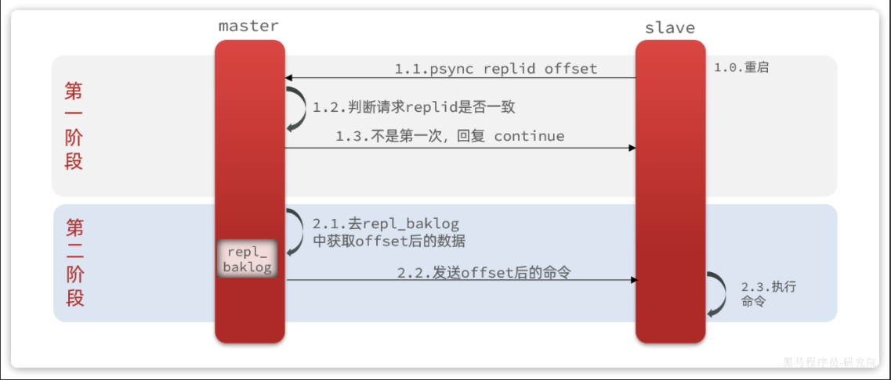

那么master怎么知道slave与自己的数据差异在哪里呢?


### 3.3 repl_baklog 原理

master怎么知道slave与自己的数据差异在哪里呢?

这就要说到全量同步时的`repl_baklog`文件了。这个文件是一个固定大小的数组，只不过数组是环形，也就是说**角标到达数组末尾后，会再次从0开始读写**，这样数组头部的数据就会被覆盖。

`repl_baklog`中会记录Redis处理过的命令及`offset`，包括master当前的`offset`，和slave已经拷贝到的`offset`：

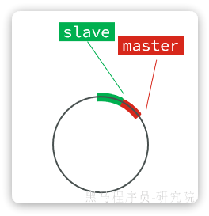

slave与master的offset之间的差异，就是salve需要增量拷贝的数据了。

随着不断有数据写入，master的offset逐渐变大，slave也不断的拷贝，追赶master的offset：

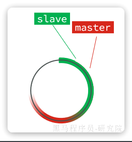

直到数组被填满：

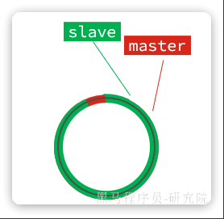

此时，如果有新的数据写入，就会覆盖数组中的旧数据。不过，旧的数据只要是绿色的，说明是已经被同步到slave的数据，即便被覆盖了也没什么影响。因为未同步的仅仅是红色部分：

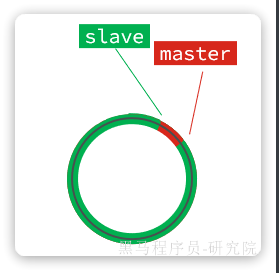

但是，如果slave出现网络阻塞，导致master的`offset`远远超过了slave的`offset`： 

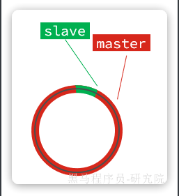

如果master继续写入新数据，master的`offset`就会覆盖`repl_baklog`中旧的数据，直到将slave现在的`offset`也覆盖：

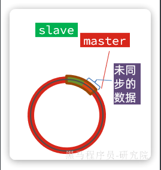

棕色框中的红色部分，就是尚未同步，但是却已经被覆盖的数据。此时如果slave恢复，需要同步，却发现自己的`offset`都没有了，无法完成增量同步了。只能做**全量同步**。

`repl_baklog`大小有上限，写满后会覆盖最早的数据。如果slave断开时间过久，导致尚未备份的数据被覆盖，则无法基于`repl_baklog`做增量同步，只能再次全量同步。


## 4 主从同步优化

主从同步可以保证主从数据的一致性，非常重要。

可以从以下几个方面来优化Redis主从就集群：

- 在master中配置`repl-diskless-sync  yes`启用无磁盘复制，避免全量同步时的磁盘IO。
- Redis单节点上的内存占用不要太大，减少RDB导致的过多磁盘IO
- 适当提高`repl_baklog`的大小，发现slave宕机时尽快实现故障恢复，尽可能避免全量同步
- 限制一个master上的slave节点数量，如果实在是太多slave，则可以采用`主-从-从`链式结构，减少master压力

`主-从-从`架构图：

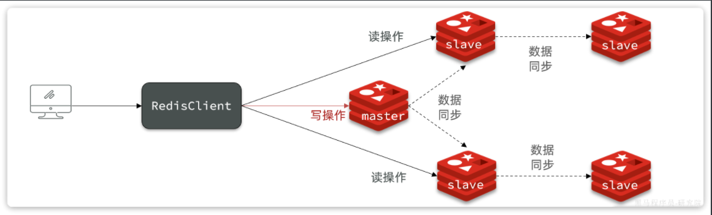

简述全量同步和增量同步区别？

- 全量同步：master将完整内存数据生成RDB，发送RDB到slave。后续命令则记录在repl_baklog，逐个发送给slave。
- 增量同步：slave提交自己的offset到master，master获取repl_baklog中从offset之后的命令给slave

什么时候执行全量同步？

- slave节点第一次连接master节点时
- slave节点断开时间太久，repl_baklog中的offset已经被覆盖时

什么时候执行增量同步？

- slave节点断开又恢复，并且在`repl_baklog`中能找到offset时