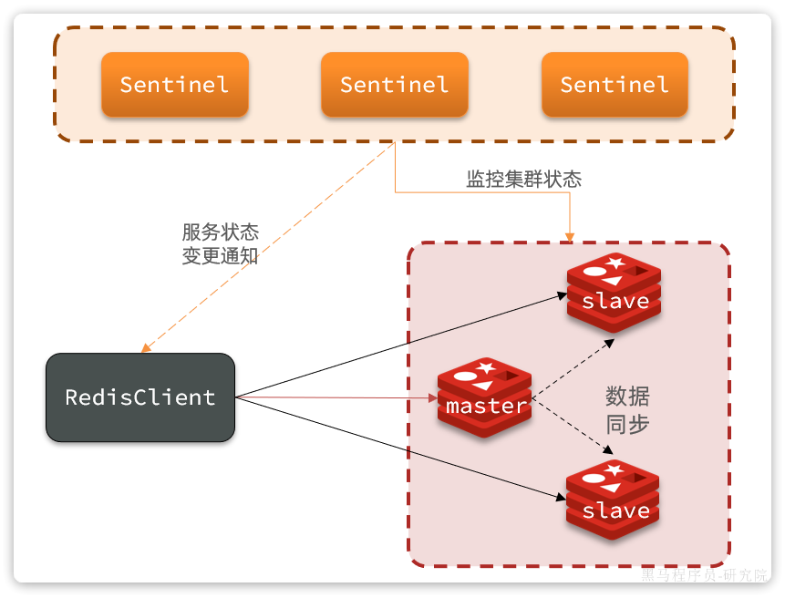
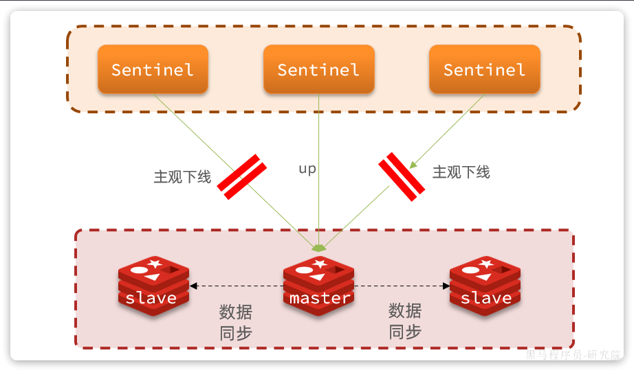
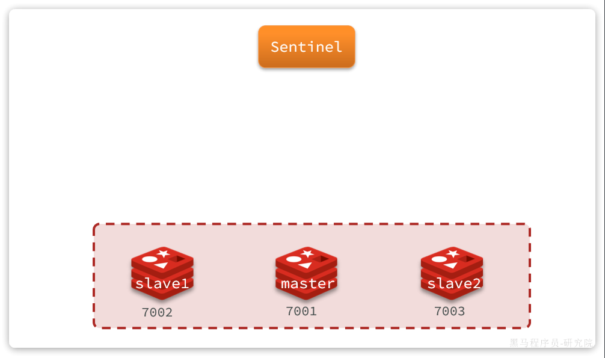
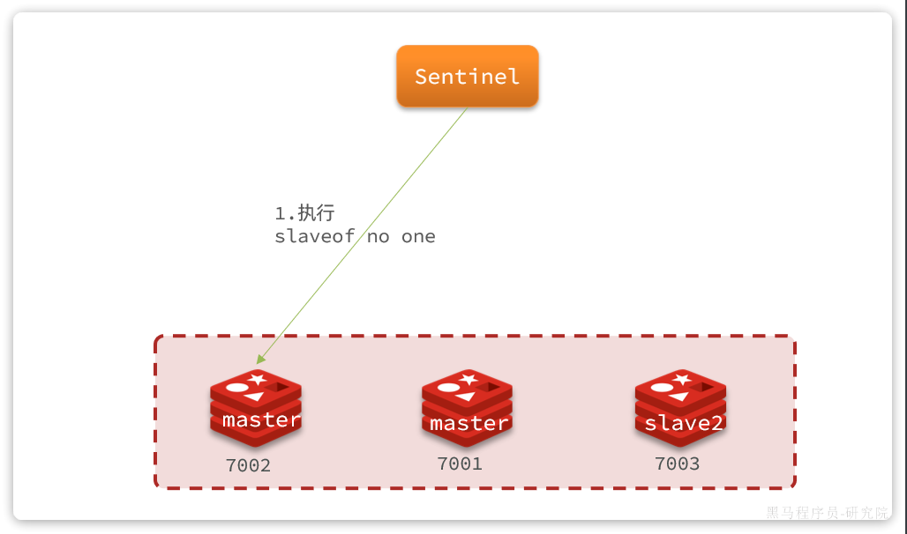
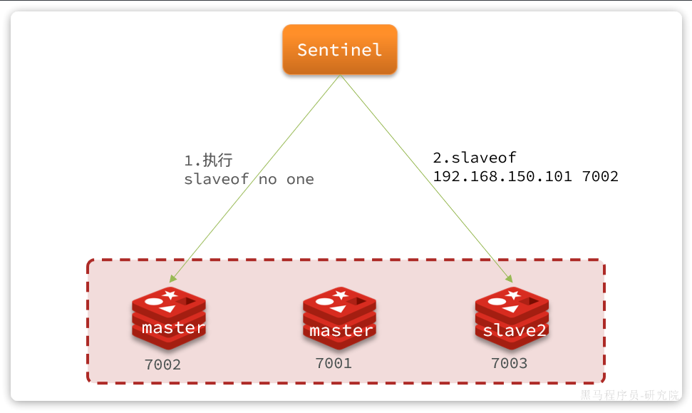
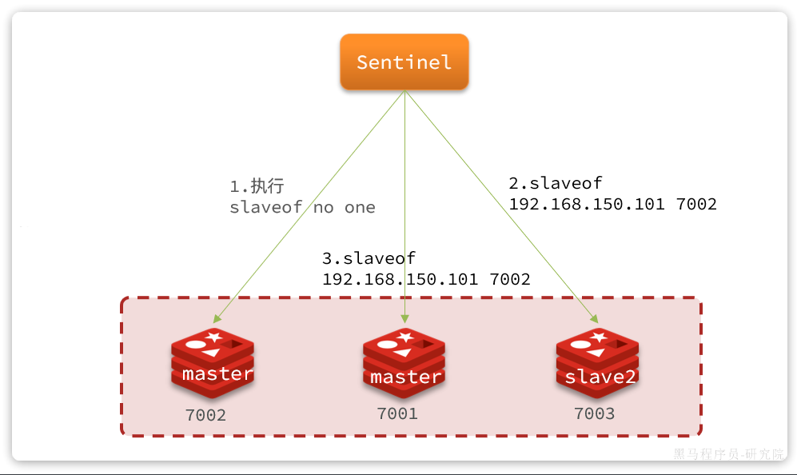
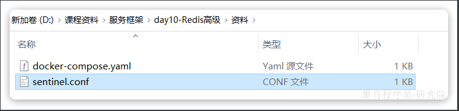
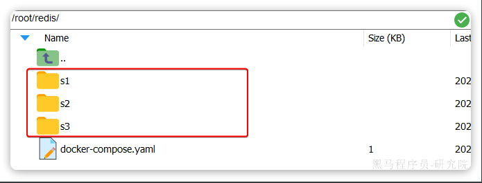
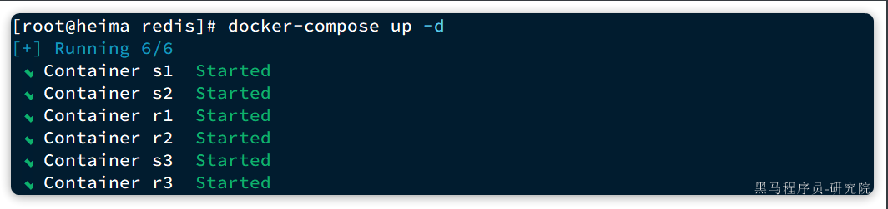
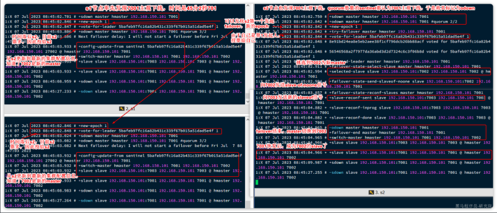

::: tip

1 哨兵工作原理

2 搭建哨兵集群

3 演示 failover

4 总结

5 RedisTemplate 连接哨兵集群 (自学)

:::

主从结构中master节点的作用非常重要，一旦故障就会导致集群不可用。那么有什么办法能保证主从集群的高可用性呢？


## 1 哨兵工作原理

Redis提供了`哨兵`（`Sentinel`）机制来监控主从集群监控状态，确保集群的高可用性。

### 1.1 哨兵作用

哨兵集群作用原理图：



哨兵的作用如下：

- **状态监控**：`Sentinel` 会不断检查您的`master`和`slave`是否按预期工作
- **故障恢复（failover）**：如果`master`故障，`Sentinel`会将一个`slave`提升为`master`。当故障实例恢复后会成为`slave`
- **状态通知**：`Sentinel`充当`Redis`客户端的服务发现来源，当集群发生`failover`时，会将最新集群信息推送给`Redis`的客户端

那么问题来了，`Sentinel`怎么知道一个Redis节点是否宕机呢？


### 1.2 状态监控

`Sentinel`基于心跳机制监测服务状态，每隔1秒向集群的每个节点发送ping命令，并通过实例的响应结果来做出判断：

- **主观下线（sdown）**：如果某sentinel节点发现某Redis节点未在规定时间响应，则认为该节点主观下线。
- **客观下线(odown)**：若超过指定数量（通过`quorum`设置）的sentinel都认为该节点主观下线，则该节点客观下线。quorum值最好超过Sentinel节点数量的一半，Sentinel节点数量至少3台。

如图：



一旦发现master故障，sentinel需要在salve中选择一个作为新的master，选择依据是这样的：

- 首先会判断slave节点与master节点断开时间长短，如果超过`down-after-milliseconds * 10`则会排除该slave节点
- 然后判断slave节点的`slave-priority`值，越小优先级越高，如果是0则永不参与选举（默认都是1）。
- 如果`slave-prority`一样，则判断slave节点的`offset`值，越大说明数据越新，优先级越高
- 最后是判断slave节点的`run_id`大小，越小优先级越高（`通过info server可以查看run_id`）。

对应的官方文档如下：

https://redis.io/docs/management/sentinel/#replica-selection-and-priority

问题来了，当选出一个新的master后，该如何实现身份切换呢？

大概分为两步：

- 在多个`sentinel`中选举一个`leader`
- 由`leader`执行`failover`


### 1.3 选举 leader

首先，Sentinel集群要选出一个执行`failover`的Sentinel节点，可以成为`leader`。要成为`leader`要满足两个条件：

- 最先获得超过半数的投票
- 获得的投票数不小于`quorum`值

而sentinel投票的原则有两条：

- 优先投票给目前得票最多的
- 如果目前没有任何节点的票，就投给自己

比如有3个sentinel节点，`s1`、`s2`、`s3`，假如`s2`先投票：

- 此时发现没有任何人在投票，那就投给自己。`s2`得1票
- 接着`s1`和`s3`开始投票，发现目前`s2`票最多，于是也投给`s2`，`s2`得3票
- `s2`称为`leader`，开始故障转移

不难看出，**谁先****投票****，谁就会称为****leader**，那什么时候会触发投票呢？

答案是**第一个确认****master****客观下线****的人****会立刻发起****投票****，一定会成为****leader**。

OK，`sentinel`找到`leader`以后，该如何完成`failover`呢？


### 1.4 failover

我们举个例子，有一个集群，初始状态下7001为`master`，7002和7003为`slave`：



假如master发生故障，slave1当选。则故障转移的流程如下：

1）`sentinel`给备选的`slave1`节点发送`slaveof no one`命令，让该节点成为`master`



2）`sentinel`给所有其它`slave`发送`slaveof 192.168.150.101 7002` 命令，让这些节点成为新`master`，也就是`7002`的`slave`节点，开始从新的`master`上同步数据。



3）最后，当故障节点恢复后会接收到哨兵信号，执行`slaveof 192.168.150.101 7002`命令，成为`slave`：




## 2 搭建哨兵集群

首先，我们停掉之前的redis集群：

```bash
# 老版本DockerCompose
docker-compose down

# 新版本Docker
docker compose down
```

然后，我们找到课前资料提供的sentinel.conf文件：



其内容如下：

```bash
sentinel announce-ip "192.168.150.101"
sentinel monitor hmaster 192.168.150.101 7001 2
sentinel down-after-milliseconds hmaster 5000
sentinel failover-timeout hmaster 60000
```

说明：

- `sentinel announce-ip "192.168.150.101"`：声明当前sentinel的ip
- `sentinel monitor hmaster 192.168.150.101 7001 2`：指定集群的主节点信息 
  - `hmaster`：主节点名称，自定义，任意写
  - `192.168.150.101 7001`：主节点的ip和端口
  - `2`：认定`master`下线时的`quorum`值
- `sentinel down-after-milliseconds hmaster 5000`：声明master节点超时多久后被标记下线
- `sentinel failover-timeout hmaster 60000`：在第一次故障转移失败后多久再次重试

我们在虚拟机的`/root/redis`目录下新建3个文件夹：`s1`、`s2`、`s3`:



将课前资料提供的`sentinel.conf`文件分别拷贝一份到3个文件夹中。

接着修改`docker-compose.yaml`文件，内容如下：

```yaml
version: "3.2"

services:
  r1:
    image: redis
    container_name: r1
    network_mode: "host"
    entrypoint: ["redis-server", "--port", "7001"]
  r2:
    image: redis
    container_name: r2
    network_mode: "host"
    entrypoint: ["redis-server", "--port", "7002", "--slaveof", "192.168.150.101", "7001"]
  r3:
    image: redis
    container_name: r3
    network_mode: "host"
    entrypoint: ["redis-server", "--port", "7003", "--slaveof", "192.168.150.101", "7001"]
  s1:
    image: redis
    container_name: s1
    volumes:
      - /root/redis/s1:/etc/redis
    network_mode: "host"
    entrypoint: ["redis-sentinel", "/etc/redis/sentinel.conf", "--port", "27001"]
  s2:
    image: redis
    container_name: s2
    volumes:
      - /root/redis/s2:/etc/redis
    network_mode: "host"
    entrypoint: ["redis-sentinel", "/etc/redis/sentinel.conf", "--port", "27002"]
  s3:
    image: redis
    container_name: s3
    volumes:
      - /root/redis/s3:/etc/redis
    network_mode: "host"
    entrypoint: ["redis-sentinel", "/etc/redis/sentinel.conf", "--port", "27003"]
```

直接运行命令，启动集群：

```shell
docker-compose up -d
```

运行结果：



我们以s1节点为例，查看其运行日志：

```bash
# Sentinel ID is 8e91bd24ea8e5eb2aee38f1cf796dcb26bb88acf
# +monitor master hmaster 192.168.150.101 7001 quorum 2
* +slave slave 192.168.150.101:7003 192.168.150.101 7003 @ hmaster 192.168.150.101 7001
* +sentinel sentinel 5bafeb97fc16a82b431c339f67b015a51dad5e4f 192.168.150.101 27002 @ hmaster 192.168.150.101 7001
* +sentinel sentinel 56546568a2f7977da36abd3d2d7324c6c3f06b8d 192.168.150.101 27003 @ hmaster 192.168.150.101 7001
* +slave slave 192.168.150.101:7002 192.168.150.101 7002 @ hmaster 192.168.150.101 7001
```

可以看到`sentinel`已经联系到了`7001`这个节点，并且与其它几个哨兵也建立了链接。哨兵信息如下：

- `27001`：`Sentinel ID`是`8e91bd24ea8e5eb2aee38f1cf796dcb26bb88acf`
- `27002`：`Sentinel ID`是`5bafeb97fc16a82b431c339f67b015a51dad5e4f`
- `27003`：`Sentinel ID`是`56546568a2f7977da36abd3d2d7324c6c3f06b8d`


## 3 演示 failover

接下来，我们演示一下当主节点故障时，哨兵是如何完成集群故障恢复（failover）的。

我们连接`7001`这个`master`节点，然后通过命令让其休眠60秒，模拟宕机：

```bash
# 连接7001这个master节点，通过sleep模拟服务宕机，60秒后自动恢复
docker exec -it r1 redis-cli -p 7001 DEBUG sleep 60
```

稍微等待一段时间后，会发现sentinel节点触发了`failover`：




## 4 总结

Sentinel的三个作用是什么？

- 集群监控
- 故障恢复
- 状态通知

Sentinel如何判断一个redis实例是否健康？

- 每隔1秒发送一次ping命令，如果超过一定时间没有相向则认为是主观下线（`sdown`）
- 如果大多数sentinel都认为实例主观下线，则判定服务客观下线（`odown`）

故障转移步骤有哪些？

- 首先要在`sentinel`中选出一个`leader`，由leader执行`failover`
- 选定一个`slave`作为新的`master`，执行`slaveof noone`，切换到master模式
- 然后让所有节点都执行`slaveof` 新master
- 修改故障节点配置，添加`slaveof` 新master

sentinel选举leader的依据是什么？

- 票数超过sentinel节点数量1半
- 票数超过quorum数量
- 一般情况下最先发起failover的节点会当选

sentinel从slave中选取master的依据是什么？

- 首先会判断slave节点与master节点断开时间长短，如果超过`down-after-milliseconds`` * 10`则会排除该slave节点
- 然后判断slave节点的`slave-priority`值，越小优先级越高，如果是0则永不参与选举（默认都是1）。
- 如果`slave-prority`一样，则判断slave节点的`offset`值，越大说明数据越新，优先级越高
- 最后是判断slave节点的`run_id`大小，越小优先级越高（`通过info server可以查看run_id`）。


## 5 RedisTemplate 连接哨兵集群 (自学)

分为三步：

- 1）引入依赖
- 2）配置哨兵地址
- 3）配置读写分离


### 5.1 引入依赖

就是SpringDataRedis的依赖：

```xml
<dependency>
    <groupId>org.springframework.boot</groupId>
    <artifactId>spring-boot-starter-data-redis</artifactId>
</dependency>
```


### 5.2 配置哨兵地址

连接哨兵集群与传统单点模式不同，不再需要设置每一个redis的地址，而是直接指定哨兵地址：

```yaml
spring:
  redis:
    sentinel:
      master: hmaster # 集群名
      nodes: # 哨兵地址列表
        - 192.168.150.101:27001
        - 192.168.150.101:27002
        - 192.168.150.101:27003
```


### 5.3 配置读写分离

最后，还要配置读写分离，让java客户端将写请求发送到master节点，读请求发送到slave节点。定义一个bean即可：

```java
@Bean
public LettuceClientConfigurationBuilderCustomizer clientConfigurationBuilderCustomizer(){
    return clientConfigurationBuilder -> clientConfigurationBuilder.readFrom(ReadFrom.REPLICA_PREFERRED);
}
```

这个bean中配置的就是读写策略，包括四种：

- `MASTER`：从主节点读取
- `MASTER_PREFERRED`：优先从`master`节点读取，`master`不可用才读取`slave`
- `REPLICA`：从`slave`节点读取
- `REPLICA_PREFERRED`：优先从`slave`节点读取，所有的`slave`都不可用才读取`master`