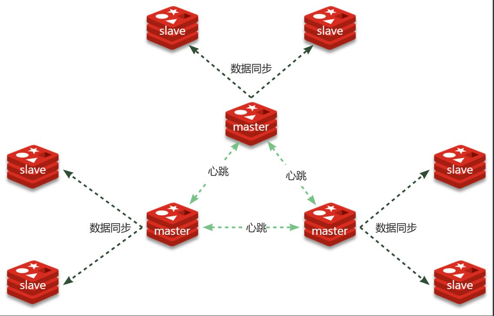

::: tip

1 搭建分片集群

2 散列插槽

3 故障转移

4 总结

5 Java 客户端连接分片集群 (选学)

:::

主从模式可以解决高可用、高并发读的问题。但依然有两个问题没有解决：

- 海量数据存储
- 高并发写

要解决这两个问题就需要用到分片集群了。分片的意思，就是把数据拆分存储到不同节点，这样整个集群的存储数据量就更大了。

Redis分片集群的结构如图：



分片集群特征：

-  集群中有多个master，每个master保存不同分片数据 ，解决海量数据存储问题
-  每个master都可以有多个slave节点 ，确保高可用
-  master之间通过ping监测彼此健康状态 ，类似哨兵作用
-  客户端请求可以访问集群任意节点，最终都会被转发到数据所在节点 


## 1 搭建分片集群

Redis分片集群最少也需要3个master节点，由于我们的机器性能有限，我们只给每个master配置1个slave，形成最小的分片集群：


计划部署的节点信息如下：


### 1.1 集群配置

分片集群中的Redis节点必须开启集群模式，一般在配置文件中添加下面参数：

```bash
port 7000
cluster-enabled yes
cluster-config-file nodes.conf
cluster-node-timeout 5000
appendonly yes
```

其中有3个我们没见过的参数：

- `cluster-enabled`：是否开启集群模式
- `cluster-config-file`：集群模式的配置文件名称，无需手动创建，由集群自动维护
- `cluster-node-timeout`：集群中节点之间心跳超时时间

一般搭建部署集群肯定是给每个节点都配置上述参数，不过考虑到我们计划用`docker-compose`部署，因此可以直接在启动命令中指定参数，偷个懒。

在虚拟机的`/root`目录下新建一个`redis-cluster`目录，然后在其中新建一个`docker-compose.yaml`文件，内容如下：

```yaml
version: "3.2"

services:
  r1:
    image: redis
    container_name: r1
    network_mode: "host"
    entrypoint: ["redis-server", "--port", "7001", "--cluster-enabled", "yes", "--cluster-config-file", "node.conf"]
  r2:
    image: redis
    container_name: r2
    network_mode: "host"
    entrypoint: ["redis-server", "--port", "7002", "--cluster-enabled", "yes", "--cluster-config-file", "node.conf"]
  r3:
    image: redis
    container_name: r3
    network_mode: "host"
    entrypoint: ["redis-server", "--port", "7003", "--cluster-enabled", "yes", "--cluster-config-file", "node.conf"]
  r4:
    image: redis
    container_name: r4
    network_mode: "host"
    entrypoint: ["redis-server", "--port", "7004", "--cluster-enabled", "yes", "--cluster-config-file", "node.conf"]
  r5:
    image: redis
    container_name: r5
    network_mode: "host"
    entrypoint: ["redis-server", "--port", "7005", "--cluster-enabled", "yes", "--cluster-config-file", "node.conf"]
  r6:
    image: redis
    container_name: r6
    network_mode: "host"
    entrypoint: ["redis-server", "--port", "7006", "--cluster-enabled", "yes", "--cluster-config-file", "node.conf"]
```

**注意**：使用Docker部署Redis集群，network模式必须采用host


### 1.2 启动集群

进入`/root/redis-cluster`目录，使用命令启动redis：

```bash
docker-compose up -d
```

启动成功，可以通过命令查看启动进程：

```bash
ps -ef | grep redis
# 结果：
root       4822   4743  0 14:29 ?        00:00:02 redis-server *:7002 [cluster]
root       4827   4745  0 14:29 ?        00:00:01 redis-server *:7005 [cluster]
root       4897   4778  0 14:29 ?        00:00:01 redis-server *:7004 [cluster]
root       4903   4759  0 14:29 ?        00:00:01 redis-server *:7006 [cluster]
root       4905   4775  0 14:29 ?        00:00:02 redis-server *:7001 [cluster]
root       4912   4732  0 14:29 ?        00:00:01 redis-server *:7003 [cluster]
```

可以发现每个redis节点都以cluster模式运行。不过节点与节点之间并未建立连接。

接下来，我们使用命令创建集群：

```bash
# 进入任意节点容器
docker exec -it r1 bash
# 然后，执行命令
redis-cli --cluster create --cluster-replicas 1 \
192.168.150.101:7001 192.168.150.101:7002 192.168.150.101:7003 \
192.168.150.101:7004 192.168.150.101:7005 192.168.150.101:7006
```

命令说明：

- `redis-cli --cluster`：代表集群操作命令
- `create`：代表是创建集群
- `--cluster-replicas 1` ：指定集群中每个`master`的副本个数为1
  - 此时`节点总数 ÷ (replicas + 1)` 得到的就是`master`的数量`n`。因此节点列表中的前`n`个节点就是`master`，其它节点都是`slave`节点，随机分配到不同`master`

输入命令后控制台会弹出下面的信息：


这里展示了集群中`master`与`slave`节点分配情况，并询问你是否同意。节点信息如下：

- `7001`是`master`，节点`id`后6位是`da134f`
- `7002`是`master`，节点`id`后6位是`862fa0`
- `7003`是`master`，节点`id`后6位是`ad5083`
- `7004`是`slave`，节点`id`后6位是`391f8b`，认`ad5083`（7003）为`master`
- `7005`是`slave`，节点`id`后6位是`e152cd`，认`da134f`（7001）为`master`
- `7006`是`slave`，节点`id`后6位是`4a018a`，认`862fa0`（7002）为`master`

输入`yes`然后回车。会发现集群开始创建，并输出下列信息：


接着，我们可以通过命令查看集群状态：

```bash
redis-cli -p 7001 cluster nodes
```

结果：


## 2 散列插槽

数据要分片存储到不同的Redis节点，肯定需要有分片的依据，这样下次查询的时候才能知道去哪个节点查询。很多数据分片都会采用一致性hash算法。而Redis则是利用散列插槽（**`hash slot`**）的方式实现数据分片。

详见官方文档：

https://redis.io/docs/management/scaling/#redis-cluster-101

在Redis集群中，共有16384个`hash slots`，集群中的每一个master节点都会分配一定数量的`hash slots`。具体的分配在集群创建时就已经指定了：


如图中所示：

- Master[0]，本例中就是7001节点，分配到的插槽是0~5460
- Master[1]，本例中就是7002节点，分配到的插槽是5461~10922
- Master[2]，本例中就是7003节点，分配到的插槽是10923~16383

当我们读写数据时，Redis基于`CRC16` 算法对`key`做`hash`运算，得到的结果与`16384`取余，就计算出了这个`key`的`slot`值。然后到`slot`所在的Redis节点执行读写操作。

不过`hash slot`的计算也分两种情况：

- 当`key`中包含`{}`时，根据`{}`之间的字符串计算`hash slot`
- 当`key`中不包含`{}`时，则根据整个`key`字符串计算`hash slot`

例如：

- key是`user`，则根据`user`来计算hash slot
- key是`user:{age}`，则根据`age`来计算hash slot

我们来测试一下，先于`7001`建立连接：

```bash
# 进入容器
docker exec -it r1 bash
# 进入redis-cli
redis-cli -p 7001
# 测试
set user jack
```

会发现报错了：


提示我们`MOVED 5474`，其实就是经过计算，得出`user`这个`key`的`hash slot` 是`5474`，而`5474`是在`7002`节点，不能在`7001`上写入！！

说好的任意节点都可以读写呢？

这是因为我们连接的方式有问题，连接集群时，要加`-c`参数：

```bash
# 通过7001连接集群
redis-cli -c -p 7001
# 存入数据
set user jack
```

结果如下：


可以看到，客户端自动跳转到了`5474`这个`slot`所在的`7002`节点。

现在，我们添加一个新的key，这次加上`{}`：

```bash
# 试一下key中带{}
set user:{age} 21

# 再试一下key中不带{}
set age 20
```

结果如下：


可以看到`user:{age}`和`age`计算出的`slot`都是`741`。


## 3 故障转移

分片集群的节点之间会互相通过ping的方式做心跳检测，超时未回应的节点会被标记为下线状态。当发现master下线时，会将这个master的某个slave提升为master。

我们先打开一个控制台窗口，利用命令监测集群状态：

```bash
watch docker exec -it r1 redis-cli -p 7001 cluster nodes
```

命令前面的watch可以每隔一段时间刷新执行结果，方便我们实时监控集群状态变化。

接着，我们故技重施，利用命令让某个master节点休眠。比如这里我们让`7002`节点休眠，打开一个新的ssh控制台，输入下面命令：

```bash
docker exec -it r2 redis-cli -p 7002 DEBUG sleep 30
```

可以观察到，集群发现7002宕机，标记为下线：


过了一段时间后，7002原本的小弟7006变成了`master`：


而7002被标记为`slave`，而且其`master`正好是7006，主从地位互换。


## 4 总结

Redis分片集群如何判断某个key应该在哪个实例？

- 将16384个插槽分配到不同的实例
- 根据key计算哈希值，对16384取余
- 余数作为插槽，寻找插槽所在实例即可

如何将同一类数据固定的保存在同一个Redis实例？

- Redis计算key的插槽值时会判断key中是否包含`{}`，如果有则基于`{}`内的字符计算插槽
- 数据的key中可以加入`{类型}`，例如key都以`{typeId}`为前缀，这样同类型数据计算的插槽一定相同


## 5 Java 客户端连接分片集群 (选学)

RedisTemplate底层同样基于lettuce实现了分片集群的支持，而使用的步骤与哨兵模式基本一致，参考`2.5节`：

1）引入redis的starter依赖

2）配置分片集群地址

3）配置读写分离

与哨兵模式相比，其中只有分片集群的配置方式略有差异，如下：

```yaml
spring:
  redis:
    cluster:
      nodes:
        - 192.168.150.101:7001
        - 192.168.150.101:7002
        - 192.168.150.101:7003
        - 192.168.150.101:8001
        - 192.168.150.101:8002
        - 192.168.150.101:8003
```