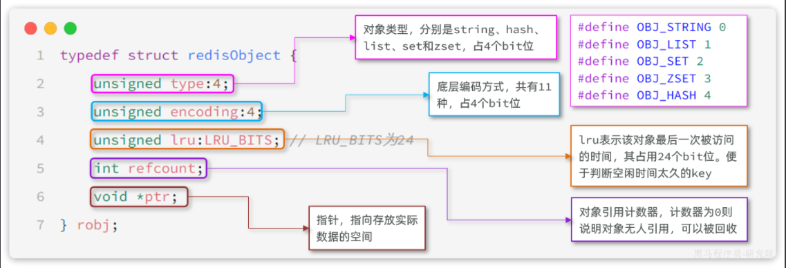
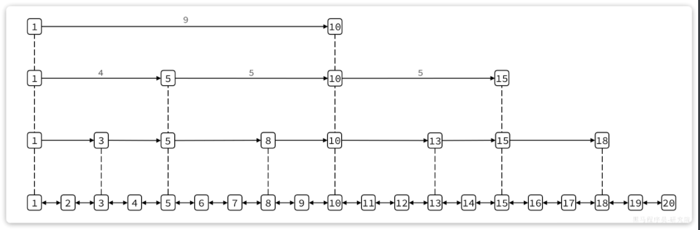
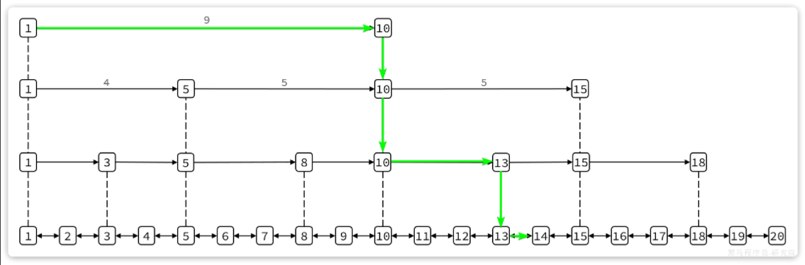
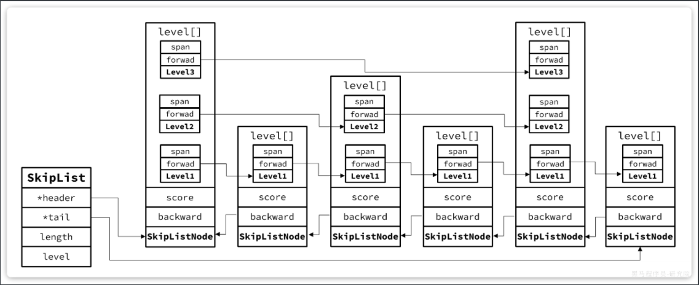
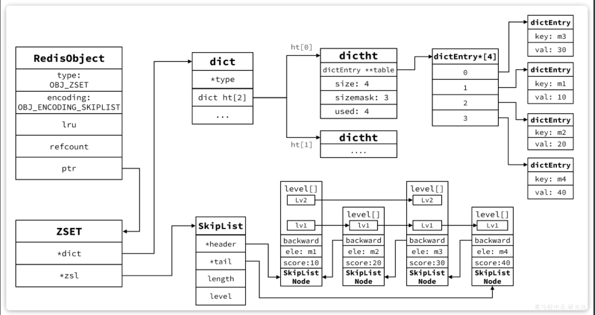

::: tip

1 RedisObject

2 SkipList

3 SortedSet

:::

我们常用的Redis数据类型有5种，分别是：

- String
- List
- Set
- SortedSet
- Hash

还有一些高级数据类型，比如Bitmap、HyperLogLog、GEO等，其底层都是基于上述5种基本数据类型。因此在Redis的源码中，其实只有5种数据类型。


## 1 RedisObject

不管是任何一种数据类型，最终都会封装为RedisObject格式，它是一种结构体，C语言中的一种结构，可以理解为Java中的类。

结构大概是这样的：



可以看到整个结构体中并不包含真实的数据，仅仅是对象头信息，内存占用的大小为4+4+24+32+64 = 128bit

也就是16字节，然后指针`ptr`指针指向的才是真实数据存储的内存地址。所以RedisObject的内存开销是很大的。

属性中的`encoding`就是当前对象底层采用的**数据结构**或**编码方式**，可选的有11种之多：

| **编号** | **编码方式**            | **说明**               |
| :------- | :---------------------- | :--------------------- |
| 0        | OBJ_ENCODING_RAW        | raw编码动态字符串      |
| 1        | OBJ_ENCODING_INT        | long类型的整数的字符串 |
| 2        | OBJ_ENCODING_HT         | hash表（也叫dict）     |
| 3        | OBJ_ENCODING_ZIPMAP     | 已废弃                 |
| 4        | OBJ_ENCODING_LINKEDLIST | 双端链表               |
| 5        | OBJ_ENCODING_ZIPLIST    | 压缩列表               |
| 6        | OBJ_ENCODING_INTSET     | 整数集合               |
| 7        | OBJ_ENCODING_SKIPLIST   | 跳表                   |
| 8        | OBJ_ENCODING_EMBSTR     | embstr编码的动态字符串 |
| 9        | OBJ_ENCODING_QUICKLIST  | 快速列表               |
| 10       | OBJ_ENCODING_STREAM     | Stream流               |
| 11       | OBJ_ENCODING_LISTPACK   | 紧凑列表               |

Redis中的5种不同的数据类型采用的底层数据结构和编码方式如下：

| **数据类型** | **编码方式**                                                 |
| :----------- | :----------------------------------------------------------- |
| STRING       | `int`、`embstr`、`raw`                                       |
| LIST         | `LinkedList和ZipList`(3.2以前)、`QuickList`（3.2以后）       |
| SET          | `intset`、`HT`                                               |
| ZSET         | `ZipList`（7.0以前）、`Listpack`（7.0以后）、`HT`、`SkipList` |
| HASH         | `ZipList`（7.0以前）、`Listpack`（7.0以后）、`HT`            |


## 2 SkipList

SkipList（跳表）首先是链表，但与传统链表相比有几点差异：

- 元素按照升序排列存储
- 节点可能包含多个指针，指针跨度不同。

传统链表只有指向前后元素的指针，因此只能顺序依次访问。如果查找的元素在链表中间，查询的效率会比较低。而SkipList则不同，它内部包含跨度不同的多级指针，可以让我们跳跃查找链表中间的元素，效率非常高。

其结构如图：



我们可以看到1号元素就有指向3、5、10的多个指针，查询时就可以跳跃查找。例如我们要找大小为14的元素，查找的流程是这样的：



- 首先找元素1节点最高级指针，也就是4级指针，起始元素大小为1，指针跨度为9，可以判断出目标元素大小为10。由于14比10大，肯定要从10这个元素向下接着找。
- 找到10这个元素，发现10这个元素的最高级指针跨度为5，判断出目标元素大小为15，大于14，需要判断下级指针
- 10这个元素的2级指针跨度为3，判断出目标元素为13，小于14，因此要基于元素13接着找
- 13这个元素最高级级指针跨度为2，判断出目标元素为15，比14大，需要判断下级指针。
- 13的下级指针跨度为1，因此目标元素是14，刚好于目标一致，找到。

这种多级指针的查询方式就避免了传统链表的逐个遍历导致的查询效率下降问题。在对有序数据做随机查询和排序时效率非常高。

跳表的结构体如下：

```c
typedef struct zskiplist {
    // 头尾节点指针
    struct zskiplistNode *header, *tail;
    // 节点数量
    unsigned long length;
    // 最大的索引层级
    int level;
} zskiplist;
```

可以看到SkipList主要属性是header和tail，也就是头尾指针，因此它是支持双向遍历的。

跳表中节点的结构体如下：

```c
typedef struct zskiplistNode {
    sds ele; // 节点存储的字符串
    double score;// 节点分数，排序、查找用
    struct zskiplistNode *backward; // 前一个节点指针
    struct zskiplistLevel {
        struct zskiplistNode *forward; // 下一个节点指针
        unsigned long span; // 索引跨度
    } level[]; // 多级索引数组
} zskiplistNode;
```

每个节点中都包含ele和score两个属性，其中score是得分，也就是节点排序的依据。ele则是节点存储的字符串数据指针。

其内存结构如下：




## 3 SortedSet

**面试题**：Redis的`SortedSet`底层的数据结构是怎样的？

**答**：SortedSet是有序集合，底层的存储的每个数据都包含element和score两个值。score是得分，element则是字符串值。SortedSet会根据每个element的score值排序，形成有序集合。

它支持的操作很多，比如：

- 根据element查询score值
- 按照score值升序或降序查询element

要实现根据element查询对应的score值，就必须实现element与score之间的键值映射。SortedSet底层是基于**HashTable**来实现的。

要实现对score值排序，并且查询效率还高，就需要有一种高效的有序数据结构，SortedSet是基于**跳表**实现的。

加分项：因为SortedSet底层需要用到两种数据结构，对内存占用比较高。因此Redis底层会对SortedSet中的元素大小做判断。如果**元素大小****小于128**且**每个元素都小于64字节**，SortedSet底层会采用**ZipList**，也就是**压缩列**表来代替**HashTable**和**SkipList**

不过，`ZipList`存在连锁更新问题，因此而在Redis7.0版本以后，`ZipList`又被替换为**Listpack**（紧凑列表）。

Redis源码中`zset`，也就是`SortedSet`的结构体如下：

```c
typedef struct zset {
    dict *dict; // dict，底层就是HashTable
    zskiplist *zsl; // 跳表
} zset;
```

其内存结构如图：

