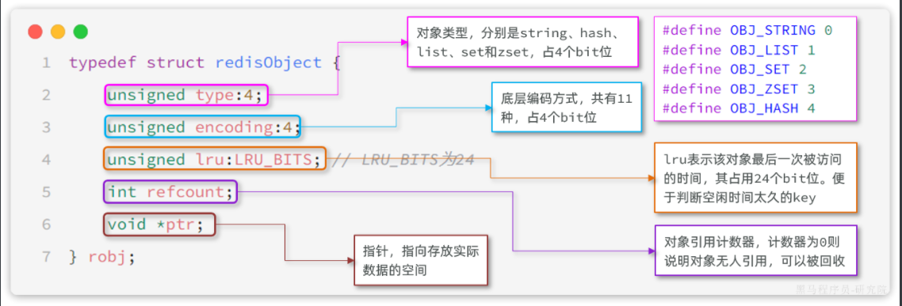
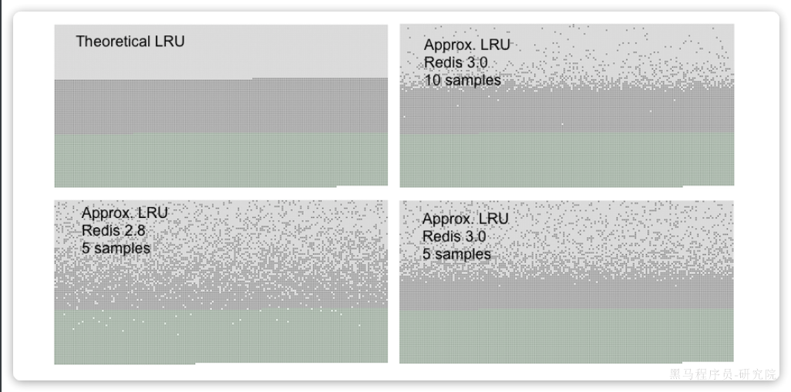

::: tip

1 内存过期处理

2 内存淘汰策略

3 总结

:::

Redis之所以性能强，最主要的原因就是基于内存存储。然而单节点的Redis其内存大小不宜过大，会影响持久化或主从同步性能。

我们可以通过修改redis.conf文件，添加下面的配置来配置Redis的最大内存：

```Properties
maxmemory 1gb
```

当内存达到上限，就无法存储更多数据了。因此，Redis内部会有两套内存回收的策略：

- 内存过期策略
- 内存淘汰策略


## 1 内存过期处理

存入Redis中的数据可以配置过期时间，到期后再次访问会发现这些数据都不存在了，也就是被过期清理了。


### 1.1 过期命令

Redis中通过`expire`命令可以给KEY设置`TTL`（过期时间），例如：

```bash
# 写入一条数据
set num 123
# 设置20秒过期时间
expire num 20
```

不过set命令本身也可以支持过期时间的设置：

```shell
# 写入一条数据并设置20s过期时间
set num EX 20
```

当过期时间到了以后，再去查询数据，会发现数据已经不存在。 


### 1.2 过期策略

那么问题来了：

- Redis如何判断一个KEY是否过期呢？
- Redis又是何时删除过期KEY的呢？

Redis不管有多少种数据类型，本质是一个`KEY-VALUE`的键值型数据库，而这种键值映射底层正式基于HashTable来实现的，在Redis中叫做Dict.

来看下RedisDB的底层源码：

```c
typedef struct redisDb {
    dict dict;                 / The keyspace for this DB , 也就是存放KEY和VALUE的哈希表*/
    dict *expires;              /* 同样是哈希表，但保存的是设置了TTL的KEY，及其到期时间*/
    dict *blocking_keys;        /* Keys with clients waiting for data (BLPOP)*/
    dict *ready_keys;           /* Blocked keys that received a PUSH */
    dict *watched_keys;         /* WATCHED keys for MULTI/EXEC CAS /
    int id;                     / Database ID, 0 ~ 15 /
    long long avg_ttl;          / Average TTL, just for stats /
    unsigned long expires_cursor; / Cursor of the active expire cycle. */
    list *defrag_later;         /* List of key names to attempt to defrag one by one, gradually. */
} redisDb;
```

现在回答第一个问题：

**面试题**：Redis如何判断KEY是否过期呢？

**答**：在Redis中会有两个Dict，也就是HashTable，其中一个记录KEY-VALUE键值对，另一个记录KEY和过期时间。要判断一个KEY是否过期，只需要到记录过期时间的Dict中根据KEY查询即可。

Redis是何时删除过期KEY的呢？

Redis并不会在KEY过期时立刻删除KEY，因为要实现这样的效果就必须给每一个过期的KEY设置时钟，并监控这些KEY的过期状态。无论对CPU还是内存都会带来极大的负担。

Redis的过期KEY删除策略有两种：

- 惰性删除
- 周期删除

**惰性删除**，顾明思议就是过期后不会立刻删除。那在什么时候删除呢？

Redis会在每次访问KEY的时候判断当前KEY有没有设置过期时间，如果有，过期时间是否已经到期。对应的源码如下：

```c
// db.c
// 寻找要执行写操作的key
robj *lookupKeyWriteWithFlags(redisDb *db, robj *key, int flags) {
    // 检查key是否过期，如果过期则删除
    expireIfNeeded(db,key);
    return lookupKey(db,key,flags);
}

// 寻找要执行读操作的key
robj *lookupKeyReadWithFlags(redisDb *db, robj *key, int flags) {
    robj *val;
    // 检查key是否过期，如果过期则删除
    if (expireIfNeeded(db,key) == 1) {
        // 略 ...
    }
    val = lookupKey(db,key,flags);
    if (val == NULL)
        goto keymiss;
    server.stat_keyspace_hits++;
    return val;
}
```

**周期删除**：顾明思议是通过一个定时任务，周期性的抽样部分过期的key，然后执行删除。

执行周期有两种：

- **SLOW模式：**Redis会设置一个定时任务`serverCron()`，按照`server.hz`的频率来执行过期key清理
- **FAST模式：**Redis的每个事件循环前执行过期key清理（事件循环就是NIO事件处理的循环）。

**SLOW**模式规则：

- ① 执行频率受`server.hz`影响，默认为10，即每秒执行10次，每个执行周期100ms。
- ② 执行清理耗时不超过一次执行周期的25%，即25ms.
- ③ 逐个遍历db，逐个遍历db中的bucket，抽取20个key判断是否过期
- ④ 如果没达到时间上限（25ms）并且过期key比例大于10%，再进行一次抽样，否则结束

**FAST**模式规则（过期key比例小于10%不执行）：

- ① 执行频率受`beforeSleep()`调用频率影响，但两次FAST模式间隔不低于2ms
- ② 执行清理耗时不超过1ms
- ③ 逐个遍历db，逐个遍历db中的bucket，抽取20个key判断是否过期
- ④ 如果没达到时间上限（1ms）并且过期key比例大于10%，再进行一次抽样，否则结束


## 2 内存淘汰策略

对于某些特别依赖于Redis的项目而言，仅仅依靠过期KEY清理是不够的，内存可能很快就达到上限。因此Redis允许设置内存告警阈值，当内存使用达到阈值时就会主动挑选部分KEY删除以释放更多内存。这叫做**内存淘汰**机制。

### 2.1 内存淘汰时机

那么问题来了，当内存达到阈值时执行内存淘汰，但问题是Redis什么时候会执去判断内存是否达到预警呢？

Redis每次执行任何命令时，都会判断内存是否达到阈值：

```c
// server.c中处理命令的部分源码
int processCommand(client *c) {
    // ... 略
    if (server.maxmemory && !server.lua_timedout) {
        // 调用performEvictions()方法尝试进行内存淘汰
        int out_of_memory = (performEvictions() == EVICT_FAIL);
        // ... 略
        if (out_of_memory && reject_cmd_on_oom) {
            // 如果内存依然不足，直接拒绝命令
            rejectCommand(c, shared.oomerr);
            return C_OK;
        }
    }
}
```


### 2.2 淘汰策略

好了，知道什么时候尝试淘汰了，那具体Redis是如何判断该淘汰哪些`Key`的呢？

Redis支持8种不同的内存淘汰策略：

- `noeviction`： 不淘汰任何key，但是内存满时不允许写入新数据，默认就是这种策略。
- `volatile``-ttl`： 对设置了TTL的key，比较key的剩余TTL值，TTL越小越先被淘汰
- `allkeys``-random`：对全体key ，随机进行淘汰。也就是直接从db->dict中随机挑选
- `volatile-random`：对设置了TTL的key ，随机进行淘汰。也就是从db->expires中随机挑选。
- `allkeys-lru`： 对全体key，基于LRU算法进行淘汰
- `volatile-lru`： 对设置了TTL的key，基于LRU算法进行淘汰
- `allkeys-lfu`： 对全体key，基于LFU算法进行淘汰
- `volatile-lfu`： 对设置了TTL的key，基于LFI算法进行淘汰

比较容易混淆的有两个算法：

- **LRU**（**`L`**`east `**`R`**`ecently `**`U`**`sed`），最近最久未使用。用当前时间减去最后一次访问时间，这个值越大则淘汰优先级越高。
- **LFU**（**`L`**`east `**`F`**`requently `**`U`**`sed`），最少频率使用。会统计每个key的访问频率，值越小淘汰优先级越高。

Redis怎么知道某个KEY的`最近一次访问时间`或者是`访问频率`呢？

还记不记得之前讲过的RedisObject的结构？

回忆一下：



其中的`lru`就是记录最近一次访问时间和访问频率的。当然，你选择`LRU`和`LFU`时的记录方式不同：

- **LRU**：以秒为单位记录最近一次访问时间，长度24bit
- **LFU**：高16位以分钟为单位记录最近一次访问时间，低8位记录逻辑访问次数

时间就不说了，那么逻辑访问次数又是怎么回事呢？8位无符号数字最大才255，访问次数超过255怎么办？

这就要聊起Redis的**逻辑访问次数**算法了，LFU的访问次数之所以叫做**逻辑访问次数**，是因为并不是每次key被访问都计数，而是通过运算：

- ① 生成`[0,1)`之间的随机数`R`
- ② 计算 `1/(``旧次数`` * lfu_log_factor + 1)`，记录为`P`， `lfu_log_factor`默认为10
- ③ 如果 `R` < `P `，则计数器 `+1`，且最大不超过255
- ④ 访问次数会随时间衰减，距离上一次访问时间每隔 `lfu_decay_time` 分钟(默认1) ，计数器`-1`

显然LFU的基于访问频率的统计更符合我们的淘汰目标，因此**官方推荐使用LFU算法。**

算法我们弄明白了，不过这里大家要注意一下：Redis中的`KEY`可能有数百万甚至更多，每个KEY都有自己访问时间或者逻辑访问次数。我们要找出时间最早的或者访问次数最小的，难道要把Redis中**所有数据排序**？

要知道Redis的内存淘汰是在每次执行命令时处理的。如果每次执行命令都先对全量数据做内存排序，那命令的执行时长肯定会非常长，这是不现实的。

所以Redis采取的是**抽样法**，即每次抽样一定数量（`maxmemory_smples`）的key，然后基于内存策略做排序，找出淘汰优先级最高的，删除这个key。这就导致Redis的算法并不是真正的**LRU**，而是一种基于抽样的**近似LRU算法**。

不过，在Redis3.0以后改进了这个算法，引入了一个淘汰候选池，抽样的key要与候选池中的key比较淘汰优先级，优先级更高的才会被放入候选池。然后在候选池中找出优先级最高的淘汰掉，这就使算法的结果更接近与真正的LRU算法了。特别是在抽样值较高的情况下（例如10），可以达到与真正的LRU接近的效果。

这也是官方给出的真正LRU与近似LRU的结果对比：



你可以在图表中看到三种颜色的点形成三个不同的带，每个点就是一个加入的`KEY`。

- 浅灰色带是被驱逐的对象
- 灰色带是没有被驱逐的对象
- 绿色带是被添加的对象


## 3 总结

> **面试题**：**Redis如何判断KEY是否过期呢？**
>
> **答**：在Redis中会有两个Dict，也就是HashTable，其中一个记录KEY-VALUE键值对，另一个记录KEY和过期时间。要判断一个KEY是否过期，只需要到记录过期时间的Dict中根据KEY查询即可。

> **面试题**：**Redis何时删除过期KEY？如何删除？**
>
> **答**：Redis的过期KEY处理有两种策略，分别是惰性删除和周期删除。
>
> **惰性删除**是指在每次用户访问某个KEY时，判断KEY的过期时间：如果过期则删除；如果未过期则忽略。
>
> **周期删除**有两种模式：
>
> - **SLOW**模式：通过一个定时任务，定期的抽样部分带有TTL的KEY，判断其是否过期。默认情况下定时任务的执行频率是每秒10次，但每次执行不能超过25毫秒。如果执行抽样后发现时间还有剩余，并且过期KEY的比例较高，则会多次抽样。
> - **FAST**模式：在Redis每次处理NIO事件之前，都会抽样部分带有TTL的KEY，判断是否过期，因此执行频率较高。但是每次执行时长不能超过1ms，如果时间充足并且过期KEY比例过高，也会多次抽样

> **面试题**：**当Redis内存不足时会怎么做？**
>
> **答**：这取决于配置的内存淘汰策略，Redis支持很多种内存淘汰策略，例如LRU、LFU、Random. 但默认的策略是直接拒绝新的写入请求。而如果设置了其它策略，则会在每次执行命令后判断占用内存是否达到阈值。如果达到阈值则会基于配置的淘汰策略尝试进行内存淘汰，直到占用内存小于阈值为止。

> **面试题**：**那你能聊聊LRU和LFU吗？**
>
> **答**：`LRU`是最近最久未使用。Redis的Key都是RedisObject，当启用LRU算法后，Redis会在Key的头信息中使用24个bit记录每个key的最近一次使用的时间`lru`。每次需要内存淘汰时，就会抽样一部分KEY，找出其中空闲时间最长的，也就是`now - lru`结果最大的，然后将其删除。如果内存依然不足，就重复这个过程。
>
> 由于采用了抽样来计算，这种算法只能说是一种近似LRU算法。因此在Redis4.0以后又引入了`LFU`算法，这种算法是统计最近最少使用，也就是按key的访问频率来统计。当启用LFU算法后，Redis会在key的头信息中使用24bit记录最近一次使用时间和逻辑访问频率。其中高16位是以分钟为单位的最近访问时间，后8位是逻辑访问次数。与LFU类似，每次需要内存淘汰时，就会抽样一部分KEY，找出其中逻辑访问次数最小的，将其淘汰。

> **面试题**：**逻辑访问次数是如何计算的？**
>
> **答**：由于记录访问次数的只有`8bit`，即便是无符号数，最大值只有255，不可能记录真实的访问次数。因此Redis统计的其实是逻辑访问次数。这其中有一个计算公式，会根据当前的访问次数做计算，结果要么是次数`+1`，要么是次数不变。但随着当前访问次数越大，`+1`的概率也会越低，并且最大值不超过255.
>
> 除此以外，逻辑访问次数还有一个衰减周期，默认为1分钟，即每隔1分钟逻辑访问次数会`-1`。这样逻辑访问次数就能基本反映出一个`key`的访问热度了。