::: tip

1 缓存一致性

2 缓存穿透

3 缓存雪崩

4 缓存击穿

5 面试总结

:::

Redis经常被用作缓存，而缓存在使用的过程中存在很多问题需要解决。例如：

- 缓存的数据一致性问题
- 缓存击穿
- 缓存穿透
- 缓存雪崩

## 1 缓存一致性

我们先看下目前企业用的最多的缓存模型。缓存的通用模型有三种：

- `Cache Aside`：有缓存调用者自己维护数据库与缓存的一致性。即：
  - 查询时：命中则直接返回，未命中则查询数据库并写入缓存
  - 更新时：更新数据库并删除缓存，查询时自然会更新缓存
- `Read/Write Through`：数据库自己维护一份缓存，底层实现对调用者透明。底层实现：
  - 查询时：命中则直接返回，未命中则查询数据库并写入缓存
  - 更新时：判断缓存是否存在，不存在直接更新数据库。存在则更新缓存，同步更新数据库
- `Write Behind Cahing`：读写操作都直接操作缓存，由线程异步的将缓存数据同步到数据库

目前企业中使用最多的就是`Cache Aside`模式，因为实现起来非常简单。但缺点也很明显，就是无法保证数据库与缓存的强一致性。为什么呢？我们一起来分析一下。

`Cache Aside`的写操作是要在更新数据库的同时删除缓存，那为什么不选择更新数据库的同时更新缓存，而是删除呢？

原因很简单，假如一段时间内无人查询，但是有多次更新，那这些更新都属于无效更新。采用删除方案也就是延迟更新，什么时候有人查询了，什么时候更新。

那到底是先更新数据库再删除缓存，还是先删除缓存再更新数据库呢？

现在假设有两个线程，一个来更新数据，一个来查询数据。我们分别分析两种策略的表现。

我们先分析策略1，先更新数据库再删除缓存：

**正常情况**

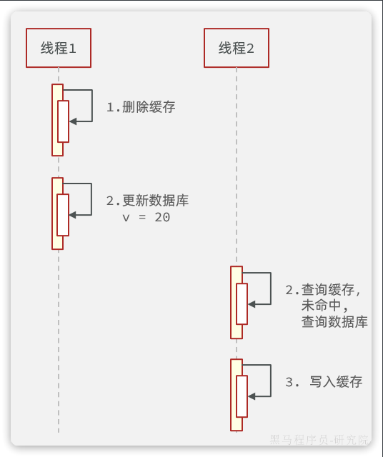

**异常情况**

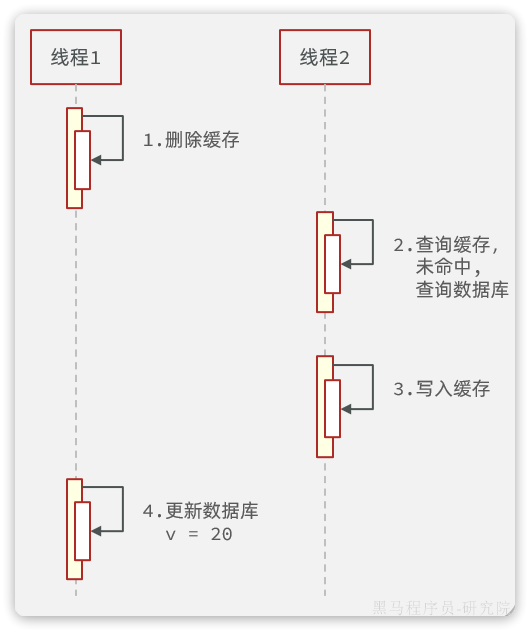

异常情况说明：

- 线程1删除缓存后，还没来得及更新数据库，
- 此时线程2来查询，发现缓存未命中，于是查询数据库，写入缓存。由于此时数据库尚未更新，查询的是旧数据。也就是说刚才的删除白删了，缓存又变成旧数据了。
- 然后线程1更新数据库，此时数据库是新数据，缓存是旧数据

由于更新数据库的操作本身比较耗时，在期间有线程来查询数据库并更新缓存的概率非常高。因此不推荐这种方案。

再来看策略2，先更新数据库再删除缓存：

**正常情况**

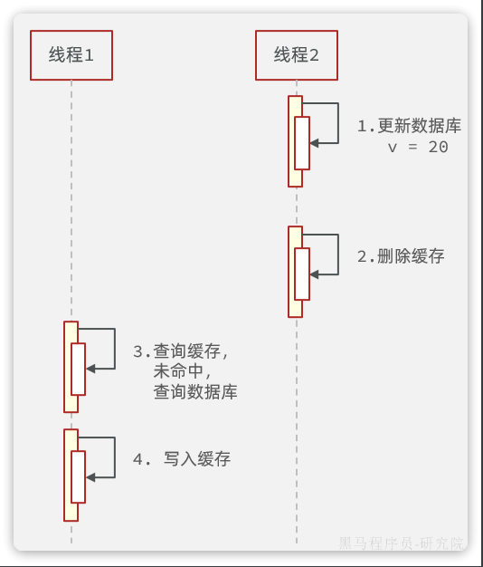

**异常情况**

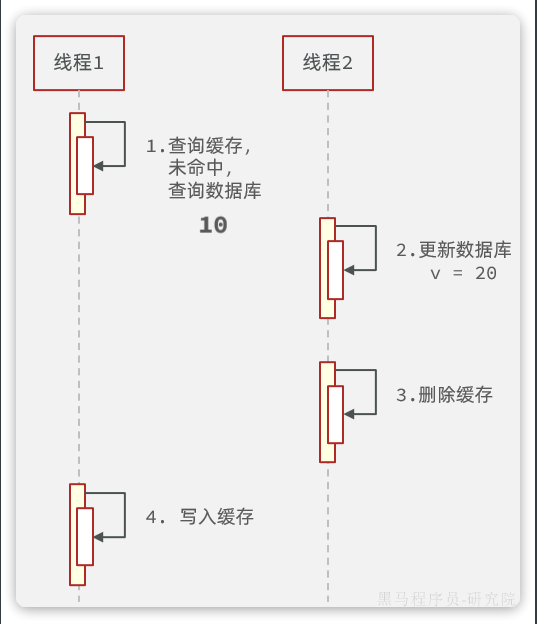

异常情况说明：

- 线程1查询缓存未命中，于是去查询数据库，查询到旧数据
- 线程1将数据写入缓存之前，线程2来了，更新数据库，删除缓存
- 线程1执行写入缓存的操作，写入旧数据

可以发现，异常状态发生的概率极为苛刻，线程1必须是查询数据库已经完成，但是缓存尚未写入之前。线程2要完成更新数据库同时删除缓存的两个操作。要知道线程1执行写缓存的速度在毫秒之间，速度非常快，在这么短的时间要完成数据库和缓存的操作，概率非常之低。

> **综上**，添加缓存的目的是为了提高系统性能，而你要付出的代价就是缓存与数据库的强一致性。如果你要求数据库与缓存的强一致，那就需要加锁避免并行读写。但这就降低了性能，与缓存的目标背道而驰。
>
> 因此不管任何缓存同步方案最终的目的都是尽可能保证最终一致性，降低发生不一致的概率。我们采用先更新数据库再删除缓存的方案，已经将这种概率降到足够低，目的已经达到了。
>
> 同时我们还要给缓存加上过期时间，一旦发生缓存不一致，当缓存过期后会重新加载，数据最终还是能保证一致。这就可以作为一个兜底方案。

## 2 缓存穿透

什么是缓存穿透呢？

我们知道，当请求查询缓存未命中时，需要查询数据库以加载缓存。但是大家思考一下这样的场景：

> 如果我访问一个数据库中也不存在的数据。会出现什么现象？

由于数据库中不存在该数据，那么缓存中肯定也不存在。因此不管请求该数据多少次，缓存永远不可能建立，请求永远会直达数据库。

假如有不怀好意的人，开启很多线程频繁的访问一个数据库中也不存在的数据。由于缓存不可能生效，那么所有的请求都访问数据库，可能就会导致数据库因过高的压力而宕机。

解决这个问题有两种思路：

- 缓存空值
- 布隆过滤器

### 2.1 缓存空值

简单来说，就是当我们发现请求的数据即不存在与缓存，也不存在与数据库时，将空值缓存到Redis，避免频繁查询数据库。实现思路如下：

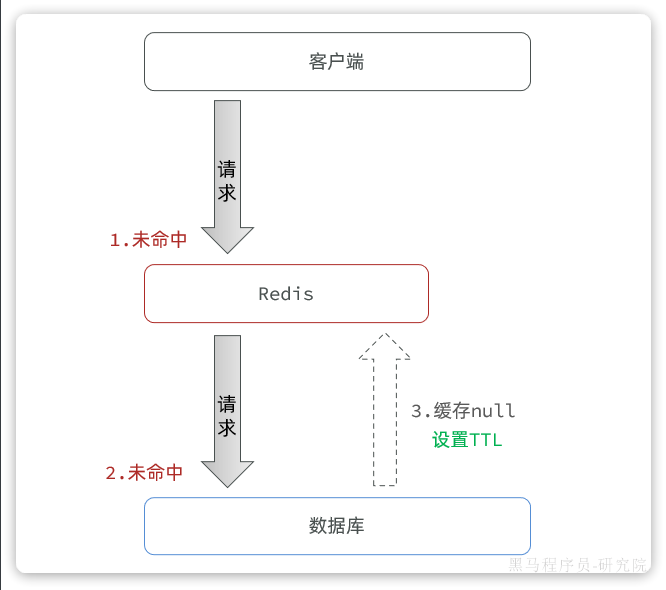

优点：

- 实现简单，维护方便

缺点：

- 额外的内存消耗

### 2.2 布隆过滤器

布隆过滤是一种数据统计的算法，用于检索一个元素是否存在一个集合中。

一般我们判断集合中是否存在元素，都会先把元素保存到类似于树、哈希表等数据结构中，然后利用这些结构查询效率高的特点来快速匹配判断。但是随着元素数量越来越多，这种模式对内存的占用也越来越大，检索的速度也会越来越慢。而布隆过滤的内存占用小，查询效率却很高。

布隆过滤首先需要一个很长的bit数组，默认数组中每一位都是0. 

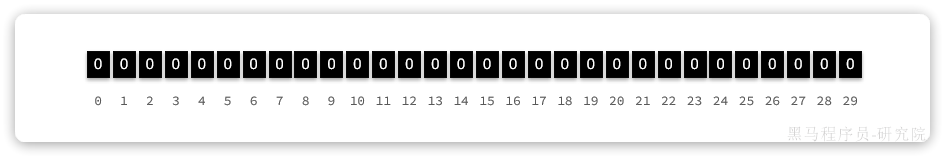

然后还需要`K`个`hash`函数，将元素基于这些hash函数做运算的结果映射到bit数组的不同位置，并将这些位置置为1，例如现在k=3：

- `hello`经过运算得到3个角标：1、5、12
- `world`经过运算得到3个角标：8、17、21
- `java`经过运算得到3个角标：17、25、28

则需要将每个元素对应角标位置置为1：

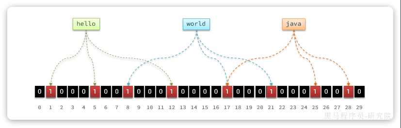

此时，我们要判断元素是否存在，只需要再次基于`K`个`hash`函数做运算， 得到`K`个角标，判断每个角标的位置是不是1：

- 只要全是1，就证明元素存在
- 任意位置为0，就证明元素一定不存在

假如某个元素本身并不存在，也没添加到布隆过滤器过。但是由于存在hash碰撞的可能性，这就会出现这个元素计算出的角标已经被其它元素置为1的情况。那么这个元素也会被误判为已经存在。

因此，布隆过滤器的判断存在误差：

- 当布隆过滤器认为元素不存在时，它**肯定不存在**
- 当布隆过滤器认为元素存在时，它**可能存在，也可能不存在**

当`bit`数组越大、`Hash`函数`K`越复杂，`K`越大时，这个误判的概率也就越低。由于采用`bit`数组来标示数据，即便`4,294,967,296`个`bit`位，也只占`512mb`的空间

我们可以把数据库中的数据利用布隆过滤器标记出来，当用户请求缓存未命中时，先基于布隆过滤器判断。如果不存在则直接拒绝请求，存在则去查询数据库。尽管布隆过滤存在误差，但一般都在0.01%左右，可以大大减少数据库压力。

使用布隆过滤后的流程如下：

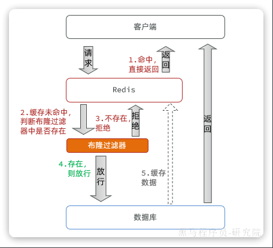

## 3 缓存雪崩

缓存雪崩是指在同一时段大量的缓存key同时失效或者Redis服务宕机，导致大量请求到达数据库，带来巨大压力。

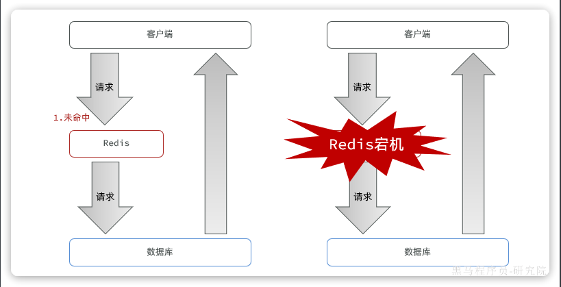

常见的解决方案有：

- 给不同的Key的TTL添加随机值，这样KEY的过期时间不同，不会大量KEY同时过期
- 利用Redis集群提高服务的可用性，避免缓存服务宕机
- 给缓存业务添加降级限流策略
- 给业务添加多级缓存，比如先查询本地缓存，本地缓存未命中再查询Redis，Redis未命中再查询数据库。即便Redis宕机，也还有本地缓存可以抗压力

## 4 缓存击穿

**缓存击穿**问题也叫**热点Key**问题，就是一个被高并发访问并且缓存重建业务较复杂的key突然失效了，无数的请求访问会在瞬间给数据库带来巨大的冲击。

由于我们采用的是`Cache Aside`模式，当缓存失效时需要下次查询时才会更新缓存。当某个key缓存失效时，如果这个key是热点key，并发访问量比较高。就会在一瞬间涌入大量请求，都发现缓存未命中，于是都会去查询数据库，尝试重建缓存。可能一瞬间就把数据库压垮了。

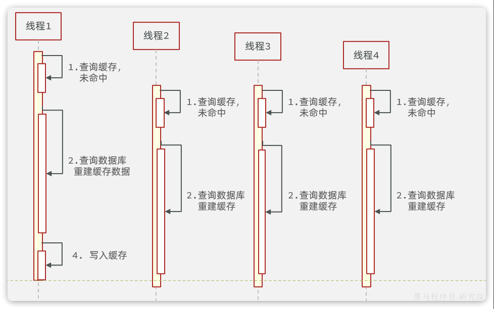

如上图所示：

- 线程1发现缓存未命中，准备查询数据库，重建缓存，但是因为数据比较复杂，导致查询数据库耗时较久
- 在这个过程中，一下次来了3个新的线程，就都会发现缓存未命中，都去查询数据库
- 数据库压力激增

常见的解决方案有两种：

- 互斥锁：给重建缓存逻辑加锁，避免多线程同时指向
- 逻辑过期：热点key不要设置过期时间，在活动结束后手动删除。

基于互斥锁的方案如图：

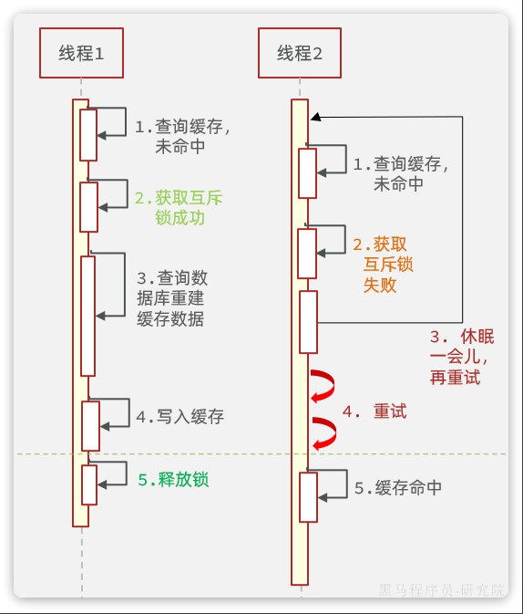

逻辑过期的思路如图：

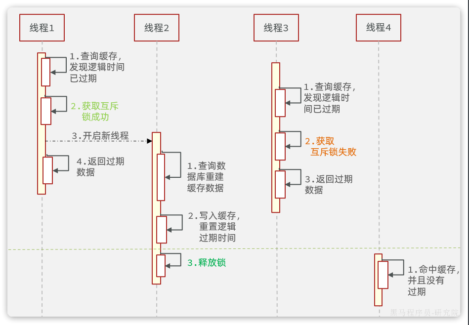

## 5 面试总结

> **面试题**：**如何保证缓存的双写一致性？**
>
> **答**：缓存的双写一致性很难保证强一致，只能尽可能降低不一致的概率，确保最终一致。我们项目中采用的是`Cache Aside`模式。简单来说，就是在更新数据库之后删除缓存；在查询时先查询缓存，如果未命中则查询数据库并写入缓存。同时我们会给缓存设置过期时间作为兜底方案，如果真的出现了不一致的情况，也可以通过缓存过期来保证最终一致。
>
> **追问**：为什么不采用延迟双删机制？**
>
> **答**：延迟双删的第一次删除并没有实际意义，第二次采用延迟删除主要是解决数据库主从同步的延迟问题，我认为这是数据库主从的一致性问题，与缓存同步无关。既然主节点数据已经更新，Redis的缓存理应更新。而且延迟双删会增加缓存业务复杂度，也没能完全避免缓存一致性问题，投入回报比太低。

> **面试题**：**如何解决缓存穿透问题？**
>
> **答**：缓存穿透也可以说是穿透攻击，具体来说是因为请求访问到了数据库不存在的值，这样缓存无法命中，必然访问数据库。如果高并发的访问这样的接口，会给数据库带来巨大压力。
>
> 我们项目中都是基于布隆过滤器来解决缓存穿透问题的，当缓存未命中时基于布隆过滤器判断数据是否存在。如果不存在则不去访问数据库。
>
> 当然，也可以使用缓存空值的方式解决，不过这种方案比较浪费内存。

> **面试题**：**如何解决缓存雪崩问题？**
>
> **答**：缓存雪崩的常见原因有两个，第一是因为大量key同时过期。针对问这个题我们可以可以给缓存key设置不同的TTL值，避免key同时过期。
>
> 第二个原因是Redis宕机导致缓存不可用。针对这个问题我们可以利用集群提高Redis的可用性。也可以添加多级缓存，当Redis宕机时还有本地缓存可用。

> **面试题**：**如何解决缓存击穿问题？**
>
> **答**：缓存击穿往往是由热点Key引起的，当热点Key过期时，大量请求涌入同时查询，发现缓存未命中都会去访问数据库，导致数据库压力激增。解决这个问题的主要思路就是避免多线程并发去重建缓存，因此方案有两种。
>
> 第一种是基于互斥锁，当发现缓存未命中时需要先获取互斥锁，再重建缓存，缓存重建完成释放锁。这样就可以保证缓存重建同一时刻只会有一个线程执行。不过这种做法会导致缓存重建时性能下降严重。
>
> 第二种是基于逻辑过期，也就是不给热点Key设置过期时间，而是给数据添加一个过期时间的字段。这样热点Key就不会过期，缓存中永远有数据。
>
> 查询到数据时基于其中的过期时间判断key是否过期，如果过期开启独立新线程异步的重建缓存，而查询请求先返回旧数据即可。当然，这个过程也要加互斥锁，但由于重建缓存是异步的，而且获取锁失败也无需等待，而是返回旧数据，这样性能几乎不受影响。
>
> 需要注意的是，无论是采用哪种方式，在获取互斥锁后一定要再次判断缓存是否命中，做dubbo check. 因为当你获取锁成功时，可能是在你之前有其它线程已经重建缓存了。