::: tip

1 CAP 定理

2 BASE 理论

3 AT 模式的脏写问题

4 TCC 模式

:::

微服务在面试时被问到的内容相对较少，常见的面试题如下：

- SpringCloud有哪些常用组件？分别是什么作用？
- 服务注册发现的基本流程是怎样的？
- Eureka和Nacos有哪些区别？
- Nacos的分级存储模型是什么意思？
- Ribbon和SpringCloudLoadBalancer有什么差异
- 什么是服务雪崩，常见的解决方案有哪些？
- Hystix和Sentinel有什么区别和联系？
- 限流的常见算法有哪些？
- 什么是CAP理论和BASE思想？
- 项目中碰到过分布式事务问题吗？怎么解决的？
- AT模式如何解决脏读和脏写问题的？
- TCC模式与AT模式对比，有哪些优缺点

可以发现，这些问题都是围绕着SpringCloud的相关组件的，其中有些问题我们在课堂上已经介绍过，这里不再赘述。我们重点讲解一些之前没有讲过的，与底层实现有关的部分。

讲解的思路还是基于SpringCloud的组件分类来讲的，主要包括：

- 分布式事务
- 注册中心
- 远程调用
- 服务保护

等几个方面

**分布式事务**，就是指不是在单个服务或单个数据库架构下，产生的事务，例如：

- 跨数据源的分布式事务
- 跨服务的分布式事务
- 综合情况

我们之前解决分布式事务问题是直接使用Seata框架的AT模式，但是解决分布式事务问题的方案远不止这一种。

## 1 CAP 定理

解决分布式事务问题，需要一些分布式系统的基础知识作为理论指导，首先就是CAP定理。

1998年，加州大学的计算机科学家 Eric Brewer 提出，分布式系统有三个指标：

- **C**onsistency（一致性）
- **A**vailability（可用性）
- **P**artition tolerance （分区容错性）

它们的第一个字母分别是 `C`、`A`、`P`。Eric Brewer认为任何分布式系统架构方案都不可能同时满足这3个目标，这个结论就叫做 CAP 定理。

为什么呢？

### 1.1 一致性

`Consistency`（一致性）：用户访问分布式系统中的任意节点，得到的数据必须一致。

比如现在包含两个节点，其中的初始数据是一致的：

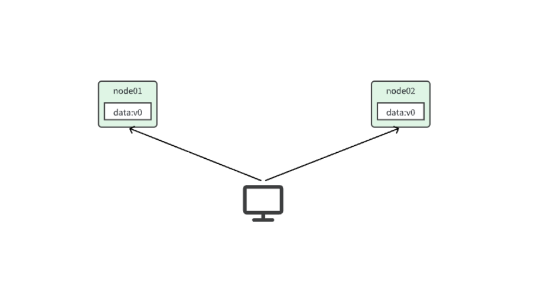

当我们修改其中一个节点的数据时，两者的数据产生了差异：

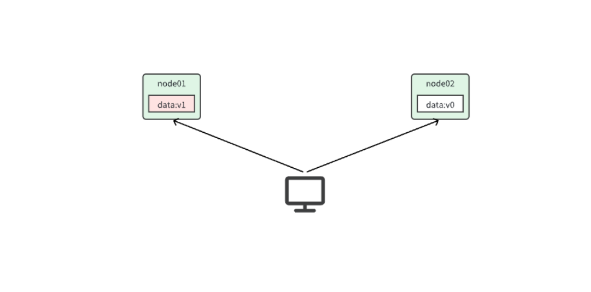

要想保住一致性，就必须实现node01 到 node02的数据 同步：

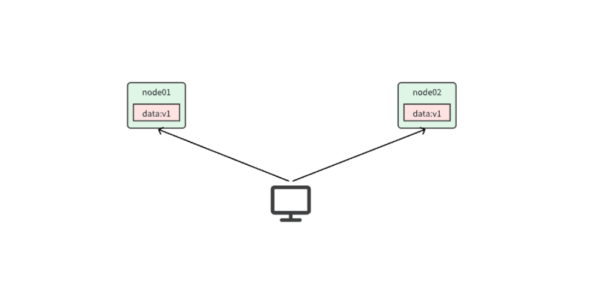

### 1.2 可用性

Availability （可用性）：用户访问分布式系统时，读或写操作总能成功。

只能读不能写，或者只能写不能读，或者两者都不能执行，就说明系统弱可用或不可用。

### 1.3 分区容错

`Partition`，就是分区，就是当分布式系统节点之间出现网络故障导致节点之间无法通信的情况：

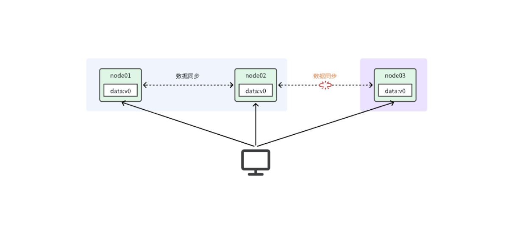

如上图，node01和node02之间网关畅通，但是与node03之间网络断开。于是node03成为一个独立的网络分区；node01和node02在一个网络分区。

`Tolerance`，就是容错，即便是系统出现网络分区，整个系统也要持续对外提供服务。

### 1.4 矛盾

在分布式系统中，网络不能100%保证畅通，也就是说网络分区的情况一定会存在。而我们的系统必须要持续运行，对外提供服务。所以分区容错性（`P`）是硬性指标，所有分布式系统都要满足。而在设计分布式系统时要取舍的就是一致性（`C`）和可用性（`A`）了。

假如现在出现了网络分区，如图：

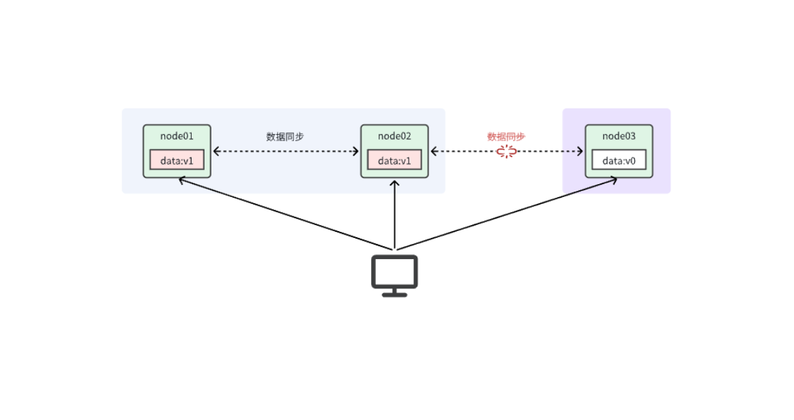

由于网络故障，当我们把数据写入node01时，可以与node02完成数据同步，但是无法同步给node03。现在有两种选择：

- 允许用户任意读写，保证可用性。但由于node03无法完成同步，就会出现数据不一致的情况。满足AP
- 不允许用户写，可以读，直到网络恢复，分区消失。这样就确保了一致性，但牺牲了可用性。满足CP

可见，在分布式系统中，`A`和`C`之间只能满足一个。

## 2 BASE 理论

既然分布式系统要遵循CAP定理，那么问题来了，我到底是该牺牲一致性还是可用性呢？如果牺牲了一致性，出现数据不一致该怎么处理？

人们在总结系统设计经验时，最终得到了一些心得：

- **B**asically **A**vailable **（**基本可用**）**：分布式系统在出现故障时，允许损失部分可用性，即保证核心可用。
- **S**oft State**（**软状态**）：**在一定时间内，允许出现中间状态，比如临时的不一致状态。
- **Ev**entually Consistent**（**最终一致性**）**：虽然无法保证强一致性，但是在软状态结束后，最终达到数据一致。

以上就是BASE理论。

简单来说，BASE理论就是一种取舍的方案，不再追求完美，而是最终达成目标。因此解决分布式事务的思想也是这样，有两个方向：

- AP思想：各个子事务分别执行和提交，无需锁定数据。允许出现结果不一致，然后采用弥补措施恢复，实现最终一致即可。例如`AT`模式就是如此
- CP思想：各个子事务执行后不要提交，而是等待彼此结果，然后同时提交或回滚。在这个过程中锁定资源，不允许其它人访问，数据处于不可用状态，但能保证一致性。例如`XA`模式

## 3 AT 模式的脏写问题

我们先回顾一下AT模式的流程，AT模式也分为两个阶段：

第一阶段是记录数据快照，执行并提交事务：

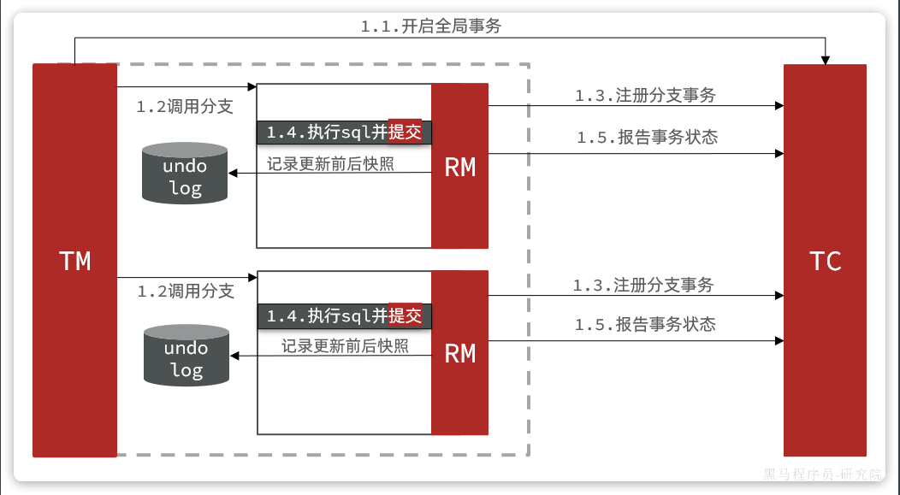

第二阶段根据阶段一的结果来判断：

- 如果每一个分支事务都成功，则事务已经结束（因为阶段一已经提交），因此删除阶段一的快照即可
- 如果有任意分支事务失败，则需要根据快照恢复到更新前数据。然后删除快照

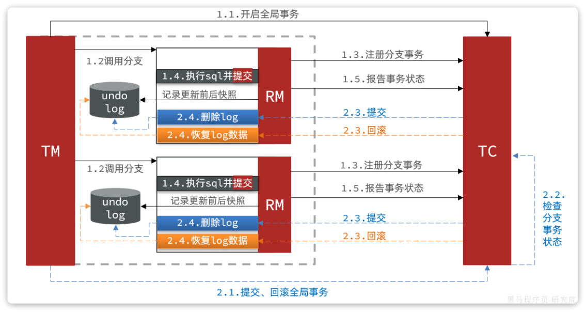

这种模式在大多数情况下（99%）并不会有什么问题，不过在极端情况下，特别是多线程并发访问AT模式的分布式事务时，有可能出现脏写问题，如图：

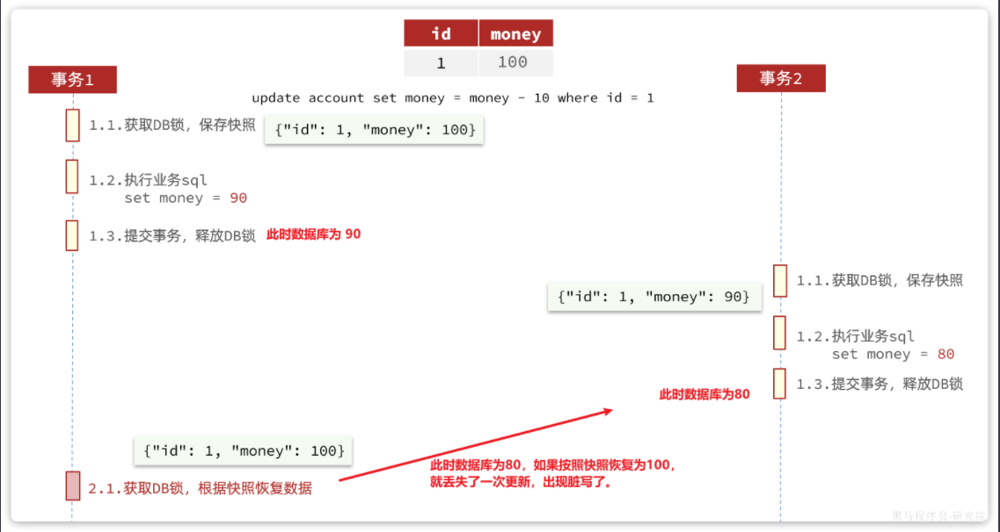

解决思路就是引入了全局锁的概念。在释放DB锁之前，先拿到全局锁。避免同一时刻有另外一个事务来操作当前数据。

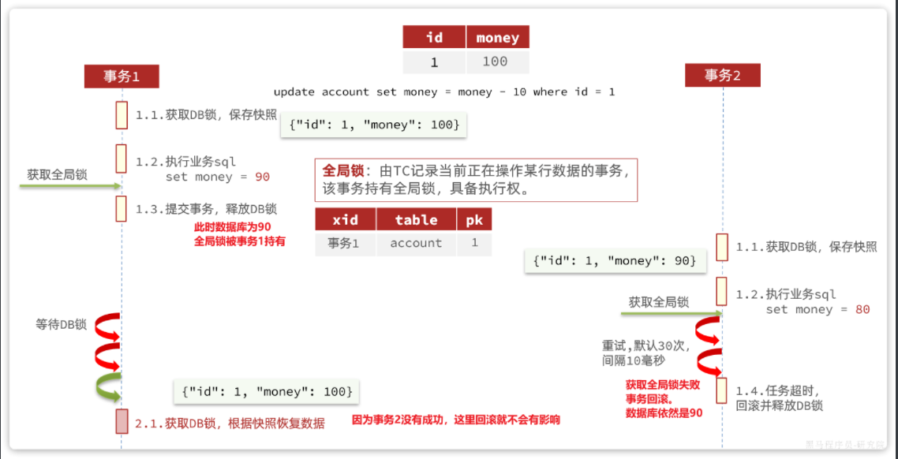

具体可以参考官方文档：

https://seata.io/zh-cn/docs/dev/mode/at-mode.html

## 4 TCC 模式

TCC模式与AT模式非常相似，每阶段都是独立事务，不同的是TCC通过人工编码来实现数据恢复。需要实现三个方法：

-  `try`：资源的检测和预留； 
-  `confirm`：完成资源操作业务；要求 `try` 成功 `confirm` 一定要能成功。 
-  `cancel`：预留资源释放，可以理解为try的反向操作。 

### 4.1 流程分析

举例，一个扣减用户余额的业务。假设账户A原来余额是100，需要余额扣减30元。

**阶段一（ Try ）**：检查余额是否充足，如果充足则冻结金额增加30元，可用余额扣除30

初始余额：

余额充足，可以冻结：

此时，总金额 = 冻结金额 + 可用金额，数量依然是100不变。事务直接提交无需等待其它事务。

**阶段二（Confirm)**：假如要提交（Confirm），之前可用金额已经扣减，并转移到冻结金额。因此可用金额不变，直接冻结金额扣减30即可：

此时，总金额 = 冻结金额 + 可用金额 = 0 + 70  = 70元

**阶段二(Canncel)**：如果要回滚（Cancel），则释放之前冻结的金额，也就是冻结金额扣减30，可用余额增加30

### 4.2 事务悬挂和空回滚

假如一个分布式事务中包含两个分支事务，try阶段，一个分支成功执行，另一个分支事务**阻塞**：

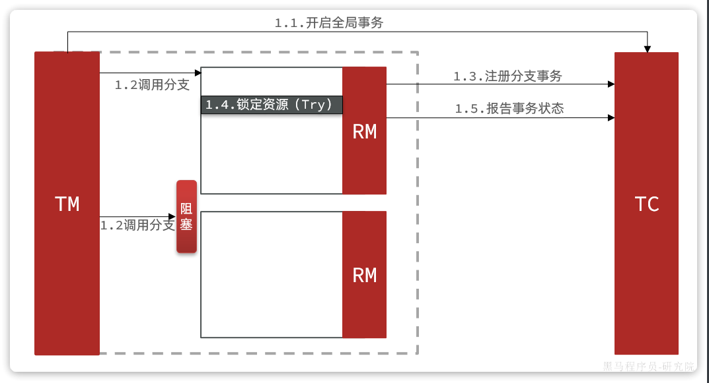

如果阻塞时间太长，可能导致全局事务超时而触发二阶段的`cancel`操作。两个分支事务都会执行cancel操作：

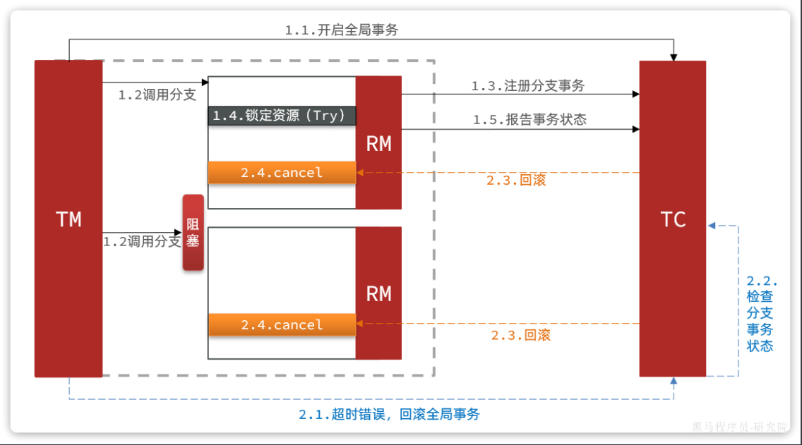

要知道，其中一个分支是未执行`try`操作的，直接执行了`cancel`操作，反而会导致数据错误。因此，这种情况下，尽管`cancel`方法要执行，但其中不能做任何回滚操作，这就是**空回滚**。

对于整个空回滚的分支事务，将来try方法阻塞结束依然会执行。但是整个全局事务其实已经结束了，因此永远不会再有confirm或cancel，也就是说这个事务执行了一半，处于**悬挂状态**，这就是业务悬挂问题。

以上问题都需要我们在编写try、cancel方法时处理。

### 4.3 总结

TCC模式的每个阶段是做什么的？

- Try：资源检查和预留
- Confirm：业务执行和提交
- Cancel：预留资源的释放

TCC的优点是什么？

- 一阶段完成直接提交事务，释放数据库资源，性能好
- 相比AT模型，无需生成快照，无需使用全局锁，性能最强
- 不依赖数据库事务，而是依赖补偿操作，可以用于非事务型数据库

TCC的缺点是什么？

- 有代码侵入，需要人为编写try、Confirm和Cancel接口，太麻烦
- 软状态，事务是最终一致
- 需要考虑Confirm和Cancel的失败情况，做好幂等处理、事务悬挂和空回滚处理