::: tip

1 环境隔离

2 分级模型

3 Eureka

4 Eureka 和 Nacos 对比

:::

本章主要学习Nacos中的一些特性和原理，以及与Eureka的功能对比。

## 1 环境隔离

企业实际开发中，往往会搭建多个运行环境，例如：

- 开发环境
- 测试环境
- 预发布环境
- 生产环境

这些不同环境之间的服务和数据之间需要隔离。

还有的企业中，会开发多个项目，共享nacos集群。此时，这些项目之间也需要把服务和数据隔离。

因此，Nacos提供了基于`namespace`的环境隔离功能。具体的隔离层次如图所示：

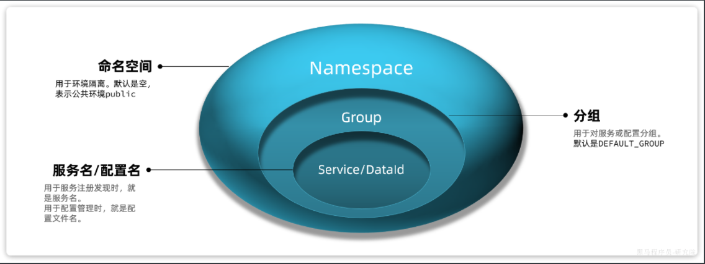

说明：

- Nacos中可以配置多个`namespace`，相互之间完全隔离。默认的`namespace`名为`public`
- `namespace`下还可以继续分组，也就是group ，相互隔离。 默认的group是`DEFAULT_GROUP`
- `group`之下就是服务和配置了


### 1.1 创建 namespace

nacos提供了一个默认的`namespace`，叫做`public`：

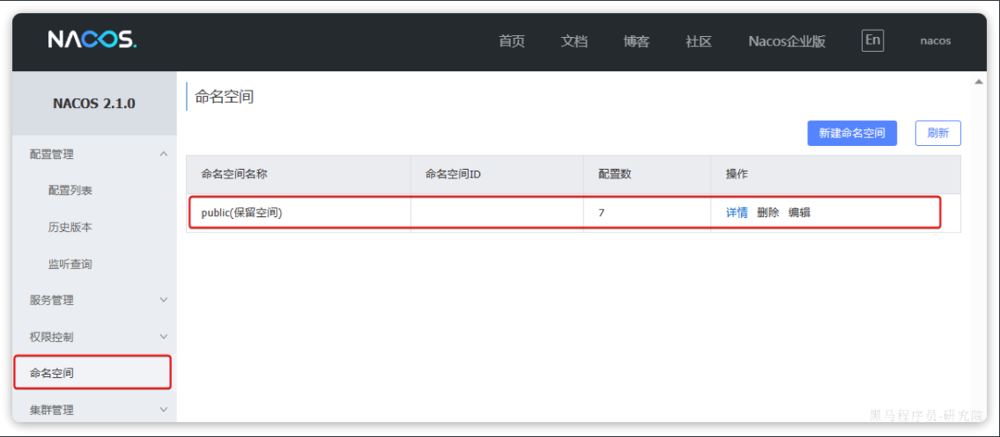

默认所有的服务和配置都属于这个`namespace`，当然我们也可以自己创建新的`namespace`：

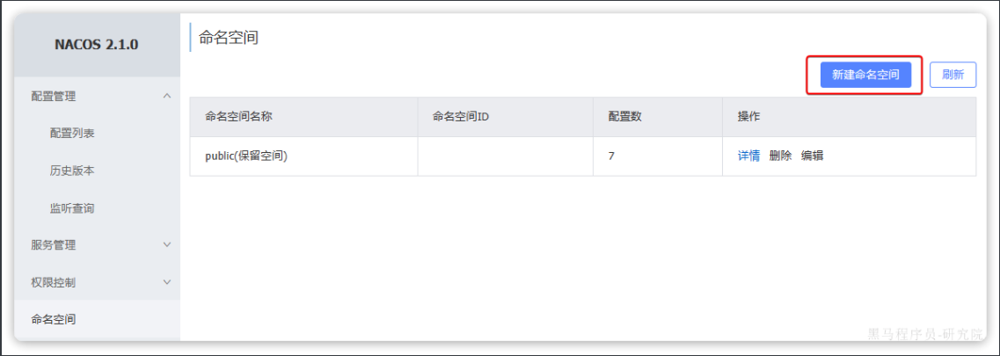

然后填写表单：

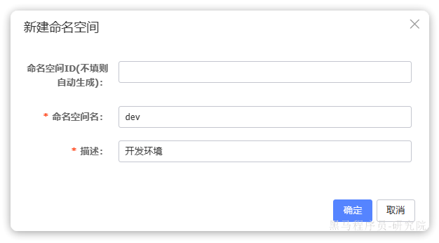

添加完成后，可以在页面看到我们新建的`namespace`，并且Nacos为我们自动生成了一个命名空间id：

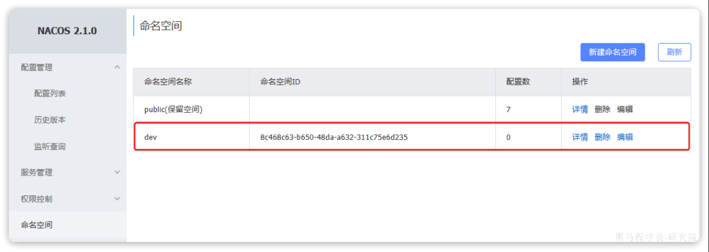

我们切换到配置列表页，你会发现`dev`这个命名空间下没有任何配置：

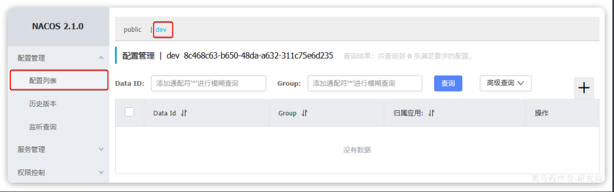

因为之前我们添加的所有配置都在`public`下：

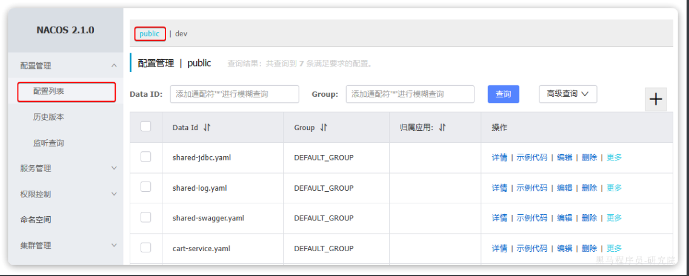


### 1.2 微服务配置 namespace

默认情况下，所有的微服务注册发现、配置管理都是走`public`这个命名空间。如果要指定命名空间则需要修改`application.yml`文件。

比如，我们修改`item-service`服务的bootstrap.yml文件，添加服务发现配置，指定其`namespace`：

```yaml
spring:
  application:
    name: item-service # 服务名称
  profiles:
    active: dev
  cloud:
    nacos:
      server-addr: 192.168.150.101 # nacos地址
      discovery: # 服务发现配置
        namespace: 8c468c63-b650-48da-a632-311c75e6d235 # 设置namespace，必须用id
      # 。。。略
```

启动`item-service`，查看服务列表，会发现`item-service`出现在`dev`下：

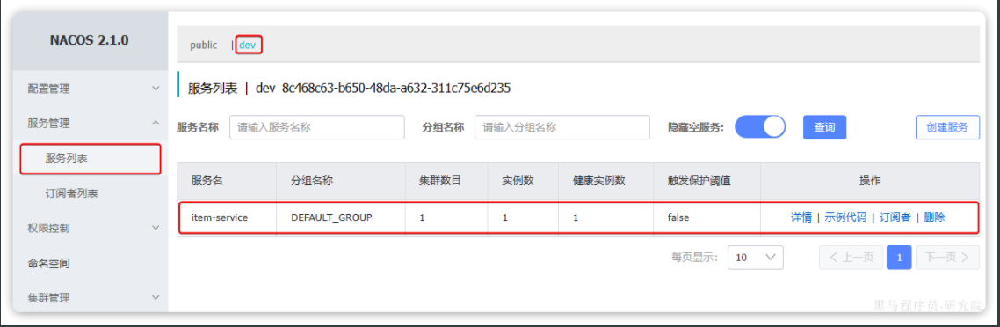

而其它服务则出现在`public`下：

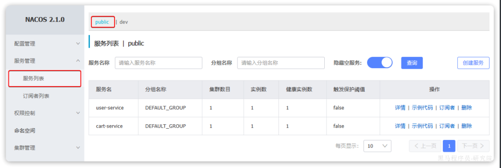

此时访问`http://localhost:8082/doc.html`，基于`swagger`做测试：

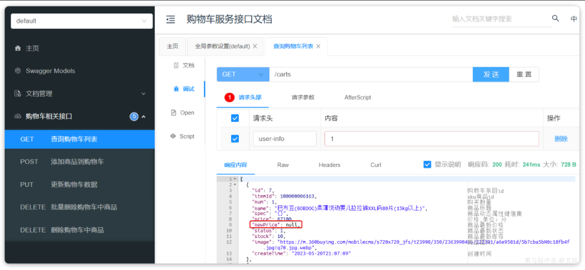

会发现查询结果中缺少商品的最新价格信息。

我们查看服务运行日志：

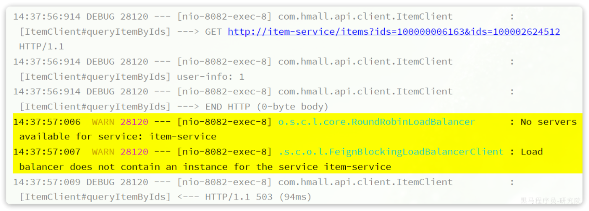

会发现`cart-service`服务在远程调用`item-service`时，并没有找到可用的实例。这证明不同namespace之间确实是相互隔离的，不可访问。

当我们把`namespace`切换回`public`，或者统一都是以`dev`时访问恢复正常。


## 2 分级模型

在一些大型应用中，同一个服务可以部署很多实例。而这些实例可能分布在全国各地的不同机房。由于存在地域差异，网络传输的速度会有很大不同，因此在做服务治理时需要区分不同机房的实例。

例如item-service，我们可以部署3个实例：

- 127.0.0.1:8081
- 127.0.0.1:8082
- 127.0.0.1:8083

假如这些实例分布在不同机房，例如：

- 127.0.0.1:8081，在上海机房
- 127.0.0.1:8082，在上海机房
- 127.0.0.1:8083，在杭州机房

Nacos中提供了集群（`cluster`）的概念，来对应不同机房。也就是说，一个服务（`service`）下可以有很多集群（`cluster`），而一个集群（`cluster`）中下又可以包含很多实例（`instance`）。

如图：

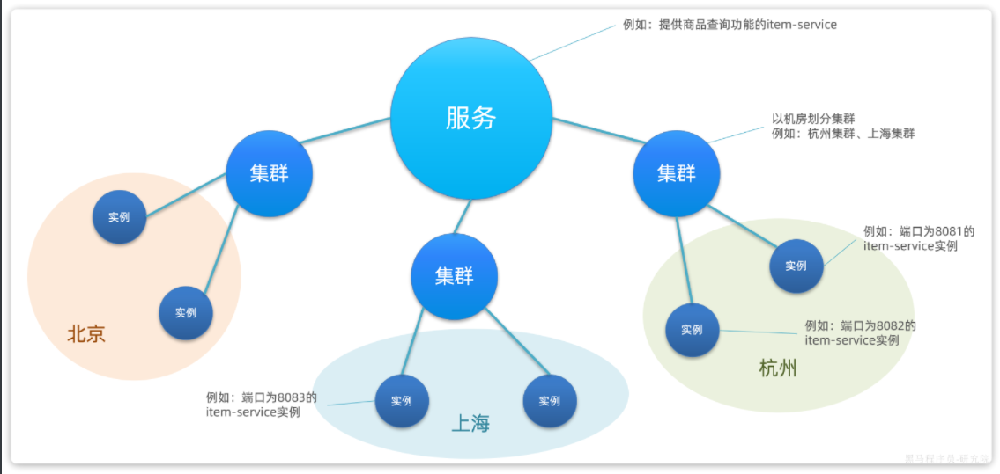

因此，结合我们上一节学习的`namespace`命名空间的知识，任何一个微服务的实例在注册到Nacos时，都会生成以下几个信息，用来确认当前实例的身份，从外到内依次是：

- namespace：命名空间
- group：分组
- service：服务名
- cluster：集群
- instance：实例，包含ip和端口

这就是nacos中的服务分级模型。

在Nacos内部会有一个服务实例的注册表，是基于Map实现的，其结构与分级模型的对应关系如下：

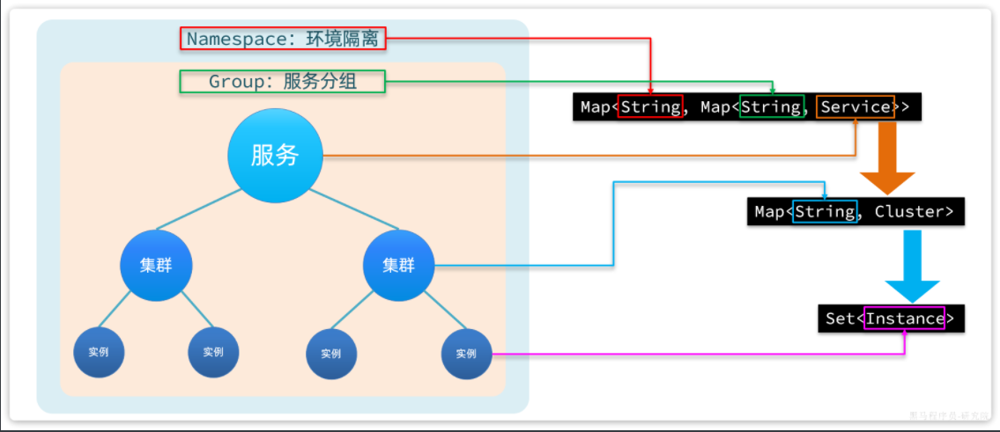

查看nacos控制台，会发现默认情况下所有服务的集群都是default：

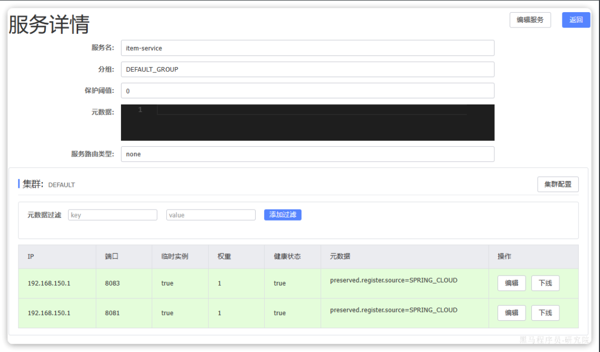

如果我们要修改服务所在集群，只需要修改`bootstrap.yml`即可：

```yaml
spring:
  cloud:
    nacos:
      discovery:
        cluster-name: BJ # 集群名称，自定义
```

我们修改`item-service`的`bootstrap.yml`，然后重新创建一个实例：

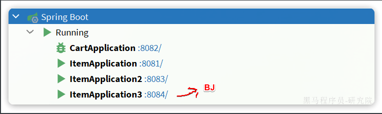

再次查看nacos：

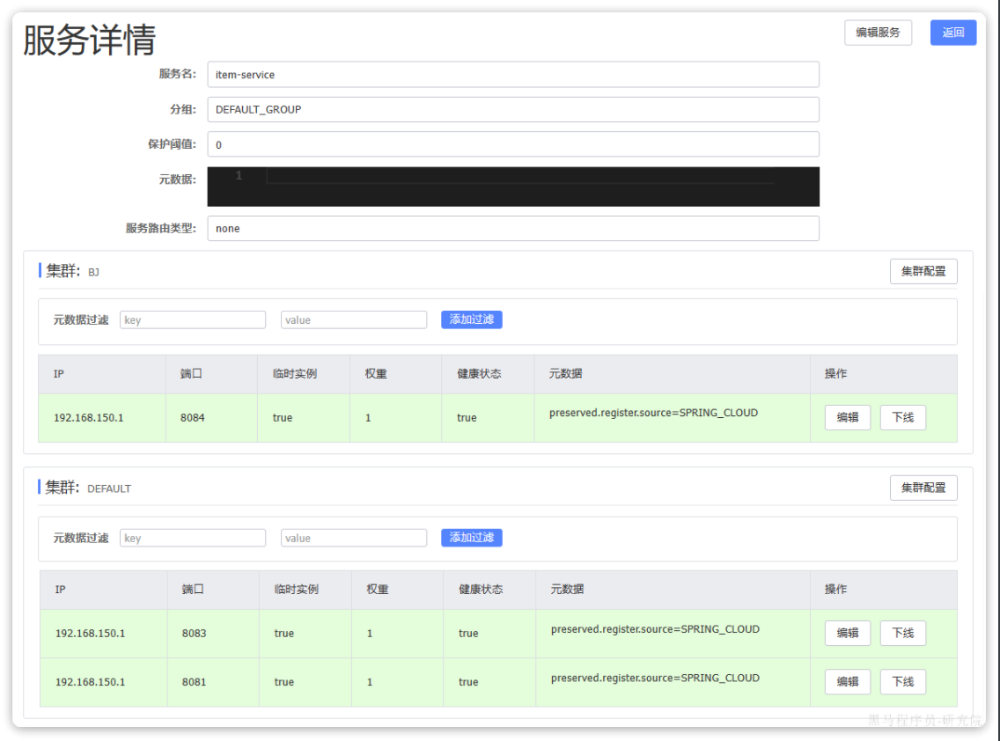

发现8084这个新的实例确实属于`BJ`这个集群了。


## 3 Eureka

Eureka是Netflix公司开源的一个服务注册中心组件，早期版本的SpringCloud都是使用Eureka作为注册中心。由于Eureka和Nacos的starter中提供的功能都是基于SpringCloudCommon规范，因此两者使用起来差别不大。

课前资料中提供了一个Eureka的demo：

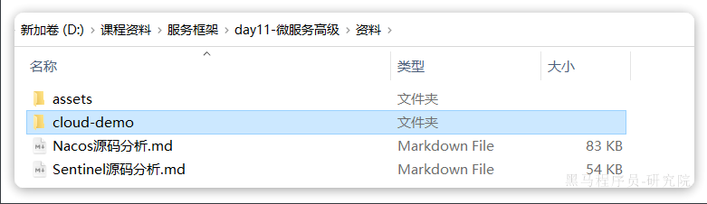

我们可以用idea打开查看一下：

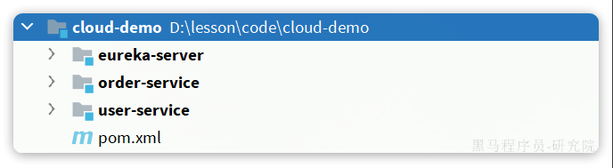

结构说明：

- `eureka-server`：Eureka的服务端，也就是注册中心。没错，Eureka服务端要自己创建项目
- `order-service`：订单服务，是一个服务调用者，查询订单的时候要查询用户
- `user-service`：用户服务，是一个服务提供者，对外暴露查询用户的接口

启动以后，访问`localhost:10086`即可查看到Eureka的控制台，相对于Nacos来说简陋了很多：

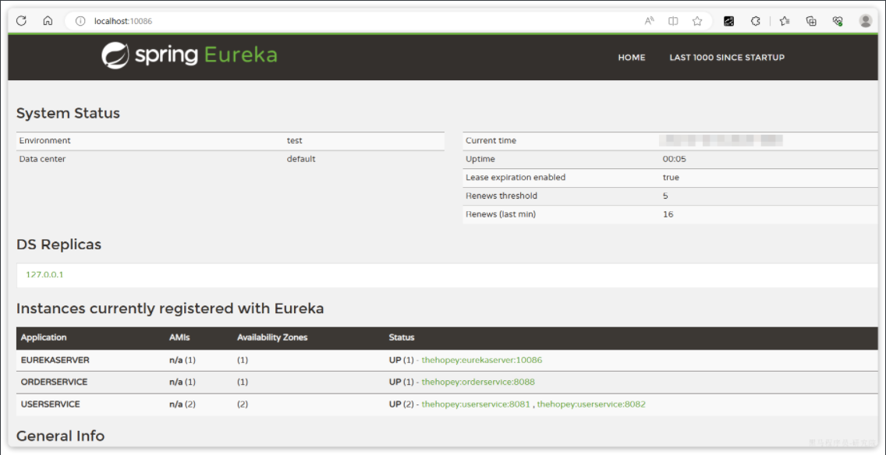

微服务引入Eureka的方式也极其简单，分两步：

- 引入`eureka-client`依赖
- 配置`eureka`地址

接下来就是编写OpenFeign的客户端了，怎么样？是不是跟Nacos用起来基本一致。


## 4 Eureka 和 Nacos 对比

Eureka和Nacos都能起到注册中心的作用，用法基本类似。但还是有一些区别的，例如：

- Nacos支持配置管理，而Eureka则不支持。

而且服务注册发现上也有区别，我们来做一个实验：

我们停止`user-service`服务，然后观察Eureka控制台，你会发现很长一段时间过去后，Eureka服务依然没有察觉`user-service`的异常状态。

这与Eureka的健康检测机制有关。在Eureka中，健康检测的原理如下：

- 微服务启动时注册信息到Eureka，这点与Nacos一致。
- 微服务每隔30秒向Eureka发送心跳请求，报告自己的健康状态。Nacos中默认是5秒一次。
- Eureka如果90秒未收到心跳，则认为服务疑似故障，可能被剔除。Nacos中则是15秒超时，30秒剔除。
- Eureka如果发现超过85%比例的服务都心跳异常，会认为是自己的网络异常，暂停剔除服务的功能。
- Eureka每隔60秒执行一次服务检测和清理任务；Nacos是每隔5秒执行一次。

综上，你会发现Eureka是尽量不剔除服务，避免“误杀”，宁可放过一千，也不错杀一个。这就导致当服务真的出现故障时，迟迟不会被剔除，给服务的调用者带来困扰。

不仅如此，当Eureka发现服务宕机并从服务列表中剔除以后，并不会将服务列表的变更消息推送给所有微服务。而是等待微服务自己来拉取时发现服务列表的变化。而微服务每隔30秒才会去Eureka更新一次服务列表，进一步推迟了服务宕机时被发现的时间。

而Nacos中微服务除了自己定时去Nacos中拉取服务列表以外，Nacos还会在服务列表变更时主动推送最新的服务列表给所有的订阅者。

综上，Eureka和Nacos的相似点有：

- 都支持服务注册发现功能
- 都有基于心跳的健康监测功能
- 都支持集群，集群间数据同步默认是AP模式，即最全高可用性

Eureka和Nacos的区别有：

- Eureka的心跳是30秒一次，Nacos则是5秒一次
- Eureka如果90秒未收到心跳，则认为服务疑似故障，可能被剔除。Nacos中则是15秒超时，30秒剔除。
- Eureka每隔60秒执行一次服务检测和清理任务；Nacos是每隔5秒执行一次。
- Eureka只能等微服务自己每隔30秒更新一次服务列表；Nacos即有定时更新，也有在服务变更时的广播推送
- Eureka仅有注册中心功能，而Nacos同时支持注册中心、配置管理
- Eureka和Nacos都支持集群，而且默认都是AP模式