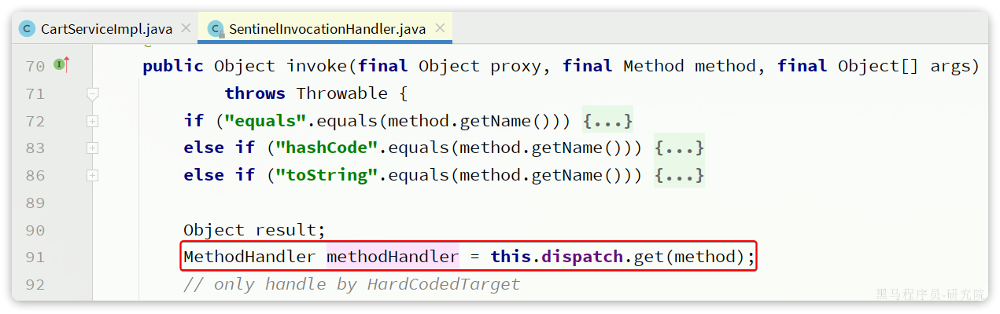
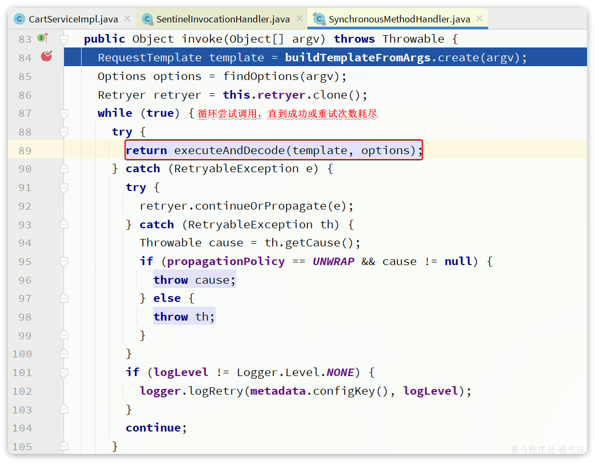
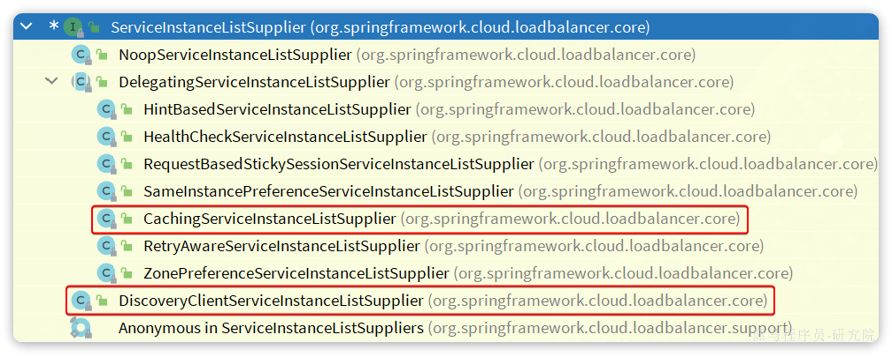

::: tip

1 负载均衡原理

2 NacosRule

:::

我们知道微服务间远程调用都是有OpenFeign帮我们完成的，甚至帮我们实现了服务列表之间的负载均衡。但具体负载均衡的规则是什么呢？何时做的负载均衡呢？

接下来我们一起来分析一下。


## 1 负载均衡原理

在SpringCloud的早期版本中，负载均衡都是有Netflix公司开源的Ribbon组件来实现的，甚至Ribbon被直接集成到了Eureka-client和Nacos-Discovery中。

但是自SpringCloud2020版本开始，已经弃用Ribbon，改用Spring自己开源的Spring Cloud LoadBalancer了，我们使用的OpenFeign的也已经与其整合。

接下来我们就通过源码分析，来看看OpenFeign底层是如何实现负载均衡功能的。


### 1.1 源码跟踪

要弄清楚OpenFeign的负载均衡原理，最佳的办法肯定是从FeignClient的请求流程入手。

首先，我们在`com.hmall.cart.service.impl.CartServiceImpl`中的`queryMyCarts`方法中打一个断点。然后在swagger页面请求购物车列表接口。

进入断点后，观察`ItemClient`这个接口：


你会发现ItemClient是一个代理对象，而代理的处理器则是`SentinelInvocationHandler`。这是因为我们项目中引入了`Sentinel`导致。

我们进入`SentinelInvocationHandler`类中的`invoke`方法看看：



可以看到这里是先获取被代理的方法的处理器`MethodHandler`，接着，Sentinel就会开启对簇点资源的监控：


开启Sentinel的簇点资源监控后，就可以调用处理器了，我们尝试跟入，会发现有两种实现：


这其实就是OpenFeign远程调用的处理器了。继续跟入会进入`SynchronousMethodHandler`这个实现类：



在上述方法中，会循环尝试调用`executeAndDecode()`方法，直到成功或者是重试次数达到Retryer中配置的上限。

我们继续跟入`executeAndDecode()`方法：


`executeAndDecode()`方法最终会利用`client`去调用`execute()`方法，发起远程调用。

这里的client的类型是`feign.Client`接口，其下有很多实现类：


由于我们项目中整合了seata，所以这里client对象的类型是`SeataFeignBlockingLoadBalancerClient`，内部实现如下：


这里直接调用了其父类，也就是`FeignBlockingLoadBalancerClient`的`execute`方法，来看一下：


整段代码中核心的有4步：

- 从请求的`URI`中找出`serviceId`
- 利用`loadBalancerClient`，根据`serviceId`做负载均衡，选出一个实例`ServiceInstance`
- 用选中的`ServiceInstance`的`ip`和`port`替代`serviceId`，重构`URI`
- 向真正的URI发送请求

所以负载均衡的关键就是这里的loadBalancerClient，类型是`org.springframework.cloud.client.loadbalancer.LoadBalancerClient`，这是`Spring-Cloud-Common`模块中定义的接口，只有一个实现类：


而这里的`org.springframework.cloud.client.loadbalancer.BlockingLoadBalancerClient`正是`Spring-Cloud-LoadBalancer`模块下的一个类：


我们继续跟入其`BlockingLoadBalancerClient#choose()`方法：


图中代码的核心逻辑如下：

- 根据serviceId找到这个服务采用的负载均衡器（`ReactiveLoadBalancer`），也就是说我们可以给每个服务配不同的负载均衡算法。
- 利用负载均衡器（`ReactiveLoadBalancer`）中的负载均衡算法，选出一个服务实例

`ReactiveLoadBalancer`是`Spring-Cloud-Common`组件中定义的负载均衡器接口规范，而`Spring-Cloud-Loadbalancer`组件给出了两个实现：


默认的实现是`RoundRobinLoadBalancer`，即**轮询**负载均衡器。负载均衡器的核心逻辑如下：


核心流程就是两步：

- 利用`ServiceInstanceListSupplier#get()`方法拉取服务的实例列表，这一步是采用响应式编程
- 利用本类，也就是`RoundRobinLoadBalancer`的`getInstanceResponse()`方法挑选一个实例，这里采用了轮询算法来挑选。

这里的ServiceInstanceListSupplier有很多实现：



其中CachingServiceInstanceListSupplier采用了装饰模式，加了服务实例列表缓存，避免每次都要去注册中心拉取服务实例列表。而其内部是基于`DiscoveryClientServiceInstanceListSupplier`来实现的。

在这个类的构造函数中，就会异步的基于DiscoveryClient去拉取服务的实例列表：


### 1.2 流程梳理

根据之前的分析，我们会发现Spring在整合OpenFeign的时候，实现了`org.springframework.cloud.openfeign.loadbalancer.FeignBlockingLoadBalancerClient`类，其中定义了OpenFeign发起远程调用的核心流程。也就是四步：

- 获取请求中的`serviceId`
- 根据`serviceId`负载均衡，找出一个可用的服务实例
- 利用服务实例的`ip`和`port`信息重构url
- 向真正的url发起请求

而具体的负载均衡则是不是由`OpenFeign`组件负责。而是分成了**负载均衡的接口规范**，以及**负载均衡的具体实现**两部分。

负载均衡的接口规范是定义在`Spring-Cloud-Common`模块中，包含下面的接口：

- `LoadBalancerClient`：负载均衡客户端，职责是根据serviceId最终负载均衡，选出一个服务实例
- `ReactiveLoadBalancer`：负载均衡器，负责具体的负载均衡算法

OpenFeign的负载均衡是基于`Spring-Cloud-Common`模块中的负载均衡规则接口，并没有写死具体实现。这就意味着以后还可以拓展其它各种负载均衡的实现。

不过目前`SpringCloud`中只有`Spring-Cloud-Loadbalancer`这一种实现。

`Spring-Cloud-Loadbalancer`模块中，实现了`Spring-Cloud-Common`模块的相关接口，具体如下：

- `BlockingLoadBalancerClient`：实现了`LoadBalancerClient`，会根据serviceId选出负载均衡器并调用其算法实现负载均衡。
- `RoundRobinLoadBalancer`：基于轮询算法实现了`ReactiveLoadBalancer`
- `RandomLoadBalancer`：基于随机算法实现了`ReactiveLoadBalancer`，

这样一来，整体思路就非常清楚了，流程图如下：


## 2 NacosRule

之前分析源码的时候我们发现负载均衡的算法是有`ReactiveLoadBalancer`来定义的，我们发现它的实现类有三个：


其中`RoundRobinLoadBalancer`和`RandomLoadBalancer`是由`Spring-Cloud-Loadbalancer`模块提供的，而`NacosLoadBalancer`则是由`Nacos-Discorvery`模块提供的。

默认采用的负载均衡策略是`RoundRobinLoadBalancer`，那如果我们要切换负载均衡策略该怎么办？

### 2.1 修改负载均衡策

查看源码会发现，`Spring-Cloud-Loadbalancer`模块中有一个自动配置类：


其中定义了默认的负载均衡器：


这个Bean上添加了`@ConditionalOnMissingBean`注解，也就是说如果我们自定义了这个类型的bean，则负载均衡的策略就会被改变。

我们在`hm-cart`模块中的添加一个配置类：


代码如下：

```java
package com.hmall.cart.config;

import com.alibaba.cloud.nacos.NacosDiscoveryProperties;
import com.alibaba.cloud.nacos.loadbalancer.NacosLoadBalancer;
import org.springframework.cloud.client.ServiceInstance;
import org.springframework.cloud.loadbalancer.core.ReactorLoadBalancer;
import org.springframework.cloud.loadbalancer.core.ServiceInstanceListSupplier;
import org.springframework.cloud.loadbalancer.support.LoadBalancerClientFactory;
import org.springframework.context.annotation.Bean;
import org.springframework.core.env.Environment;

public class OpenFeignConfig {

    @Bean
    public ReactorLoadBalancer<ServiceInstance> reactorServiceInstanceLoadBalancer(
            Environment environment, NacosDiscoveryProperties properties,
            LoadBalancerClientFactory loadBalancerClientFactory) {
        String name = environment.getProperty(LoadBalancerClientFactory.PROPERTY_NAME);
        return new NacosLoadBalancer(
                loadBalancerClientFactory.getLazyProvider(name, ServiceInstanceListSupplier.class), name, properties);
    }

}
```

**注意**：

这个配置类千万不要加`@Configuration`注解，也不要被SpringBootApplication扫描到。

由于这个OpenFeignConfig没有加`@Configuration`注解，也就没有被Spring加载，因此是不会生效的。接下来，我们要在启动类上通过注解来声明这个配置。

有两种做法：

- 全局配置：对所有服务生效

```java
@LoadBalancerClients(defaultConfiguration = OpenFeignConfig.class)
```

- 局部配置：只对某个服务生效

```java
@LoadBalancerClients({
        @LoadBalancerClient(value = "item-service", configuration = OpenFeignConfig.class)
})
```

我们选择全局配置：


DEBUG重启后测试，会发现负载均衡器的类型确实切换成功：


### 2.2 集群优先

`RoundRobinLoadBalancer`是轮询算法，`RandomLoadBalancer`是随机算法，那么`NacosLoadBalancer`是什么负载均衡算法呢？

我们通过源码来分析一下，先看第一部分：


这部分代码的大概流程如下：

- 通过`ServiceInstanceListSupplier`获取服务实例列表
- 获取`NacosDiscoveryProperties`中的`clusterName`，也就是yml文件中的配置，代表当前服务实例所在集群信息（参考`2.2`小节，分级模型）
- 然后利用stream的filter过滤找到被调用的服务实例中与当前服务实例`clusterName`一致的。简单来说就是**服务调用者与服务提供者要在一个集群**

为什么？

假如我现在有两个机房，都部署有`item-service`和`cart-service`服务：


假如这些服务实例全部都注册到了同一个Nacos。现在，杭州机房的`cart-service`要调用`item-service`，会拉取到所有机房的item-service的实例。调用时会出现两种情况：

- 直接调用当前机房的`item-service`
- 调用其它机房的`item-service`

本机房调用几乎没有网络延迟，速度比较快。而跨机房调用，如果两个机房相距很远，会存在较大的网络延迟。因此，我们应该尽可能避免跨机房调用，优先本地集群调用：


现在的情况是这样的：

- `cart-service`所在集群是`default`
- `item-service`的8081、8083所在集群的`default`
- `item-service`的8084所在集群是`BJ`

`cart-service`访问`item-service`时，应该优先访问8081和8082，我们重启`cart-service`，测试一下：


可以看到原本是3个实例，经过筛选后还剩下2个实例。

查看Debug控制台：


同集群的实例还剩下两个，接下来就需要做负载均衡了，具体用的是什么算法呢？


### 2.3 权重配置

我们继续跟踪`NacosLoadBalancer`源码：


那么问题来了， 这个权重是怎么配的呢？

我们打开nacos控制台，进入`item-service`的服务详情页，可以看到每个实例后面都有一个**编辑**按钮：


点击，可以看到一个编辑表单：


我们将这里的权重修改为5：


访问10次购物车接口，可以发现大多数请求都访问到了8083这个实例。