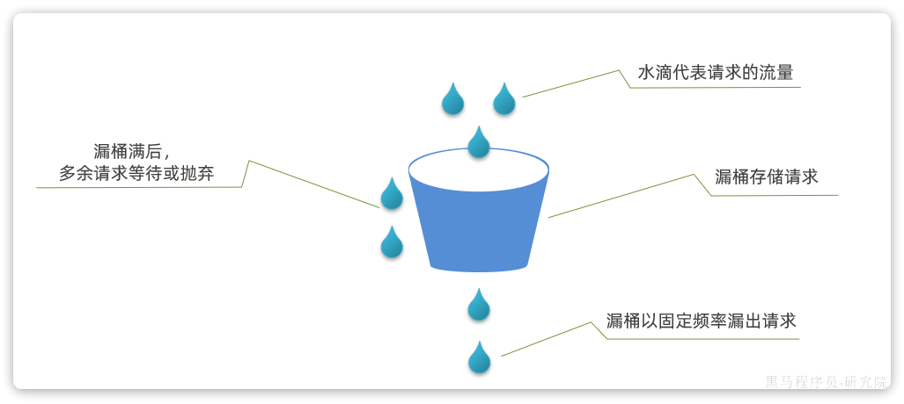
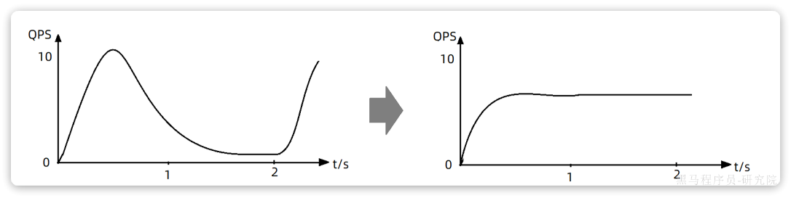

::: tip

1 线程隔离

2 滑动窗口算法

3 令牌桶算法

4 漏桶算法

5 作业

:::

在SpringCloud的早期版本中采用的服务保护技术叫做`Hystix`，不过后来被淘汰，替换为`Spring Cloud Circuit Breaker`，其底层实现可以是`Spring Retry`和`Resilience4J`。

不过在国内使用较多还是`SpringCloudAlibaba`中的`Sentinel`组件。

接下来，我们就分析一下`Sentinel`组件的一些基本实现原理以及它与`Hystix`的差异。

## 1 线程隔离

首先我们来看下线程隔离功能，无论是Hystix还是Sentinel都支持线程隔离。不过其实现方式不同。

线程隔离有两种方式实现：

- **线程池****隔离**：给每个服务调用业务分配一个线程池，利用线程池本身实现隔离效果
- **信号量****隔离**：不创建线程池，而是计数器模式，记录业务使用的线程数量，达到信号量上限时，禁止新的请求

如图：

两者的优缺点如下：

Sentinel的线程隔离就是基于信号量隔离实现的，而Hystix两种都支持，但默认是基于线程池隔离。

## 2 滑动窗口算法

在熔断功能中，需要统计异常请求或慢请求比例，也就是计数。在限流的时候，要统计每秒钟的QPS，同样是计数。可见计数算法在熔断限流中的应用非常多。sentinel中采用的计数器算法就是滑动窗口计数算法。

### 2.1 固定窗口计数

要了解滑动窗口计数算法，我们必须先知道固定窗口计数算法，其基本原理如图：

说明：

- 将时间划分为多个窗口，窗口时间跨度称为`Interval`，本例中为1000ms；
- 每个窗口维护1个计数器，每有1次请求就将计数器`+1`。限流就是设置计数器阈值，本例为3，图中红线标记
- 如果计数器超过了限流阈值，则超出阈值的请求都被丢弃。

示例：

说明：

- 第1、2秒，请求数量都小于3，没问题
- 第3秒，请求数量为5，超过阈值，超出的请求被拒绝

但是我们考虑一种特殊场景，如图：

说明：

- 假如在第5、6秒，请求数量都为3，没有超过阈值，全部放行
- 但是，如果第5秒的三次请求都是在4.5~5秒之间进来；第6秒的请求是在5~5.5之间进来。那么从第4.5~5.之间就有6次请求！也就是说每秒的QPS达到了6，远超阈值。

这就是固定窗口计数算法的问题，它只能统计当前某1个时间窗的请求数量是否到达阈值，无法结合前后的时间窗的数据做综合统计。

因此，我们就需要滑动时间窗口算法来解决。

### 2.2 滑动窗口计数

固定时间窗口算法中窗口有很多，其跨度和位置是与时间区间绑定，因此是很多固定不动的窗口。而滑动时间窗口算法中只包含1个固定跨度的窗口，但窗口是可移动动的，与时间区间无关。

具体规则如下：

- 窗口时间跨度`Interval`大小固定，例如1秒
- 时间区间跨度为`Interval / n` ，例如n=2，则时间区间跨度为500ms
- 窗口会随着当前请求所在时间`currentTime`移动，窗口范围从`currentTime-Interval`时刻之后的第一个时区开始，到`currentTime`所在时区结束。

如图所示：

限流阈值依然为3，绿色小块就是请求，上面的数字是其`currentTime`值。

- 在第1300ms时接收到一个请求，其所在时区就是1000~1500
- 按照规则，currentTime-Interval值为300ms，300ms之后的第一个时区是500~1000，因此窗口范围包含两个时区：500~1000、1000~1500，也就是粉红色方框部分
- 统计窗口内的请求总数，发现是3，未达到上限。

若第1400ms又来一个请求，会落在1000~1500时区，虽然该时区请求总数是3，但滑动窗口内总数已经达到4，因此该请求会被拒绝：

假如第1600ms又来的一个请求，处于1500~2000时区，根据算法，滑动窗口位置应该是1000~1500和1500~2000这两个时区，也就是向后移动：

这就是滑动窗口计数的原理，解决了我们之前所说的问题。而且滑动窗口内划分的时区越多，这种统计就越准确。

## 3 令牌桶算法

限流的另一种常见算法是令牌桶算法。Sentinel中的热点参数限流正是基于令牌桶算法实现的。其基本思路如图：

说明：

- 以固定的速率生成令牌，存入令牌桶中，如果令牌桶满了以后，多余令牌丢弃
- 请求进入后，必须先尝试从桶中获取令牌，获取到令牌后才可以被处理
- 如果令牌桶中没有令牌，则请求等待或丢弃

基于令牌桶算法，每秒产生的令牌数量基本就是QPS上限。

当然也有例外情况，例如：

- 某一秒令牌桶中产生了很多令牌，达到令牌桶上限N，缓存在令牌桶中，但是这一秒没有请求进入。
- 下一秒的前半秒涌入了超过2N个请求，之前缓存的令牌桶的令牌耗尽，同时这一秒又生成了N个令牌，于是总共放行了2N个请求。超出了我们设定的QPS阈值。

因此，在使用令牌桶算法时，尽量不要将令牌上限设定到服务能承受的QPS上限。而是预留一定的波动空间，这样我们才能应对突发流量。

## 4 漏桶算法

漏桶算法与令牌桶相似，但在设计上更适合应对并发波动较大的场景，以解决令牌桶中的问题。

简单来说就是请求到达后不是直接处理，而是先放入一个队列。而后以固定的速率从队列中取出并处理请求。之所以叫漏桶算法，就是把请求看做水，队列看做是一个漏了的桶。

如图：

说明：

- 将每个请求视作"水滴"放入"漏桶"进行存储；
- "漏桶"以固定速率向外"漏"出请求来执行，如果"漏桶"空了则停止"漏水”；
- 如果"漏桶"满了则多余的"水滴"会被直接丢弃。

漏桶的优势就是**流量整型**，桶就像是一个大坝，请求就是水。并发量不断波动，就如图水流时大时小，但都会被大坝拦住。而后大坝按照固定的速度放水，避免下游被洪水淹没。

因此，不管并发量如何波动，经过漏桶处理后的请求一定是相对平滑的曲线：

sentinel中的限流中的排队等待功能正是基于漏桶算法实现的。漏桶算法与令牌桶相似，但在设计上更适合应对并发波动较大的场景，以解决令牌桶中的问题。

简单来说就是请求到达后不是直接处理，而是先放入一个队列。而后以固定的速率从队列中取出并处理请求。之所以叫漏桶算法，就是把请求看做水，队列看做是一个漏了的桶。

如图：

说明：

- 将每个请求视作"水滴"放入"漏桶"进行存储；
- "漏桶"以固定速率向外"漏"出请求来执行，如果"漏桶"空了则停止"漏水”；
- 如果"漏桶"满了则多余的"水滴"会被直接丢弃。

漏桶的优势就是**流量整型**，桶就像是一个大坝，请求就是水。并发量不断波动，就如图水流时大时小，但都会被大坝拦住。而后大坝按照固定的速度放水，避免下游被洪水淹没。

因此，不管并发量如何波动，经过漏桶处理后的请求一定是相对平滑的曲线：

sentinel中的限流中的排队等待功能正是基于漏桶算法实现的。

## 5.作业

尝试用自己的语言回答下列面试题：

- SpringCloud有哪些常用组件？分别是什么作用？
- 服务注册发现的基本流程是怎样的？
- Eureka和Nacos有哪些区别？
- Nacos的分级存储模型是什么意思？
- OpenFeign是如何实现负载均衡的？
- 什么是服务雪崩，常见的解决方案有哪些？
- Hystix和Sentinel有什么区别和联系？
- 限流的常见算法有哪些？
- 什么是CAP理论和BASE思想？
- 项目中碰到过分布式事务问题吗？怎么解决的？
- AT模式如何解决脏读和脏写问题的？
- TCC模式与AT模式对比，有哪些优缺点
- RabbitMQ是如何确保消息的可靠性的？
- RabbitMQ是如何解决消息堆积问题的？