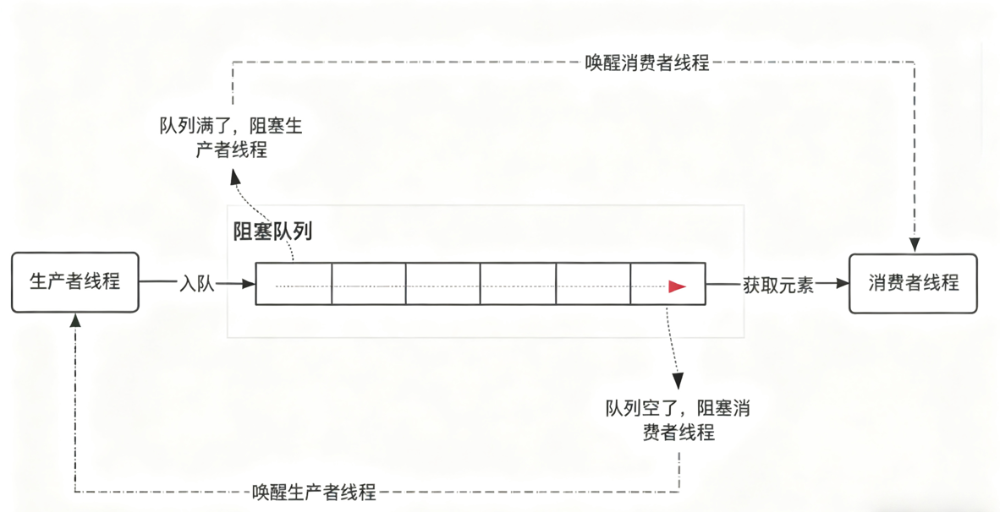
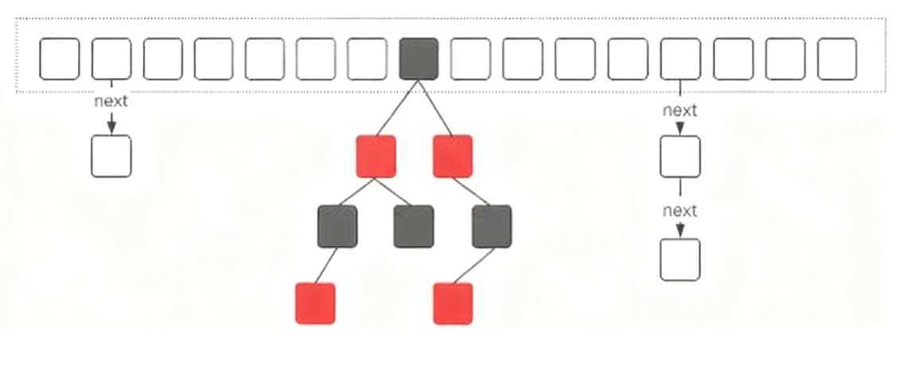
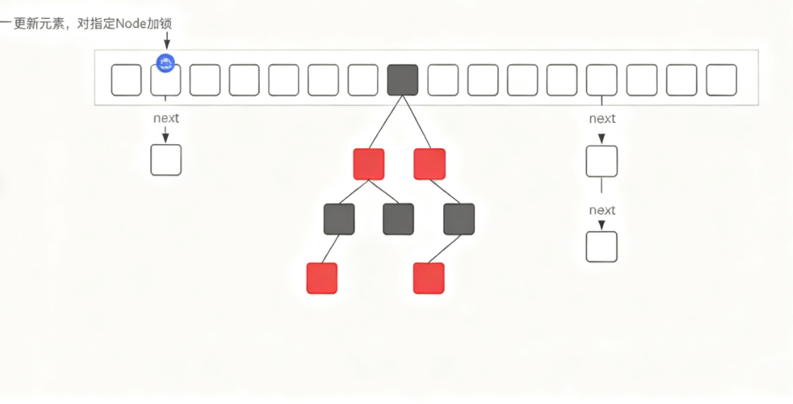
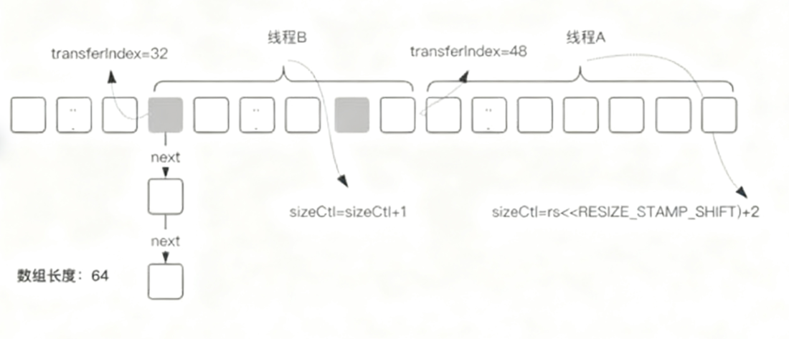
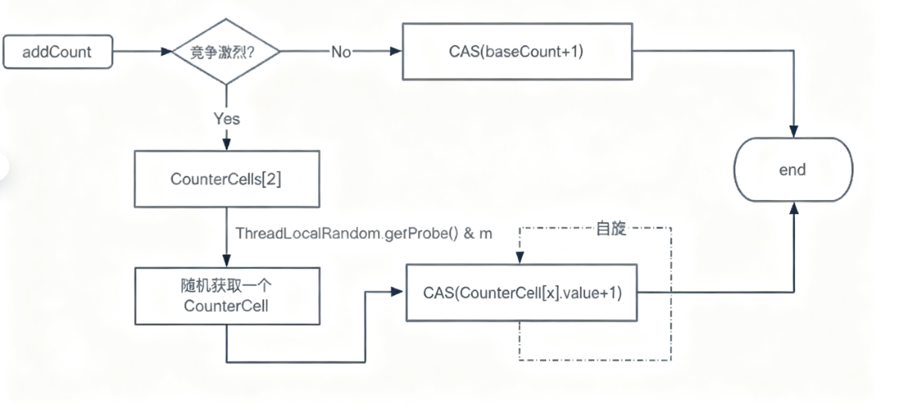
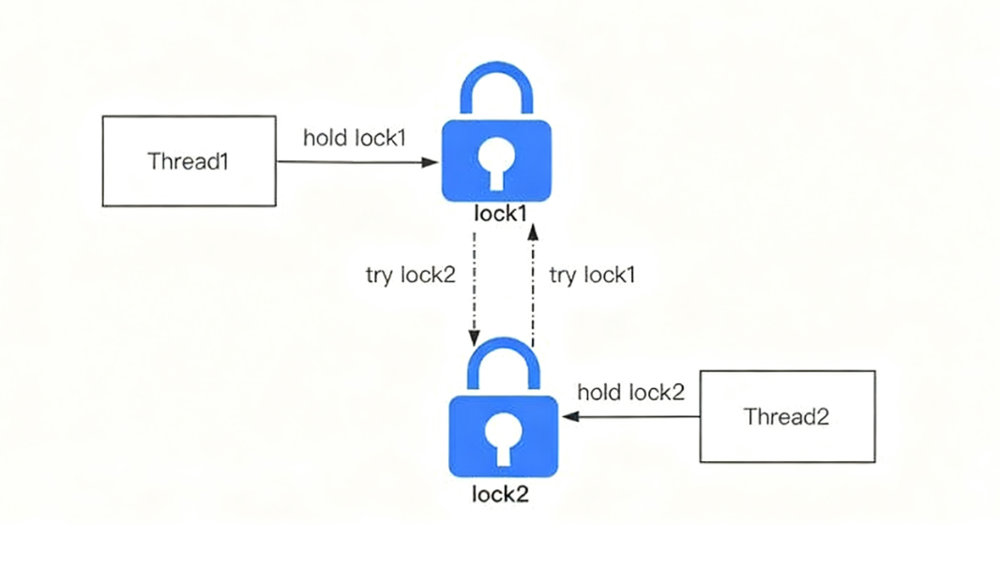
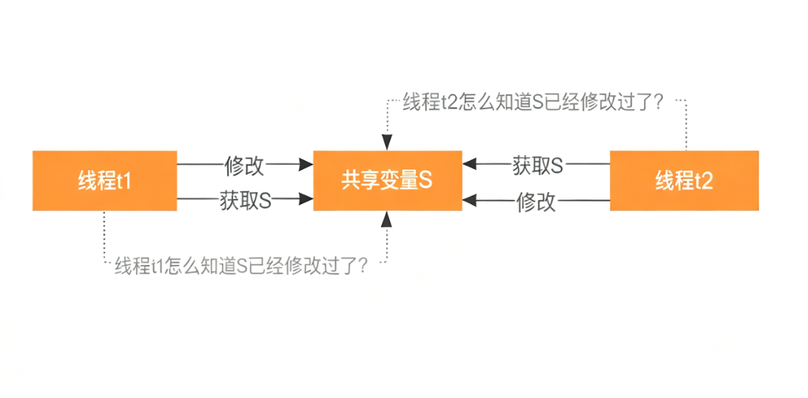

## 1.谈谈你对 AQS 的理解

AQS 是 AbstractQueuedSynchronizer 的简称，是并发编程中比较核心的组件。

### 普通人的回答

AQS 全程是 AbstractQueuedSynchronizer  ，他是 JUC 包中 Lock 锁的底层实现，可以用它来实现多线程的同步器。

### 高手的回答

AQS 是多线程同步器。他是 JUC 包中多个组件的底层实现，如  Lock 、ContDownLatch、Semaphore 等都用到了 AQS.从本质上来说，AQS 提供了两种锁机制，分别是`排它锁`和`共享锁`。

排它锁，就是存在多线程竞争同意共享资源时，同一时刻只允许一个线程访问该共享资源，也就是多个线程中只能由一个线程获得锁资源，比如 Lock 中的 ReentrantLock 重入锁实现就是用到了AQS 中的排它锁功能。

共享锁，也称读锁，就是在同一时刻允许多个线程同时获得锁资源，比如 CountDownLatch 和饥饿 Semaphore 都是用到了 AQS 中的共享锁功能。


## 2.lock 和 synchronized 区别

### 普通人的回答

lock 是 J.U.C 包里提供的锁，synchronized 是 Java 中的同步关键字。他们都可以实现多线程对共享资源访问的线程安全性。

### 高手的回答

下面我从4个方面来回答

1. 从功能角度来看

   Lock 和 Synchronized 都是 Java 中用来解决线程安全问题的工具。

2. 从特性来看

   - Synchronized 是 java 中的同步关键字，Lock 是 J.U.C 包中提供的接口，这个接口有很多实现类，其中就包括 ReentrantLock 重入锁

   - Synchronized 可以通过实现两种方式来控制锁的粒度

     ```java
     //修饰在方法层面
     public synchronized void sync() {
         
     }
     
     Object lock = new Object();
     //修饰在代码块
     public void sync() {
         synchronized(lcok) {
             
         }
     }
     ```

     一种是把 synchronized 关键字修饰在方法层面，另一种是修饰在代码块上，并且我们可以通过 Synchronized 加锁对象的生命周期来控制锁的范围，比如锁对象是静态对象或者类对象。那么这个锁就是全局锁。如果锁对象是普通实例对象，那这个锁的范围取决于这个实例的生命周期。

     Lock 锁的粒度是通过它里面提供的 lock() 和 unlock() 方法决定的，包裹在这两个方法之间的代码能够保证线程安全性。而锁的作用取决于 Lock 实例的生命周期。

     ```java
     Lock lock = new ReentrantLock();
     
     public void sync() {
         lock.lock();  //竞争锁
         //TODO 线程安全的代码
         lock.unlock();  //释放锁
     }
     ```

   - Lock 比 Synchronized 的灵活性更高，Lock 可以自主决定什么时候加锁，什么时候释放锁，只需要调用 lock() 和 unlock() 这两个方法就行，同时 Lock 还提供了非阻塞的竞争锁方法 tryLock() 方法，这个方法通过返回 true/false 来告诉当前线程是否已经有其他线程正在使用锁。

     Synchronized 由于是关键字，所以它无法实现非阻塞竞争锁的方法，另外，Synchronized 锁的释放是被动的，就是当 Synchronized 同步代码块执行完以后或者代码出现异常时才会释放。

   - Lcok 提供了公平锁和非公平锁的机制，公平锁是指线程竞争所资源时，如果已经有了其他线程在排队等待释放锁，那么当前竞争锁资源的线程无法插队。而非公平锁，就是不管是否有有线程在排队等锁，它都会尝试去竞争一次锁。Synchronized 只提供了一种非公平锁的实现。

3. 从性能方面来看

   Synchronized 和 Lock 在性能方面相差不大，在实现上会有一些区别，Synchronized 引入了偏向锁、轻量级锁、重量级锁以及锁升级的方式来优化加锁的性能，而 Lock 中则用到了自旋锁的方式来实现性能优化。


## 3.线程池如何知道一个线程的任务已经执行完成

### 高手的回答

我会从两个方面来回答

1. 在线程池内部，当我们把一个任务丢给线程池去执行，线程池会调度工作线程来执行这个任务的 run 方法， run 方法正常结束，也就意味着任务完成了。所以线程池中的工作线程时通过同步调用任务的 run() 方法并且等待了 run 方法返回后，再去统计任务的完成数量。

2. 如果想在线程外部去获得线程池内部任务的执行状态，有几种方法可以实现。

   - 线程池提供了一个 isTerminated() 方法，可以判断线程池的运行状态，我们可以循环判断 isTerminated() 方法的返回结果来了解线程池的运行状态，一旦线程池的运行状态时 Terminated ，意味着线程池中的所有任务都已经执行完了。想要通过这个方法获取状态的前提是，程序中主动调用了线程池的 shotdown() 方法。在实际业务中，一般不会主动去关闭线程，因此这个方法的实用性和灵活性方面都不是很好。

   - 在线程池中，有一个 submit() 方法，它提供了一个 Futrure 的返回值，我们通过 Future.get() 方法来获得任务的执行结果，当线程池中的任务没执行完之前，future.get() 方法会一直阻塞，知道任务执行结束。因此，只要 future.get() 方法正常返回，也就意味着传入到线程池中的任务已经完成了。

   - 可以引入一个 CountDownLatch 计数器，它可以通过初始化指定一个计数器进行倒计时，其中有两个方法分别是 await() 阻塞线程，以及 countDown() 进行倒计时，一旦倒计时归零，所有被阻塞在 await() 方法的线程都会被释放。

     基于这样的原理，我们可以定义一个 CountDownLatch 对象并且计数器为 1 ，接着在线程池代码块后面调用 await() 方法阻塞主线程，然后，当传入到线程池中的任务执行完成后，调用 countDown() 方法标识任务执行结束。最后，计数器归零0，唤醒阻塞在 await() 方法的线程。

     ```java
     public static void mian(String[] args) throws InterruptedException {
         ExecutorService executorService = Executors.newFixedThreadPool(10);
         CountDownLatch countDownLatch = new CountDownLatch(1);
         executorService.execute(new Runable() {
             @Override
             public void run() {
                 //开始执行任务
                 try {
                     Thread.sleep(3000); //模拟任务执行时间
                     countDownLatch.counDown(); //任务执行结束后，计数器减1
                 } catch (InterruptedException e) {
                     e.printStackTrace();
                 }
             }
         });
         //阻塞main线程 的那个任务执行结束调用 countDown() 方法使得计数器归零后，唤醒主线程
         countDownLatch.await();
         executorService.shutDown();  
     }
     ```

3. 基于这个问题，简单总结一下，不管是线程池内部还是外部，要想知道线程是否执行结束，我们必须要获取线程执行结束后的状态，而线程本身 没有返回值，所以只能通过`阻塞-唤醒`方式来实现，future.get 和 ConutDownLatch 都是这样一个原理。


## 4.什么叫阻塞队列的有界和无界

### 普通人的回答

有界队列就是说队列中的元素个数是有限制的，而无界队列表示队列中的元素个数没有限制。

### 高手的回答

1. （如图），阻塞队列，是一种特殊的队列，它在普通队列的基础上提供了两个附加功能

   - 当队列为空的时候，获取队列中元素的消费者线程会被阻塞，同时唤醒生产者线程。

   - 当队列满了的时候，向队列中添加元素的生产者线程被阻塞，同时唤醒消费者线程。

     

2. 其中，阻塞队列中能够容纳的元素个数，通常情况下是有界的，比如我们实例化一个 `ArrayBlockingList` ，可以在构造方法中传入一个整形的数字，表示这个基于数组的阻塞队列能够容纳的元素个数。这种就是有界队列。

3. 而无界队列，就是没有设置固定大小的队列，不过它并不是像我们理解的那种元素没有任何限制，而实它的元素存储量很大，像 LinkedBlockingQueue，它的默认队列长度是 Integer.Max_Value，所以我们感知不到它的长度限制。

4. 无界队列存在比较大的潜在风险，如果在并发量较大的情况下，线程池中几乎无限制的添加内存，容易导致内存溢出的问题。


### 结尾

阻塞队列在生产者消费者模型的场景中使用频率比较高，比较典型的就是在线程池中，通过阻塞队列来实现线程任务的生产和消费功能。基于阻塞队列实现的生产消费者模型比较适合用在异步化性能提升的场景，以及做并发流量缓冲类的场景中！在很多开源中间件中都可以看到这种模型的使用，比如在 Zookeeper 源码中就大量用到了阻塞队列实现的生产者消费者模型。


## 5.ConcurrentHashMap 底层具体实现知道吗？实现原理是什么？

### 普通人的回答

ConcurrentHashMap 是用数组和链表的方式来实现的，在JDK1.8里面还引入了红黑树，然后链表和红黑树是解决hash冲突的。

### 高手的回答

这个问题我从三个方面来回答：

1. ConcurrentHashMap的整体架构
2. ConcurrentHashMap的基本功能
3. ConcurrentHashMap在性能方面的优化

- ConcurrentHashMap的整体架构整体架构

  如图所示，这个是ConcurrentHashMap在JDK1.8中的存储结构，它是由数组、单向链表、红黑树组成。

  当我们初始化一个ConcurrentHashMap实例时，默认会初始化一个长度为16的数组。由于ConcurrentHashMap它的核心仍然是hash表，所以必然会存在hash冲突问题。ConcurrentHashMap采用链式寻址法来解决hash冲突。

  当hash冲突比较多的时候，会造成链表长度较长，这种情况会使得ConcurrentHashMap中数据元素的查询复杂度变成$O(_n)$。因此在JDK1.8中，引入了红黑树的机制。当数组长度大于64并且链表长度大于等于8的时候，单项链表就会转换为红黑树。另外，随着ConcurrentHashMap的动态扩容，一旦链表长度小于8，红黑树会退化成单向链表。

- ConcurrentHashMap的基本功能

  ConcurrentHashMap本质上是一个HashMap，因此功能和HashMap一样，但是ConcurrentHashMap在HashMap的基础上，提供了并发安全的实现。

  并发安全的主要实现是通过对指定的 `Node` 节点加锁，来保证数据更新的安全性(如图所示)。

  

- ConcurrentHashMap在性能方面的优化

  如果在并发性能和数据安全性之间做好平衡，在很多地方都有类似的设计，比如cpu的三级缓存、mysql 的 buffer _pool、Synchronized 的锁升级等等。

  ConcurrentHashMap也做了类似的优化，主要体现在以下几个方面：

  1. 在JDK1.8中，ConcurrentHashMap锁的粒度式数组中的某一个节点，而在JDK1.7，锁定的式 Segment，锁的范围要更大，因此性能上会更低。

  2. 引入红黑树，降低了数据查询的时间复杂度，红黑树的时间复杂度是 $O(_{longn})$

  3. 如图所示，当数组长度不够时，ConcurrentHashMap需要对数组进行扩容，在扩容的实现上，ConcurrentHashMap引入了多线程并发扩容的机制，简单来说就是多个线程对原始数组进行分片后，每个线程负责一个分片的数据迁移，从而提升了扩容过程中数据迁移的效率。

     

  4. ConcurrentHashMap中有一个size()方法来获取总的元素个数，而在多线程并发场景中，在保证原子性的前提下来实现元素个数的累加，性能时非常低的。

     ConcurrentHashMap在这个方面的优化主要体现在两个点：

     - 当线程竞争不激烈时，直接采用CAS来实现元素个数的原子递增。

     - 如果线程竞争激烈，使用一个数组来维护元素个数，如果要增加总的元素个数，则直接从数组中随机选择一个，再通过CAS实现原子递增。它的核心思想时引入了数组来实现对并发更新的负载。

       


## 6.能谈以下CAS机制吗？

### 普通人的回答

CAS，是并发编程中用来实现原子性功能的一种操作，它类似于一种乐观锁的机制，可以保证并发情况下对共享变量的修改的原子性。像AtomicInteger这个类中，就用到了CAS机制。

### 高手的回答

CAS是Java中Unsafe类里面的方法，它的全程是CompareAndSwap，比较并交换的意思。它的主要功能是能够保证在多线程环境下，对于共享变量的修改的原子性。我来举个例子：

```java
public class Example {
    private int state = 0;
    
    public void doSomething(){
        if(state==0){ //多线程环境中，存在原子性问题
            state=1;
            //TODO
        }
    }
}
```

有一个成员变量state，默认值是0，定义了一个方法doSomething()，这个方法的逻辑是判断state是否为0，如果为0，就修改成1。

这个逻辑看起来没有任何问题，但在多线程环境下，会存在原子性问题，因为这里是一个典型的，Read-Write的操作。一般情况下我们会在doSomething()这个方法上加同步锁来解决原子性问题。但是，加同步锁，会带来性能上的损耗，所以，对于这类场景，我们就可以使用CAS机制来进行优化。

优化后的代码：

```java
public class Example {
    private volatile int state = 0;
    private static final Unsafe unsafe = Unsafe.getUnsafe();
    private static final long stateOffset;
    
    static {
        try {
            stateOffset = unsafe.objectFieldOffset(Example.class.getDeclaredField("state"));
        } catch(Exception ex) {
            throw new Error(ex);
        }
    }
    
    public void doSomething(){
        if(unsafe.compareAndSwapInt(this,stateoffset,0,1)){
            state=1;
            //TODO
        }
    }
}
```

在 doSomething() 方法中，我们调用了unsafe类中的 compareAndSwapInt() 方法来达到同样的目的，这个方法有4个参数，分别是：当前对象实例、成员变量 state 在内存地址中的偏移量、预期值0、期望更改之后的值1。CAS 机制会比较 state 内存地址偏移量对应的值和传入的预期值0是否相等，如果相等，就直接修改内存地址中 state 的值为1，否则，返回 false，表示修改失败，而这个过程是原子的，不会存在线程安全问题。

CompareAndSwap 是一个 native 方法，实际上它最终还是会面临同样的问题，就是先从内存地址中读取 state 的值，然后去比较，最后再修改。这个过程不管是什么层面上实现，都会存在原子性问题。所以呢，CompareAndSwap 的底层实现中，在多核 CPU 环境下，会增加一个 Lock 指令对缓存或者让总线加锁，从而保证比较并替换这两个指令的原子行。

CAS 主要用于并发场景中，比较典型的使用场景有两个：

1. 第一个是 J.U.C 里面 Atomic 的原子实现，比如 AtomicInteger、AtomicLong。
2. 第二个实现是多线程对共享资源竞争的互斥性，比如在 AQS、ConcurrentHashMap、ConcurrentLinkedQueue 等都有用到。


## 7.死锁的发生原因和怎么避免

如果让你遇到这个问题，你会怎么设计？

### 高手的回答



死锁，简单来说就是两个或者两个以上的线程在执行的过程中，争夺同一个共享资源造成的相互等待的现象。如果没有外部干扰，线程会一直阻塞无法往下执行下去，这些一直处于相互等待资源的线程就称为死锁线程。导致死锁的条件有4个，也就是这四个条件同时满足就会产生死锁。

- 互斥条件，共享资源 X 和 Y 只能被一个线程占用。
- 请求合保持条件，线程 T1 已经取得共享资源 X，在等待共享资源 Y 的时候，不释放共享资源 X。
- 不可抢占条件，其他线程不能强行抢占线程 T1 占有的资源。
- 循环等待条件，线程 T1 等待线程 T2 占有的资源，线程 T2 等待线程 T1 占有的资源，就是循环等待。

导致死锁之后，只能通过人工干预来解决，比如重启服务，或者杀掉某个线程。所以，只能在写代码的时候，去规避可能出现的死锁问题。按照死锁发生的四个条件，只需要破坏其中的任何一个，就可以解决，但是，互斥条件是没办法破坏的，因为这是互斥锁的基本约束，其他三方条件都有方法来破坏：

- 对于 `请求和保持` 这个条件，我们可以一次性申请所有的资源，这样就不存在等待了。
- 对于 `不可抢占` 这个条件，占用部分资源的线程进一步申请其他资源时，如果申请不到，可以主动释放它占有的资源，这样不可抢占这个条件就破坏掉了。
- 对于 `循环等待` 这个条件，可以靠按序申请资源来预防。所谓按序申请资源，是指资源是有线性顺序的，申请的时候可以先申请资源序号小的，再申请资源序号大的，这样线性化后自然就不存在循环了。


## 8.wait和notify这个为社么要在synchronized代码块中？

### 高手的回答

wait 和 notify 用来实现多线程之间的协调，wait 表示让线程进入到阻塞状态，notify 表示让阻塞线程的线程唤醒。

wait 和 notify 必然是成对出现的，如果一个线程被 wait() 方法阻塞，那么必然需要另外一个线程通过 notify() 方法来唤醒这个被阻塞的线程，从而实现多线程之间的通信。



如图，在多线程里面，要实现多个线程之间的通信，除了管道流以外，只能通过共享变量的方法来实现，也就是线程 t1 修改共享变量 s ，线程 t2 获取修改后的共享变量 s ，从而完成数据通信。

但是多线程本身具有并行执行的特性，也就是同一时刻，多个线程可以同时执行。在这种情况下，线程 t2 在访问共享变量 s 之前，必须要知道线程 t1 已经修改过了共享变量 s ，否则就需要等待。

同时，线程 t1 修改过了共享变量 s 之后，还需要通知在等待中的先传给你 t2。

所以要在这种特性下要去实现线程之间的通信，就必须要有一个竞争条件控制线程在什么条件下等待，什么条件下唤醒。

而 Synchronized 同步关键字就可以实现这样一个互斥条件，也就是在通过共享变量来实现多个线程通信的场景里面，参与通信的线程必须要竞争到这个共享变量的锁资源，才有资格对共享变量做修改，修改完成后就释放锁，那么其他的线程就可以再来竞争同一个共享变量的锁来获取修改后的数据，从而完成线程之前的通信。

所以这也是为什么 wait/notify 需要放在 Synchronizec 同步代码块中的原因，有了 Synchronized 同步锁，就可以实现对多个通信线程之间的互斥，实现条件等待和条件唤醒。

另外，为了避免 wait/notify 的错误使用，jdk 强制要求把 wait/notify 写在同步代码块里面，否则会抛出`IllegalMonitorStateException` 。

最后，基于 wait/notfiy 的特性，非常适合实现生产者消费者的模型，比如说用 wait/notify 来实现连接池就绪前的等待与就绪后的唤醒。


## 9.你是怎么理解线程安全问题的？

### 高手的回答

所谓线程安全问题，简单来说，就是在多个线程访问某个方法或者对象的时候，不管通过任何的方式调用以及线程如何去交替执行。在线程中不做任何同步干预操作的情况下，这个方法或者对象的执行/修改都能按照语气的结果来反馈。

实际上，线程安全问题的具体表现在三个方面，原子性、有序性、可见性。

原子性呢，是指当一个线程执行一系列程序指令操作的时候，它应该是不可中断的，因为一旦出现中断，站在多线程的视角来看，这一系列的程序指令会出现前后执行结果不一致的问题。

这个和数据库里面的原子性是一样的，就是一段程序只能由一个线程完整的执行完成，而不能存在多个线程干扰。


