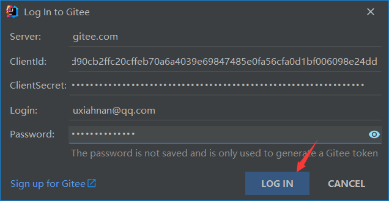
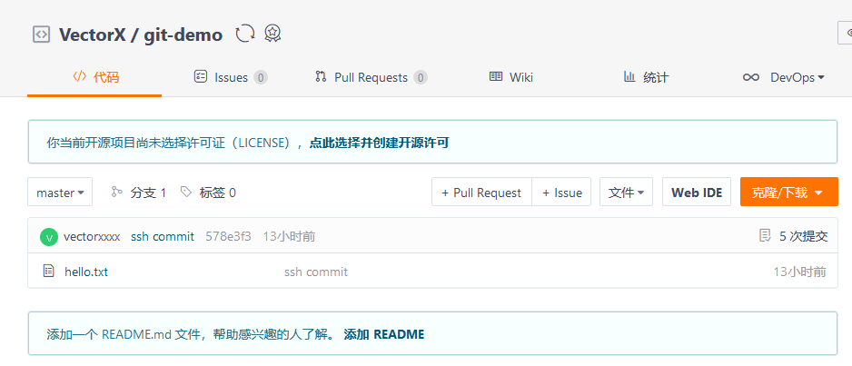
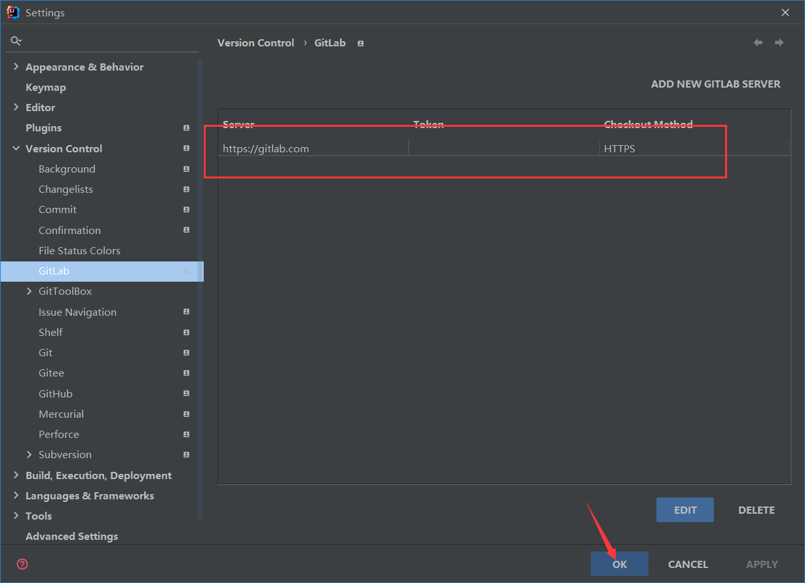

::: tip

7 IDEA集成Git

8 IDEA集成GitHub

9 国内代码托管中心-码云

10 自建代码托管平台-GitLab

:::

## 7、IDEA 集成 Git

### 7.1、配置 Git 忽略文件

问题1:为什么要忽略他们？答：与项目的实际功能无关，不参与服务器上部署运行。把它们忽略掉能够屏蔽 IDE 工具之间的差异。

问题2：怎么忽略？ 

**1）创建忽略规则文件 xxxx.ignore（前缀名随便起，建议是 git.ignore）**

这个文件的存放位置原则上在哪里都可以，为了便于让`~/.gitconfig`文件引用，建议也放在用户家目录下 

`git.ignore`文件模版内容

```properties
# Compiled class file 
*.class 
 
# Log file 
*.log 
 
# BlueJ files 
*.ctxt 
 
# Mobile Tools for Java (J2ME) 
.mtj.tmp/ 
 
# Package Files # 
*.jar 
*.war 
*.nar 
*.ear 
*.zip 
*.tar.gz 
*.rar 
 
# virtual machine crash logs, see http://www.java.com/en/download/help/error_hotspot.xml 
hs_err_pid* 
.classpath 
.project .settings target .idea 
*.iml 	crash 	logs,  	see 
```

**2）在 .gitconfig 文件中引用忽略配置文件（此文件在 Windows 的家目录中）**

```properties
[core]
	excludesfile = C:/Users/Archimedes/git.ignore
```

注意：这里要使用正斜线（`/`），不要使用反斜线（`\`）

### 7.2、定位 Git 程序


### 7.3、初始化本地库


明显看到，文件颜色变红了，代表着未被追踪。说明 Git 已经检测到 git-test 下文件，但是文件尚未被添加至暂存区


### 7.4、添加至暂存区


添加完毕之后，可以看到文件颜色变绿了，代表文件被追踪。说明 Git 已将文件添加至暂存区，但是尚未提交本地库

在`src`—`main`—`java`下创建一个`com.test.Test.java`文件


这是 IDEA 会自动检测到该文件，并提示是否需要将`Test.java`添加至暂存区

这里先`Cancel`，不直接`Add`单个文件，取而代之的是在整个项目上进行`Add`操作，这样整个项目下文件都可以被添加至暂存区


这时会发现，`Test.java`文件变成绿色了，说明添加成功


### 7.5、提交到本地库


点击`Commit Diretory...`之后，就可以看到暂存区的文件，输入日志信息就可以进行提交了


提交完毕之后，文件颜色也随之发生改变，说明 Git 已将文件提交至本地库


### 7.6、切换版本

首先修改文件，观察到修改的文件颜色为蓝色，表示已修改状态，可以直接进行`commit`操作


点击 IDEA 左下角 `Git`，可以查看历史版本


选定某一版本，点击`Checkout Reversion xxx`，可以进行版本穿梭


可以看到每次版本穿梭，`HEAD`指针的变化


### 7.7、创建分支、切换分支

点击 IDEA 右下角`master`—`New Branch`就可以创建分支了


输入分支名，点击`Create`进行创建


当然，也通过项目上`右键`—`Git`—`New Branch`，或者`右键`—`Git`—`Branches`—`New Branch`同理


切换分支同理，右键或是右下角均可


### 7.8、合并分支

首先切换到`hot-fix`分支，修改内容后提交，再切换回`master`分支，同样在右下角选择我们需要合并的分支`hot-fix`，选择`Merge Selected into Current`，将`hot-fix`分支合并至`master`分支上


发现内容已发生改变，并且查看历史版本也发生了变化


### 7.9、冲突合并

首先，分别切换`master`和`hot-fix`都对`Test.java`内容进行修改并提交

`master`版本信息


`hot-fix`版本信息


可以观察到，历史版本发生了分叉。现在将`hot-fix`合并至`master`上，提示`Conflicts`，说明合并出现了冲突


点击`Merge`进行手动合并


解决完冲突后，会提示`All changes have been processed. Save changes and finish merging`，说明代码可以正常合并，点击`Apply`对手动合并的代码进行应用


会发现文件颜色变为正常颜色，并且历史版本发生了改变，原来的两个分支合并成了一个


## 8、IDEA 集成 GitHub

### 8.1、设置 GitHub 账号

**通过账号密码设置**

打开`Settings`，点击`Log In via GitHub...`


会自动打开浏览器，进行授权确认


点击`Authorize in GitHub`后，会提示授权成功


看到 IDEA 里新增了一条账号信息即为添加成功


**通过 Token 设置**

点击`Log In with Token...`


会弹出`Add GitHubh Account`框，输入我们在 GitHub 上创建的 Token 信息即可


如果还没有生成过或者丢失了之前创建的 Token，可以直接点击`Generate...`进行自动生成，默认已勾好权限


修改并确认无误后，点击`Generate token`即可进行生成


Token 生成之后，只会在当前页面显示一次，需要及时复制保存下来


将 Token 粘贴至输入框，点击`Add Account`即可添加


最后别忘了，一定要点击`Apply`和`OK`对设置进行保存


### 8.2、分享工程到 GitHub

我们一般会先在远程库创建一个`Repository`，再将本地库通过`remote`关联到远程库，最后进行版本推送

或者是先在远程库创建一个`Repository`，再通过`clone`将远程库克隆至本地，最后进行版本推送

而在 IDEA 中，可以将上述步骤合成一个步骤，即通过`Share`将本地库分享至 GitHub 上，非常便捷


填写完信息后，点击`Share`按钮，IDEA 会自动帮我们创建和初始化远程库，并将本地库推送至远程库


查看 GitHub 是否存在该仓库，以验证是否分享成功


在分享过程中，可能会出现如下报错：成功创建远程仓库，但是初始化推送失败。这时就需要进行手动`Push`的操作了


### 8.3、Push 推送本地分支到远程库


这里默认使用`https`协议进行推送，因为网络原因，很有可能推送失败


这是可以修改远程连接方式，点击`Define remote`设置新的远程别名


然后会弹出一个重新定义远程方式的界面，这里使用 SSH 协议的远程地址即可（注意：不要与原来的别名重复）


点击`OK`后，可以重新选择远程别名，这里改为我们刚刚定义的 SSH 协议的别名：`origin-ssh`


查看 GitHub 上历史版本修改内容，推送成功


**注意**：`push`是将本地库代码推送到远程库，如果本地库代码跟远程库代码版本不一致， `push`的操作是会被拒绝的。也就是说，要想 `push`成功，一定要保证本地库的版本要比远程库的版本高！<mark>因此一个成熟的程序员在动手改本地代码之前，一定会先检查下远程库跟本地代码的区别！如果本地的代码版本已经落后，切记要先`pull`拉取一下远程库的代码，将本地代码更新到最新以后，然后再修改，提交，推送！</mark>

### 8.4、Pull 拉取远程库到本地

首先先修改远程库代码，然后进行如下操作


选择 SSH 协议的别名，点击`Pull`进行代码拉取


查看本地库代码易发生变化，并且历史版本也有了相关记录，说明代码拉取成功


### 8.5、Clone 克隆远程库到本地

关闭项目，在 IDEA 选择页面，点击`Get From VCS`


填写需要克隆的远程仓库地址和本地仓库地址，点击`Clone`进行克隆


等待克隆完成


初次进入项目，会提示是否信任并打开此 Maven 工程，一般选择`Trust Project`

如果勾选`Trust projects in xxx`，则在此工作空间下所有新增项目都将被信任，不会再提示


打开项目，确认`Test.java`内容无误，历史版本记录正常


## 9、国内代码托管中心**-**码云

众所周知，GitHub 服务器在国外，使用 GitHub 作为项目托管网站，如果网速不好的话，严重影响使用体验，甚至会出现登录不上的情况。针对这个情况，大家也可以使用国内的项目托管网站-码云

码云是开源中国推出的基于 Git 的代码托管服务中心，网址是 [https://gitee.com/](https://gitee.com/)，使用方式跟 GitHub 一样，而且它还是一个中文网站，如果你英文不是很好它是最好的选择


### 9.1、创建远程库


输入仓库名称，路径会自动与仓库名称保持一致，一般不改。选择开源，点击`创建`即可


创建完毕会自动跳转到该项目界面，复制下列地址以备用


### 9.2、删除远程库

打开项目`管理`—`仓库设置`—`删除仓库`，点击`删除仓库`


输入确认信息，点击`确认删除`


输入密码，进行二次确认，点击`验证`，即可删除成功


### 9.3、IDEA 集成码云

首先安装 Gitee 的插件


安装完成之后，点击`Apply`会刷新`Settings`选项，打开`Version Control`，多了一个`Gitee`选项

这里同样有两种方式，可以通过账号密码登录，也可以通过`Token`登录，操作同 IDEA 集成 `GitHub`


输入完账号密码，点击`Log In`即可



如果输入无误，便会在界面中展示账号信息，点击`OK`保存


### 9.4、分享工程到 Gitee


如果远程仓库已存在该名称的项目，则会提示存在同名仓库无法删除，需要先删除刚刚我们创建的`git-test`仓库


提示分享成功


查看 Gitee，确认仓库创建成功并且推送成功


### 9.5、推送本地分支到远程库

修改内容，可以在左侧导航栏`Commit`直接进行提交并推送


同样可以自定义远程地址别名，点击`Push`进行推送


查看 Gitee 仓库历史版本记录，确认推送成功


### 9.6、拉取远程库到本地

直接在 Gitee 上修改`Test.java`内容后，IDEA 中进行`Pull`即可


选择我们指定的别名和分支，点击`Pull`进行拉取


查看`Test.java`即历史版本发生了变化，说明拉取成功


### 9.7、克隆远程库到本地


### 9.8、码云复制 GitHub 项目

**导入仓库**

点击`从 GitHub / GitLab 导入仓库`


输入 GitHub 仓库地址，Gitee 会自动帮我们反填仓库名称及路径信息，修改为开源或私有，点击`导入`


等待片刻


导入成功



**强制同步**

如果后续该工程在 GitHub 上进行了修改，可以直接点击，刷新图标进行强制同步


需要注意的是强制更新会覆盖当前仓库，这里点击`确认`即可


查看历史版本记录，确认同步成功


## 10、自建代码托管平台 - GitLab

### 10.1、GitLab 简介

GitLab 是由 GitLabInc. 开发，使用 MIT 许可证的基于 网络的 Git 仓库管理工具，且具有 wiki 和 issue 跟踪功能。使用 Git 作为代码管理工具，并在此基础上搭建起来的 web 服务

GitLab 由乌克兰程序员 DmitriyZaporozhets 和 ValerySizov 开发，它使用 Ruby 语言写成。后来，一些部分用 Go 语言重写。截止 2018 年 5 月，该公司约有 290 名团队成员，以及 2000 多名开源贡献者。GitLab 被 IBM，Sony，JülichResearchCenter，NASA，Alibaba，Invincea，O’ReillyMedia，Leibniz-Rechenzentrum(LRZ)，CERN，SpaceX 等组织使用

### 10.2、GitLab 官网地址

- 官网地址：[https://about.gitlab.com/](https://about.gitlab.com/ ) 
- 安装说明：[https://about.gitlab.com/installation/](https://about.gitlab.com/installation/)

### 10.3、GitLab 安装

#### 服务器准备

准备一个系统为 CentOS7 以上版本的服务器，要求：内存 4G，磁盘 50G

关闭防火墙，并且配置好主机名和 IP，保证服务器可以上网

此教程使用虚拟机：主机名：`gitlab-server` IP 地址：`192.168.6.200`

#### 安装包准备

`Yum` 在线安装 `gitlab-ce` 时，需要下载几百 M 的安装文件，非常耗时，所以最好提前把所需 `RPM` 包下载到本地，然后使用离线 `rpm` 的方式安装

下载地址：

- [https://packages.gitlab.com/gitlab](https://packages.gitlab.com/gitlab)

注：资料里提供了此 `rpm` 包，直接将此包上传到服务器`/opt/module`目录下即可

####  编写安装脚本

安装 GitLab 步骤比较繁琐，因此我们可以参考官网编写 GitLab 的安装脚本

```bash
vim gitlab-install.sh
```

将下列脚本内容复制到创建的`gitlab-install.sh`文件中

```bash
sudo rpm -ivh /opt/module/gitlab-ce-13.10.2-ce.0.el7.x86_64.rpm
sudo yum install -y
curl policycoreutils-python openssh-server cronie
sudo lokkit -s http -s ssh
sudo yum install -y postfix
sudo service postfix start
sudo chkconfig postfix on
curl https://packages.gitlab.com/install/repositories/gitlab/gitlab-ce/script.rpm.sh | sudo bash
sudo EXTERNAL_URL="http://gitlab.example.com" yum -y install gitlab-ce
```

给脚本增加执行权限

```bash
chmod +x gitlab-install.sh
```

执行脚本变绿，说明具备执行权限


然后执行该脚本，开始安装 `gitlab-ce`。注意一定要保证服务器可以上网

```bash
./gitlab-install.sh
```

耐心等待片刻


脚本执行成功


#### 初始化 GitLab 服务

执行以下命令初始化 GitLab 服务

```bash
gitlab-ctl reconfigure
```

过程大概需要几分钟，耐心等待…


出现`gitlab Reconfigured!`说明 GitLab 服务初始化成功

#### 启动 GitLab 服务

执行以下命令启动 GitLab 服务

```bash
gitlab-ctl start
```

如需停止，执行

```bash
gitlab-ctl stop
```

服务启动成功


#### 使用浏览器访问 GitLab

使用主机名或者 IP 地址即可访问 GitLab 服务，使用主机名访问需要提前配置一下 windows 的 hosts 文件


首次登陆之前，需要修改下 GitLab 提供的 root 账户的密码，要求 8 位以上，包含大小写子母和特殊符号。因此我们修改密码为 `Atguigu.123456`，然后使用修改后的密码登录 GitLab


接下来，就可以用刚才修改的账号密码进行登录了


登录成功


#### GitLab 创建远程库

我这里以官网 GitLab 为例，官网地址：[https://gitlab.com/](https://gitlab.com/)

官网还提供了 GitLab 自身的项目源码：[https://gitlab.com/gitlab-org/gitlab](https://gitlab.com/gitlab-org/gitlab)


点击`New project/repository`—`Create a project`进行 GitLab 仓库的创建


填写项目信息后，点击`Create project`即可


创建成功


#### IDEA 集成 GitLab

1）安装 GitLab 插件


2）设置 GitLab 插件


出现相关信息，说明添加成功



3）push 本地代码到 GitLab 远程库

我们首先添加一个远程库别名

点击`Git`—`Manage Remotes`


点击`+`号，自定义一个远程别名及对应远程库地址，点击`OK`


出现刚刚的记录，说明添加远程别名成功，点击`OK`


只要 GitLab 的远程库连接定义好以后，对 GitLab 远程库进行 pull 和 clone 的操作和 Github、码云一致，此处不再赘述