::: tip

1 版本控制

2 Git简史

3 Git初始化配置

4 Git底层概念(底层命令)

:::

## 1、版本控制

**什么是版本控制？我们为什么要关心它呢？**

版本控制是一种**记录**一个或若干文件内容**变化**，以便将来查阅特定版本修订情况的系统

**为什么要使用版本控制？**

软件开发中采用版本控制系统是个**明智**的选择。有了它你就可以将某个文件回溯到之前的状态，甚至将整个项目都回退到过去某个时间点的状态。就算你乱来一气把整个项目中的文件改的改删的删，你也照样可以轻松恢复到原先的样子。但额外增加的工作量却微乎其微。
你可以比较文件的变化细节，查出最后是谁修改了哪个地方，从而找出导致怪异问题出现的原因，又是谁在何时报告了某个功能缺陷等等。

### 1.1、集中化的版本控制系统

集中化的版本控制系统诸如 CVS，Subversion 以及 Perforce 等，都有一个单一的集中管理的服务器，**保存所有文件的修订版本，而协同工作的人们都通过客户端连到这台服务器，取出最新的文件或者提交更新**。多年以来，这已成为版本控制系统的标准做法

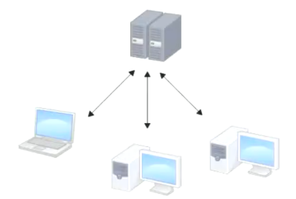

这种做法带来了许多好处，现在，每个人都可以在一定程度上看到项目中的其他人正在做些什么。而管理员也可以轻松掌控每个开发者的权限，并且管理一个集中化的版本控制系统；要远比在各个客户端上维护本地数据库来得轻松容易

<mark>事分两面，有好有坏。这么做最显而易见的缺点是中央服务器的单点故障</mark>

<mark>如果服务器宕机一小时，那么在这一小时内，谁都无法提交更新，也就无法协同工作</mark>

并不是说服务器故障了就没有办法写代码了，只是在服务器故障的情况下写的代码是没有办法得到保障的。试想svn中央服务器挂机一天，你还拼命写了天代码，其中12点之前的代码都是高质量可靠的，而且有很多闪光点。而12点之后的代码由于你想尝试一个比较大胆的想法，将代码改的面目全非了。这样下来你12点之前做的工作也都白费了。有记录的版本只能是 svn 服务器挂掉时保存的版本！

<mark>要是中央服务器的磁盘发生故障，碰巧没做备份，或者备份不够及时，就会有丢失数据的风险。最坏的情况是彻底丢失整个项目的所有历史更改记录，而被客户端偶然提取出来的保存在本地的某些快照数据就成了恢复数据的希望。但这样的话依然是个问题，你不能保证所有的数据者都已经有人事先完整提取出来过。只要整个项目的历史记录被保存在单一位置，就有丢失所有历史更新记录的风险</mark>

**集中式总结**

- 优点：代码存放在单一的服务器上，便于项目管理
- 缺点：服务器宕机、故障

### 1.2、分布式的版本控制系统

于是分布式版本控制系统面世了。在这类系统中，像 Git、BitKeeper 等，**客户端并不只提取最新版本的文件快照，而是把代码仓库完整地镜像下来**。这么一来，任何一处协同工作用的服务器发生故障，事后都可以用任何一个镜像出来的本地仓库恢复。因为每一次的提取操作，实际上都是一次对代码仓库的完整备份

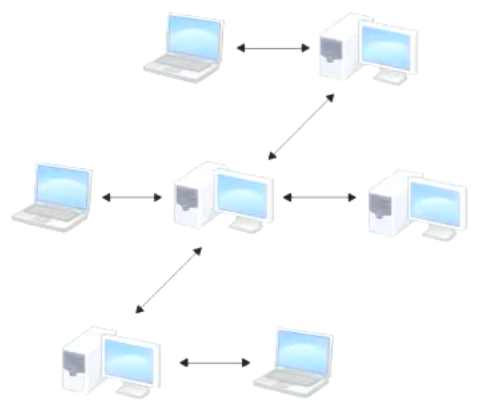

更进一步，许多这类系统都可以指定和若干不同的远端代码仓库进行交互。籍此，你就可以在同一个项目中分别和不同工作小组的人相互协作

<mark>分布式的版本控制系统在管理项目时存放的不是项目版本与版本之间的差异，它存的是索引（所需磁盘空间很少，所以每个客户端都可以放下整个项目的历史记录）</mark>

<mark>分布式的版本控制系统出现之后，解决了集中式版本控制系统的缺陷：</mark>

- 1）断网的情况下也可以进行开发（因为版本控制是在本地进行的）
- 2）使用 git 业进行团队协作，哪怕 github 挂了，每个客户端保存的也都是整个完整的项目（包含历史记录的！！）

### 1.3、svn 与 git 对比

- svn 每次存的都是差异，需要的硬盘空间会相对的小一点，可是回滚的速度会很慢
- git 每次存的都是项目的完整快照，需要的硬盘空间会相对对大点（不过Git团队对代码做了极限的压缩，最终需要的实际空间l比 svn 多不太多），但是回滚的速度极快


## 2、Git 简史

Git 是目前世界上最先进的分布式版本控制系统。同生活中的许多伟大事件一样，Git 诞生于一个极富纷争大举创新的年代。Linux内核开源项目有着为数众广的参与者。绝大多数的 Linux 内核维护工作都花在了提交补丁和保存归档的繁琐事务上（1991-2002年间）。到 2002 年，整个项目组开始启用分布式版本控制系统 BitKeeper 来管理和维护代码

到了2005年，开发 BitKeeper 的商业公司同 Linux 内核开源社区的合作关系结束，他们收回了免费使用 BitKeeper 的权力。这就迫使Linux 开源社区（特别是 Linux 的缔造者 Linus Torvalds）不得不吸取教训，只有开发一套属于自己的版本控制系统才不至于重蹈覆辙。他们对新的系统制订了若干目标：

- 分支切换速度快
- 容量小（压缩）
- 简单的设计
- 完全分布式
- 对非线性开发模式的强力支持（允许上千个并行开发的分支）
- 有能力高效管理类似 Linux 内核一样的超大规模项目（速度和数据量）

自诞生于 2005 年以来，Git 日臻成熟完善，在高度易用的同时，仍然保留着初期设定的目标。它的速度飞快，极其适合管理大项目，它还有着令人难以置信的非线性分支管理系统可以应付各种复杂的项目开发需求


## 3、Git 初始化配置

一般在新的系统上，我们都需要先配置下自己的 Git 工作环境。配置工作只需一次，以后升级时还会沿用现在的配置。当然，如果需要，你随时可以用相同的命令修改已有的配置。

Git 提供了一个叫做`git config`的命令来配置或读取相应的工作环境变量。而正是由这些环境变量，决定了 Git 在各个环节的具体工作方式和行为。这些变量可以存放在以下三个不同的地方：

- `/etc/gitconfig`文件：系统中对所有用户都普遍适用的配置。若使用`git config`时用`--system`选项，读写的就是这个文件
- `~/gitconfig`文件：用户目录下的配置文件只适用于该用户。若使用`git config`时用`--global`选项，读写的就是这个文件
- `.git/config`文件：当前项目的 Git 目录中的配置文件，这里的配置仅仅针对当前项目有效

<mark>每一个级别的配置都会覆盖上层的相同配置</mark>

第一个要配置的是你个人的用户名称和电子邮件地址。这两条配置很重要，每次Git提交时都会引用这两条信息，说明是谁提交了更新，所以会随更新内容一起被永久纳入历史记录：

```bash
git config --global user.name 用户名
git config --global user.email 邮箱
```

要检查已有的配置信息，可以使用命令

```bash
git config --list
```

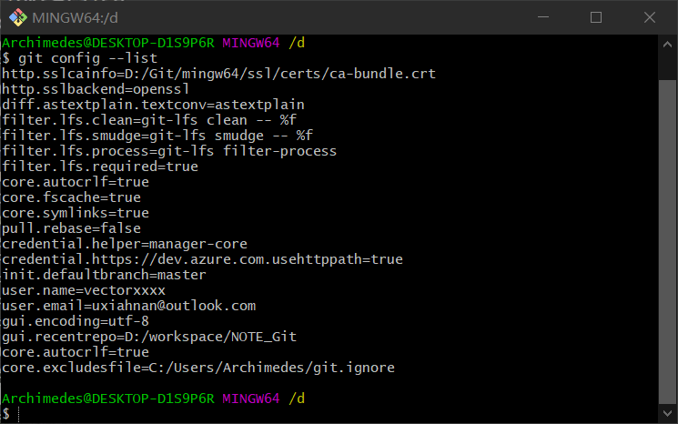


## 4、Git 底层概念（底层命令）

### 4.1、初始化新仓库

- 命令：`git init`
- 解析：要对现有的某个项目开始用 Git 管理，只需到此项目所在的目录，执行命令
- 作用：初始化后，在当前目录下会出现一个名为`.git`的目录，所有 Git 需要的数据和资源都存放在这个目录中。不过目前，仅仅是按照既有的结构框架初始化好了里边所有的文件和目录，但我们还没有开始跟踪管理项目中的任何一个文件

### 4.2、.git 目录

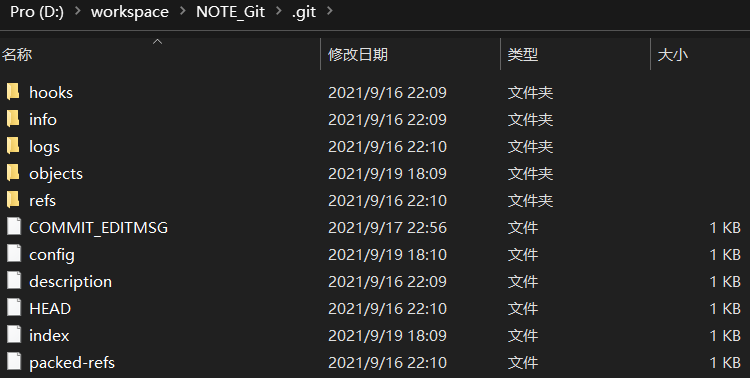

| 目录                  | 作用                                                  |
| :-------------------- | :---------------------------------------------------- |
| `hooks`               | 目录包含客户端或服务端的钩子脚本                      |
| `info`                | 包含一个全局性排除文件                                |
| `logs`                | 保存日志信息                                          |
| <mark>`object`</mark> | <mark>目录存储所有数据内容</mark>                     |
| <mark>`refs`</mark>   | <mark>目录存储指向数据的提交对象的指针（分支）</mark> |
| `config`              | 文件包含项目特有的配置选项                            |
| `description`         | 用来显示对仓库的描述信息                              |
| <mark>`HEAD`</mark>   | <mark>文件指示目前被检出的分支</mark>                 |
| <mark>`index`</mark>  | <mark>文件保存暂存区信息</mark>                       |

### 4.3、基础的 linux 命令

```bash
clear  # 清除屏幕
echo 'test content' # 往控制台输出信息
echo 'test content' > test.txt # 往文件输出信息  
ll # 将当前目录下的子文件&子目录平铺在控制台 
find 目录名 # 将对应目录下的子孙文件&子孙目录平铺在控制台 
find 目录名 -type f # 将对应目录下的文件平铺在控制台 
rm [-rf] 文件名 # 删除文件
mv 源文件 重命名文件 #重命名
cat 文件的url # 查看对应文件的内容
vim 文件的url（在英文模式下）
    # 按i进入插入模式：进行文件的编辑
    # 按Esc键 & 按:键：进行命令的执行
		q! # 强制退出（不保存）
		wq #保存退出
		set nu # 设置行号
```

### 4.4、对象

- Git 对象：一个 Git 对象就是文件的一个快照
- 树对象：一个树对象就是项目的一个快照
- 提交对象：一个提交对象就是项目的一个版本

### 4.5、区域

- 工作区
- 暂存区
- 版本库

### 4.6、Git 对象

Git  的核心部分是一个**简单的键值对数据库**。你可以向该数据库插入任意类型的内容，它会返回一个键值，通过该键值可以在任意时刻再次检索该内容

#### 4.6.1、向数据库写入内容并返回对应键值

```bash
echo 'test content' | git hash-object -w --stdin
# d670460b4b4aece5915caf5c68d12f560a9fe3e4
```

- `-w`选项指示`hash-object`命令存储数据对象；若不指定此选项，则该命令仅返回对应的键值
- `--stdin`（standard input）选项则指示该命令从标准输入读取内容

若不指定此选项，则须在命令尾部给出待存储文件的路径

```bash
git hash-object -w 文件路径  # 存文件
git hash-object 文件路径  # 返回对应文件的键值 
```

返回： 该命令输出一个长度为 40 个字符的校验和。 这是一个 SHA-1 哈希值

#### 4.6.2、查看 Git  是如何存储数据的

```bash
find .git/objects -type f
# .git/objects/d6/70460b4b4aece5915caf5c68d12f560a9fe3e4
```

返回：`.git/objects/d6/70460b4b4aece5915caf5c68d12f560a9fe3e4 `

这就是开始时 Git 存储内容的方式：一个文件对应一条内容。校验和的前两个字符用于命名子目录，余下的 38 个字符则用作文件名

#### 4.6.3、根据键值拉取数据

```bash
git cat-file -p d670460b4b4aece5915caf5c68d12f560a9fe3e4
```

- `-p`选项可指示该命令自动判断内容的类型，并为我们显示格式友好的内容

返回： 对应文件的内容

#### 4.6.4、对一个文件进行简单的版本控制

创建一个新文件并将其内容存入数据库

```bash
echo 'version 1' > test.txt
git hash-object -w test.txt
```

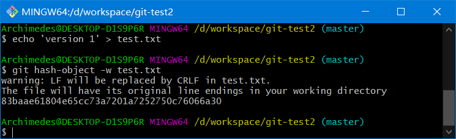

向文件里写入新内容，并再次将其存入数据库

```bash
echo 'version 2' > test.txt
git hash-object -w test.txt
# 1f7a7a472abf3dd9643fd615f6da379c4acb3e3a 
```

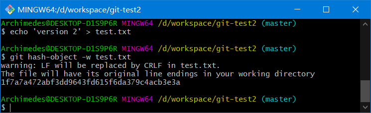

查看数据库内容 

```bash
find .git/objects -type f
git cat-file -p 1f7a7a472abf3dd9643fd615f6da379c4acb3e3a
git cat-file -p 83baae61804e65cc73a7201a7252750c76066a30
git cat-file -t 83baae61804e65cc73a7201a7252750c76066a30
```

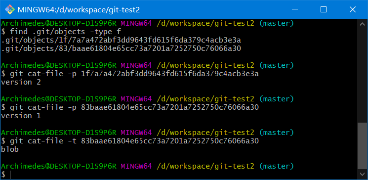

利用`cat-file -t`命令，可以让 Git 告诉我们其内部存储的任何对象类型

问题： 

1. 记住文件的每一个版本所对应的 SHA-1 值并不现实 
2. 在 Git 中，文件名并没有被保存——我们仅保存了文件的内容 

<mark>解决方案：树对象</mark>

**注意**：当前的操作都是在对本地数据库进行操作  不涉及暂存区

### 4.7、树对象

树对象（tree object），它能解决文件名保存的问题，也允许我们将多个文件组织到一起。Git  以一种类似于  UNIX  文件系统的方式存储内容。所有内容均以树对象和数据对象(git 对象)的形式存储，其中树对象对应了  UNIX  中的目录项，数据对象(git 对象)则大致上对应文件内容。一个树对象包含了一条或多条记录（每条记录含有一个指向 git 对象或者子树对象的  SHA-1  指针，以及相应的模式、类型、文件名信息）。一个树对象也可以包含另一个树对象

我们可以通过`update-index`；`write-tree`；`read-tree` 等命令来构建树对象并塞入到暂存区。 假设我们做了一系列操作之后得到一个树对象

#### 4.7.1、查看暂存区

```bash
git ls-files -s
```

#### 4.7.2、创建暂存区

1、利用`update-index`命令为 test.txt 文件的首个版本

```bash
git update-index --add --cacheinfo 100644 e32092a83f837140c08e85a60ef16a6b2a208986 test.txt
```

- `--add`选项：因为此前该文件并不在暂存区中，首次需要`--add` 
- `--cacheinfo`选项：因为将要添加的文件位于 Git 数据库中，而不是位于当前目录下，所以需要`--cacheinfo`
- 文件模式为
  - `100644`表明这是一个普通文件
  - `100755`表示一个可执行文件
  - `120000`表示一个符号链接

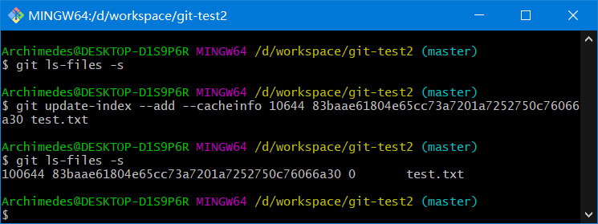

#### 4.7.3、生成树对象

通过`write-tree`命令生成树对象

```bash
git write-tree
```

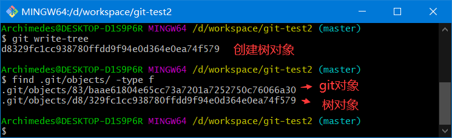

树对象存放的是暂存区的快照

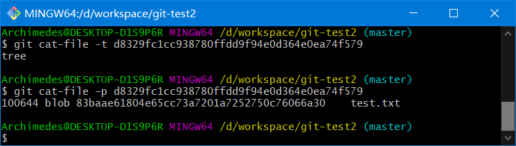

2、新增 new.txt  将 new.txt 和 test.txt 文件的第二个个版本塞入暂存区。并通过 write-tree 命令生成树对象

新增 new.txt

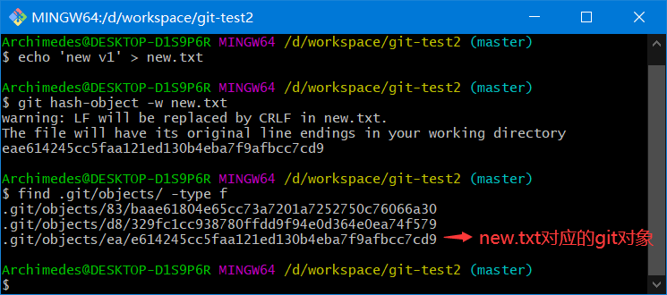

修改 test.txt

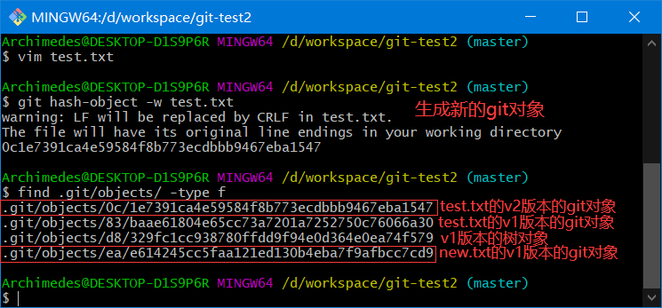

塞入暂存区

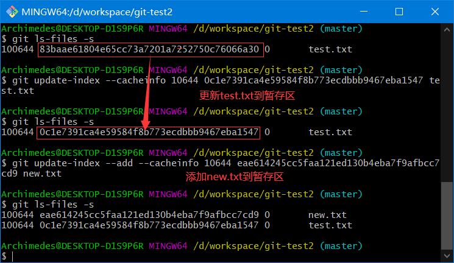

生成树对象

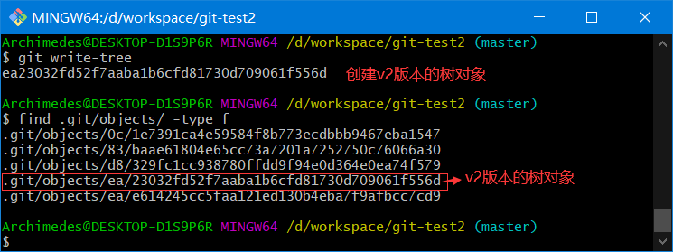

目前状态

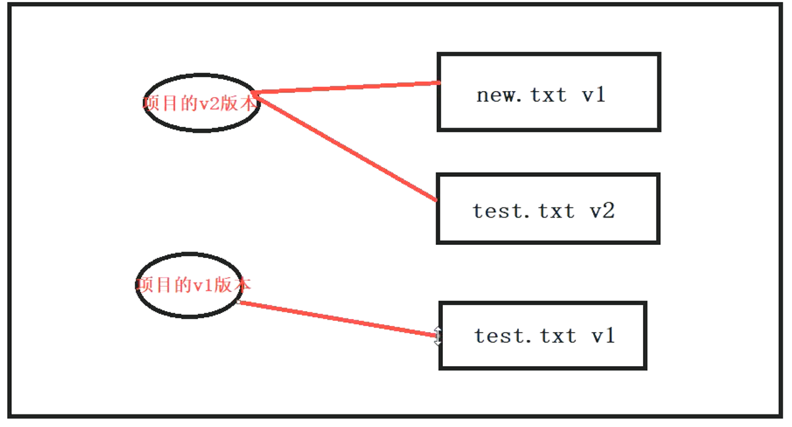

对象对应关系

```bash
.git/objects/0c/1e7391ca4e59584f8b773ecdbbb9467eba1547    # test.txt的v2版本
.git/objects/83/baae61804e65cc73a7201a7252750c76066a30    # test.txt的v1版本
.git/objects/d8/329fc1cc938780ffdd9f94e0d364e0ea74f579    # 项目的v1版本
.git/objects/ea/23032fd52f7aaba1b6cfd81730d709061f556d    # 项目的v2版本
.git/objects/ea/e614245cc5faa121ed130b4eba7f9afbcc7cd9	  # new.txt的v1版本
```

3、将第一个树对象加入第二个树对象，使其成为新的树对象

```bash
git read-tree --prefix=bak d8329fc1cc938780ffdd9f94e0d364e0ea74f579
git write-tree
```

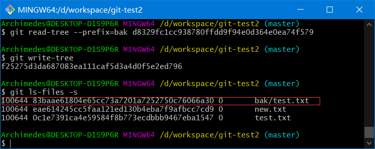

目前状态

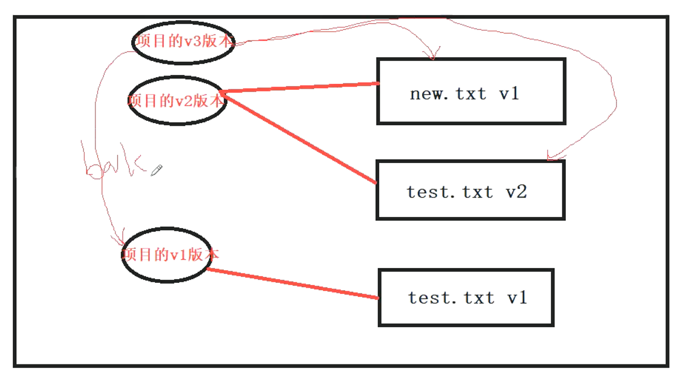

对象对应关系

```bash
.git/objects/0c/1e7391ca4e59584f8b773ecdbbb9467eba1547    # test.txt的v2版本
.git/objects/83/baae61804e65cc73a7201a7252750c76066a30    # test.txt的v1版本
.git/objects/d8/329fc1cc938780ffdd9f94e0d364e0ea74f579    # 项目的v1版本
.git/objects/ea/23032fd52f7aaba1b6cfd81730d709061f556d    # 项目的v2版本
.git/objects/ea/e614245cc5faa121ed130b4eba7f9afbcc7cd9	  # new.txt的v1版本
.git/objects/f2/5275d3da687083ea111caf5d3a4d0f5e2ed796    # 项目的v3版本
```

#### 4.7.4、解析树对象

Git 根据某一时刻暂存区（即 index 区域）所表示的状态创建并记录一个对应的树对象，如此重复便可依次记录（某个时间段内）一系列的树对象

其实树对象是对暂存区内操作的抽象，这颗树对象相对于就是快照。当我们的工作区有任何更改同步到暂存区时。便会调用`write-tree`命令

通过`write-tree`命令向暂存区内容写入一个树对象。它会根据当前暂存区状态自动创建一个新的树对象。即每一次同步都产生一颗树对象。且该命令会返回一个 hash 指向树对象

在 Git 中每一个文件（数据）都对应一个 hash（类型 blob） 每一个树对象都对应一个 hash（类型 tree） 

**总结** ：我们可以认为树对象就是我们项目的快照

**问题**：现在有三个树对象（执行了三次 write-tree），分别代表了我们想要跟踪的不同项目快照。然而问题依旧：若想重用这些快照，你必须记住所有三个 SHA-1  哈希值。  并且，你也完全不知道是谁保存了这些快照，在什么时刻保存的，以及为什么保存这些快照。  而以上这些，正是提交对象（commit object）能为你保存的基本信息

### 4.8、提交对象

我们可以通过调用`commit-tree`命令创建一个提交对象，为此需要指定一个树对象的 SHA-1 值，以及该提交的父提交对象（如果有的话  ，第一次将暂存区做快照就没有父对象）

#### 4.8.1、创建提交对象

```bash
echo 'first commit' | git commit-tree d8329fc1cc938780ffdd9f94e0d364e0ea74f579
# 7fe5a775aa47939d222518e8e2340ca093a8cf47
```

#### 4.8.2、查看提交对象

```bash
git cat-file -p 7fe5a775aa47939d222518e8e2340ca093a8cf47
```

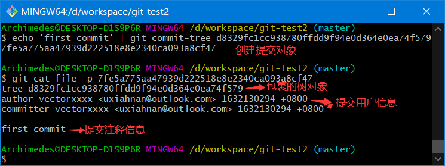

#### 4.8.3、提交对象的格式

提交对象的格式很简单：

- 先指定一个顶层树对象，代表当前项目快照
- 然后是作者/提交者信息（依据你的 user.name 和 user.email 配置来设定，外加一个时间戳）
- 留空一行
- 最后是提交注释

接着，我们将创建另两个提交对象，它们分别引用各自的上一个提交（作为其父提交对象）

```bash
# 7fe5a775aa47939d222518e8e2340ca093a8cf47
echo 'second commit' | git commit-tree ea2303 -p 7fe5a7
# f1108b54c247d0f4455b3857e0ae2db482658237
echo 'second commit' | git commit-tree f25275 -p f1108b
# 665fa8610194e347f7d70ce35cca7487d131a585
```

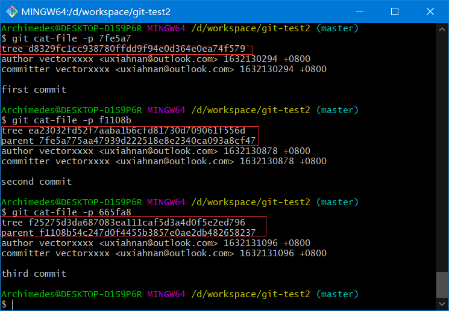

**注意**：`git commit-tree`不但生成提交对象，而且会将对应的快照（树对象）提交到本地库中

**图示**

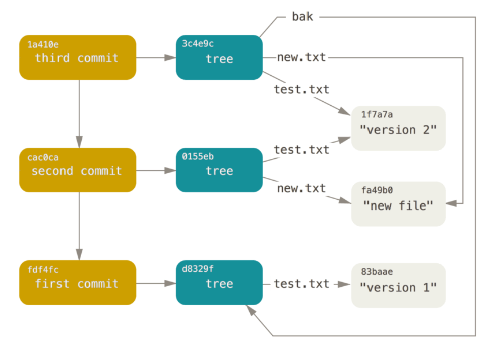

### 4.9、总结

本章节常用命令

```bash
# 根据键值获取数据
git cat-file -p hash
# 根据键值获取数据类型
git cat-file -t hash
# 查看暂存区
git ls-files -s
```

